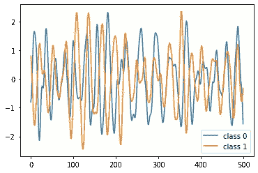
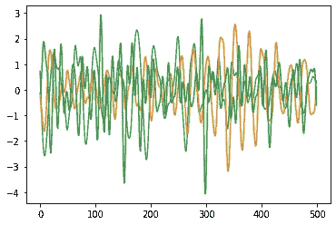
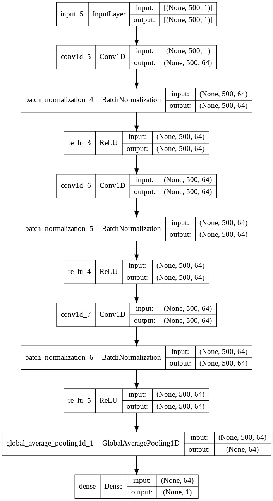
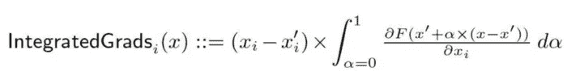
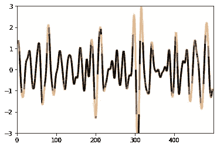
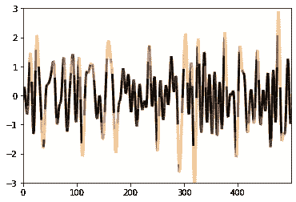

# 如何理解具有集成梯度的深度时间序列分类器

> 原文：<https://towardsdatascience.com/how-to-understand-the-deep-time-series-classifier-with-integrated-gradients-f4f58af48c05?source=collection_archive---------7----------------------->



作者图片:电机数据的两个实例

时间序列分类是一个常见的问题，可以在许多领域和环境中看到，例如，对于金融产品的给定时间序列，预测客户是否会购买。

然而，由于特殊的时间维度，理解分类器为什么做出决定并不总是一件容易的事情:决定标签的不是时间线上的单个点，而是整个时间线。但是所有的时刻都重要吗？它们的重要性相同吗？对于预测来说，今天比昨天更重要还是星期二比星期天更重要？

在本文中，我试图给出我的解决方案来解释时间序列分类器。本文主要由两部分组成:

1.  在第一部分中，我将为一个经典的时间序列分类问题建立一个 CNN 模型。
2.  在文章的第二部分和主要部分，我将使用综合梯度来解释模型的预测。

请在这里查看[笔记本](https://colab.research.google.com/drive/13dFDbkVh8mmk5Lq-31c0ibHltXib4dJm#scrollTo=aIL3VoAOc2jV)中我所有的代码。

# CNN 模型作为时间序列分类器

我建立的模型考虑了来自[本教程](https://keras.io/examples/timeseries/timeseries_classification_from_scratch)的一个例子。

## 数据集

给定的数据集由电机数据组成，其中每个实例都是电机传感器捕获的发动机噪声测量值的时间序列。该任务的目标是预测发动机是否有特定问题。关于数据集的更多细节，你可以看看这篇[的论文](https://www.researchgate.net/publication/228506182_Classification_of_Ford_Motor_Data)。

本文开头的图显示了这个时间序列中的两个实例:类 0 表示不存在问题，而类 1 表示存在问题。此外，我给出了下图:所有三条曲线都属于同一个 0 类(没有问题的类),因此您可以看到，要想知道时间序列可以被标记的原因并不简单:



图片作者:同一类的三个时间序列 0

## CNN 模型

时间序列与其他正常特征的一个重要区别是时间线上的每个点都不是独立于预测的。一个时刻一个点不仅应该包含该时刻的信息，还应该包含过去的一部分信息。这需要提取时间序列的特征(平均值、标准差、最大值等)。在观察窗口内)。我们将使用以下代码构建一个 1D CNN 模型来进行分类，而不是进行特征提取:

```
from keras import models
from keras import layersinput_layer = layers.Input(shape=(x_train.shape[1],1))
conv1 = layers.Conv1D(filters=64, kernel_size=3, padding="same")(input_layer)
conv1 = layers.BatchNormalization()(conv1)
conv1 = layers.ReLU()(conv1)
conv2 = layers.Conv1D(filters=64, kernel_size=3, padding="same")(conv1)
conv2 =layers.BatchNormalization()(conv2)
conv2 = layers.ReLU()(conv2)
conv3 = layers.Conv1D(filters=64, kernel_size=3, padding="same")(conv2)
conv3 = layers.BatchNormalization()(conv3)
conv3 = layers.ReLU()(conv3)
gap = layers.GlobalAveragePooling1D()(conv3)
output_layer = layers.Dense(1, activation="sigmoid")(gap)
model=models.Model(inputs=input_layer, outputs=output_layer)
```

下面我给出一个情节作为模型的总结。可以看到，模型中有三个 1D 卷积层。



作者图片:CNN 模型摘要

在 3601 个实例上训练并在另外 1320 个实例上测试，该模型在具有早期停止的 220 个训练时期之后达到 0.9697 的 val_binary_accuracy。

# IG 解释的时间序列预测

## 作为解释者的 IG

现在让我们深入一点。如何才能理解模型？为了解释 CNN 分类器，我将使用综合梯度作为工具。我想你对 IG 很熟悉。如果没有，请查看我的上一篇博客,在这篇博客中，我简要介绍了 IG，并展示了一个关于它的实现和限制的例子。

简而言之，IG 将系数概化为线性表达式，其输入要素的值用于测量该要素如何使模型的输出不同于基线输出。在这个例子中，基线被简单地选择为一个时间序列，所有的点都是 0。下面是 IG 的定义。



图片 bu 作者:IG 的定义

根据上述定义，IG 是通过沿着从基线到输入的直线路径累积梯度而获得的。实际上，借助于张量流的[自动微分，梯度的计算可以很容易地用下面的代码得到:](https://www.tensorflow.org/guide/advanced_autodiff)

```
def compute_gradients(series):
   with tf.GradientTape() as tape:
     tape.watch(series)
     logits = model(series)
    return tape.gradient(logits, series)
```

## 结果

为了说明 IG 如何帮助我们理解我们在上一章中建立的模型，我在测试数据集中选择了两个时间序列，它们分别被预测为 1 类和 0 类。图中的曲线显示时间序列，而颜色显示 IG 值的绝对值:颜色越深，IG 值越大。换句话说，曲线上的深色部分对预测的贡献更大。



作者图片:具有 IG 值的类 1 中的时间序列



作者提供的图片:具有 IG 值的 0 类时间序列

## 结论

我们可以从这两幅图中观察到一些有趣的事情:

1.  一个单独的点不能导致预测。在时间线上总是存在一个点的邻域，其中所有点对预测具有相似的贡献值。
2.  对于预测来说，时间线上的一些点(间隔)远不如时间线上的其他点重要。
3.  即使我们没有导致预测的提取特征的量化值，我们仍然可以对 CNN 分类器的输出有很好的视觉直觉。例如，该值的局部最小值或最大值对预测没有大的影响。