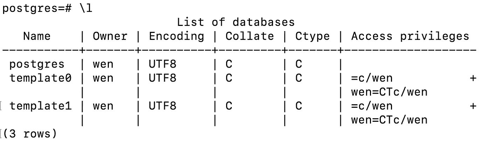
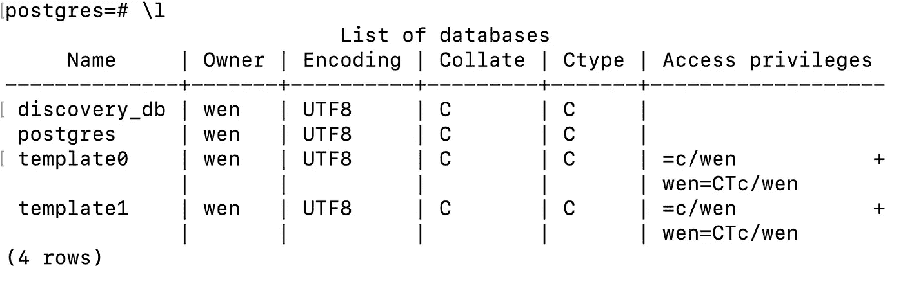

# 如何卸载 PostgreSQL 13.3 并通过 Brew 重新安装

> 原文：<https://towardsdatascience.com/how-to-uninstall-postgresql-13-3-and-reinstall-via-brew-6c1e7047f349?source=collection_archive---------7----------------------->

## 关于删除通过安装程序安装的 PostgresSQL 并通过 brew for macOS Catalina 重新安装它的分步指南


马库斯·斯皮斯克在 [Unsplash](https://unsplash.com?utm_source=medium&utm_medium=referral) 上拍摄的照片

**这是给谁的？**

对于任何需要完全卸载 PostgresSQL 13.3 的人，该版本是通过[安装程序](https://www.enterprisedb.com/downloads/postgres-postgresql-downloads)安装的。

**本文将涵盖三个主题:**

*   如何卸载 PostgreSQL 13.3
*   如何通过 brew 重新安装 PostgreSQL
*   测试它是否工作:创建数据库、用户和授予特权

1.  **如何卸载 PostgreSQL 13.3**

**第一步**:打开你的终端。检查安装的版本和位置。在我的例子中，它安装在`/Library/PostgreSQL/13/bin/psql`下

```
# check version
$ postgres --version
postgres (PostgreSQL) 13.3# locate where it is installed
$ which psql
/Library/PostgreSQL/13/bin/psql
```

**第二步**:根据`uninstall-postgres.app`是否安装，我们有两种解决方案。

**解 2A:**

改变目录运行`uninstall-postgres.app`这个应用程序位于`bin`文件夹的上层目录，在我的例子中是`/Library/PostgreSQL/13`。

```
# change directory$ cd /Library/PostgreSQL/13
$ open uninstall-postgres.app
```

如果卸载窗口提示，您可以按照[本指南](https://www.enterprisedb.com/docs/supported-open-source/postgresql/installer/05_uninstalling_postgresql/)上的【在 Mac 上卸载 PostgreSQL】一节进行操作。

然而，这个解决方案对我不起作用。我收到一条错误消息:

```
$ open uninstall-postgres.appThe file /Library/PostgreSQL/13/uninstall-postgres.app does not exist.
```

在网上尝试了许多其他方法后，虽然似乎都没有结果，但我注意到**一个有趣的模式，即→对于同一功能，有些人会使用** `**postgres**` **，而其他人会使用** `**postgresql**`。出于绝望，我意外地发现了解 2B。

**解 2B** :

改变就好→

`$ open uninstall-postgres.app`到

`$ open uninstall-postgresql.app`。

这是一个很小的变化，但它的工作！🤩

```
# change directory$ cd /Library/PostgreSQL/13
$ open uninstall-postgresql.app
```

卸载窗口提示！如果这也适用于你，你可以遵循[本指南](https://www.enterprisedb.com/docs/supported-open-source/postgresql/installer/05_uninstalling_postgresql/)中的【在 Mac 上卸载 PostgreSQL】一节，直到图 8。

重要提示:在你按照上面的指南，一直到图 8，我们还没有完成！为了删除所有 Postgres 相关文件，您需要执行步骤 3。

步骤 3:删除 Postgres 相关文件

```
# change to home directory
$ cd ~
$ sudo rm -rf /Library/PostgreSQL
$ sudo rm /etc/postgres-reg.ini# some people also suggested to remove sysctl.conf
# but I don't seem to have this file in my environment
# so I ignored it. You can try if you'd like
$ sudo rm /etc/sysctl.confrm: /etc/sysctl.conf: No such file or directory
```

🎉🎉🎉万岁！我们成功卸载了 PostgreSQL 13.3！！

**2。如何通过 brew 重新安装 PostgreSQL】🍺**

我需要卸载 PostgreSQL 的原因是，当我需要创建一个测试数据库时，我不能使用我的同事正在使用的代码。我们怀疑通过安装程序安装的 PostgreSQL 和通过 brew 安装的 PostgreSQL 是有区别的。长话短说，这是真的至少在我的情况下，它解决了问题。

通过 brew 安装 PostgreSQL 非常简单，它有两个步骤:

```
# 1\. update brew
$ brew update# optional: run brew doctor (I did this.)
$ brew doctor# 2\. install postgresql
$ brew install postgresql
```

至此，我们可以通过运行下面的命令来启动 PostgreSQL。

```
$ brew services start postgresql
```

运行之后，它告诉我们已经成功启动了`postgresql`

```
==> **Successfully started `postgresql` (label: homebrew.mxcl.postgresql)**
```

**现在，让我们测试一下它是否工作。**

**3。测试:执行三项任务—创建数据库、用户和授予特权。**

**第一步**:启动 Postgres

```
# 1\. launch postgres
$ psql postgrespsql (13.3)
Type "help" for help.postgres=# ls
postgres-# help
Use \? for help or press control-C to clear the input buffer.
postgres-# \q
```

您可以使用命令`\l`查看所有可用的数据库。比如这是我能看到的。

```
# note: postgres=# is a prompt, not part of the command
# the command is \l, which lists all databasespostgres=# \l
```



第二步:我创建了一个名为`discovery_db`的数据库，你可以根据自己的目的命名这个数据库。

```
postgres=# create database discovery_db;# use \l to check again
postgres=# \l
```



现在我们有 4 排，`discovery_db`列在最上面。整洁！

**第三步**:创建一个带密码的用户。

```
postgres=# create user discovery_db_user with encrypted password 'discovery_db_pass';
```

**第四步**:将所有权限授予我们刚刚创建的用户。

```
postgres=# grant all privileges on database discovery_db to discovery_db_user;
```

现在，我们再检查一遍→


在输出`Access privileges`中，我们可以看到`discovery_db_users`拥有与所有者`wen`(我)相同的特权😊).

最后，我们可以用内容退出 postgres `\q`。

```
postgres=# \q
```

**关键要点:**

1.  如果您遇到 Postgres 问题，并且您在网上找到的博客帖子似乎对您不起作用，请尝试修改命令`postgres`到`postgresql`，反之亦然。
2.  Postgres 有许多不同的版本。如果你不能运行其他人的代码，完全卸载 Postgres 并重新安装可能比调试几天更容易。
3.  我意识到一旦有了新版本的 Postgres，这篇文章可能会过时，但我认为它至少可以作为 PostgreSQL 13.3 + MacOS Catalina 系统的定时解决方案。