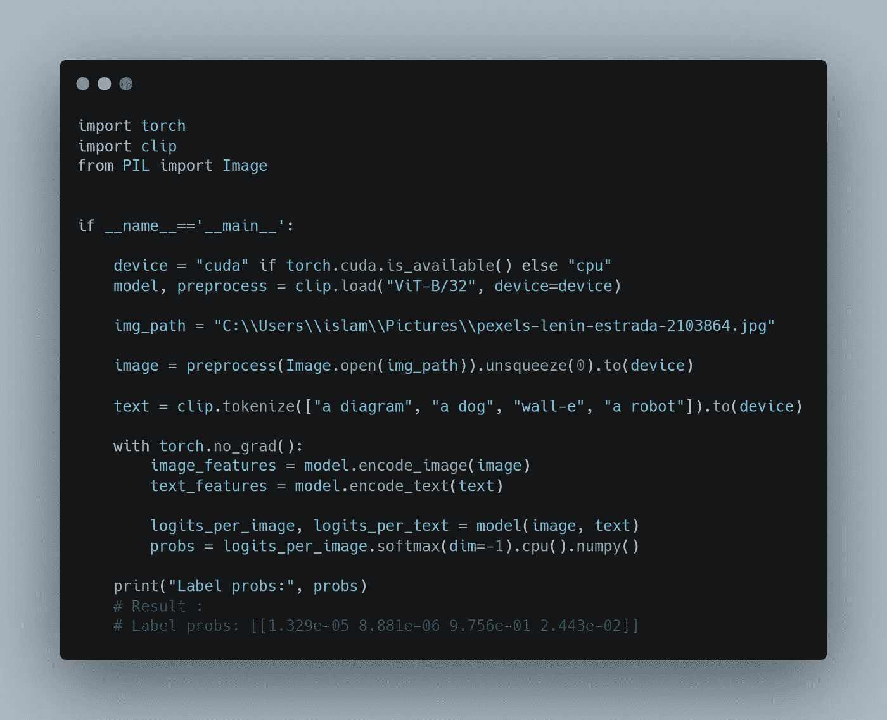

# 如何通过添加 NLP 的味道来解锁强大的计算机视觉应用

> 原文：<https://towardsdatascience.com/how-to-unlock-powerful-computer-vision-applications-by-adding-a-flavor-of-nlp-d125ef81559d?source=collection_archive---------35----------------------->

## 结合 NLP 和计算机视觉的深度学习模型

图片来自 Pixabay

# 什么是剪辑？

计算机视觉中的自监督学习在学习图像的不同表示方面显示出巨大的潜力。

这是一种神经网络可以学习表示的方法，这些表示可以在以后用于不同的任务，如图像分类和对象检测。

从数据集学习表示的另一种方法称为 [**剪辑**](https://arxiv.org/abs/2103.00020) ，由 [**OpenAI**](https://github.com/openai/CLIP) 开发。

这种方法使用(图像，文本)配对来学习图像编码器和文本编码器。这意味着它结合了自然语言处理和计算机视觉。

我觉得这很酷！

一旦学习了这些编码器，它们就可以在零射击设置中用于完成不同的计算机视觉任务。

# 剪辑工作原理的高级概述

在下图(左侧)中，我们看到了如何使用(图像，文本)配对来学习两个编码器。一个是文本编码器，另一个是图像编码器。这就好像我们试图将语言映射到视觉，反之亦然。

然后，这两个编码器可以用于一次性设置，以预测图像包含的内容，例如，如下图右侧所示。

剪辑高级概览图(来自原纸[1])

# 为什么剪辑令人印象深刻？

ResNet-50 在来自 ImageNet 的 128 万个人群标记的训练样本上进行训练。它通过纯监督达到了很高的 top-1 精度。

CLIP 通过不使用这 128 万张图像中的任何一张图像达到了相当的准确性！

CLIP 也达到了与 InceptionV4 相当的前 5 名精度。后者是在一个纯粹的监督环境中接受培训的。

仔细想想，这太不可思议了！

# 我测试了 CLIP 深度学习模型

使用 OpenAI 提供的开源[代码](https://github.com/openai/CLIP)，我给 CLIP 了下面这张图片，是我从股票图片网站 Unsplash 得到的。

WALL-E(来自 Unsplash)

这张图片是一个名叫瓦力的机器人，它曾出现在同名电影中。

我通过给 CLIP 一个包含句子“a robot”的句子字典来测试它。

作者制作的图像

> 标签问题:[[5.436 e-04 3.622 e-04 4.041 e-04 9.985 e-01]]

夹子答对了！它给了这个标签最高的概率。

然后我给它除了“一个机器人”还加了“瓦力”这个词。

作者制作的图像

> 标签问题:[[1.329 e-05 8.881 e-06 9.756 e-01 2.443 e-02]]

瞧，它也做对了！

事实上，我保留了两个句子:“一个机器人”和“瓦力”,它给了后一个标签最高的概率！

**还记得**吗，CLIP 在纯监督环境下既没有被训练识别机器人，也没有被训练识别瓦力。但它仍然能够一次性识别出它们。这太不可思议了！

不仅仅是这样！通过给这个模型贴上“瓦力”和“机器人”的标签，我试图了解 CLIP 对这个图像到底了解多少。我认为“wall-e”这个标签太具体了，但显然这个模型非常强大！

如果要我在其他具体案例上测试，请告诉我！

# 结论

在本文中，我们了解了自然语言处理和计算机视觉的结合是如何产生一些令人难以置信的结果的。CLIP 是一个深度学习模型，展示了这一点。我们看到了 CLIP 如何在一次性设置中使用，并且仍然做出正确的预测。*这是深度学习的未来吗？*

# 参考

[1]亚历克·拉德福德等.*从自然语言监督中学习可转移视觉模型*

作者制作的图像

我是一名机器学习工程师，致力于解决具有挑战性的计算机视觉问题。我想帮助你学习应用于计算机视觉问题的机器学习。以下是方法。

1.  通过帮助您了解该领域的最新动态。我几乎每天都在 [**LinkedIn**](https://www.linkedin.com/in/nour-islam-mokhtari-07b521a5/) 和[**Twitter**](https://twitter.com/NourIslamMo)**上分享一些小帖子。那就跟我去吧！**
2.  **给你一份我的**时事通讯上那些琐碎帖子的每周摘要。所以订阅吧！****
3.  ****通过在 Medium 上写关于机器学习不同主题的文章。所以跟我来吧！****
4.  ****给你一份免费的机器学习工作清单，帮助你检查你需要学习的所有要点，如果你计划在 ML，特别是在计算机视觉方面的职业生涯。你可以在这里 得到核对表 [**。**](https://www.aifee.co/free-resources)****

****5.最后但同样重要的是，通过与你分享我的 [**免费入门张量流课程**](https://aifee.teachable.com/p/introduction-to-tensorflow-2-for-computer-vision) ，它有超过 ***4 小时*的视频内容**，你可以在那里问我任何问题。****

****此外，如果您有任何问题或者您只是想聊聊 ML，请随时在 LinkedIn 或 Twitter 上联系我！****