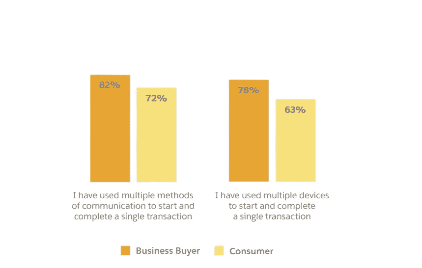
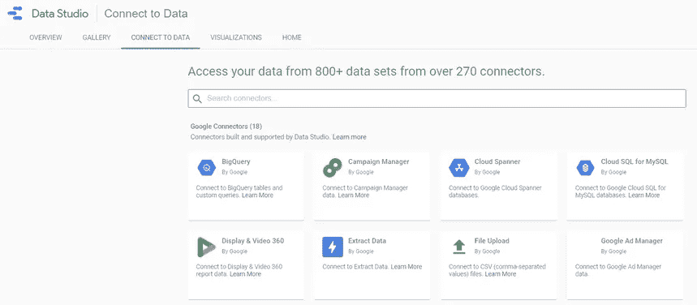
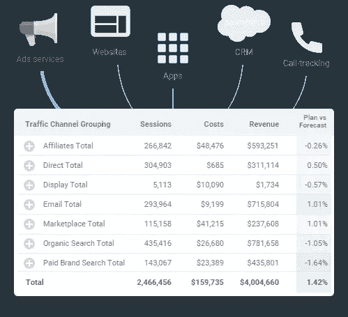
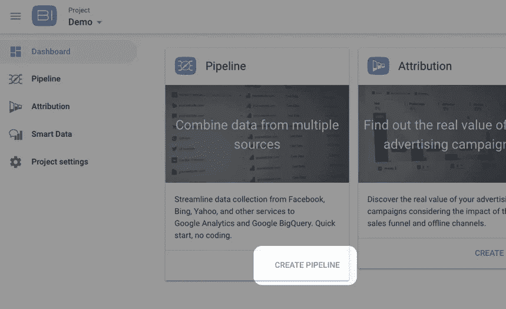
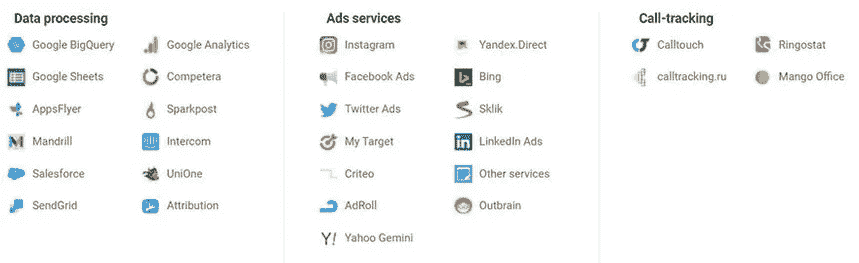
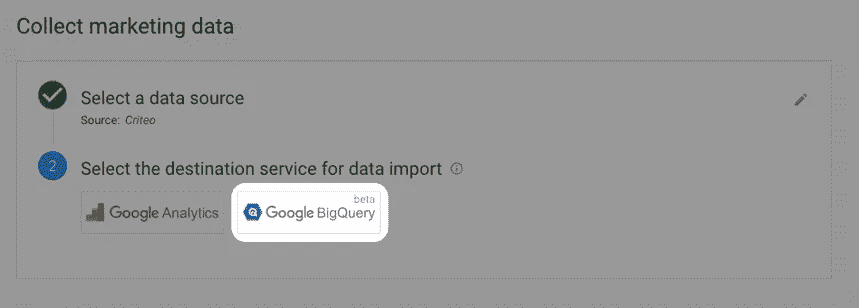

# 如何上传广告数据到谷歌大查询

> 原文：<https://towardsdatascience.com/how-to-upload-ads-data-to-google-bigquery-5ebdf1a2cf90?source=collection_archive---------27----------------------->

来源: [Unsplash](https://unsplash.com/photos/LfG7RwMM6g8)

## 了解如何在一个集中的数据仓库中比较和分析您所有营销渠道的广告表现，以及如何轻松地将您的广告数据上传到 GBQ。

如果你像许多营销人员一样，你可能会使用各种数字营销渠道开展活动——不仅包括谷歌广告，还包括脸书、Instagram、Twitter、LinkedIn 等等。没有钱可以浪费，你的目标是从每项营销投资中获得最大收益。为此，您需要清晰、全面地了解客户在所有渠道和设备上的旅程。

在这篇文章中，我们将探讨如何将所有的东西放在一起，并将所有的营销数据上传到一个数据存储中(例如 Google BigQuery ),从而描绘出一幅广告活动绩效的美好画面，并提高所有多个广告渠道的投资回报率。

全渠道营销分析已经成为任何规模和行业的组织的关键工具。然而，大多数营销人员将时间浪费在日常活动上，比如手动组织数据。 [OWOX BI](https://www.owox.com/) 为您耗时的营销常规提供解决方案。有了 OWOX BI，来自付费活动的广告数据将被自动拉入 Google BigQuery。您可以根据自己的需要存储多长时间，根据需要创建详细的报告，了解付费营销计划的真正价值，并更好地利用您的广告支出。

# 当今数字营销的挑战

今天的客户旅程比以往任何时候都更加复杂。数字说明了一切:根据 [Salesforce 的《2020 年关联客户状况报告](https://www.salesforce.com/resources/research-reports/state-of-the-connected-customer/)，72%的消费者使用多种沟通方式来开始并完成一笔交易。从 Z 世代到沉默一代，63%的消费者使用多种设备开始并完成一笔交易。最重要的是，62%的消费者表示，他们更喜欢个性化的产品或服务，而不是标准的“一刀切”的报价。

图片由作者提供

单个客户的旅程可能需要几分钟到几个月的时间。它可能发生在一个渠道中，也可能跨越多个接触点和设备。举个例子:用户可以首先通过智能手机上的脸书广告访问你的网站，然后在初次互动几天后，通过笔记本电脑上的搜索广告注册并购买。在当今多渠道、多设备的环境下，消费者只需点击一下鼠标，就能离开你的品牌，转向竞争对手。

如果你像大多数营销人员一样，你可能正在努力与你的客户保持联系，并让他们通过互联网参与进来。你需要数据——这不用说。像大多数营销人员一样，你可能已经在筛选无数的活动报告，努力发现客户行为的趋势和模式，确定制胜策略，并优化你的营销策略。你留意一些选择的指标，其余的只是堆积在广告平台上，从未真正被分析或使用。

但是这里有一个警告:**如果你不关注价值，你就会落后于**。

据 [Gartner](https://blogs.gartner.com/lizzy-foo-kune/2020/10/07/more-than-half-of-marketing-leaders-are-disappointed-in-their-analytics-results/#:~:text=Despite%20CMOs%20prioritizing%20investments%20in,Marketing%20Data%20and%20Analytics%20Survey.&text=In%20fact%2C%20nearly%20half%20of,unable%20to%20measure%20marketing%20ROI.) 称，大多数营销分析团队仍然将大部分时间花在组织数据、运行即席查询和生成报告上，而不是实际使用他们的数据来为他们的营销决策提供信息。结果呢？Gartner 报告称，超过一半的高级营销领导对其分析投资的结果感到失望。

自动化日常活动将使您能够专注于对您的组织真正重要的事情，例如提取隐藏的见解并利用它们做出更好、更明智的营销决策。

尽管如此，在你的数据中寻找洞察力之前，你必须在一个地方收集和合并它。最广泛使用的解决方案是 Google BigQuery，这是一个完全托管的无服务器数据仓库，是 Google 基础设施的一部分。

# BigQuery 有什么特别之处？

全渠道营销的主要障碍之一是数据存储在彼此不容易沟通的孤岛中。如果你使用许多不同的平台开展付费营销活动，你就会知道密切关注每个活动并试图将所有营销活动的数据整合在一起是多么困难。

这就是 Google BigQuery 的用武之地。

Google BigQuery 是一个无服务器的、可扩展的数据仓库，具有内置的查询服务。它为营销人员提供了一个集中的位置来进行高级数据驱动的营销，而不需要广泛的技术技能、对 It 的依赖或大量的资金投资。

然而，BigQuery 有一个很大的问题——它不能与非谷歌服务集成。

您需要第三方连接器来整合来自非 Google 数据源的接触点。也就是说，如果你想从你的网站、CRM、ESP 或广告平台如[脸书广告到 BigQuery](https://www.owox.com/products/bi/pipeline/facebook-ads-to-google-bigquery/) 获取数据，你需要一个像 OWOX BI 这样的服务来帮你完成繁重的工作。

图片由作者提供

# 接受挑战:6 种自动上传常规数据的方法

您可以通过多种方式将您的广告数据上传到 Google BigQuery。主要任务是找到一种适合您的业务的方法，需要最少的努力，节省最多的时间，并提供可靠和准确的结果。

让我们来看看将数据上传到 Google BigQuery 的方法:

1.  **从 CSV 或 JSON 文件上传数据。**您可以手动将包含广告数据的 CSV 或 JSON 文件直接从 Google 云存储、Google Drive 或您的计算机上传到 Google BigQuery。
2.  **用 Google Sheets 上传数据(OWOX BI BigQuery Reports 插件)。**你可以使用免费的 [OWOX BI BigQuery Reports 插件](https://www.owox.com/products/bi/pipeline/google-sheets-to-google-bigquery/)从 Google Sheets 上传数据。你可以直接从 Google Sheets 或者从 Chrome 网上商店[安装这个插件。](https://workspace.google.com/marketplace/app/owox_bi_bigquery_reports/263000453832?pann=cwsdp)
3.  **从谷歌云存储上传数据。** [谷歌云存储](https://cloud.google.com/storage/)让你安全地在线存储和传输数据。你可以在谷歌云帮助中心了解[数据下载限制](https://cloud.google.com/bigquery/docs/loading-data-cloud-storage#limitations)和[云存储权限](https://cloud.google.com/bigquery/docs/loading-data-cloud-storage#required_permissions)。
4.  **从谷歌广告和谷歌广告管理器等其他谷歌服务上传数据。**要从各种 Google 服务上传数据，首先需要配置 BigQuery 数据传输服务。在您可以使用它之前，您必须选择或创建一个数据项目，并且在大多数情况下，为它启用计费。
5.  **用**[**big query API**](https://cloud.google.com/bigquery/docs/batch-loading-data)**下载数据。有了云客户端库，你可以使用你最喜欢的编程语言来使用 Google BigQuery API。**
6.  **使用第三方工具上传数据。**例如，通过 [OWOX BI Pipeline](https://www.owox.com/products/bi/pipeline/) ，您可以自动从广告服务以及呼叫跟踪和 CRM 系统中收集数据。这使您能够快速、轻松地从您选择的源中获得现成的完整数据集。

这些方法各有利弊，以及它们最适用的业务挑战。然而，为了跟上现代世界的步伐，最好通过尽可能自动化和简化流程，为你不能委派的任务节省时间和精力。

对于大多数企业来说，最佳决策是选择一个以最快、最简单的方式满足其需求的单一服务。那么，让我们来看看将你的广告数据上传到 Google BigQuery 的最佳方式之一。

# BigQuery 和 OWOX BI:释放数据价值的正确组合

[OWOX BI](https://www.owox.com/) 是一个全面的商业智能系统，旨在促进营销分析和决策。借助 OWOX BI，营销人员可以自动集中各种来源的不同数据，并使用这些整合数据来:

*   分析他们的营销努力
*   创建自动化报告
*   揭示客户与组织互动的新见解
*   优化您的营销投资以获得更好的投资回报。

您不必编写一行代码，不必四处寻找连接器，也不必手动准备数据。OWOX BI 会处理好一切。

现在，OWOX BI 和 Google BigQuery 到底能帮你做什么？

## 汇集来自多个系统的数据

只有在将数据整合到一个集中的位置后，它才变得可操作。您需要做的第一件事是有效地整合您的数据，以便您可以轻松地处理、分析和提取来自所有这些众多客户接触点的见解。你需要知道你信任你的数据，并且你在比较苹果和苹果。

图片由作者提供

OWOX BI 提供了一套连接器，可以自动将你所有营销平台的原始数据，包括 [LinkedIn](https://www.owox.com/products/bi/pipeline/linkedIn-ads-to-google-bigquery/) 、 [Twitter](https://www.owox.com/products/bi/pipeline/twitter-to-google-bigquery/) 、 [Instagram](https://www.owox.com/products/bi/pipeline/instagram-to-google-bigquery/) 和[脸书](https://www.owox.com/products/bi/pipeline/facebook-ads-to-google-bigquery/)拉至 BigQuery。结果是一个随时可用的数据集，每天自动更新。此外，您将能够将这些数据与来自其他接触点的数据联系起来，包括来自您网站的原始实时数据以及来自您的 CRM、呼叫跟踪和电子邮件营销系统的数据。你唯一要做的事情就是全力以赴，专注于将数据付诸行动。

## 处理海量数据

BigQuery 是[谷歌云平台](https://console.cloud.google.com/home)的一部分，这意味着你可以获得谷歌的云计算和存储能力。您可以在这里存储万亿字节的数据，包括所有的历史数据，并在几秒钟内对数十亿行进行查询。

## 减少重复性的工作

在传统场景中，营销人员必须手动在广告服务之间来回切换，以提取数据快照并将其组织到[报告和仪表板](https://www.owox.com/blog/articles/advanced-marketing-reports-google-data-studio/)中。通过 OWOX BI 和 BigQuery 实现这些过程的自动化消除了执行常规数据更新的麻烦，并确保您可以随时获得最新的数据。如果您的广告账户发生变化，OWOX BI 还会追溯性地刷新 Google BigQuery 中的成本数据。

## 永远不要失去对历史数据的控制

大多数营销平台都对你可以存储多少数据或可以访问这些数据多长时间有限制。有了 Google BigQuery，你可以将来自所有营销平台的数据保存任意长的时间，并对其进行分析，以捕捉不太明显的趋势，这些趋势只有在很长一段时间后才会变得可见。OWOX BI 可以用您的 ad 帐户中的历史数据填充您的 BigQuery 数据集，因此您可以立即开始工作。

## 进行全面的数据分析

使用 BigQuery 中的数据，您将能够创建原始数据中没有的定制指标和维度，创建任意参数组合，将定制过滤器应用于您的报告。

如果您不喜欢编写 SQL 查询，OWOX BI 可以满足您的需求。您可以使用 OWOX BI Smart Data 中的报告构建器，用自然英语询问您的数据问题，并根据您的数据以组织有序的报告形式获得答案，其中包含您需要的具体指标。

图片由作者提供

## 可视化数据

通过将 BigQuery 连接到您最喜欢的可视化工具，或者将您的报告导出到数据可视化服务，如 [Google Data Studio](https://datastudio.google.com/u/0/) ，来创建可操作的数据可视化。为此，您不必使用多个数据源:一个 BigQuery 连接器就足够了。

# 如何用 OWOX BI Pipeline 将广告数据上传到 Google BigQuery

要设置数据收集，您必须在要收集数据的项目中拥有 [*BigQuery 数据编辑器*和 *BigQuery 用户*角色](https://cloud.google.com/bigquery/docs/access-control)。一旦这些角色出现在您的项目中，请按照以下步骤将您的广告数据上传到 Google BigQuery:

1.  在 OWOX BI 仪表板中，单击**创建管道**。

图片由作者提供

2.选择要连接的数据源。

图片由作者提供

3.选择 **Google BigQuery** 作为目的地。

图片由作者提供

4.提供您广告帐户的访问权限。

5.提供对您想要存储导出数据的 Google BigQuery 帐户的访问。

6.选择一个 Google BigQuery 项目并创建一个想要上传数据的数据集(或者选择一个现有的数据集)。

7.指定标记要上载成本数据的期间的开始日期，并选择要将成本数据转换为的货币。

8.点击**创建管道**。

搞定了。Google BigQuery 会自动收集数据，你可以从你选择的来源获得现成的完整数据。

# 最后的想法

在数据产生价值之前，需要对其进行收集、处理、分析并付诸行动。借助 Google BigQuery 和 OWOX BI，营销人员可以轻松摆脱手动任务和分散的电子表格，转向成熟的商业智能系统，在该系统中，您可以自动聚合来自多个接触点的数据，并将其转化为有价值的见解。

毕竟，您收集的数据的价值完全取决于您驾驭这些数据并从中做出决策的能力。