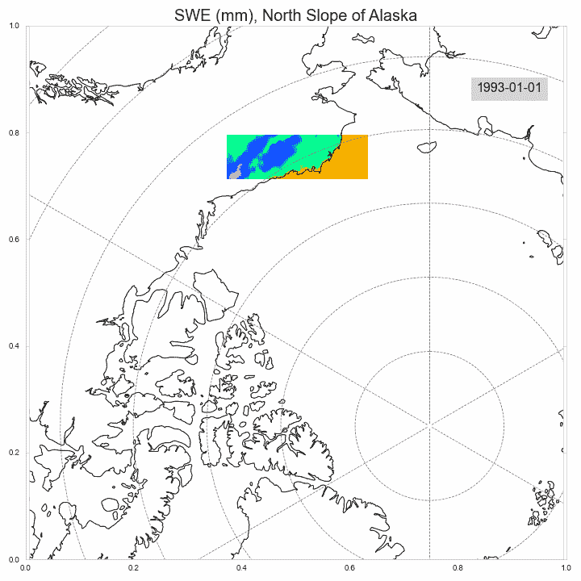

# 如何上传和嵌入交互式绘图可视化

> 原文：<https://towardsdatascience.com/how-to-upload-and-embed-interactive-plotly-visualizations-f819d4ffecfb?source=collection_archive---------15----------------------->

## Plotly 是一个很好的交互式数据可视化工具，但是它的 Chart-Studio 服务仅限于 500KB 的上传。


由作者创建

今年我分享了很多我用 Plotly 制作的互动情节。有一段时间，Plotly 的 chart-studio 服务对我来说是一个很好的解决方案，我可以上传我的绘图，以便我可以将它们嵌入到文章或演示文稿中。然而，Chart-Studio 在他们的自由层上有一个相当激进的 500KB 大小限制。除了昂贵的商业计划之外，chart-studio 没有一个透明的选项来支付更大的上传量。

我想一定有更好的方法来分享我制作的交互式网络地图，果然有！在这篇文章中，我将向你展示如何上传一个交互式 Plotly 地图到 Datapane，并将其嵌入到任何网站上。

# 图表工作室

看看下面描绘阿拉斯加积雪变化的图。我用 Matplotlib 和 Cartopy 创建了它，它们可以很好地将数据投影到底图上。然而，静态地图不允许查看者查看数据值或缩小以获取位置的上下文。此外，虽然像这样的动画地图很有趣，但我认为网络地图上的滑块可以让读者更好地了解随着时间的推移而发生的变化。



由作者创建

制作一个互动版本将意味着我不必在数据可见和观众了解我们在地球上的位置之间做出选择。当我为博客帖子等设置创建地图时，我喜欢使用交互式地图，因为我不会在那里解释背景信息。我倾向于用静态地图来展示，因为我可以向观众提供任何需要的背景。

我们可以很容易地使用 Plotly 重新创建这个交互的情节。但是，有很多数据点，远远超过了 500KB 的 Chart-Studio 限制。但是我们马上会处理这个问题。首先，下面是我用 Plotly 翻拍剧情的代码:

由作者创建


Plotly 剧情截图(作者创作)

下面是这段代码创建的一个屏幕截图。看起来很好！然而，当我使用 chart-studio 上传它时，我得到了以下错误:

```
import chart_studio.plotly as pypy.plot(fig, filename = 'swe_map_test', auto_open=True)
```


Plotly 图表工作室大小限制(由作者创建)

如果你有一个只有很少数据点的图，你也许可以摆脱 500KB 的限制。为了让我写的几篇文章的图表符合我的要求，我会随机挑选一些数据。然而，我最近发现了另一个工具 Datapane，它的空闲层有一个更高的大小限制。

# 数据面板

Datapane 是一种用于创建由数据帧、绘图和文件组成的报告的服务。您可以在 Python 中创建它们并将它们发布到 Datapane。他们还提供了一个免费层，比 Chart-Studio 有更高的上传大小限制。太棒了。

用 Datapane 创建报告非常有用，但是在这篇文章中，我们将重点介绍如何使用 Datapane 来嵌入用 Plotly 和 Altair 制作的交互式绘图。创建一个报告只需要几行代码。

首先，使用 pip 安装 Datapane:

```
pip3 install datapane
```

现在您可以创建一个 Datapane 帐户，并通过终端/命令提示符登录:

```
datapane login --token=[your_token]
```

现在我们都设置好了，我们可以继续发布我们的数字！

```
import datapane as dp report = dp.Report(dp.Plot(fig))
report.publish(name="SWE Study Area", open=True)
```

一旦您运行这个代码，一个新的窗口将会打开，您的绘图将会上传到 Datapane。我们可以通过粘贴“分享”按钮中的 URL 将情节直接嵌入到这篇文章中:

由作者创建

您可能需要进入设置，并将图“可见性”更改为“公共”。由于某些原因，在最新版本的 Datapane 上，在 Python 中设置可见性给我抛出了一个错误。

现在我们有了一个用 Plotly 构建的交互式网络地图，我们可以把它嵌入到任何地方。最棒的是，这个图比我能够通过 Chart-Studio 上传的要大得多，这意味着我可以开始上传更多的网络地图，而无需支付昂贵的订阅费。

# 在 GitHub 页面上托管

我尝试的 Chart-Studio 的第一个替代方案是用我的情节创建一个 GitHub Pages repo，并通过 iFrame 嵌入它。我在几个地方读到过这种方法，我真的很喜欢它，因为 GitHub Pages 的限制很少。然而，许多网站，比如我们目前所在的网站，不支持手动插入 iFrames。这意味着在 GitHub 页面上托管情节对我的用例不起作用，因为我不能将它们插入到我的文章中。不过，我将向您展示如何做到这一点，因为这是在您自己的网站上嵌入的一个很好的解决方案。

## 创建 HTML 文件

首先，我们需要使用 Plotly 来导出我们绘图的 HTML 文件。

```
import plotly.io as pio
pio.write_html(fig, file='index.html', auto_open=True)
```

这将使用生成的 HTML 文件在浏览器中打开绘图。

## 设置 GitHub 页面

使用 GitHub 页面托管您的绘图有三个步骤:

1.  使用自述文件创建新的存储库
2.  上传新的 HTML 文件
3.  转到“设置”选项卡，向下导航到“页面”，在“源”下选择您的主/主分支


由作者创建

现在你可以去[https://wino6687.github.io/swe_viz_1/](https://wino6687.github.io/swe_viz_1/)看剧情，但是我不能把它放在这里。

# 包扎

希望这能帮助你找到一个免费的 Chart-Studio 的替代品，它没有 500KB 的上传限制。Datapane 使嵌入图变得非常简单，并且它们与许多网站接口良好。

# 资源

*   [数据面板文档](https://docs.datapane.com/)
*   [Plotly 文档](https://plotly.com/python/)