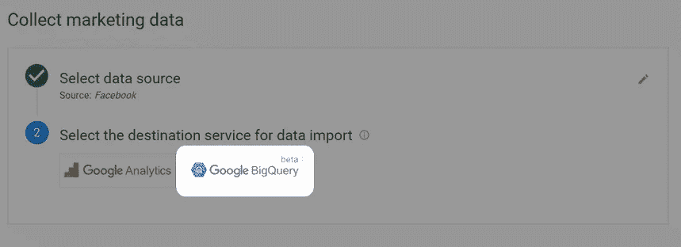

# 如何从脸书上传数据到谷歌大查询

> 原文：<https://towardsdatascience.com/how-to-upload-data-from-facebook-to-google-bigquery-fd4640957fe5?source=collection_archive---------33----------------------->

来源:[沉积照片](https://ru.depositphotos.com/40840471/stock-photo-equilibration.html)

## 在脸书广告档案和网络分析系统中，你可以分析广告表现的基础。对于广告渠道少的小企业来说，这就足够了。

脸书是全球[最受欢迎的社交网络](https://www.statista.com/statistics/272014/global-social-networks-ranked-by-number-of-users/)，每月活跃用户超过 26 亿。毫不奇怪，它已经成为许多商家的强制性促销渠道。超过 700 万的广告客户在这个平台上推广他们的服务。此外，脸书[拥有另外三个最大的社交媒体平台](https://www.facebook.com/iq/insights-to-go/6m-there-are-more-than-6-million-active-advertisers-on-facebook) : Instagram、WhatsApp 和 Facebook Messenger。

脸书和 Instagram 在广告商中受欢迎的另一个原因是接触受众的低价格和准确锁定受众的能力。

# 脸书收集什么数据

脸书为企业和营销人员提供广告宣传工具:脸书广告经理、脸书像素和脸书分析。

默认情况下，广告管理器提供关于覆盖范围、浏览量、点击量、广告成本等信息。如果你在网站上安装了脸书 pixel，并设置了事件跟踪功能，你就可以通过点击广告来了解用户的行为。

你可以在任何设备上跟踪你的广告给你的网站带来的所有类型的转换，并查看你想要的行为花费了多少。脸书报告显示你所有的点击，注册，订单，购买等。

存储在脸书广告档案中的数据只能告诉你一个来源的有效性。但是，如果一个用户从有机流量中找到你，然后回到你的网站，点击脸书上的链接，并在收到电子邮件后进行购买，会怎么样呢？在这种情况下，你如何评价脸书渠道的有效性？在整合数据之前，您不会知道它如何与其他营销来源交互，以及它们如何影响整体业务。

在大公司，营销不仅限于脸书，销售可以在线上和线下进行。因此，有必要将脸书广告管理器的数据与您的网站、其他广告服务和您的 CRM 的数据结合起来，这样您就可以看到全貌:在广告上花了多少钱，哪些广告渠道更有效，以及财务结果。

# 为什么要在谷歌大查询中收集脸书的数据？

通过将广告服务的成本数据上传到 Google BigQuery，您可以将成本与网站上的用户活动、呼叫中心的呼叫、电子邮件以及 CRM 系统中的购买订单相关联。这有助于您[建立高级分析](https://www.owox.com/blog/use-cases/end-to-end-analytics-implementation/)并评估所有在线和离线营销活动对业务绩效的影响。

上传到谷歌 BigQuery 的营销服务数据可以用于[计算你的归因模型](https://www.owox.com/products/bi/attribution/)，然后 BigQuery 可以将结果传递给系统进行自动投标管理。此外，在谷歌大查询中，你可以根据综合数据和属性计算的结果创建用户受众，然后[自动将这些受众发送给广告服务](https://www.owox.com/import-audiences-from-google-bigquery/)。最后，您可以使用 BigQuery 中收集的数据来[构建任何您需要的报告](https://www.owox.com/marketing-reports/)而不受限制。

# 为什么谷歌大查询而不是其他云存储？

最受欢迎的云平台是亚马逊红移、谷歌 BigQuery 和微软 Azure。与传统的数据仓库相比，它们具有共同的优势:

*   当负载增加时，您不需要维护服务器和连接新的服务器。云存储会自动扩展。
*   云平台比传统存储更快，并自动重新分配负载。
*   进入云存储不需要在电脑上安装服务器。只需打开浏览器，登录云端。

我们选择 Google BigQuery 并推荐给我们的客户，原因如下:

*   谷歌是营销人员数据来源数量的领导者:广告、分析、搜索控制台、YouTube。所有这些服务都与 BigQuery 无缝集成。
*   它能快速处理大量数据。
*   不需要数据库管理员的帮助，很容易上手 BigQuery。只需创建一个谷歌云帐户。
*   您只需为您使用的服务付费。
*   有现成的服务和解决方案可以在不需要开发者帮助的情况下将数据上传到 Google BigQuery。

# 如何将脸书的数据导入 Google BigQuery

谷歌 BigQuery 没有内置的从脸书广告管理器导入数据的工具。有几种方法可以解决这个问题:手动上传数据，编写自己的脚本，或者使用 OWOX BI 之类的专门服务。让我们仔细看看这些选项。

## 手动导入数据或使用您自己的解决方案

您可以将脸书广告资料中的成本数据上传到单独的文件中，并通过 BigQuery 界面手动上传。这种方法的缺点是显而易见的:大量不必要的工作，没有自动化。

您还可以编写脚本，从营销服务中上传您需要的数据。然而，您需要不断地监控和支持这些脚本。你还必须花费开发人员的资源来组合来自不同账户和不同日期的数据，检查数据质量，并快速响应广告服务 API 的可能变化。此外，如果脸书广告中的数据发生变化，您需要追溯更新数据，将所有广告来源的成本转换为单一货币，等等。如果你不做这些事情，低质量的数据会导致次优的解决方案，让你的企业损失惨重。

## 使用谷歌分析将成本数据收集到谷歌 BigQuery 中

使用 OWOX BI，您可以设置从不同广告服务向 Google Analytics 自动导入成本数据，并将成本数据上传到云存储中。如果你使用这种方法，考虑一下谷歌分析的[限制:](https://support.google.com/analytics/answer/6016094?hl=en&utm_id=ad#technical_file_limitations&zippy=%2C%D1%81%D0%BE%D0%B4%D0%B5%D1%80%D0%B6%D0%B0%D0%BD%D0%B8%D0%B5%2Cin-this-article)

*   每天最多可将 90 MB 加载到单个数据集中。
*   每个资源每天最多可以下载 50 个文件。
*   Google Analytics 可能需要 24 小时来处理上传的数据，并使其在报告中可用。
*   当上传大量数据时，Google Analytics API 可能会出现问题。
*   您上传的参数不能超过 Google Analytics 的[成本数据集模式](https://support.google.com/analytics/answer/6066858#zippy=%2Cin-this-article)所能包含的参数。

## 将广告服务的费用直接导入 Google BigQuery

OWOX BI 拥有来自[脸书](https://support.owox.com/hc/en-us/sections/360008993193)、 [Instagram](https://support.owox.com/hc/en-us/sections/360008993193) 和 [LinkedIn](https://support.owox.com/hc/en-us/sections/360008995613) 的直接数据流，你可以通过它将所有活动的原始数据上传到 BigQuery。这些[数据方案](https://support.owox.com/hc/en-us/articles/115000316593)包含 80 到 200 个参数，这确保了您报告的高粒度数据。

**脸书与谷歌 BigQuery 的直接整合有什么好处？**

OWOX BI 提供了开箱即用的完整解决方案，您不需要手动做任何事情。该服务以方便的格式收集您需要的所有数据，并监控其质量和相关性。

如果脸书广告中的历史数据发生变化，OWOX BI 会自动更新上传到 BigQuery 的数据。此外，如果有必要，您可以上传您最近六个月的历史数据。这将有助于您评估活动动态。

由于成本数据的导入没有 Google Analytics 的参与:

1.  你可以更快地获得数据:费用被直接上传到 BigQuery，你不必再等 24 小时让 Google Analytics 来处理。
2.  数据下载没有谷歌分析限制 [90 MB 和每天 50 次下载](https://support.owox.com/hc/en-us/articles/219386408)。
3.  创建流时，只需指定相同的数据集，就可以将多个 ad 帐户的统计数据下载到单个 BigQuery 表中。
4.  来自广告源的数据被编译成 Google BigQuery 中的一方表。这极大地简化了查询的编译和下载数据的分析。
5.  成本数据以两种货币上传到 BigQuery。一个字段存储广告服务的原始货币成本。创建流程时，您可以指定将成本数据转换为的另一种货币。转换成本对于必须将不同来源的数据转换为单一货币的报表很有帮助。

# 如何使用 OWOX BI 设置从脸书广告到 Google BigQuery 的成本数据导入

1.  确保你的广告链接有 UTM 标签。
2.  在 [OWOX BI](https://bi.owox.com/ui/projects/trial/) 主页上，点击创建管道:

图片由作者提供

3.作为来源，选择**脸书广告**:

图片由作者提供

4.作为目的地，选择 **Google BigQuery** :

图片由作者提供

*如果你在 Google BigQuery 中没有项目，* [*学习如何开始使用云存储并创建数据集*](https://www.owox.com/blog/use-cases/bigquery-schema/) *。*

5.选择要从中导出广告费用数据的脸书帐户(或授予对新脸书帐户的访问权限):

图片由作者提供

*在任何情况下，OWOX BI 都不会更改您的帐户设置或广告活动！*

*对于大多数广告平台，OWOX BI 仅请求访问以读取数据。这个访问级别足以让我们获得广告中链接标记的统计数据和信息。但并不是所有的广告服务都有我们期望的这种访问或工作水平。比如使用 OWOX BI 将脸书的原始数据导入 Google BigQuery，需要* [*ads_management 权限*](https://developers.facebook.com/docs/facebook-login/permissions/#reference-ads_management) *。*

图片由作者提供

6.选择一个已连接的帐户或授予对您要存储导出数据的 Google BigQuery 帐户的访问权限:

图片由作者提供

7.选择一个 Google BigQuery 项目和一个要上传数据的数据集(或创建一个新的数据集):

图片由作者提供

***注意！*** *要设置数据收集，您的 Google 帐户必须被授予目标项目的* ***BigQuery 数据编辑*** *和* ***BigQuery 用户*** *角色。否则，BigQuery 不会让您上传数据。*

图片由作者提供

*要检查/授予这些权限，请转到您的 Google 云平台项目中的* [*身份和访问管理*](https://console.cloud.google.com/iam-admin) *页面。更多阅读* [*谷歌文档*](https://cloud.google.com/bigquery/docs/access-control#bigquery-roles) *。*

8.指定管道的设置:

图片由作者提供

*   选择要上传成本数据的起始日期。您可以设置未来或过去的日期。如果您选择过去的日期，请了解历史数据导入的[限制。](https://support.owox.com/hc/en-us/articles/360051056991#Dataimportforthepastdates)
*   选择默认情况下要应用于导入数据的源/媒体。只有当 OWOX BI 没有接收到实际的 UTM 参数值时，您为 UTM 源/通道指定的默认值才会被写入成本数据表。关于为什么要在管道设置中为 UTM 源/通道指定默认值的更多信息，[参见帮助](https://support.owox.com/hc/en-us/articles/360061648971)。

**重要！**您可以随时将 pipeline 页面上的源/介质设置更改为除 google/organic 之外的任何值。指定的值将应用于修改后导入的新数据和更新窗口内的历史数据。

图片由作者提供

9.点击**创建管道**。

搞定了。前一天的数据将在每天 00:00 (UTC)出现在指定数据集中的表中。根据数据量和广告服务 API 的功能，导入数据可能需要 24 小时。表的结构见[本条](https://support.owox.com/hc/en-us/articles/115000316593)。

如果广告服务中的信息发生追溯性变化，OWOX BI 将在已建立的[更新窗口](https://support.owox.com/hc/en-us/articles/360056770692)内更新上传到 BigQuery 的所有数据。

# 关键要点

在脸书广告档案和网络分析系统中，你可以分析广告表现的基础。例如，您可以分析 CTR、CPC、CPA、CR、会话、观看深度、跳出率、RPC 和 ROAS。对于广告渠道少的小企业来说，这就足够了。

然而，如果您与客户有许多接触点，有线下商店，并希望看到完整的购买路径，那么您应该考虑[设置高级分析](https://www.owox.com/blog/use-cases/end-to-end-analytics-implementation/)并创建一个自动更新的仪表板，其中包含您感兴趣的所有指标。这将使您随时掌握最新信息，对广告效果进行全面评估，并更快地做出重要决策。