# 如何使用 Airflow 将文件上传到 Google Drive

> 原文：<https://towardsdatascience.com/how-to-upload-files-to-google-drive-using-airflow-73d961bbd22?source=collection_archive---------10----------------------->

## 开发自定义 GoogleDriveOperator

一个可以自动化的常见有用操作是将文档定期上传到 Google Drive 文件夹。例如，这可以是每月上传一次销售数据的 Excel 分析，以便与团队共享。

Airflow provider package `apache-airflow-providers-google`提供了允许与 GCP 上的谷歌服务轻松集成的组件。但是，它没有直接提供一个操作者直接上传一个本地文件到 Google Drive。这就是为什么在本文中，我们将学习如何构建我们自己的气流操作符来实现这一点。

我们将分四个连续的步骤来完成这项工作:

1.  在 GCP 上配置 Google Drive API 和创建服务帐户
2.  在我们的 Google Workspace 上配置全域委托
3.  为我们的自定义 GoogleDriveOperator 编写代码
4.  测试一个最小的 DAG 上传一个文本文件到我们的 Google Drive 账户

按照这些步骤，我们需要:

*   一个对 GCP 和它所属的谷歌工作区有管理权限的谷歌帐户
*   气流 2.0.x 安装

我在 Docker 上创建了一个[公共 GitHub repo](https://github.com/gontcharovd/google-drive-operator) 和一个 Airflow 安装以及本文中的所有代码。克隆项目并用`docker-compose run`启动它。

# 1.在 GCP 上配置 Google Drive API 和创建服务帐户

Airflow 通过 Google 云平台上的 Google Drive API 将文件上传到 Google Drive。

转到[*https://cloud.google.com/*](https://cloud.google.com/)并点击**控制台**。接受条件。迎接我们的是下面的仪表板(可能会因您的组织而有所不同)。

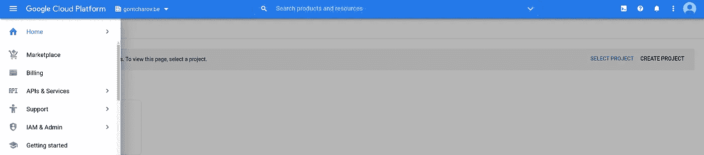

## 创建新的 GCP 项目

我们将创建一个新的 GCP 项目致力于这一功能。点击**选择一个项目**，然后点击**新建项目**。姑且称之为“气流驱动”。选择项目，使名称显示在顶部栏中。

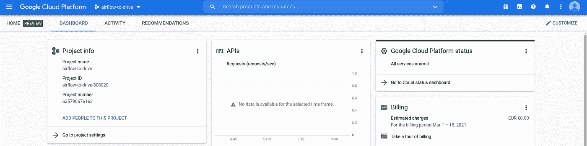

## 启用 Google Drive API

既然项目已经设置好了，我们可以启用 Google Drive API 了。在页面顶部的搜索栏中搜索“Google Drive API”并选择第一个搜索结果。

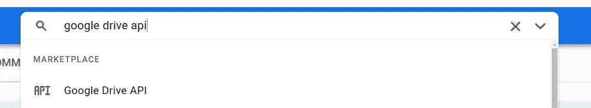

点击**启用**启用 Google Drive API。

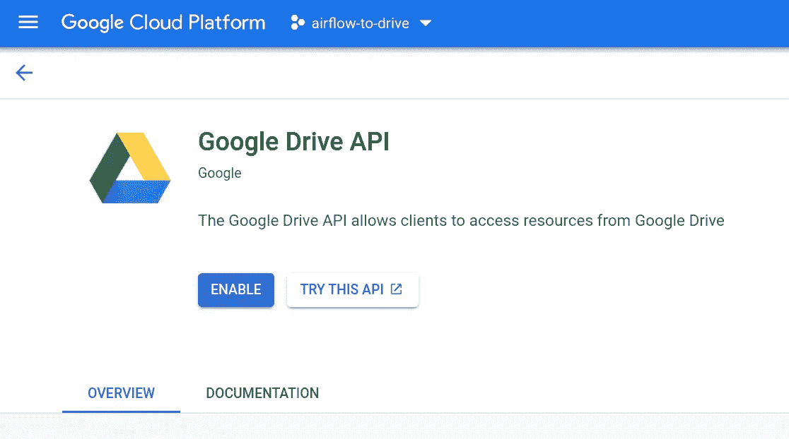

## 创建服务帐户

Airflow 将使用一个 Google 服务帐户来验证 Google Drive API。服务帐户是一种特殊类型的 Google 帐户，代表非人类用户。

从菜单进入**API&服务**并选择**服务账户**。

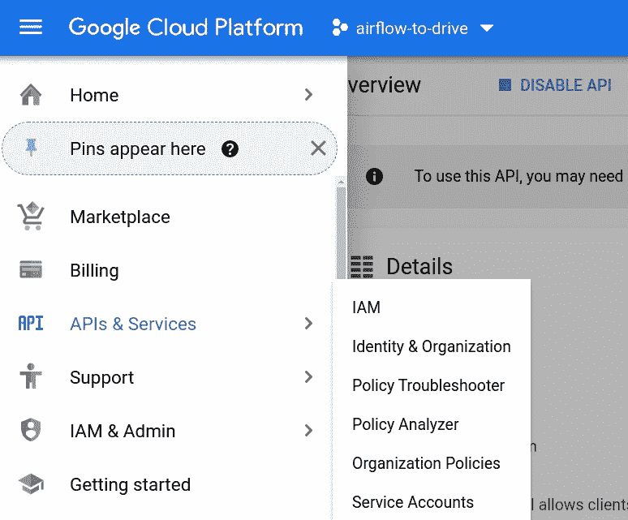

目前此项目中没有服务帐户。点击**创建服务账户**创建一个。

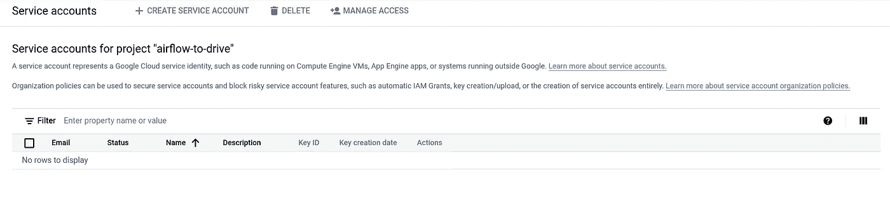

让我们将服务帐户命名为与项目“气流驱动”相同的名称。

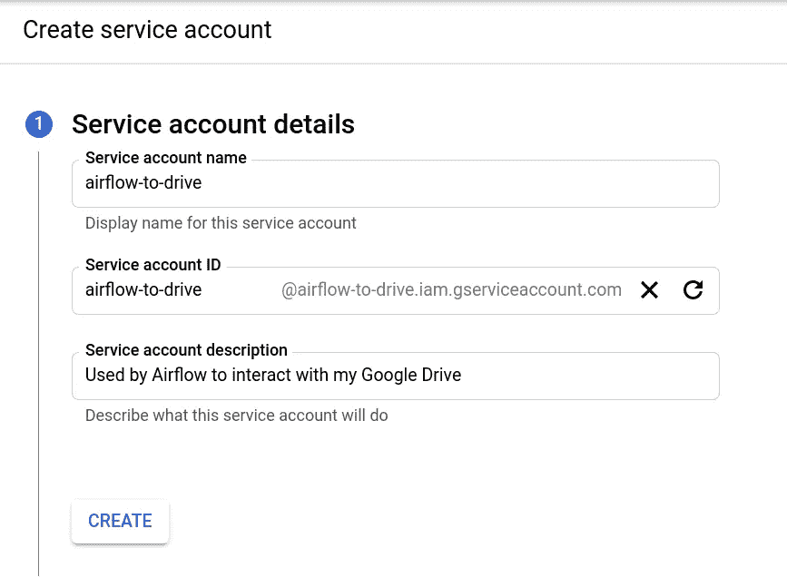

授予服务帐户此项目的**所有者**角色。

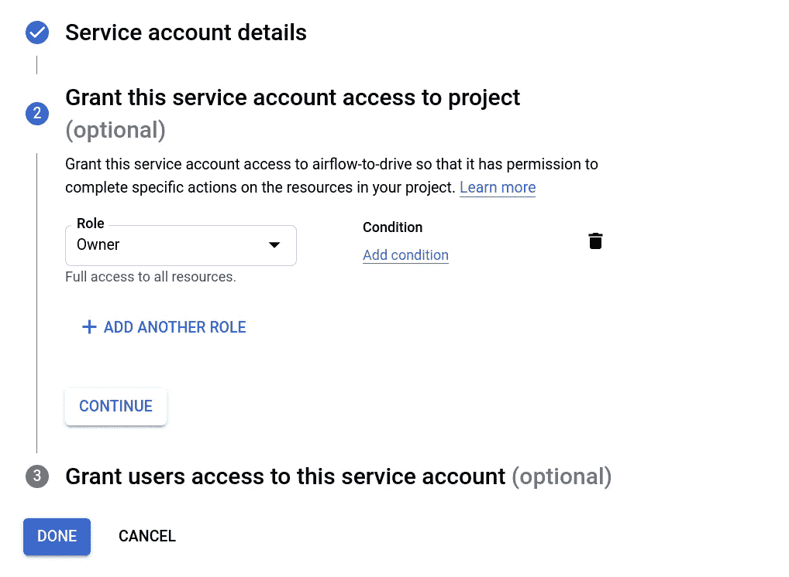

点击**完成**。服务帐户现在可见。

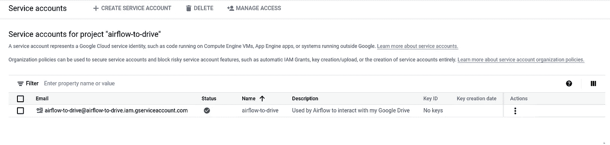

现在我们有了服务帐户，我们创建一个包含其凭证的 keyfile JSON。Airflow 将使用这些凭证来验证 Google Drive API。转到**键**选项卡，点击**添加键**。选择**创建新密钥**并选择 JSON 格式。

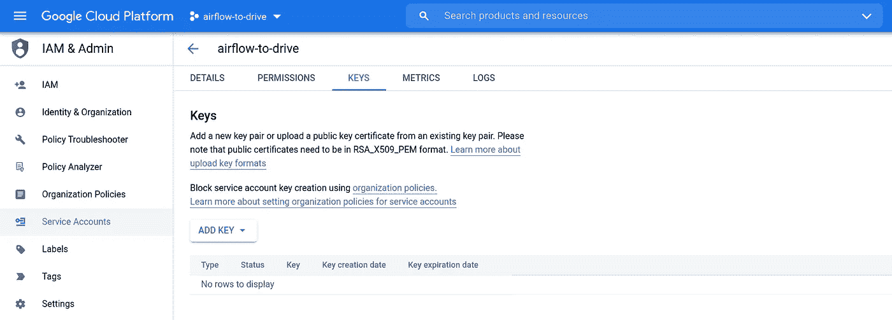

如果您正在使用提供的 [GitHub repo](https://github.com/gontcharovd/google-drive-operator) ，请将 JSON 密钥文件保存在`docker/`目录中。**确保将它的路径添加到。gitignore 这样你就不会不小心把你的 keyfile 推给 GitHub 了。不要与任何人共享此密钥！**

## 启用全域性委派

全域委托允许一个服务帐户在 Google Workspace 内代表另一个用户执行操作。这很重要，因为由服务帐户[创建或上传的文件对于其他用户来说是不可见的](https://forum.rclone.org/t/service-account-not-allowing-to-see-files-and-folders/12527)。通过为我们的服务帐户启用域范围的委托，我们将能够以我们自己的 Google 帐户的名义上传文件，以便可以直接访问上传的文件。

转到菜单中的**服务账户**并点击服务账户的电子邮件。这将打开一个页面，显示服务帐户的唯一 ID。请记下这个数字，因为我们在配置 Google Workspace 时会用到它。

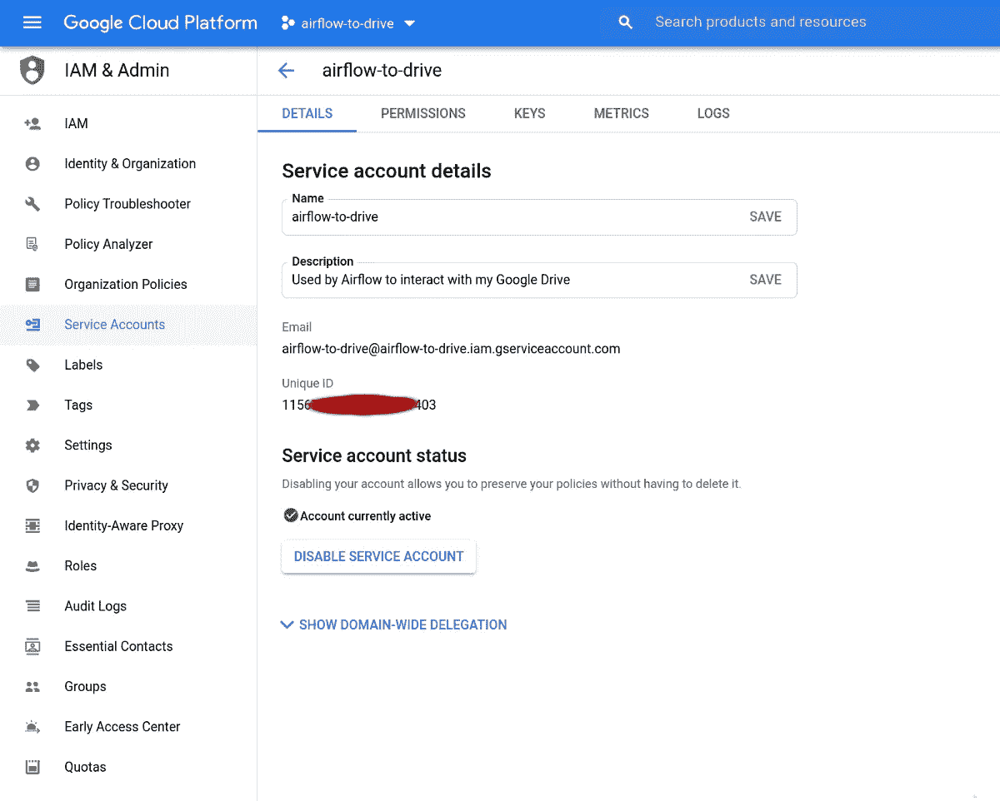

展开“全域委托”下的部分。选中显示**启用 G Suite 全域委托**的复选框。我们可以输入“airflow.to.drive”作为同意屏幕的产品名称。这个名称并不重要，因为我们不会使用这个特性。点击**保存**。

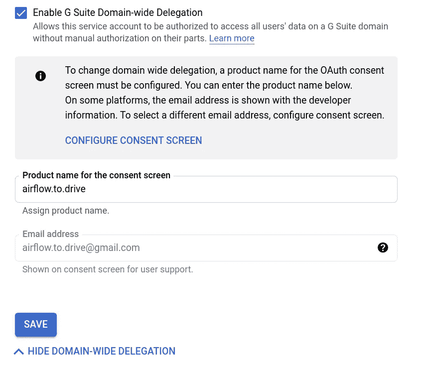

GCP 配置现在完成了！

# 2.在我们的 Google Workspace 上配置全域委托

接下来，我们必须通过我们的 Google Workspace 为服务帐户授权域范围的委托。前往[*https://myaccount.google.com/*](https://myaccount.google.com/)。点击右上角的**管理控制台**。

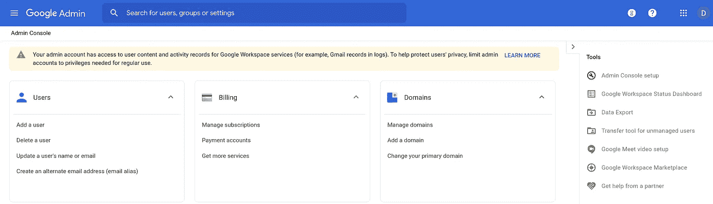

转到**安全**，然后转到**设置**。

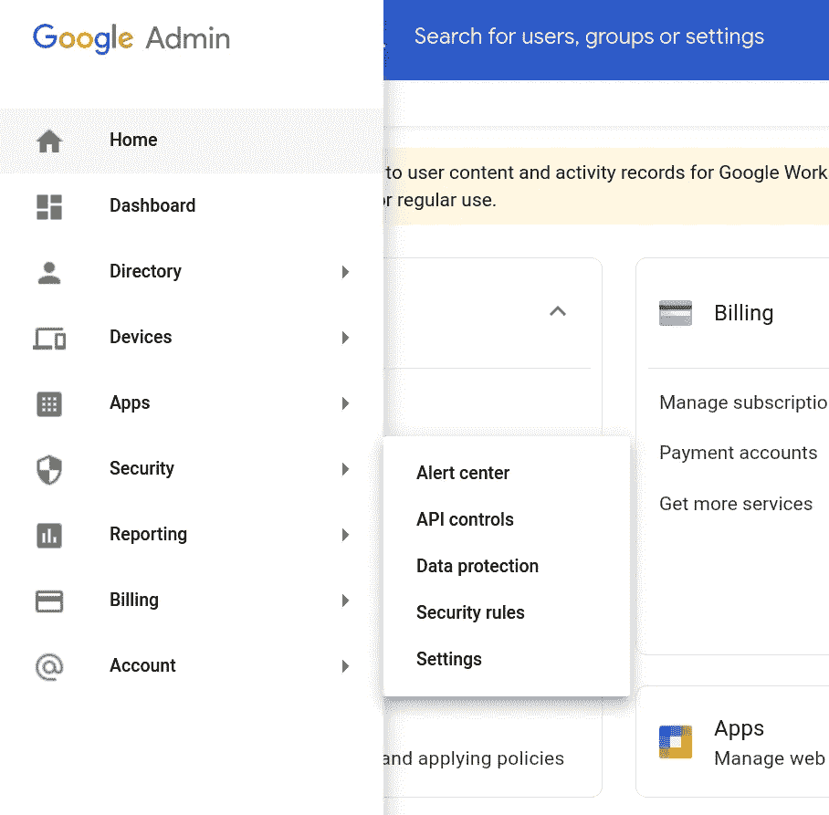

在列表底部，打开 **API 控件**部分。

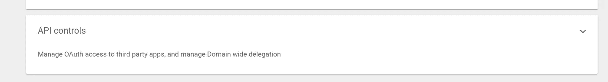

找到关于全域授权的部分，并点击**管理全域授权**。

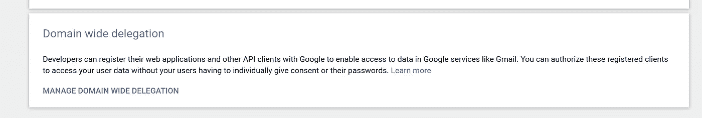

目前，没有条目。点击**添加新的**。

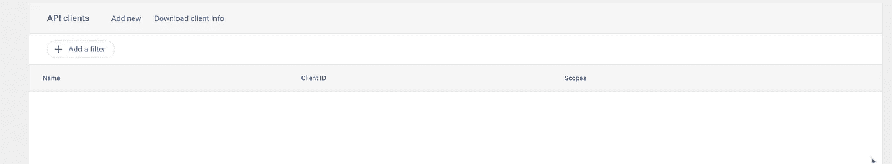

填写我们在上一部分中记录的服务帐户的唯一客户端 ID，并添加以下范围:[*https://www.googleapis.com/auth/drive*](https://www.googleapis.com/auth/drive)。这将授予具有该特定客户端 ID 的服务帐户对 Google Drive 的完全访问权限。点击**授权**。

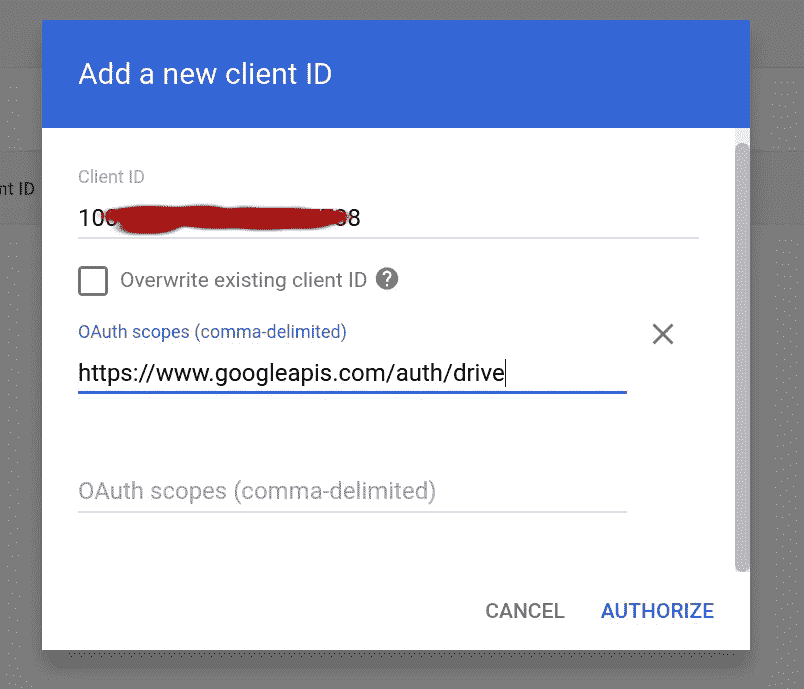

服务帐户现在被授权以 Google Workspace 中任何用户的名义将文件上传到 Google Drive。

Google Workspace 现在已经配置好了！

# 3.为我们的自定义 GoogleDriveOperator 编写代码

在这一部分中，我们将查看自定义气流操作符的 Python 代码。

像所有气流操作符一样，我们的 GoogleDriveOperator 继承自气流 BaseOperator 类。上传本身是由`apache-airflow-providers-google`包提供的 GoogleDriveHook 执行的。操作符接受我们想要上传的本地文件的路径、Google Drive 上的目标文件夹以及 GoogleDriveHook 所需的一些参数。如果参数`delete`设置为`True`，上传成功后本地文件被删除。将该文件放在`plugins/`文件夹中，以便它可以很容易地导入 DAG 模块。

# 示例 DAG

现在一切都设置好了，我们可以测试 GoogleDriveOperator 并将一些文件上传到我们的个人 Google Drive。

让我们编写一个包含两个任务的最小每日 DAG:

1.  使用 BashOperator 在`$AIRFLOW_HOME`的`tmp/`文件夹中创建一个包含当前日期的文本文件
2.  使用 GoogleDriveOperator 将此文件上传到 Google Drive 上的指定文件夹

此 DAG 将从 2021 年 2 月 10 日到 2021 年 2 月 13 日每天执行。每天都用内容`file created on 2021-02-10`创建一个文件，例如`my_file_2021-02-10.txt`。然后，这个文件被上传到我们谷歌账户的根目录下的文件夹`google-drive-operator`。请注意，`delegate_to`参数指定了服务帐户将上传委托给的电子邮件地址。该 Google 帐户将成为上传文件的所有者。

## 创建气流连接

还有最后一件事要做:我们必须创建由任务`upload_file`中的`gcp_conn_id`指定的[气流连接](https://airflow.apache.org/docs/apache-airflow/stable/howto/connection.html)。启动 Airflow 网络服务器，并转到**管理**选项卡。打开**连接**，用以下字段创建一个新连接:

*   连接标识:gcp_conn_id
*   连接类型:谷歌云
*   Keyfile 路径: */opt/airflow/ < <您的 JSON keyfile 名称> > >。json (* 或者，我们可以将这个 JSON keyfile 的内容粘贴到 Keyfile JSON 字段中)
*   项目 Id:驱动气流
*   范围:[*https://www.googleapis.com/auth/drive*](https://www.googleapis.com/auth/drive)

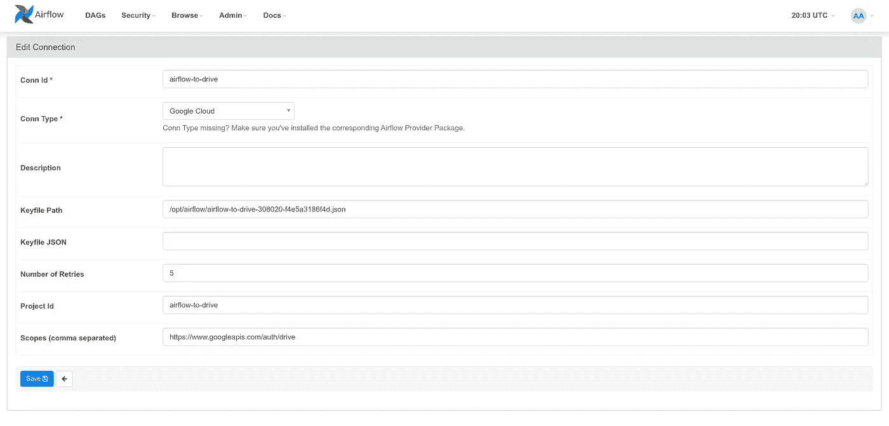

## 运行 DAG

返回到**DAG**部分并激活 DAG。

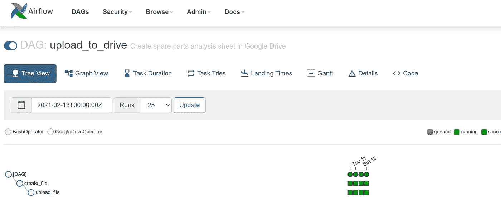

执行之后，可以在我们的 Google Drive 文件夹中看到文本文件。

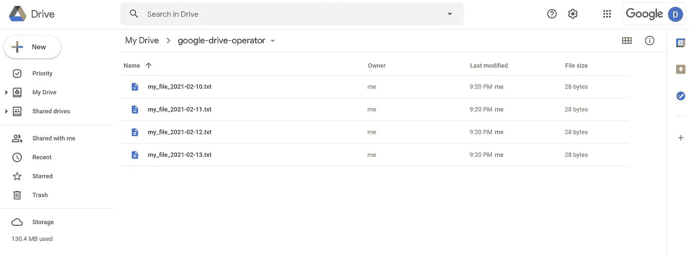

注意，由于域范围的委托，文件的**所有者**是“我”。如果`google-drive-operator`是一个共享文件夹，任何被授权的人都可以访问这些文件。

*我希望你喜欢我这篇关于气流和 Google Drive 的文章。欢迎在评论中分享任何有趣的用例或问题！*

[米海·苏尔杜](https://unsplash.com/@mihaisurdu?utm_source=unsplash&utm_medium=referral&utm_content=creditCopyText)在 [Unsplash](https://unsplash.com/s/photos/air?utm_source=unsplash&utm_medium=referral&utm_content=creditCopyText) 上的照片