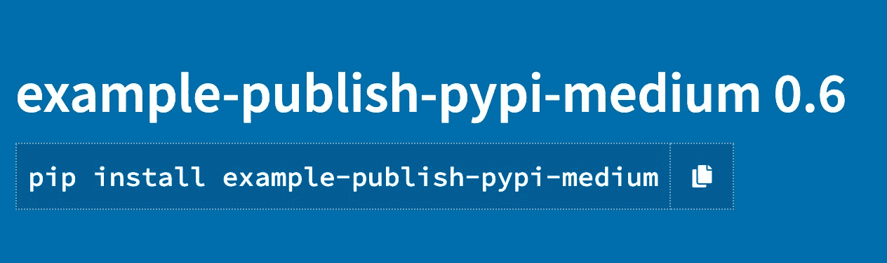

# 如何将 Python 包上传到 PyPI

> 原文：<https://towardsdatascience.com/how-to-upload-your-python-package-to-pypi-de1b363a1b3?source=collection_archive---------2----------------------->

## 让您的 Python 包在 pip 上可用的分步指南


由[凯利·西克玛](https://unsplash.com/@kellysikkema?utm_source=unsplash&utm_medium=referral&utm_content=creditCopyText)在 [Unsplash](https://unsplash.com/s/photos/packaging?utm_source=unsplash&utm_medium=referral&utm_content=creditCopyText) 上拍摄

您编写了一个新的 Python 包，解决了一个特定的问题，现在是时候与更广泛的 Python 社区分享它了。为此，您需要将包上传到一个中央存储库，全球的开发人员都可以访问这个存储库。

在今天的文章中，我们将讨论 PyPI 如何让开发人员与其他希望在自己的应用程序中使用特定功能的人共享包。此外，我们将介绍一个分步指南，帮助您在 PyPi 上上传 Python 包，以便每个 Python 用户都可以使用它。我将使用一个真实的端到端示例，这样所有步骤都非常清楚。

# 什么是 PyPI

[**Python 包索引**](https://pypi.org/) **，**缩写为 PyPI，是 Python 编程语言的官方软件库。默认情况下，`pip`——最流行的 Python 包管理器——使用 PyPI 作为检索包依赖关系的源。

PyPI 允许您查找、安装甚至发布您的 Python 包，以便公众可以广泛使用它们。超过 300，000 个不同的软件包目前发布在索引中，超过 2，500，000 个版本分发给用户。

# 如何让您的 Python 包在 PyPi 上可用

在下一节中，我们将探索在 PyPI 上发布 Python 包并使其在`pip`可用所需遵循的步骤。

## 步骤 1:确保您已经安装了 pip

如果你使用的是 Python 2 ≥ 2.7.9 或者 Python 3 ≥ 3.4 `pip`应该已经安装了。但是，如果出于任何原因您可能需要安装它，只需运行下面的命令(说明适用于 Unix):

```
curl https://bootstrap.pypa.io/get-pip.py -o get-pip.py
python get-pip.py
```

就是这样！您可以确保`pip`现在安装如下。

```
**$** python -m pip --version
pip X.Y.Z from .../site-packages/pip (python X.Y)
```

## 步骤 3:打包您的 Python 代码

我在 GitHub 上创建了一个示例项目，这样可以更容易地演示如何在 PyPI 上发布自己的包。这个项目可以在[这个链接](https://github.com/gmyrianthous/example-publish-pypi)上找到——通常你至少需要创建以下文件:

*   `**README.rst**`:强烈推荐包含一个 [README](https://github.com/gmyrianthous/example-publish-pypi/blob/main/README.rst) 文件，您应该在其中概述您的软件包所提供的基本功能。此外，您还可以附上安装说明或使用指南。
*   `**LICENSE.txt**`:最好在您打算广泛使用的包中包含一个许可证。有关更多选项和细节，请参考 GitHub 文档的[许可存储库](https://docs.github.com/en/github/creating-cloning-and-archiving-repositories/creating-a-repository-on-github/licensing-a-repository)部分。
*   `**setup.py**` **:** 这个文件应该放在你的项目结构的顶层目录中。在该文件中，您可以为 Python 项目指定配置。更多详情可参考[官方文档](https://packaging.python.org/guides/distributing-packages-using-setuptools/#configuring-your-project)。我们的示例项目的`setup.py`文件可以在 [GitHub](https://github.com/gmyrianthous/example-publish-pypi/blob/main/setup.py) 上找到，并且与下面显示的文件相同。

*   `**setup.cfg**`:该[文件](https://github.com/gmyrianthous/example-publish-pypi/blob/main/setup.cfg)包含`setup.py`命令的默认选项。

我们的示例项目的整体结构如下所示

```
.
├── LICENSE.txt
├── README.rst
├── setup.cfg
├── setup.py
├── src
│   ├── example_publish_pypi_medium
│   │   ├── __init__.py
│   │   └── example
│   │       ├── __init__.py
│   │       └── custom_sklearn.py
├── tests
│   ├── __init__.py
│   └── example
│       ├── __init__.py
│       └── test_custom_sklearn.py
```

现在我们只需要在 PyPI 上发布我们的包，这样其他用户就可以在他们的本地机器上安装它。注意，我们的示例包依赖于`scikit-learn`，这种依赖性在`setup.py`文件中被明确指定。因此，当用户使用`pip`安装您的包时，指定的依赖项也将被安装。

## 步骤 3:创建包的源代码发行版

既然我们的源代码是结构化的，并且包含了打包所需的所有文件，我们就可以继续创建源代码发行版了。

源代码发行版—通常称为 *sdist* —是包含`setup.py`文件以及源代码和数据文件(如`setup.py`和/或`setup.cfg`中所指定)的发行版

您可以通过运行下面给出的命令来创建包的源代码分发:

```
python setup.py sdist
```

如果一切按计划进行，应该在新创建的目录`dist`下创建一个`.tar.gz`文件。在我的例子中`setuptools`也增加了一个`MANIFEST`文件。

**注意:**如果您碰巧收到类似于以下内容的警告

```
Unknown distribution option: 'install_requires'
```

你可以暂时忽略它。

## 步骤 4:安装麻绳

`[twine](https://pypi.org/project/twine/#:~:text=Twine%20is%20a%20utility%20for,and%20links%20to%20additional%20resources.)`是一个实用程序包，用于在 PyPI 上发布 Python 包。

```
pip install twine
```

## 步骤 5:创建一个 PyPI 帐户

为了在 PyPI 上发布一个包，你必须创建一个帐户。你可以通过访问这个[链接](https://pypi.org/account/register/)来实现。这是完全免费的，注册时你只需要提供你的电子邮件地址、用户名和密码。

## 步骤 6:在 PyPI 上上传源代码发行版

最后，我们现在将使用`twine`来上传在 PyPI 上创建的源代码发行版。

```
twine upload dist/*
```

系统将提示您输入用户名和密码，您的包将最终在 PyPI 上可用:

```
twine upload dist/*
Uploading distributions to [https://upload.pypi.org/legacy/](https://upload.pypi.org/legacy/)
Enter your username: YOUR_USER_NAME
Enter your password: YOUR_PASSWORD
Uploading example_publish_pypi_medium-0.6.tar.gz
100%|██████████████████████████████████████████████████████████████| 3.49k/3.49k [00:01<00:00, 2.17kB/s]View at:
[https://pypi.org/project/example-publish-pypi-medium/0.6/](https://pypi.org/project/example-publish-pypi/0.1/)
```

瞧啊。我们的示例包现在可以在 [PyPI](https://pypi.org/project/example-publish-pypi-medium/0.6/) 上获得。

# 使用 pip 安装已发布的包

现在让我们验证我们的包是否如预期的那样工作。



我们的示例项目现在可以在 PyPi 上获得，并且可以通过 pip 安装

正如我们已经提到的，`pip`的默认源索引是 PyPI。所以我们的包可以直接从`pip`安装。为此，请运行

```
pip install example-publish-pypi-medium==0.6
```

该软件包应该成功安装在您的本地计算机上。如果您检查输出，您还会看到`scikit-learn`也被安装，因为它是一个依赖项，我们在打包源代码时也指定了它。

最后，我们可以验证该包是否按预期工作:

```
$ python3
>>> from example_publish_pypi_medium.example import custom_sklearn>>> custom_sklearn.get_sklearn_version()
'0.24.1'
```

# 最后的想法

了解如何分发 Python 包并使其广泛可用是很重要的。在今天的文章中，我们讨论了 PyPI 如何被用作包含 Python 包的中央存储库。此外，我们还看到了如何将您自己的 Python 包打包并发布到 PyPI，以便它可以被广泛使用。

但是请注意，强烈建议使用 [**TestPyPI**](https://packaging.python.org/guides/using-testpypi/) ，它是原始索引的一个单独的测试实例，允许用户在不影响实际索引的情况下尝试分发工具和流程。一旦您验证了所有的行为都符合预期，那么您就可以使用我们之前研究过的命令将它发布到真正的 PyPI。

# 你可能也喜欢

[](/dynamic-typing-in-python-307f7c22b24e) [## Python 中的动态类型

### 探索 Python 中对象引用的工作方式

towardsdatascience.com](/dynamic-typing-in-python-307f7c22b24e) [](/how-to-efficiently-convert-a-pyspark-dataframe-to-pandas-8bda2c3875c3) [## 加快 PySpark 和 Pandas 数据帧之间的转换

### 将大火花数据帧转换为熊猫时节省时间

towardsdatascience.com](/how-to-efficiently-convert-a-pyspark-dataframe-to-pandas-8bda2c3875c3) [](https://betterprogramming.pub/11-python-one-liners-for-everyday-programming-f346a0a73f39) [## 用于日常编程的 11 个 Python 一行程序

### 令人惊叹的 Python 片段不会降低可读性

better 编程. pub](https://betterprogramming.pub/11-python-one-liners-for-everyday-programming-f346a0a73f39)