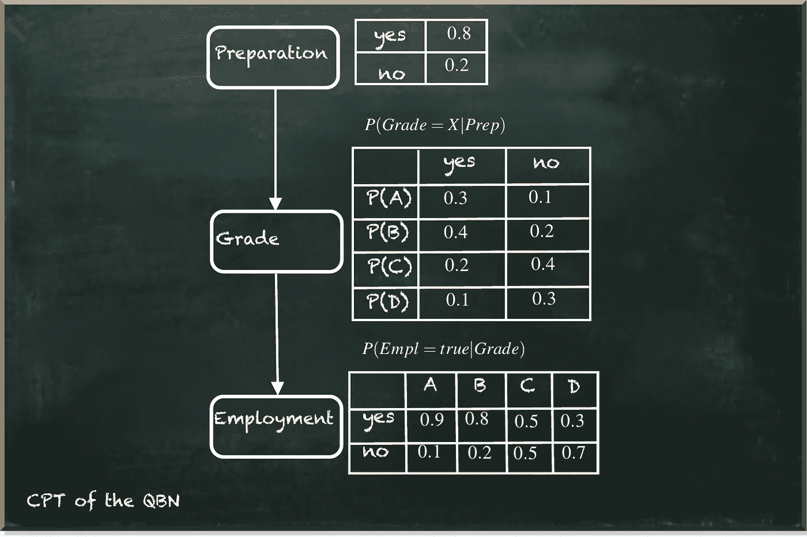
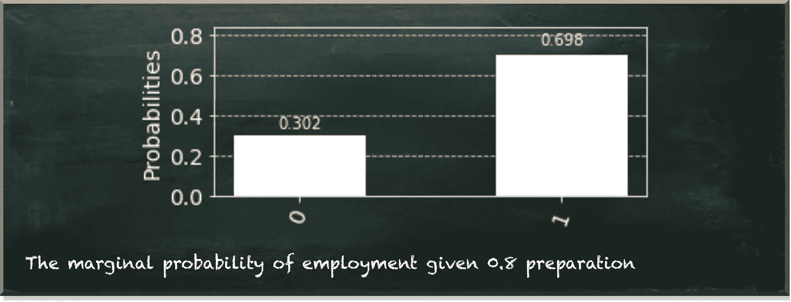

# 如何在量子贝叶斯网络中使用多元分布

> 原文：<https://towardsdatascience.com/how-to-use-a-multinoulli-distribution-in-a-quantum-bayesian-network-d13807841d23?source=collection_archive---------40----------------------->

## 量子机器学习实用指南

量子机器学习要不要入门？看看 [**动手量子机器学习用 Python**](https://www.pyqml.com/page?ref=medium_multinoulliqbn&dest=/) **。**

今天，我们将阐明一个重要的宏观经济问题。**“备考会带来更高的就业率吗？”**

上学的时候，我一直宁愿打文明也不愿意备考。所以，我会说不。但是我们为什么不更严谨地看待我的信仰呢？让我们来模拟我的信念。完成这项工作的最佳工具是贝叶斯网络。

但是我们为什么不给这个任务增加一点乐趣呢？我们为什么不建立一个**量子贝叶斯网络** (QBN)？

“又来了！”你喊？好吧，很公平。我看到你看了我以前的帖子，你已经熟悉 QBNs 了。所以，我们来增加一个挑战。在上周的[帖子](/how-to-create-quantum-multinoulli-distributions-with-qiskit-cea9021f6cb9)中，我们了解了量子多内核分布。所以，如果我们把它作为我们 QBN 的一部分不是很好吗？

那么，我们开始吧。

下图描绘了我们今天要建造的 QBN 的结构和 CPT。CPT(条件概率表)包含了 QBN 中变量之间的所有条件依赖关系。因为这些数字都是我编的，所以它们代表了我的信仰。我不是说过我们要塑造我的信仰吗？

作者图片

我们在这里看到了什么？我相信 80%的学生都在准备考试。所以，我是剩下的 20%没有准备的人之一。这个概率分布构成了我们称之为“准备”的变量这是一个有两种可能结果的变量。因此，CPT 有两行。此外，因为 preparation 没有任何父变量，所以我们只有一列值。

这没什么大不了的。我们已经研究过这样的伯努利分布。所以，让我们继续下面的变量——“等级”这是一个有四种可能结果的变量。因此，它在 CPT 中有四行。因为我们有两个可能的输入，所以有两列。这些是从“A”(最好)到“D”(最差)的等级。

我相信，准备考试的学生比那些没有准备的学生取得不同的(更好的)成绩——很可能。但是，当然，你总会看到准备充分的学生不及格(得了个“D”)。你会看到这些幸运儿取得了好成绩，尽管他们没有花下午的时间学习。有时候，我是那些幸运儿之一。

对于“准备”的每一个可能的结果，CPT 告诉我们得到特定分数的可能性。因为我们有四个等级，我们需要八个概率。

最后，我相信成绩影响一个人是否找到工作。不过，我在这里没有提到薪水。但是，让我们假设 90%的 A 级学生找到了工作，80%的 B 级学生找到了工作，只有 30%的 D 级学生找到了工作。

因为这个变量有两种可能的结果，CPT 有两行。但是为了说明其父变量(等级)的四种可能结果，我们需要四列。所以，这张表也需要八个概率。

现在简单的问题是:“**这个人群的就业率是多少？**

我们从导入将要使用的库开始。我们定义了一个便利函数，它将给定的概率转换成一个量子位旋转角度。详情请看[这篇文章](https://betterprogramming.pub/if-you-want-to-gamble-with-quantum-computing-e327c11f97e5)。

下一步，我们定义 CPT 的值。对于那些只有两种可能结果(准备和就业)的变量，我们只需要存储一个概率，因为相应的另一个结果的概率是 1。

注释，如 00，表示我们打算分配这些概率的量子态。我们很快就会看到这一点。事先，我们定义了一个量子电路，它有一个量子寄存器和四个量子位。

创建 QBN 时，从父变量开始总是一个好主意。在我们的情况下，这是准备。我们使用 prob_to_angle 函数来指定旋转角度，该角度表示准备就绪的边际概率。R_Y 门相应地旋转量子位，以 0.8 的概率将该量子位测量为 1。

接下来，正如我们在[上一篇关于多元分布的文章](/how-to-create-quantum-multinoulli-distributions-with-qiskit-cea9021f6cb9)中了解到的，我们计算了做好准备并获得“C”或“D”等级的概率。

我们将相应的旋转应用于位置 2 的量子位(第三个量子位)。因此，如果学生的等级为 C 或 d，我们说这个量子位为 1。当你再次查找概率的定义时，你会看到这些等级在第一个位置共享值 1(**1**0 或 **1** 1)。在我们的`QuantumRegister`中，我们保留了位置 1 和 2(范围从 0 到 3！)为 Multinoulli 变量。所以，只有当位置 0 代表准备的量子位是 1 时，我们将位置 2 的量子位旋转一个角度，这个角度定义了等级 C 或 d 的概率。

接下来，我们要把这个概率分成 C 和 D 两个值。为此，我们将位置 1 处的量子位旋转一个角度，该角度代表给定 C 或 D 的可能性的等级 C 的概率。但是，我们仅在位置 0(准备)和位置 2 (C 或 D)处的量子位为 1 时旋转量子位。

`mcry`(多控$R_Y$ gate)为我们完成了这个任务。我们使用位置 0 和 2 的量子位作为控制量子位(它必须是 1 ),以便 gate 应用。我们使用位置 1 的量子位作为目标量子位。

如果学生有所准备，我们对 A 和 B 年级也做类似的事情。主要的区别是，我们将这部分封装到$NOT$ ( `qc.x`)门，我们在位置 2 应用量子位。这实质上“选择”了学生成绩不是 C 或 D 的情况。因此，它必须是 A 或 B。而且，由于我们已经将 C 和 D 与 A 和 B 分开，我们不必在这里再次这样做。

这就是我们为那些备考的同学所做的一切。现在，让我们转向那些没有的人。这一次，我们使用非门来“选择”没有准备好的学生。代码的其余部分与我们为准备好的学生所做的类似。我们先把 C 和 D 的成绩从 A 和 b 中分离出来，然后，我们把 C 从 D 中分离出来，A 从 b 中分离出来，最后，我们再次取消选择没有准备好的学生。

最后，我们必须具体说明在给定特定分数的情况下被雇用的概率。在这一点上，我们不再关心学生是否准备好了。这是因为，在我们 QBN，准备对就业没有直接影响。

我们分别选择每个等级，并旋转代表就业的量子位(位置 3 的量子位)。由于如果学生有 D 级，两个控制量子位(位置 1 和 2)都是 1，默认选择这个状态，我们可以直接应用多控$R_Y$ gate。

为了选择 C 级，我们必须将$NOT$ gate 应用于量子位 1，因为这个量子位的值区分了学生是得到 C 还是 d。

相应地，我们将$NOT$ gate 应用于量子位 2 来选择 B 级。最后，我们对量子位 1 和 2 应用$NOT$ gates 来选择 A 等级。

这就完成了我们的 QBN。我们准备好运行它了。首先，我们使用 statevector_simulator 后端来计算所有状态的概率。

我们可以看到每个状态的概率。例如，状态 1011 具有 0.256 的最高概率。在这种状态下，学生是有准备的，因为位置 0 的量子位是 1 (101 **1** )。并且，如位置 1 和 2 的量子位所示(1 **01** 1)，该学生得到了 B 的成绩。这些学生也得到一份工作，如位置 4 的量子位所示( **1** 011)。

作者图片

我们可以很容易地计算出被雇用的总概率，方法是将位置 4 的值为 1 的所有状态相加。但是相反，我们用量子电路凭经验完成这项工作。

我们使用只考虑我们测量的量子位的`qasm_simulator`。因此，我们必须添加一个包含常规位的`ClassicalRegister`。一位就足以衡量就业情况。

当我们按照 shots 参数中的指定运行电路 1000 次时，我们将得到以下结果。

作者图片

如果 80%的学生准备考试，70%的学生会找到工作。如果只有 20%的学生准备怎么办？

我们可以为变量指定相应的值，然后重新运行电路。

结果显示，尽管只有 20%的学生为考试做了准备，但仍有 58%的学生找到了工作。

作者图片

那么，我们从这一切中学到了什么？最重要的教训是，我不是职业顾问。所以，请完全忽略你可能从结果中得出的关于准备考试是否值得努力的任何结论。

其次，我们学习了如何在我们的 QBN 中使用多内核分布。尽管它只有四个可能的值，但构建它比使用伯努利分布要花费更多的精力。当然，我们可以稍微简化一下代码。准备网络并不太复杂。实际上，主要的问题将是在你的 QBN 中得到你需要的所有概率。

但这是贝叶斯网络成为如此伟大工具的一个方面。它们明确了你对某个特定领域的所有信念。因此，每当你面临生活中的重要决定时，你可以创建一个(Q)BN 来验证你的信念并观察结果。只要记住结果代表你的信念。这些可能是错误的。

量子机器学习要不要入门？看看 [**动手量子机器学习用 Python**](https://www.pyqml.com/page?ref=medium_multinoulliqbn&dest=/) **。**

免费获取前三章[这里](https://www.pyqml.com/page?ref=medium_multinoulliqbn&dest=/)。