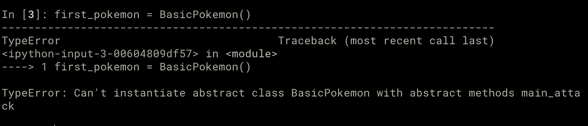
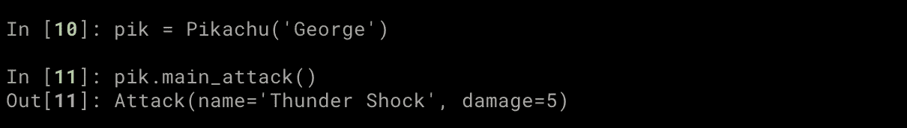
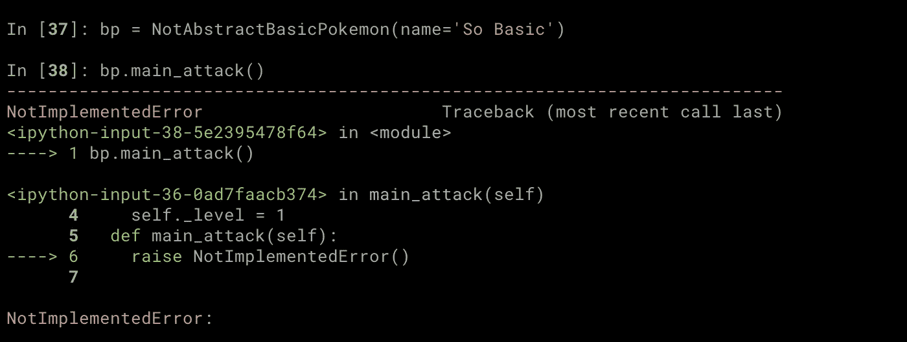

# 如何在 Python 中使用抽象类

> 原文：<https://towardsdatascience.com/how-to-use-abstract-classes-in-python-d4d2ddc02e90?source=collection_archive---------2----------------------->


[Jr Korpa](https://unsplash.com/@jrkorpa?utm_source=unsplash&utm_medium=referral&utm_content=creditCopyText) 在 [Unsplash](https://unsplash.com/s/photos/free-abstract-art?utm_source=unsplash&utm_medium=referral&utm_content=creditCopyText) 上拍摄的照片

# 什么是抽象类？

抽象类是一个类，但不是可以直接从中创建对象的类。它的目的是定义其他类应该是什么样子，也就是说，它们应该有什么样的方法和属性。

在抽象类中定义(但未实现)的方法和属性被称为**抽象方法**和**抽象属性**。所有抽象方法和属性都需要在子类中实现，以便能够从中创建对象。

我们可以通过继承属于`[abc](https://docs.python.org/3/library/abc.html)` [模块](https://docs.python.org/3/library/abc.html)的`ABC`类来创建一个抽象类。

```
from abc import (
  ABC,
  abstractmethod,
) class BasicPokemon(**ABC**):
  def __init__(self, name):
    self.name = name
    self._level = 1 **@abstractmethod**
  def main_attack(self):
    ...
```

在上面的代码中，我们创建了一个名为`BasicPokemon`的新抽象类。我们通过使用装饰器`abstractmethod`指出方法`main_attack`是一个抽象方法，这意味着我们期望在`BasicPokemon`的每个子类中实现它。

如果你尝试直接从`BasicPokemon`创建一个对象会发生什么？`TypeError`！



试图从抽象类创建一个新对象，但由于 main_attack 未实现而失败。图片由作者提供。

现在，你会注意到`BasicPokemon`的`__init__`方法需要一个`name`参数，因此上面的代码无论如何都不会起作用。这里需要注意的是，它甚至没有使用`__init__`方法来检查这一点。事实上，它有一个尚未实现的抽象方法，因此它失败了！

这就是如何使用`BasicPokemon`类。

```
from collections import namedtuple Attack = namedtuple('Attack', ('name', 'damage')) **class Pikachu(BasicPokemon):**
  def main_attack(self):
    return Attack('Thunder Shock', 5) **class Charmander(BasicPokemon):**
  def main_attack(self):
    return Attack('Flame Thrower', 5)
```

现在我们可以毫无问题地从这些类中创建对象。



创造了一个新的皮卡丘，名叫…乔治。图片由作者提供。

注意，您也可以使用相同的`abstractmethod`装饰器创建抽象属性。

```
from abc import (
  ABC,
  abstractmethod,
) class BasicPokemon(**ABC**):
  def __init__(self, name):
    self.name = name **@property
  @abstractmethod**
  def level(self):
    ... **@abstractmethod**
  def main_attack(self):
    ... 
```

现在，我们需要在子类中实现属性`level`和`main_attack`方法。

```
class Pikachu(BasicPokemon):
  **@property**
  def level(self):
    return 1 def main_attack(self):
    return Attack('Thunder Shock', 5)
```

# 我们可以只使用 NotImplementError…对吗？

你们中的一些人可能想知道为什么我们不能使用一个普通的类(即不从`ABC`继承)并为还没有实现的方法产生一个`NotImplementerError`，就像下面的例子。

```
class NotAbstractBasicPokemon:
  def __init__(self, name):
    self.name = name
    self._level = 1 def main_attack(self):
    **raise NotImplementedError()**
```

上面的代码将让你从`NotAbstractBasicPokemon`创建对象，只有当你试图使用`main_attack`时才会失败。这通常是不可取的行为。



从 NotAbstractBasicPokemon 创建对象，并在尝试调用 main_attack()时出错。图片由作者提供。

相反，试图从`BasicPokemon`创建一个对象会立即导致错误，正如我们前面看到的。

# 什么时候应该使用抽象类？

在我们在这篇文章中使用的例子中，`BasicPokemon`的目的是作为一个**的蓝图，为特定种类的口袋妖怪创建其他类**。拥有一个每个人都需要继承的抽象类来创建一个新的口袋妖怪有几个明显的好处:

*   避免代码重复。
*   确保其他人实现子类方式的一致性。
*   确保没有人忘记在子类中实现关键的方法和属性。

当你在一个团队中工作，并且你希望其他人重用/扩展代码时，以上几点尤其重要。

# **结论**

在这篇文章中，我们看了 Python 的抽象类，以及它们如何给我们一种方法来描述我们期望子类如何被实现，以及当关键部分没有被定义时如何警告用户(即其他程序员或我们未来的自己)。

<https://eminik355.medium.com/subscribe>  

*   [通过 Medium](https://eminik355.medium.com/) 关注我的更新。
*   [通过我的推荐链接加入 Medium](https://eminik355.medium.com/membership) 以无限制访问帖子。你的会员费直接支持我和你看的作家。

# **参考文献**

[1][https://docs.python.org/3/library/abc.html](https://docs.python.org/3/library/abc.html)

[https://realpython.com/python-interface/](https://realpython.com/python-interface/)

**更多来自同一作者。**

</how-not-to-use-python-lists-d06cbe8e593>  <https://medium.com/analytics-vidhya/multi-armed-bandits-part-1-epsilon-greedy-algorithm-with-python-code-534b9e2abc9>  <https://medium.com/analytics-vidhya/calculating-using-monte-carlo-simulations-337cff638ac5>  </going-bayesian-testing-rate-metrics-82e872b79175> 