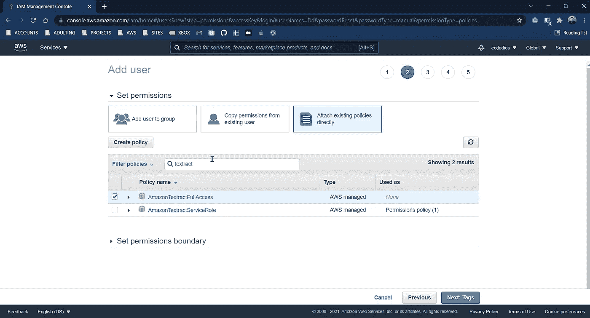
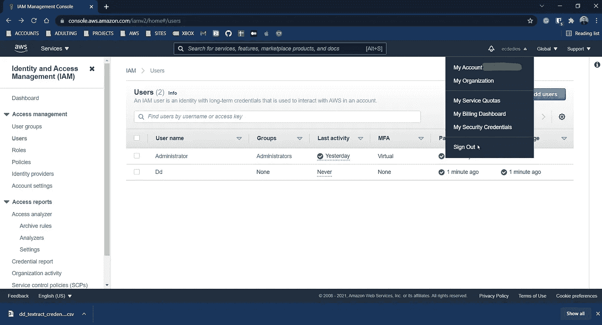
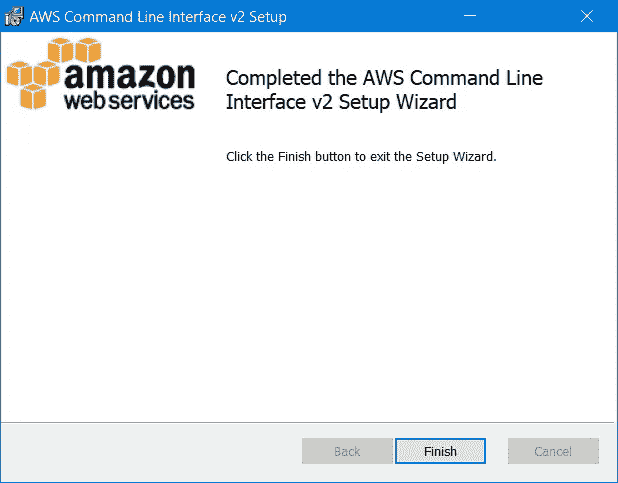
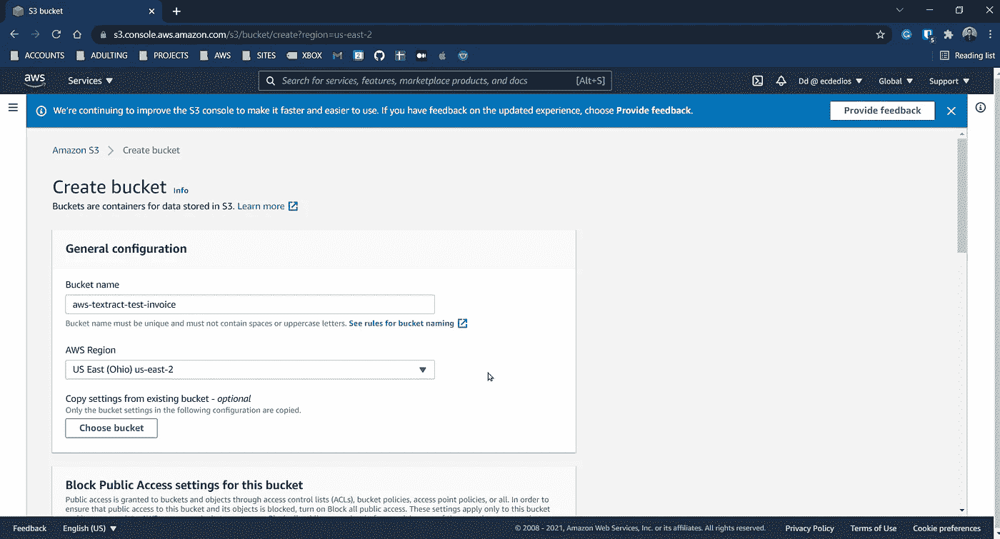
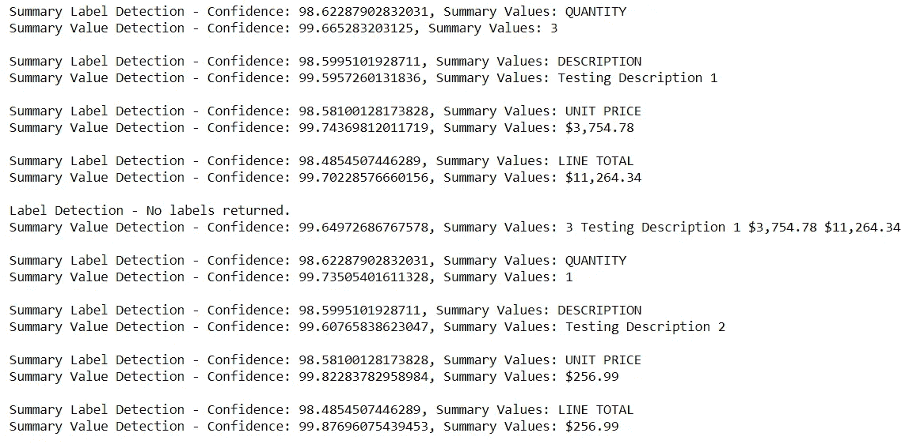

# 如何使用亚马逊 Textract 读取发票和收据

> 原文：<https://towardsdatascience.com/how-to-use-amazon-textract-to-read-invoices-and-receipts-143b661b0c49?source=collection_archive---------7----------------------->

## 自然语言处理

AWS 和 Amazon Textract 入门。


在 [Unsplash](https://unsplash.com/s/photos/converse?utm_source=unsplash&utm_medium=referral&utm_content=creditCopyText) 上由 [Atakan Narman](https://unsplash.com/@narmanatakan?utm_source=unsplash&utm_medium=referral&utm_content=creditCopyText) 拍摄的照片

今天，我们将冒险进入 AWS 世界，用 Amazon Textract 玩一玩。我们将拍摄一张发票的扫描图像，并从中提取信息。主要是，我们将:

1.  创建 AWS 用户
2.  安装 AWS CLI
3.  安装和配置 AWS SDK
4.  上传到 S3
5.  代码！

使用的大部分代码来自 Amazon Textract 开发人员指南。它可以在这里找到:

 [## Amazon Textract 入门

### Amazon Textract 入门- Amazon Textract 本节提供的主题可以帮助您开始使用 Amazon…

docs.aws.amazon.com](https://docs.aws.amazon.com/textract/latest/dg/getting-started.html) 

如果你想跟随我使用的相同文件，请在[我的 Github](https://github.com/ecdedios/aws-textract-test-invoice) 上查看项目回购。

让我们开始吧！

# 1.创建 AWS 用户

首先，进入[https://aws.amazon.com/console/](https://aws.amazon.com/console/)，点击屏幕右上角的橙色按钮登录。


接下来，使用“Root 用户”选项登录。


输入您的密码。


如果您已经激活了 MFA，请输入它。


您将进入 AWS 管理控制台主页，在这里您将看到最近访问过的服务。


找到屏幕顶部的搜索栏，键入“IAM”以显示可用 AWS 服务的下拉列表。点击写着“IAM”的那个。


然后，您的浏览器将显示 IAM 仪表板。在页面左侧找到“用户”并点击它。


点击屏幕右上角的蓝色按钮“添加用户”。


填写用户名，勾选“编程访问”和“AWS 管理控制台访问”并设置密码。然后，单击“下一步:权限”。


单击“直接附加现有策略”框。


你的屏幕应该看起来像下面的截图。点击“下一步”。


找到屏幕中间的搜索框，输入“textract”。


找到“AmazonTextractFullAccess”并点击左边的复选框。



接下来，在搜索栏中键入“s3”。


找到“AmazonS3FullAccess”并点击左边的复选框。然后，点击“下一步:标签”。


添加标签是可选的。点击“下一步:回顾”。


点击页面底部的“创建用户”按钮。


您应该会看到类似下面的内容:


***非常重要！！！*** 点击“下载。csv”并将文件保存在安全的地方。一定要记下你把它保存在哪里。以后哪里会需要里面的资料。


瞧啊。您应该会看到一个屏幕，确认已经创建了一个新用户。


在屏幕的右上方，找到您的帐户别名(我的是 ecdedios ),点击它会显示一个下拉菜单。最后，点击“退出”。



点击“重新登录”。


这一次，点击“IAM 用户”而不是“根用户”。


键入您的帐户别名，然后单击“下一步”按钮。


键入您刚刚创建的 IAM 用户名，并填写密码。点击“登录”。


如果出现提示，请更改密码。否则，我们就完成了这一步。


# 2.安装 AWS CLI

要下载 AWS 的命令行界面，请访问[https://docs . AWS . Amazon . com/CLI/latest/user guide/CLI-chap-install . html](https://docs.aws.amazon.com/cli/latest/userguide/cli-chap-install.html)。

在这个练习中，我使用了 AWS CLI 版本 2。


在下一页中，找到您的操作系统并点击它。比如，我点击了“视窗”。


找到能让你下载最新版本的链接，然后点击它。


然后应该会打开一个“另存为”对话框。把文件保存在某个地方。


找到您刚刚下载的文件，双击它启动安装程序。在弹出的窗口中单击下一步。


您应该会在下面看到类似的内容。


完成后，您会在安装窗口上看到确认信息。接下来，单击“完成”按钮。



接下来，让我们确保它安装正确。

启动您的终端，键入以下内容:

```
aws --version
```


这一步就到此为止。

# 3.为 Python 安装和配置 AWS SDK(boto 3)

对于这一步，我们将为 Python 安装和配置 AWS SDK。

如果您想了解更多 Boto3，请查看它的文档:

 [## Boto3 文档— Boto3 文档 1.18.34 文档

### 您可以使用 AWS SDK for Python (Boto3)来创建、配置和管理 AWS 服务，比如 Amazon Elastic Compute…

boto3.amazonaws.com](https://boto3.amazonaws.com/v1/documentation/api/latest/index.html) 

启动一个终端，键入下面一行:

```
pip install boto3
```

让脚本完成它的任务。

完成后，让我们通过键入以下行来进行配置:

```
aws configure
```


它会提示您输入凭据。首先，找到您在步骤 1(创建一个 AWS 用户)中下载的文件。


出现提示时，复制并粘贴“访问密钥 ID”，然后复制并粘贴“秘密访问密钥”。*粘贴完每一张后，你必须按回车键。接下来，当提示输入“默认区域名称”时，在您的首选区域中键入*。


当提示输入“默认输出格式”时，不要输入任何内容。再次按回车键。


就是这样！我们现在已经准备好用 Python 与 AWS 通信了。

# 4.上传到 S3

对于这一步，我们将上传一个图像文件到 S3 桶。我们将使用这张图片作为我们的输入文档，并要求 Amazon Textract 阅读它。

让我们重新登录 AWS 控制台。


单击 IAM 用户。


键入您的帐户别名。


单击“下一步”继续。


键入您在步骤 1 中创建的用户(非 root)凭据。


此时，您应该会看到 AWS 管理控制台。


找到页面顶部的搜索栏，输入“S3”。接下来，选择服务下的“S3 ”,如下所示。


找到橙色按钮“创建桶”。水桶就像一个文件夹。我们将在里面保存(上传)文件。


填写“Bucket name ”,并选择一个与您在步骤 3 中输入的区域相同的 AWS 区域。接下来，向下滚动页面，您会发现页面右下角有一个橙色按钮。点击它“创建桶”。



您应该会看到一条确认消息，表明已经创建了一个新的存储桶。接下来，单击我们刚刚创建的存储桶名称。


找到橙色的“上传”按钮并点击它。


点击“添加文件”。


从您的计算机中选择一个图像。扫描的发票或收据就可以了。


向下滚动到下一页，找到橙色的“上传”按钮。点击它。


点击“关闭”。


您应该会看到该文件列在“对象”下。


好吧！现在，该编码了。

# 5.密码

这是我们将要阅读的文件:


现在，让我们启动 Jupyter 笔记本，导入一些项目，并设置笔记本显示设置。

然后，复制并粘贴下面的代码。 ***重要！！！*** 不要忘记**再次检查第 42 行**，确保它与您一直使用的区域相同。

***也重要！！！*** 注意你的文件夹结构，以**匹配第 79 行**。

下面是代码的作用:

首先，它连接到 S3 并获取我们将输入到 Textract 的对象(图像文件)(第 30–33 行)。然后，它将文件加载到内存中，并将其送入 image(第 35–39 行)。接下来，我们调用 Amazon Textract API(第 41–42 行)。最后，我们调用`analyze_expense`来分析图像，并将结果存储在`response`中(第 45 行)。

第 48–76 行解析`response`，并在图像文件上绘制边界框。第 79 行在本地保存图像。最后，第 81 行返回`response`的内容。

对于下一个单元格，复制、粘贴并定制下面的代码，以匹配您的存储桶名称和对象(文件)。

现在我们准备调用上面的函数。

让我们来看看输出:



漂亮！

现在，让我们考虑下面的代码:

我们在上面所做的是过滤响应，以便它只给我们那些置信度值小于 90%的元素。


我们可以说，工作和销售人员是标签，而“技术技能(点)忍者”不是。不出所料，这个元素的置信度只有 39%。

很酷，不是吗？

就这样，伙计们！我们已经成功地进入了 AWS 的世界，并与 Amazon Textract 进行了合作。

谢谢你过来看我的帖子。我希望你学到了新的东西！在我随后的文章中，我们将深入探讨 AWS 及其提供的大量服务。

敬请期待！

*如果你想了解更多关于我从懒鬼到数据科学家的旅程，请查看下面的文章:*

[](/from-slacker-to-data-scientist-b4f34aa10ea1) [## 从懒鬼到数据科学家

### 我的无学位数据科学之旅。

towardsdatascience.com](/from-slacker-to-data-scientist-b4f34aa10ea1) 

*如果你正在考虑改变方向，进入数据科学领域，现在就开始考虑重塑品牌:*

[](/the-slackers-guide-to-rebranding-yourself-as-a-data-scientist-b34424d45540) [## 懒鬼将自己重塑为数据科学家指南

### 给我们其他人的固执己见的建议。热爱数学，选修。

towardsdatascience.com](/the-slackers-guide-to-rebranding-yourself-as-a-data-scientist-b34424d45540) 

你可以通过[推特](https://twitter.com/ecdedios)或 [LinkedIn](https://www.linkedin.com/in/ednalyn-de-dios/) 联系我。