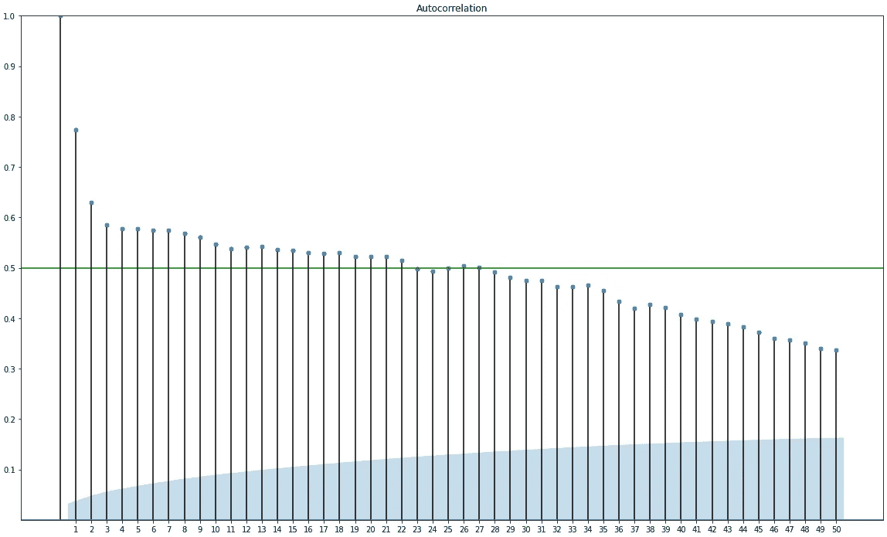

# 如何使用自回归(AR)模型进行时间序列分析

> 原文：<https://towardsdatascience.com/how-to-use-an-autoregressive-ar-model-for-time-series-analysis-bb12b7831024?source=collection_archive---------2----------------------->

## python 中使用自回归模型进行预测的初学者指南


由[阿格巴洛斯](https://unsplash.com/@agebarros?utm_source=medium&utm_medium=referral)在 [Unsplash](https://unsplash.com?utm_source=medium&utm_medium=referral) 上拍摄的照片

在处理时间序列数据时，可以使用自回归模型来预测未来值。预测背后的概念是使用以前的数据点来计算未来的数据点。

在这个简短的初学者友好指南中，你将学习如何创建一个自回归模型，并用它来预测未来的价值。

## 例子

**举个简单的例子，**可以让你知道它是如何工作的:
现在是下午 2 点，我们想预测下午 3 点的值。为了做到这一点，我们可以使用已知的 2pm 和 1pm 的值。从数学上讲，它可能如下所示:

> x(t) = b0 + b1*x(t-1) + b2*x(t-2)

是我们希望对其进行预测的时间。 *t-1* 是前一个时间点，而 *t-2* 是向后两个时间点。

*b* 值是通过拟合数据集的自回归模型得到的权重。

## 术语

**滞后:**处理时间序列数据时，每个跨时间的数据点称为一个滞后。

**偏差或权重:**上例中的 *b* 值为权重。它们是描述输入变量和我们预测的变量之间的相关性的值。如果权重为正，也称为正相关，这意味着输入变量与预测变量的移动方向相同。相反，如果权重为负，那么它会向预测变量的相反方向移动。

例如，值为 *10* (正值)的输入变量上的权重 *-0，7* 会将 *-7* 加到输出值上，从而对其产生负面影响。

如果权重值非常接近 *0* ，则表明变量的先前值和未来值之间可能没有相关性，因此无法进行预测。高于 *0.5* 或低于- *0.5* 的值表示强相关。

**自相关:**当输出变量本身与其早期变量之间计算相关性时，预测变量与输入变量之间的关系或相关性称为自相关。

## 数据集

在本指南中，我们将使用澳大利亚墨尔本的数据集，其中包含了 10 年间的最低日温度。该数据集是由澳大利亚气象局创建的。

如果你想按照这个指南编码，那么你可以在这里找到数据[。](https://gist.github.com/JacobToftgaardRasmussen/78cac8b522ce6d8cab4fc80f7de48ee9)

## 寻找自相关

为了找出哪些滞后与预测值有很强的相关性，我们可以使用 statstmodels 模块中的`plot_acf()`函数。这将创建一个图表，显示每个先前的滞后对未来滞后的影响程度。

如上所述，高于 *0.5* 或低于 *-0.5* 的值被认为具有高相关性，因此在查看曲线图时，我们可以使用这些值作为阈值来决定是包括还是忽略特定的滞后。

下面的代码块创建了这个图，我在
*y = 0.5* 处添加了一条垂直线，以便于查看哪些滞后符合 *0.5* 阈值。

> 请注意，我将 y 轴限制在 0 到 1 的范围内。您通常不应该这样做，因为相关性也可能是负的。我这样做是为了提高图的可读性，只是因为我已经知道所有的滞后都是正相关的。

```
import pandas as pd
import matplotlib.pyplot as plt
from statsmodels.graphics.tsaplots import plot_acf
import numpy as npdf = pd.read_csv('australia_temp_data.csv')fig, ax = plt.subplots(figsize=(16,8))
plot_acf(df['Temp'], lags=50, ax=ax)
plt.ylim([0,1])
plt.yticks(np.arange(0.1, 1.1, 0.1))
plt.xticks(np.arange(1, 51, 1))
plt.axhline(y=0.5, color="green")
plt.show()
```



作者创建的 acf 图

在分析剧情的时候，我们可以看到第一个滞后对我们未来的价值有非常强的相关性。滞后 22 是明显高于绿色阈值线的最后一个滞后。因此，我们现在知道使用 22 个滞后来创建我们的自回归模型。

## 将数据分成训练和测试数据集

为了能够评估我们的模型，一旦我们训练了它，我们需要一些数据来测试它。因此，我们将使用数据集中的一些最新值作为测试数据。

从上面代码块中的代码继续，我们可以按如下方式分割数据:

```
df_train = df['Temp'].iloc[:-5]
df_test = df['Temp'].iloc[-5:]
```

这使得训练集由整个数据集的最后 *5* 个值组成，并且训练集是直到最后 *5* 的所有值。

## 创建和拟合模型

既然我们已经将训练和测试数据分开，并且我们知道在我们的模型中要考虑多少滞后，我们就拥有了创建模型所需的一切。

我们使用 statsmodels 模块(版本 0.13.1)中的`AutoReg`类。

> 如果您使用的是 Google Colab 笔记本，那么您可能没有安装最新版本的 statsmodels。您很可能安装了 0.10.2 版本，而我将使用 0.13.1。要得到这个版本，你可以调用`pip install statsmodels==0.13.1`，然后重启笔记本的运行时间。

```
from statsmodels.tsa.ar_model import AutoReg
model = AutoReg(df_train, lags=22).fit()
```

现在已经创建了模型，并对训练数据进行了拟合。接下来，是时候进行一些预测，并通过与测试值进行比较来评估准确性。

## 预测和评估

```
forecasts = model.forecast(5).tolist()
test_values = df_test.tolist()
for index in range(len(forecasts)):
  difference = forecasts[index] - test_values[index]
  print(forecasts[index], test_values[index], difference)
```

为了进行预测，我们简单地调用模型上的`forecast()`函数，并向它传递我们想要预测的滞后量。这将返回一个熊猫系列对象，我们可以使用它的`tolist()`函数将它转换成一个列表。

在循环中，我们在测试数据集中的实际值旁边打印预测，以及它们之间的差异。打印结果如下所示。


作者创建的预测值、测试值以及它们之间的差异

为了获得可用于评估模型性能的单个数字指标，我们可以计算两个值列表之间的均方误差。这可以通过使用 scikit-learn 模块中的`mean_squared_error()`功能来完成，如下所示。

```
from sklearn.metrics import mean_squared_error
print(mean_squared_error(test_values, forecasts))>> 1.181958471550279
```

结果显示，我们的预测平均误差约 1.2 摄氏度。为了直观地了解预测的准确性，我们还可以在同一个图中绘制预测和测试数据。

```
fig = plt.subplots(figsize=(12,8))
plt.plot(forecasts, color="green")
plt.plot(test_values,color="blue")
plt.xticks(np.arange(0,6,1))
plt.yticks(np.arange(12.5, 17, 0.5))
plt.show()
```


作者创建的预测和测试数据图

这里我们可以清楚地看到，在滞后 4 时(x 轴上的 3)，距离很远。然而，其他预测实际上相当不错。

## 摘要

在这篇简短的指南中，您学习了自回归背后的重要背景理论，包括一些数学知识和术语。您学习了使用 acf 图来查找用于创建模型的滞后量。接下来，您将数据集分为训练和测试数据子集。最后，您了解了如何进行预测以及评估其性能的一些方法。

我希望你喜欢这个指南，并学到一些有用的东西！

感谢阅读。

## *学分*

[1](本文的数据和灵感来源)——Jason Brownlee，*用 Python 进行时间序列预测的自回归模型*，机器学习掌握，可从[https://Machine Learning Mastery . com/auto regression-Models-Time-Series-Forecasting-Python/](https://machinelearningmastery.com/autoregression-models-time-series-forecasting-python/)获取，2021 年 12 月 20 日。