# 如何在 R 中使用和可视化 K-Means 聚类

> 原文：<https://towardsdatascience.com/how-to-use-and-visualize-k-means-clustering-in-r-19264374a53c?source=collection_archive---------1----------------------->

## *通过美国传统基金会的 2020 年经济自由指数数据，学习使用和可视化 R 中的 K 均值聚类分析*

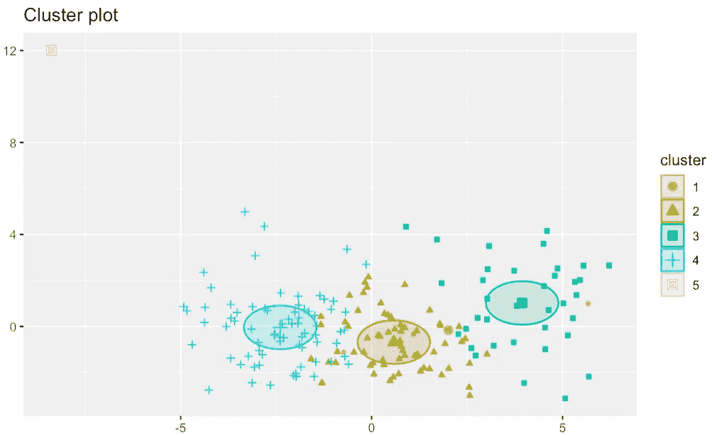

作者用 K-Means 和 R |图像制作的聚类图图像

# 目标

1.  在 R 中使用 K-均值聚类算法
2.  确定正确的集群数量
3.  创建集群的表格和可视化
4.  从网上下载、提取复杂的 Excel 文件并加载到 R
5.  高效地清理、争论和过滤数据

# 介绍

K-Means 聚类是一种无监督的机器学习技术，对于根据数据集中存在的独立变量的中心将独特的数据分组为几个相似的组非常有用[1]。几个经典的例子是在公司忠诚度计划中对不同类型的客户进行聚类，并将医疗患者分为低、中、高和极端风险类别[1]。

在本文中，我们将使用美国传统基金会免费提供的 [2020 年经济自由指数数据集](https://www.heritage.org/index/download) [2]。[我们还将使用一个 R Markdown 文件(。RMD)可通过此链接](https://github.com/ARIMA-Consulting/K-Means_Clustering_How_To)在我的 GitHub 上下载。我将假设您可以在您选择的机器上下载并安装 R 和 RStudio。

这篇文章的结构是:

1.  加载所需的库
2.  导入数据
3.  清理数据并修复格式问题
4.  展示创建 K 均值聚类的几种不同方法
5.  展示几种有用的可视化效果，您可以根据需要将它们应用到您的项目中

让我们投入进去吧！

# 代码

## 加载库

首先，我们需要将 *tidyverse、FactoMineR、factoextra、*和 *readxl* 加载到我们的 R 环境中。如果您得到一个关于软件包未被识别的错误，请在您需要的 *install.packages()* 行之前取消注释(删除#)。

```
# Install if needed by removing the #
# install.packages("tidyverse")
# install.packages("readxl")
# install.packages("FactoMineR")
# install.packages("factoextra")# Load Libraries
library(tidyverse)
library(readxl)
library(FactoMineR)
library(factoextra)
```

将您的工作目录设置到包含您的文件并有空间下载. xls 文件的文件夹中也会对您有所帮助。这可以通过 *setwd()* 命令或使用 RStudio 导航*文件*菜单到文件夹位置，并使用*更多*下拉菜单设置工作目录来完成，如下所示:

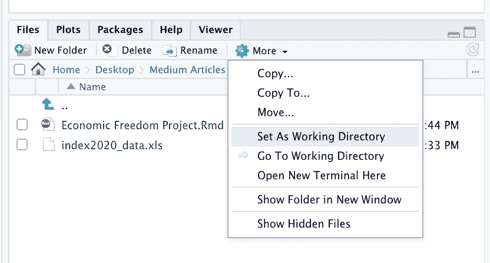

在 RStudio 中设置工作目录

## 下载数据

现在我们需要下载数据。网页的链接可以在这里找到，或者如果你想在传统基金会的网站上了解更多的数据，可以在我的 GitHub 的 T2 RMD 文件中找到。单击页面顶部的“下载原始数据”按钮，您应该会得到一个名为 *index2020_data.xls* 的文件，我们将在项目的其余部分使用该文件。

## 导入数据

最简单的做法就是导航到有数据的文件夹，点击它，自动调出 readxl 图形界面。为了简单明了，我继续将我的数据重命名为 *EFI_data* 。这些截图应该有所帮助:

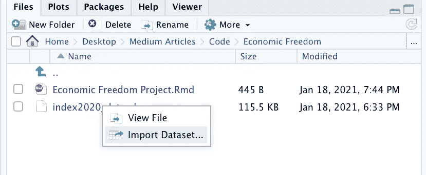

在 RStudio 中导入数据集

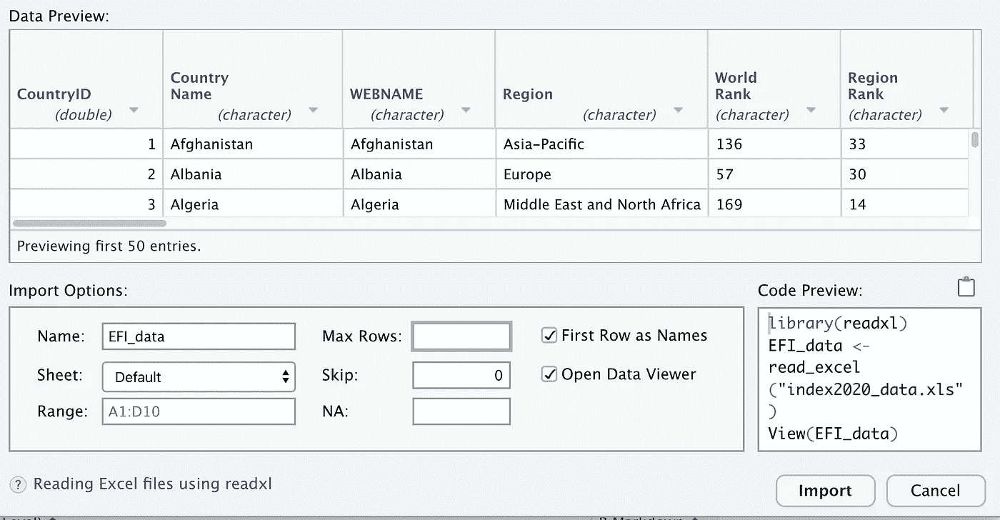

RStudio 中的 readxl GUI

更改名称并点击*导入*按钮后，RStudio 会自动生成一些代码到您的控制台。最好将没有“>”的第一行复制/粘贴到文件中，以便稍后能够快速加载数据。看起来是这样的:

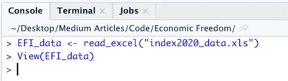

RStudio 中的 EFI_data 控制台输出

代码应该如下所示:

```
# Import Data
EFI_data <- read_excel("index2020_data.xls")
```

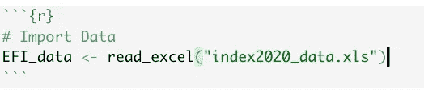

用代码将数据导入 RStudio

## 初步查看数据

如果可能的话，在我们做有趣的事情之前，快速浏览一下数据，看看是否有任何明显的问题需要解决，这总是一个好主意。

下面是中间部分数据的截图。让我们看看有什么突出的。

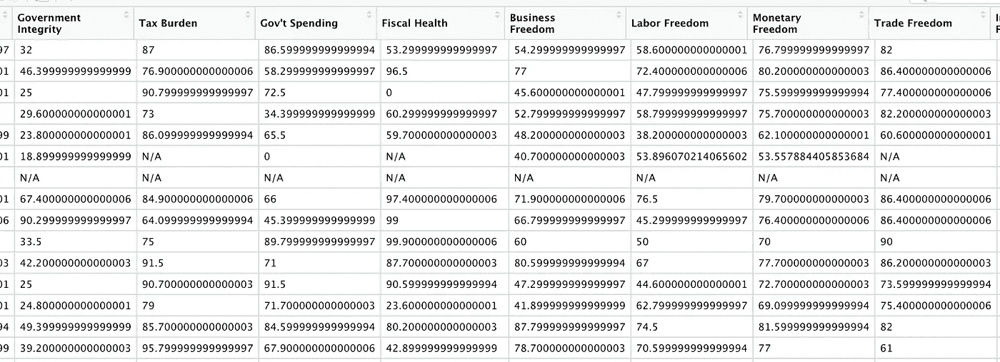

初步看看 RStudio 中的一些 EFI 数据

我想到的是，丢失的数据被标记为“N/A ”,我知道 R 不会喜欢。这些数字看起来也很奇怪，有些又短又甜，而有些则有太多的小数位。此外，我们中的热心人注意到，在数据导入阶段，所有应该是数字的列实际上都是字符。我们还必须解决数据类型问题。

## 清理数据

首先，让我们摆脱“不适用”的问题。有很多方法可以做到这一点，但我将依靠一个技巧 R 和“相信魔术”一点点。为了避免下面的步骤变得复杂，请相信我，在继续之前，我们应该从 *EFI_data* 中获取原始的列名。让我们使用这个代码:

```
# Get original column names
EFI_data_col_names <- names(EFI_data)
```

接下来，我们将使用 *lapply()* 函数，并将 *gsub()* 函数放入自定义*函数()*中，以查找字符串 *"N/A"* 的任何出现，并将其替换为 nothing。当我们像这样构造函数时，我们依靠 *lapply()* 的速度来执行调整，这比使用 for 循环要快得多，因为 R [1]是单线程的。在下一步中，我们将依靠 R 将空数据强制转换成正确的 *NA* 格式。浏览数据，亲自查看结果。

代码如下:

```
# Fix "N/A" in the data set
EFI_data <- data.frame(lapply(EFI_data, function(x) {
  gsub("N/A", "", x)
}))
```

虽然这个函数在数据本身中做了我们希望它做的事情，但 R 认为自动更改列名是个好主意。又烦又乱，就用这段代码把原来的名字放回去吧:

```
# Put the right column names back
names(EFI_data) <- EFI_data_col_names
```

自定义函数的时间到了！

让我们做一个，把所有的字符列都变成数字，并四舍五入到两位小数。我们将在下一步中插入这个自定义函数。

代码如下:

```
# Create custom function to fix data types and round
to_numeric_and_round_func <- function(x){
  round(as.numeric(as.character(x)),2)
}
```

创建了自定义函数后，我们将使用 *mutate_at()* 函数来更改除了应该保留文本的四列之外的所有列。

代码如下:

```
# Mutate the columns to proper data type
EFI_data <- EFI_data %>%
  mutate_at(vars(-one_of("Country Name", "WEBNAME", "Region", "Country")), to_numeric_and_round_func)
```

实际上，我们不需要 *Country* 或 *WEBNAME* 来进行实际分析，所以我们现在将通过使用以下代码使它们为空来删除它们:

```
# Remove Country and WEBNAME
EFI_data$Country <- NULL
EFI_data$WEBNAME <- NULL
```

## k 均值聚类

有两种主要的方法来做 K-Means 分析——基本方法和花式方法。

## 基本 K 均值

在基本的方法中，我们将做一个简单的 *kmeans()* 函数，猜测一些集群(5 通常是一个好的起点)，然后有效地将集群编号粘贴到每一行数据中，然后就结束了。我们必须首先删除任何丢失的数据，这可以用下面的代码来完成:

```
# create clean data with no NA
clean_data <- EFI_data %>%
  drop_na()
```

我们还想设置种子，以确保代码的可重复性:

```
# Set seed
set.seed(1234)
```

下面是基本 K 均值方法的代码:

```
# Cluster Analysis - kmeans
kmeans_basic <- kmeans(clean_data[,7:32], centers = 5)
kmeans_basic_table <- data.frame(kmeans_basic$size, kmeans_basic$centers)
kmeans_basic_df <- data.frame(Cluster = kmeans_basic$cluster, clean_data)# head of df
head(kmeans_basic_df)
```

以下是输出结果:

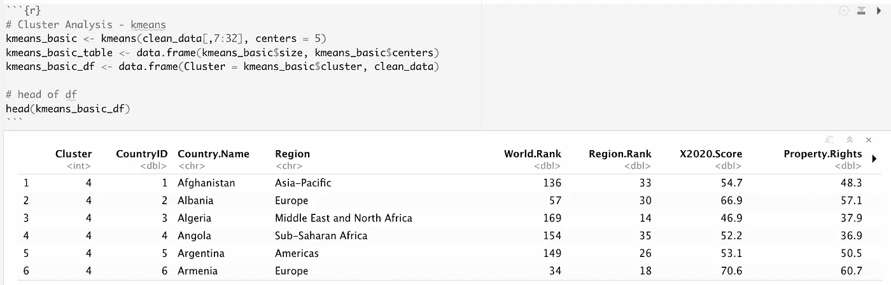

基本 K 均值聚类方法的前六行

这显示了添加到每一行数据中的簇号。

我们还可以在这里使用 *kmeans_basic_table* 查看每个集群的属性(中心、大小):

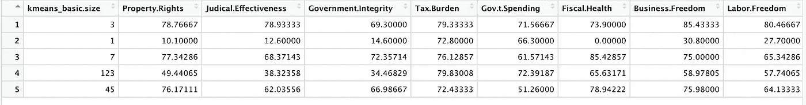

基本 K 均值聚类方法的大小和中心

我们还可以像下面这样浏览在 *kmeans_basic_df* 对象中带有集群号的每一行数据:

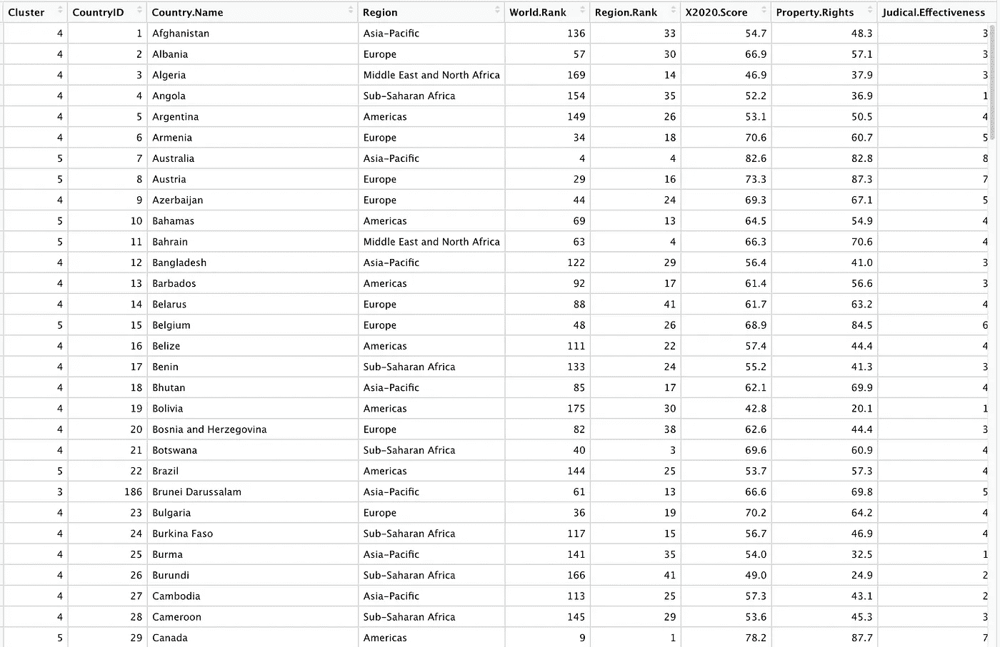

每个国家的基本 K 均值数据和聚类的大视图

对许多人来说，基本的方法将带你到你需要去的地方。从这里，您可以按区域、每个集群的数据或您想要的任何内容绘制图表。

我创建了一个快速的 *ggplot()* 例子，按区域分解每个集群的计数。我们可以做几十个不同的情节，但这是一个很好的，简单的演示。

代码如下:

```
# Example ggplot
ggplot(data = kmeans_basic_df, aes(y = Cluster)) +
  geom_bar(aes(fill = Region)) +
  ggtitle("Count of Clusters by Region") +
  theme(plot.title = element_text(hjust = 0.5))
```

以下是输出结果:

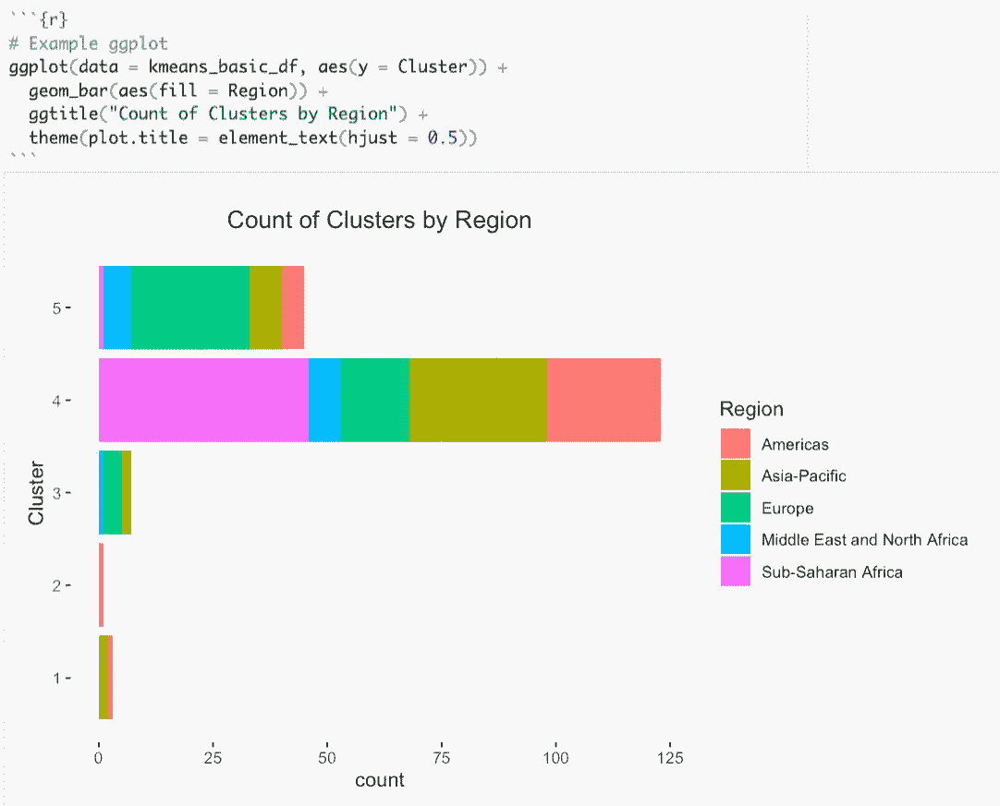

使用 ggplot 按区域绘制聚类计数图

## 花式 K 均值

第一项任务是计算出正确的集群数量。这是用碎石图完成的。本质上，目标是找到曲线开始明显变平的地方[1]。因为 K-Means 算法有效地最小化了聚类中心和每个数据点之间的差异，所以创建了这种曲线形状，其开始是陡峭的，然后渐进地接近某一水平的平坦线[1]。虽然这不是一个完整的要求，但在使用 *scale()* 函数或其他归一化技术生成聚类时缩放数据通常是一个好主意，这样可以获得更准确的结果[1]。

我们将使用 *fviz_nbclust()* 函数创建一个 scree 图，代码如下:

```
# Fancy K-Means
fviz_nbclust(scale(clean_data[,7:32]), kmeans, nstart=100, method = "wss") + 
  geom_vline(xintercept = 5, linetype = 1)
```

以下是输出结果:

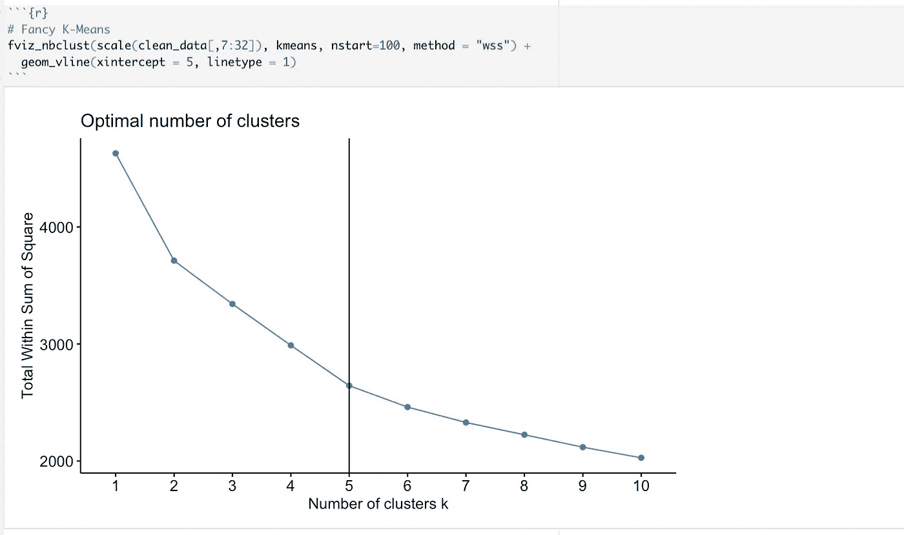

确定 K 均值最佳聚类数的 Scree 图

实际上，创建奇特的 K 均值聚类函数与基本的非常相似。我们将只缩放数据，创建 5 个集群(我们的最佳数量)，为了简单起见，将 nstart 设置为 100。

代码如下:

```
# Fancy kmeans
kmeans_fancy <- kmeans(scale(clean_data[,7:32]), 5, nstart = 100)# plot the clusters
fviz_cluster(kmeans_fancy, data = scale(clean_data[,7:32]), geom = c("point"),ellipse.type = "euclid")
```

以下是输出结果:

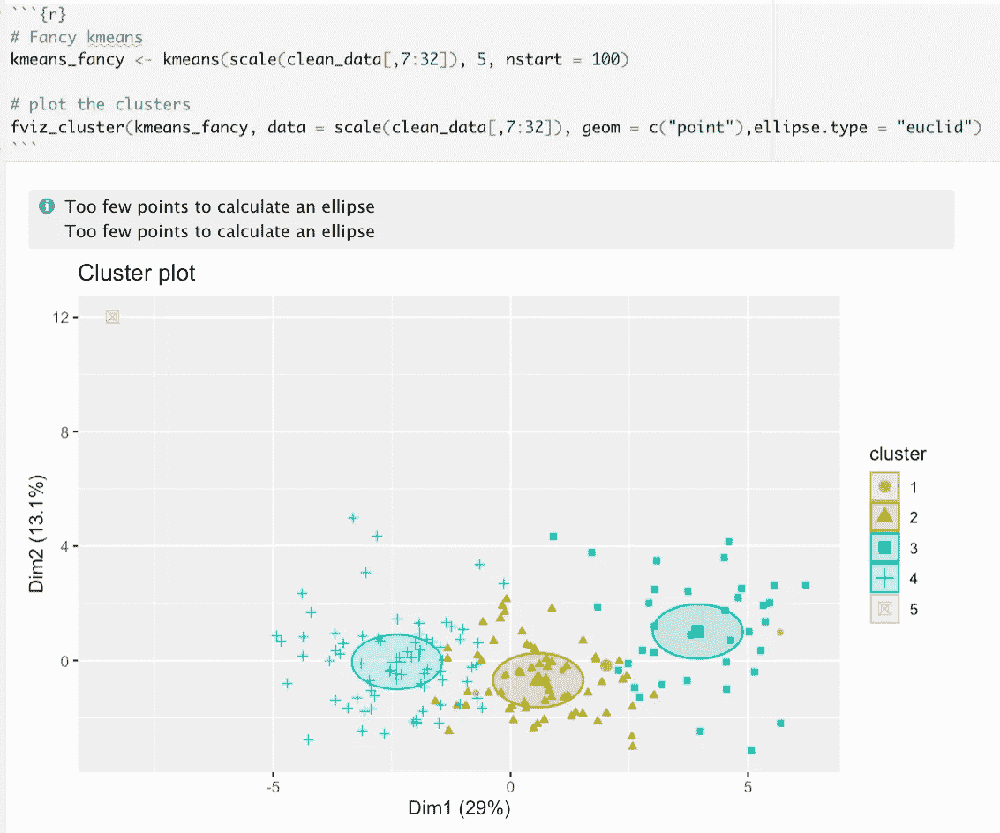

K-均值聚类的可视化

这最后一个图确实有助于形象化地显示出这些集群实际上是彼此相似的。有趣的是，用很少的代码就能得到一些非常有趣的结果。

# 结论

这个项目是为了展示如何使用和可视化 K-均值聚类。这样做的方法不止一种，可以做出无数的情节。像数据科学中的大多数任务一样，大多数时间实际上都花在了查找数据和清理数据上，以便用这些数据做一些有用的事情。希望到目前为止，您对使用 K-Means 聚类有了更好的感觉，并且可以看到我们在这里使用的技术的不同应用。

# 参考

[1] R .卡巴科夫， *R 在行动(第 2 版。)* (2015)，纽约州谢尔特岛:曼宁出版公司。

[2]美国传统基金会， *2020 年经济自由度指数* (2020)，https://www.heritage.org/index/download