# 如何使用 AWS Amplify 部署 React 应用程序

> 原文：<https://towardsdatascience.com/how-to-use-aws-amplify-to-deploy-a-react-application-ae93cd6e4525?source=collection_archive---------9----------------------->

## 使用 AWS Amplify 部署 React 应用程序的指南

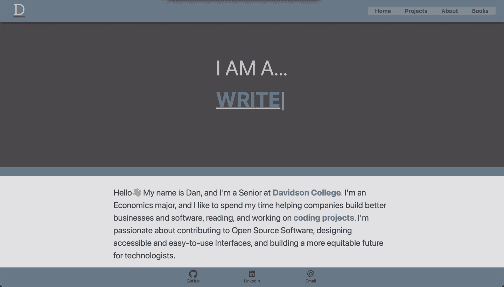

[我的作品集网站](https://www.dan-murphy.com)

> 自从我作为一名软件工程师开始从事咨询工作以来，我就想建立一个作品集网站，展示我参与的个人项目和专业项目。今年寒假，我花时间设计、开发和部署了我的 portfolio 站点，在本文中，我将向您介绍我是如何使用 AWS Amplify 部署它的。你可以在[dan-murphy.com](https://dan-murphy.com)查看网站，在 [GitHub](https://github.com/danmurphy1217/website) 查看代码。

# 简要背景

我的大部分专业工作需要构建数据驱动的应用程序和简化数据管道。为了完成这些任务，我经常使用 Python 和 Ruby，并在任何前端工作中加入 JavaScript。为了更好地使用 React，我决定使用这个框架来构建我的作品集网站。

# 设置应用程序

我采取的第一步是决定如何构建应用程序。我利用`create-react-app`作为我的目录的基本模板，然后用一些额外的文件夹重新构建了应用程序。最终的设置如下所示:

```
src
├── components
│   ├── archives
│   └── extras
│       ├── data
│       └── imgs
├── pages
│   ├── contents
│   └── data
├── styles
└── tests
    └── fixtures
```

一些显著的变化是`**components**`、`**pages**`和`**styles**`目录。

*   `**components**`:这是我存储应用程序所有组件的地方。通过将组件存储在一个集中的文件夹中，可以更容易地重用和重构我的代码，并且让其他人更直观地理解。组成我的作品集网站的一些组件是`[Header](https://github.com/danmurphy1217/website/blob/main/src/components/Header.js)`、`[Footer](https://github.com/danmurphy1217/website/blob/main/src/components/Footer.js)`和`[ProjectSidebar](https://github.com/danmurphy1217/website/blob/main/src/components/ProjectSidebar.js)`。
*   这是我为应用程序构建不同页面的地方。我从`**components**`文件夹中导入所需的组件，然后将它们集合起来设计页面。下面是我如何为**主页**这样做的一个例子:

Home.js

*   `**styles**`:这是我为应用程序定义全局 CSS 样式的地方。我喜欢将`styled-components`用于单个组件，但我也发现它有助于构建适用于每个页面的全局样式。

最后，为了将请求映射到正确的页面，我们使用了`react-router-dom`。路径在`App.js`文件中定义，如下所示:

App.js

这将把`/`请求映射到`HomePage`，把`/projects`请求映射到`ProjectsPage`，把`/about`请求映射到`AboutPage`，把`/bookshelf`请求映射到`BookPage`。既然应用程序的开发已经完成，我们需要部署它以便其他人可以使用它！

# 使用 AWS Amplify 部署

## 概观

部署 React 网站有几种方法，但我发现最简单的方法之一是使用 **AWS Amplify** 。Amplify 被描述为“构建可扩展的移动和网络应用的最快和最简单的方式。”为了实现这一点，AWS 推断出设置服务器、安装依赖项和创建网站生产版本的所有复杂性，允许您专注于构建直观的 UX。要了解更多关于 AWS Amplify 为数据驱动的应用提供了什么(具体来说，有**前端**和**后端**的网站)，请查看他们的[文档](https://aws.amazon.com/amplify/)。

## 连接存储库

要在 AWS Amplify 上托管您的 web 应用程序，您首先需要连接包含您的源代码的存储库。为此，您可以导航至 [*AWS Amplify* *入门*](https://sandbox.amplifyapp.com/getting-started) 页面，滚动至**托管我的 Web App** ，点击**连接 App 回购**。

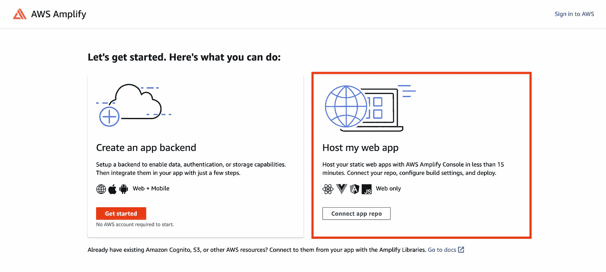

AWS Amplify 入门页面

然后，您将被重定向到一个单独的页面，在那里您可以连接包含您的源代码的存储库。对于这个例子，我将选择 GitHub，但 AWS Amplify 也支持 BitBucket、GitLab、AWS CodeCommit，甚至在没有 Git 提供者的情况下进行部署。

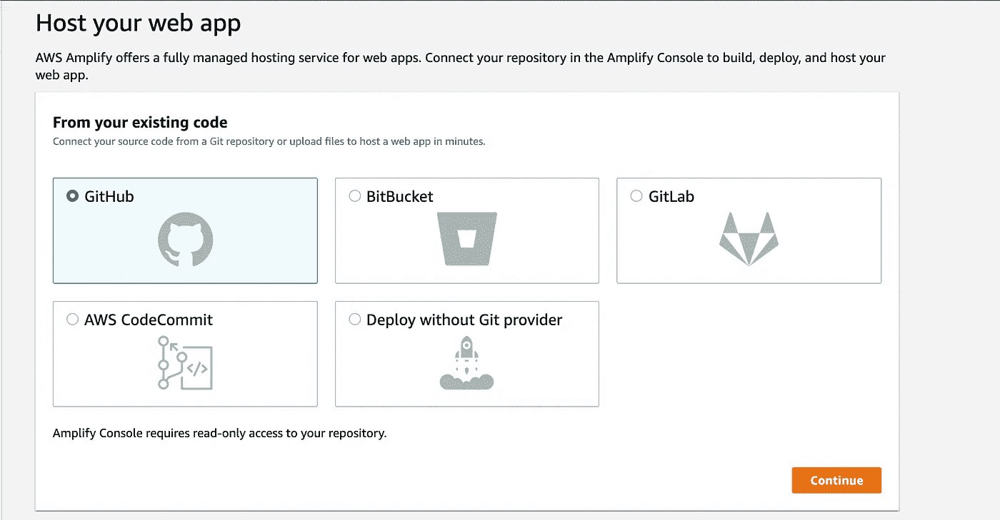

将存储库连接到 AWS Amplify

成功授权后，您可以选择想要部署的存储库，并选择 AWS Amplify 应该用于生产构建的分支。

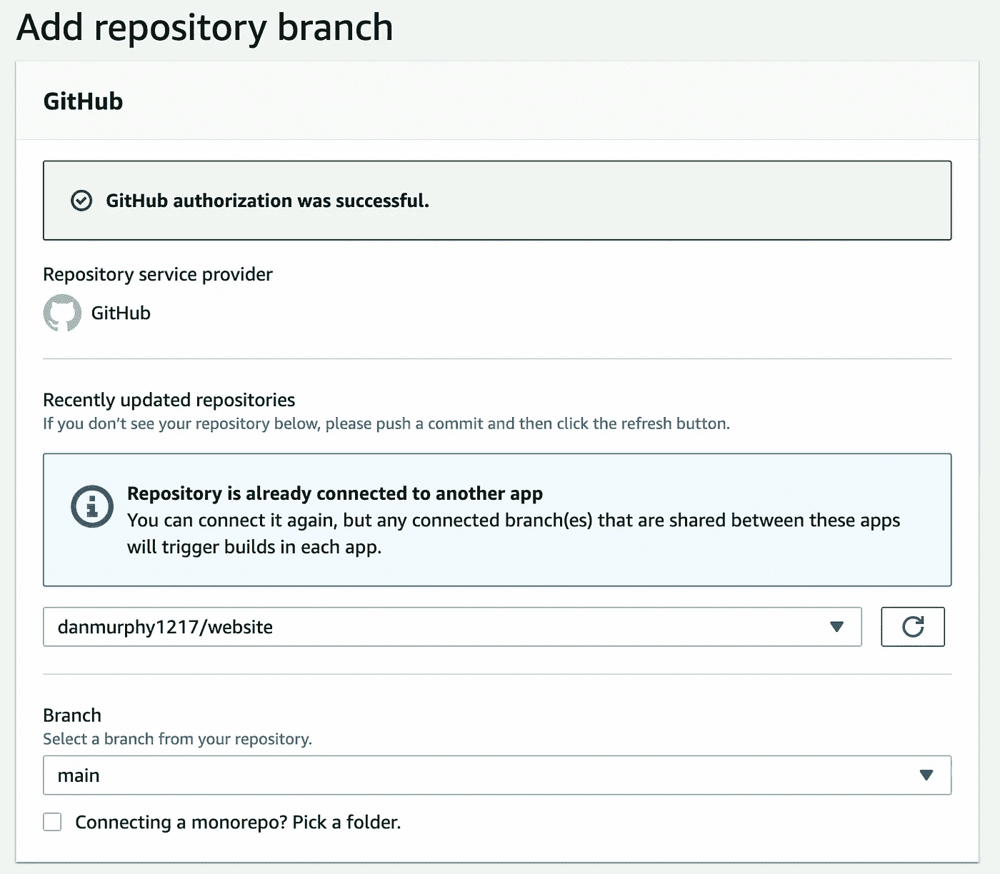

选择存储库和分支

之后，点击**下一步**，AWS 将要求您配置您的*构建*和*测试*设置。AWS 提供的基本模板如下所示。

```
version: 1
frontend:
  phases:
    preBuild:
      commands:
        - npm install build:
      commands:
        - npm run build
  artifacts:
    baseDirectory: build
    files:
      - '**/*'
  cache:
    paths:
      - node_modules/**/*
```

此外，在**高级设置**开关下，您可以设置环境变量和自定义构建容器。

最后，在检查完应用程序的设置后，单击 **Save and Deploy** 和AWS 将开始配置和部署应用程序。当 AWS 完成部署后，您可以导航到 [Amplify 主页](https://console.aws.amazon.com/amplify/home)并查看您新部署的应用程序。

现在，让我们使用 **AWS Amplify 域管理**定制 URL。

## 添加自定义域

要开始添加自定义域，导航到左侧边栏并选择**域管理**。

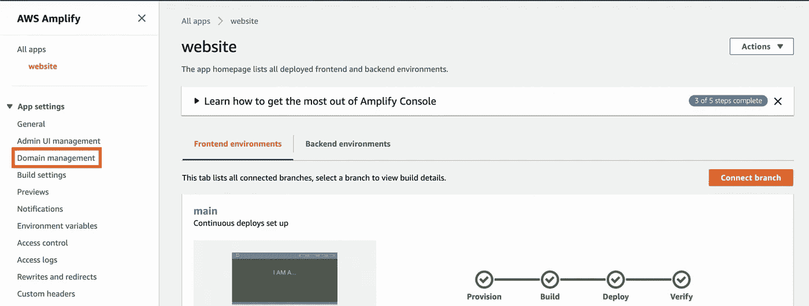

AWS Amplify 主页，在**域管理**设置周围有一个红框。

然后，选择**添加域名**，**输入您的域名(如下图所示)，点击**配置域名**。**

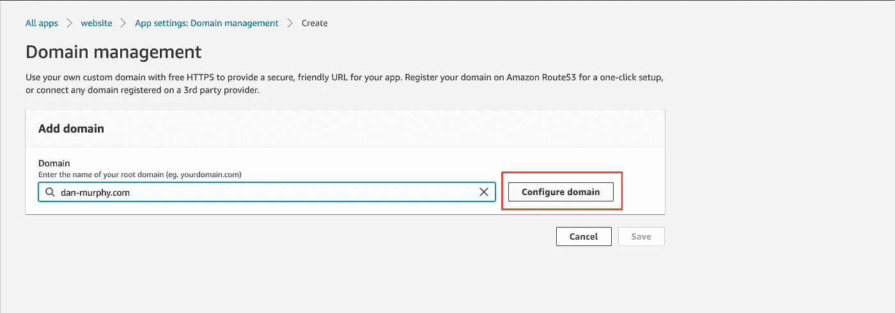

配置您的自定义域

之后，您可以设置您的域所需的任何重定向。例如，在下面的例子中，我创建了一个从[https://dan-murphy.com](https://dan-murphy.com)到[https://www.dan-murphy.com](https://dan-murphy.com)的重定向。

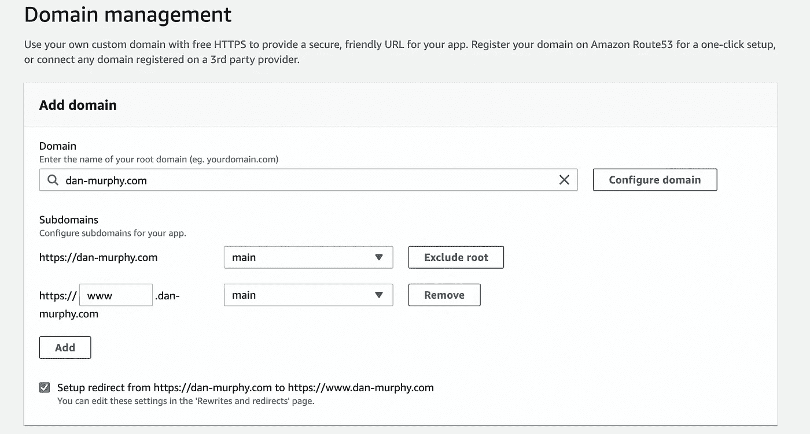

AWS 放大器域管理设置页面

最后，在您的自定义域被正确配置后，AWS 将为您提供一个**验证证书**。您也可以在 [AWS 证书管理器控制台](https://console.aws.amazon.com/acm/home?region=us-east-1#/)中查看该证书。

## 添加 CNAME 记录

配置自定义域的最后一步是添加 CNAME 记录。在下面的例子中，我使用了 [Google Domains](https://domains.google/?gclid=CjwKCAiAjeSABhAPEiwAqfxURSB3aDYrq5mFl8xGPQSHqLUE6tb3MqiZcYlc-GnY_rPaq06fORxYjhoCTYUQAvD_BwE) ，但是不同的域名注册商的基本概念是一样的。

首先，向下滚动到谷歌域名中的**自定义资源记录**。创建一个 *CNAME* 记录，将所有子域指向 AWS 放大器域:

1.  **名称**:输入子域名称。如果子域为[**www.domain.com**，](http://www.domain.com,)输入 ***www*** 。如果是**app.domain.com，**进入 **app** 。
2.  **数据**:在**域管理**页面，点击**动作**，然后选择**查看 DNS 记录**。然后，在**配置 DNS 提供商**下输入可用的 AWS Amplify 域。

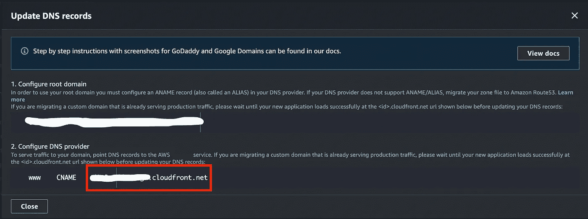

在**域管理**页面中，选择**操作**查看 DNS 记录

总之，自定义资源记录将如下所示:

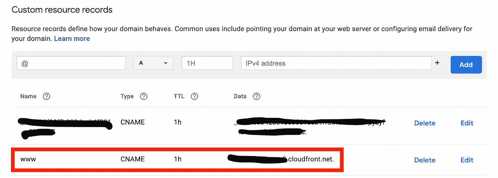

在 Google 域中创建自定义资源记录。第一个 CNAME 记录突出显示在一个红框中。

接下来，再添加一个指向 AWS 证书管理器验证服务器的 *CNAME* 记录。经验证的 AWS 证书管理器为您的应用程序处理 TLS:

1.  **名称**:输入验证服务器的子域。如果验证您的域名所有权的 DNS 记录是 **_1234.example.com** ，只需输入 **_1234** 。
2.  **数据**:输入 ACM 验证证书。如果验证服务器是**_ 1234 . abcdefg . ACM-validations . AWS .**，输入**_ 1234 . abcdefg . ACM-validations . AWS .**

您的验证证书的所有信息可在 [AWS 证书管理器控制台](https://console.aws.amazon.com/acm/home?region=us-east-1#/)中找到。添加第二个 *CNAME* 后，您的自定义记录应该如下所示:

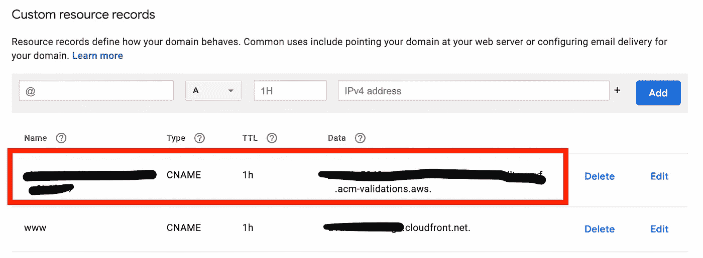

在 Google 域中创建自定义资源记录。第二个 CNAME 记录在一个红框中突出显示。

最后，让我们添加一个**合成记录**来建立一个子域 forward:

1.  **子域**:输入 **@**
2.  **域名网址** : 输入你要转发到的子域。在这个例子中，子域是 *www* 。

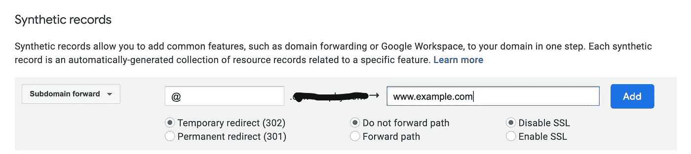

在谷歌域名创建一个子域转发。

# 包扎

总之，在本文中，我们学习了如何构建 React 应用程序并使用 AWS Amplify 部署它们。首先，我们讨论了如何将 react 应用程序模块化到*组件* 和*页面*文件夹中。然后，我们了解了 **AWS Amplify** 以及如何使用它部署静态和数据驱动的应用程序。最后，我们学习了如何使用 **AWS Amplify 域管理**和 **Google 域**来定制我们应用程序的域。

如果你对这篇文章或我的作品集网站有任何问题、顾虑或反馈，请随时评论或发邮件给我，地址是*danielmurph8@gmail.com*。感谢阅读！