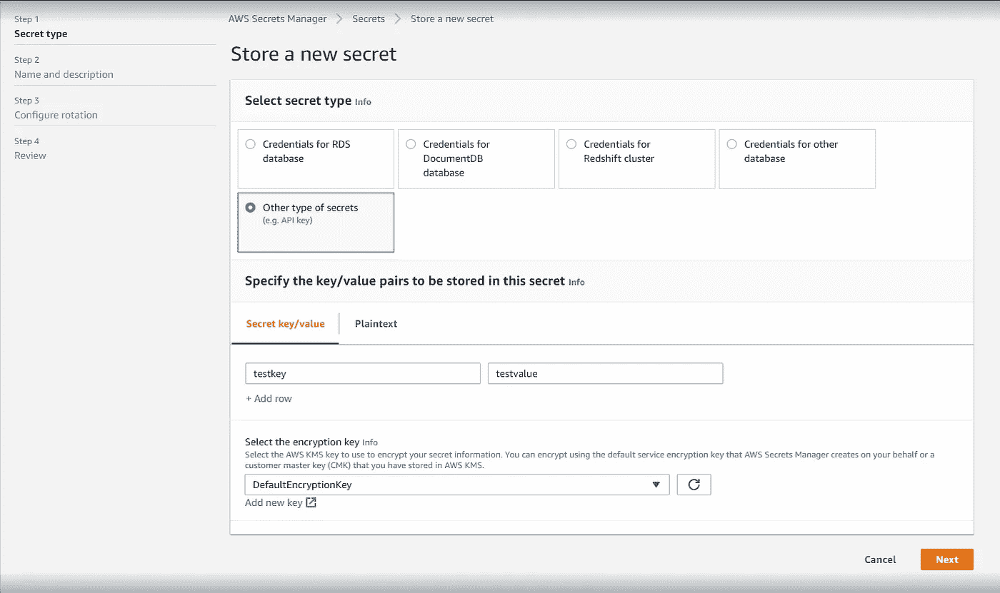
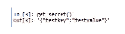

# 如何使用 AWS Secrets Manager 管理凭据

> 原文：<https://towardsdatascience.com/how-to-use-aws-secrets-manager-for-managing-credentials-abf57ab7344c?source=collection_archive---------11----------------------->

马库斯·斯皮斯克在 [Unsplash](https://unsplash.com?utm_source=medium&utm_medium=referral) 上的照片

在很多情况下，您需要使用凭证、令牌、API 密钥等。访问某些服务。例如，您需要使用 SQL server 凭据来访问应用程序的特定数据库。但是，将它们以纯文本文件的形式存储在代码库中并不是最好的主意。这是一个安全漏洞。任何有权访问您的代码库的人都可以读取这些机密，未经授权访问您的服务并执行恶意操作。您可以对秘密进行加密，并将密钥作为配置文件在应用程序外部共享，以允许解密。但是管理这样的秘密会变得很复杂。AWS 有一个秘密管理器，顾名思义，它是一个允许你管理秘密的服务。在本文中，我将讨论如何以编程方式存储和检索秘密。

# AWS 机密管理器[1]

此服务允许您保护访问您的应用程序、服务和 IT 资源所需的机密。人们可以在数据库凭证、API 密钥和其他秘密的整个生命周期中轻松地轮换、管理和检索它们。用户和应用程序通过调用 Secrets Manager APIs 来检索机密，无需以纯文本方式硬编码敏感信息。该服务可扩展到其他类型的秘密，包括 API 密钥和 OAuth 令牌。此外，您可以使用细粒度的权限控制对机密的访问，并对 AWS 云中的资源、第三方服务和内部资源集中审计机密轮换。这些秘密可以很容易地复制到其他区域，以支持多区域应用。现在我们将看看创建一个秘密并以编程方式检索它所需的步骤。

# 步骤 1:创建和存储秘密

您可以使用 AWS Secrets manager 控制台或 AWS CLI 来创建机密。

# 机密管理器控制台

1.  登录控制台:【https://console.aws.amazon.com/secretsmanager/ 

2.在“机密列表”页面上，单击“存储新机密”。

来源:作者

3.在“存储新密码”页面上，选择“其他密码类型”。(这种类型允许您存储键值对或纯文本。)然后，您可以在这个页面上将机密指定为键值对。例如，您的密钥可以是“用户名”和值“secrets@aws.com”

来源:作者

4.对于选择加密密钥，请选择 DefaultEncryptionKey。当您选择此选项时，Secrets Manager 将始终加密机密，无需额外费用。

5.选择下一步

6.在“机密名称”下，键入机密的名称。它只能是字母数字和/_+=。@-.可以用的例子:tutorial/firstkey。等级制度允许你将你的秘密分组并更好地维护它们。如果你愿意，你可以在这里添加描述和标签。

7.按下一步。

8.查看最终细节。此外，该页面还为您提供了不同语言的非常好的示例代码，您可以在您的应用程序中直接使用它们。你可以得到 Python，Java，JavaV2，JavaScript，C#，Ruby 和 Go 语言片段。相当整洁！出版社商店。这将创建一个名为 tutorial/firstkey 的秘密，其中包含 testkey:testvalue 对作为秘密。

# 机密管理器 CLI

1.  打开命令提示符运行 AWS CLI。([安装 AWS 命令行界面](https://docs.aws.amazon.com/cli/latest/userguide/installing.html)
2.  要创建密码，请运行以下命令:`$ aws secretsmanager create-secret --name tutorial/firstkey *2* --description "Basic Create Secret" --secret-string '{"testkey":"testvalue"}'`

# 步骤 2:从机密管理器中检索机密

# 在 AWS 机密管理器控制台中检索您的机密

1.  登录秘密管理员控制台:[https://console.aws.amazon.com/secretsmanager/](https://console.aws.amazon.com/secretsmanager/)
2.  在“机密列表”页面上，选择您创建的机密。
3.  在“机密值”部分，选择“检索机密值”
4.  您可以将这个秘密视为键值对，或者 JSON 文本结构。

# 使用 AWS Secrets Manager CLI 检索

1.  打开命令提示符。
2.  输入以下命令:

# 使用 boto3 Python 代码检索

您也可以使用 boto3 库检索秘密。需要配置您的 AWS CLI。

该函数将给出以下结果:

来源:作者

# 结论

最后，我们将 AWS Secrets Manager 视为存储数据库凭证、API 密钥等的一种方式。我们看到了如何使用控制台和 AWS CLI 创建密码。最后，我们看了如何使用控制台、AWS CLI 和 boto3 Python 库获得密钥。我希望你喜欢这篇文章，并学到一些有用的东西。感谢您的阅读。关注我更多有趣的文章。

# 参考

[1][https://aws.amazon.com/secrets-manager/](https://aws.amazon.com/secrets-manager/)

[2] [快速入门— Boto3 文档 1.17.96 文档](https://boto3.amazonaws.com/v1/documentation/api/latest/guide/quickstart.html)

[3][AWS Secrets Manager—boto 3 Docs 1 . 17 . 97 文档](https://boto3.amazonaws.com/v1/documentation/api/latest/guide/secrets-manager.html)

[4] [教程:创建和检索秘密— AWS 秘密管理器](https://docs.aws.amazon.com/secretsmanager/latest/userguide/tutorials_basic.html)