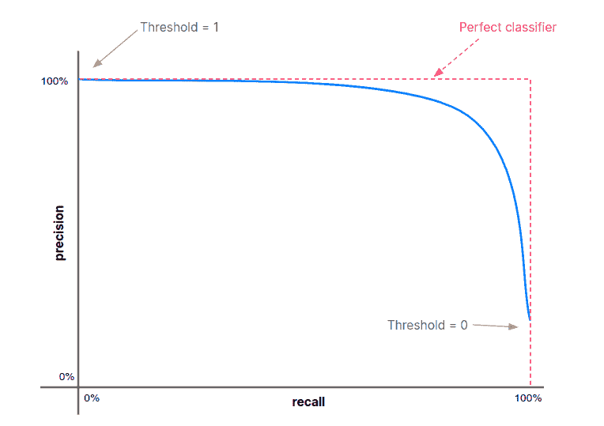
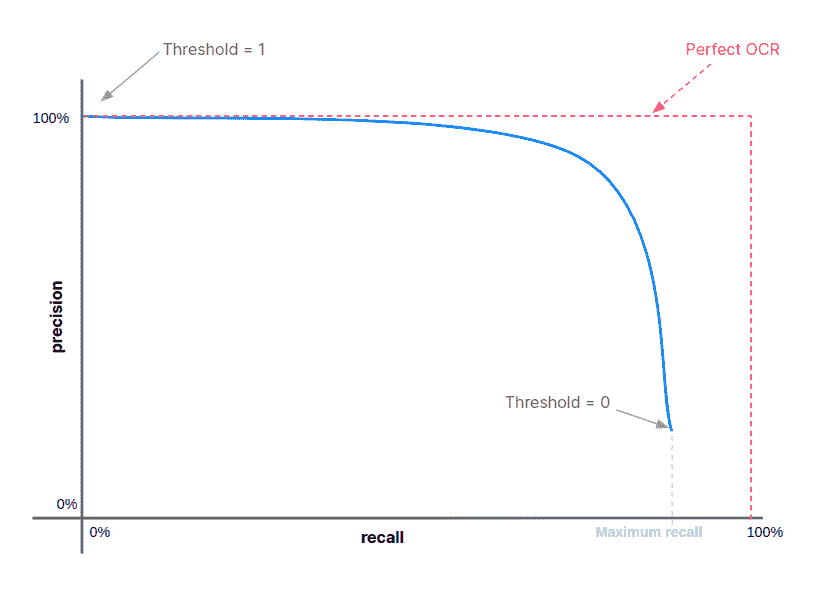
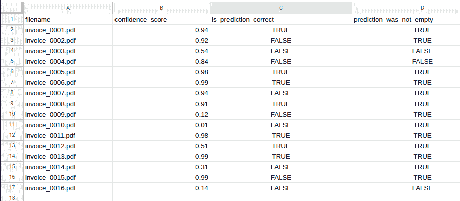
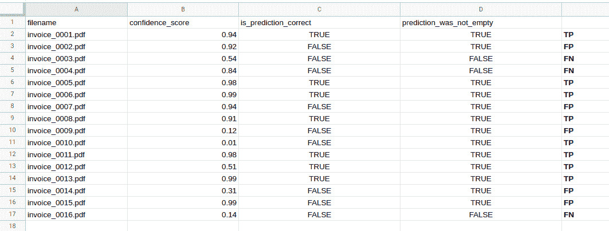
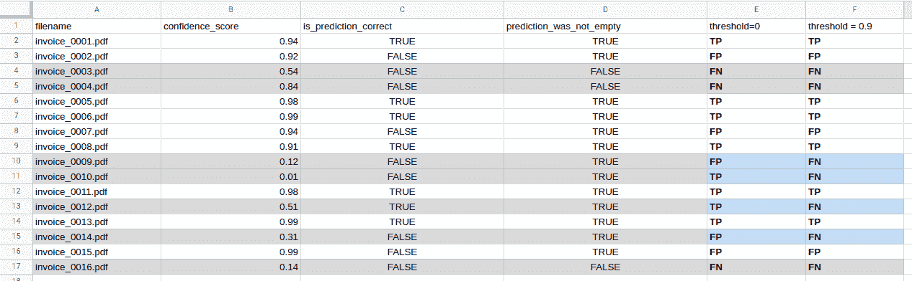
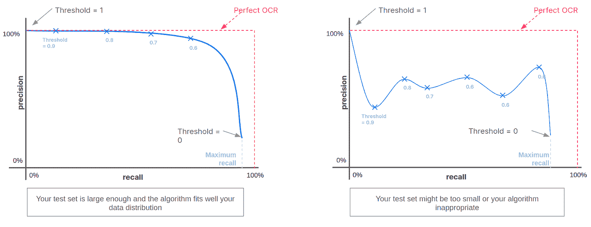
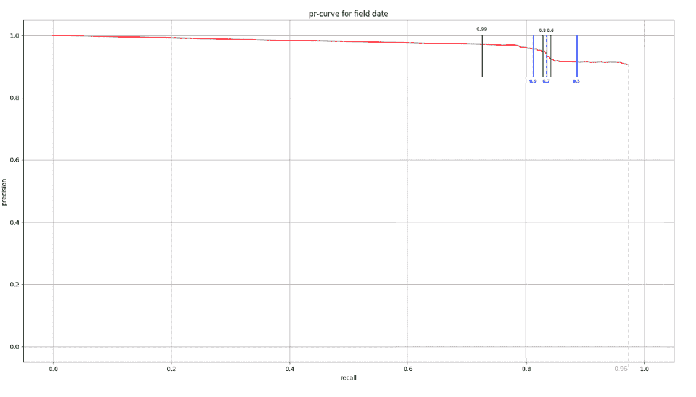

# 如何在机器学习模型中使用置信度得分

> 原文：<https://towardsdatascience.com/how-to-use-confidence-scores-in-machine-learning-models-abe9773306fa?source=collection_archive---------0----------------------->

## [入门](https://towardsdatascience.com/tagged/getting-started)

## 从二进制分类教科书案例到现实世界的 OCR 应用。

与人类一样，机器学习模型有时会在根据输入数据点预测值时出错。但是也像人类一样，大多数模型能够提供关于这些预测可靠性的信息。当你说“我确信……”或“也许是……”时，你实际上是在给你对自己所说的话的自信程度赋予一个相对的资格。在数学中，该信息可以被建模为例如百分比，即 0 和 1 之间的数字，并且大多数 ML 技术提供这种类型的信息。

该置信水平的人机等价可以是:

“我确信……”<=>100%

“我认为是……”<=>70%

“我不知道，但我会说……”<=><50%

The main issue with this confidence level is that you sometimes say “I’m sure” even though you’re effectively wrong, or “I have no clue but I’d say…” even if you happen to be right. Obviously in a human conversation you can ask more questions and try to get a more precise qualification of the reliability of the confidence level expressed by the person in front of you. But when you’re using a machine learning model and you only get a number between 0 and 1, how should you deal with it?

# Most common ML confidence scores

There is no standard definition of the term “confidence score” and you can find many different flavors of it depending on the technology you’re using. But in general, it’s an ordered set of values that you can easily compare to one another.

The three main confidence score types you are likely to encounter are:

**一个介于 0 和 1 之间的十进制数字，可以解释为信心的百分比。**

*   优点:人类容易理解
*   缺点:分数“1”或“100%”令人困惑。这很矛盾，但 100%并不意味着预测是正确的。

**0 与+**[**∩**](https://www.rapidtables.com/math/symbols/Infinity_Symbol.html)**，或-**[**∩**](https://www.rapidtables.com/math/symbols/Infinity_Symbol.html)**与+**[**∩**](https://www.rapidtables.com/math/symbols/Infinity_Symbol.html)

*   优势:你几乎总是可以比较两个置信度得分
*   弱点:对一个人来说没什么意义

**一组表达式，如{ "低"、"中"、"高" }**

*   优点:非常容易操作和理解
*   缺点:缺乏粒度，无法在数学函数中使用

**重要技术说明**:你可以使用任何双射函数转换[0，+[∞](https://www.rapidtables.com/math/symbols/Infinity_Symbol.html)[0，1 中的点]，例如使用 sigmoid 函数，轻松地从选项#1 跳到选项#2，或者从选项#2 跳到选项#1(广泛使用的技术)。请记住，由于浮点精度的原因，从 2 切换到 1 或从 1 切换到 2 可能会丢失两个值之间的顺序。试着计算一下 sigmoid(10000)和 sigmoid(100000)，都可以给你 1。

# 理解问题的一些指标

大多数情况下，决策是基于输入做出的。例如，如果你正在开车，收到“红灯”数据点，你(希望)会停下来。

当您使用 ML 模型做出导致决策的预测时，您必须让算法做出反应，如果它是错误的，将导致不太危险的决策，因为根据定义，预测永远不会 100%正确。

为了更好地理解这一点，让我们深入研究用于分类问题的三个主要指标:准确度、召回率和精确度。我们可以将这些度量扩展到分类以外的其他问题。

## 真阳性、真阴性、假阳性和假阴性

这些定义对计算指标非常有帮助。一般来说，它们指的是一个二元分类问题，在这个问题中，对一个拥有真值“是”或“否”的数据进行预测(要么是“是”，要么是“否”)。

*   真阳性:预测“是”且正确
*   真正的否定:预测“不”和正确
*   误报:预测“是”和错误(正确答案实际上是“否”)
*   假阴性:预测“否”和错误(正确答案实际上是“是”)

在接下来的部分中，我们将使用缩写 tp、tn、fp 和 fn。

## 准确(性)

准确性是最容易理解的指标。它只是数据集上正确预测的数量。例如，给定一个包含 1，000 幅图像的测试数据集，为了计算准确性，您只需对每幅图像进行预测，然后计算整个数据集中正确答案的比例。

假设你从这 1000 个例子中做出了 970 个好的预测:这意味着你的算法准确率是 97%。

当在假阳性和假阴性预测之间没有令人感兴趣的折衷时，使用该度量。

但是有时候，根据你的目标和你的决策的重要性，你可能想用其他的指标来平衡你的算法的工作方式，比如召回率和精确度。

精度公式:(tp + tn ) / ( tp + tn + fp + fn)

## 回忆(也称为敏感性)

为了计算算法的召回率，你只需要考虑测试数据集中真正“真实”的标签数据，然后计算正确预测的百分比。这是一个有助于回答以下问题的指标:“在所有真正的正值中，我的算法实际预测为真的百分比是多少？”

如果一个 ML 模型必须预测一个交通信号灯是否是红色的，以便你知道你是否必须开车，你更喜欢一个错误的预测:

1.  虽然不是红色，但上面写着“红色”
2.  虽然它是红色的，但上面写着“不是红色的”

让我们来看看在这两种情况下会发生什么:

1.  你的车停下来了，尽管它不应该停下来。这只是轻微的危险，因为后面的其他司机可能会感到惊讶，这可能会导致一场小型车祸。
2.  你的车不会在红灯时停下来。这是非常危险的，因为过马路的司机可能看不到你，造成全速撞车，造成严重的损害或伤害..

每个人都会同意情况(b)比情况(a)糟糕得多。在这种情况下，我们因此希望我们的算法永远不要说灯不是红色的:我们需要一个最大的回忆值，只有当灯是红色时算法总是预测“红色”，即使这是以灯实际上是绿色时预测“红色”为代价的，才能实现。

可以通过在测试数据集上测试该算法来测量召回率。它是一个百分比，除以算法预测为“是”的数据点数，再除以实际上为“是”值的数据点数。

例如，假设我们有 1000 幅图像，其中 650 幅是红灯，350 幅是绿灯。为了计算我们算法的召回率，我们将对我们的 650 个红灯图像进行预测。如果算法对这 650 张图片中的 602 张说“红色”，召回率将是 602 / 650 = 92.6%。这还不够！7%的情况下，存在全速车祸的风险。我们将在后面看到如何使用我们算法的置信度来防止这种情况，而不改变模型中的任何东西。

召回公式:tp / ( tp + fn)

## 精确度(也称为“阳性预测值”)

你的算法的精度让你知道当你的算法预测“正确”时，你可以信任它多少。它是正确猜测为“真实”的预测与所有猜测为“真实”的预测(其中一些实际上是“错误的”)的比例。

让我们现在想象一下，有另一个算法正在查看一条两车道的道路，并回答以下问题:“我可以超过我前面的车吗？”

再一次，让我们弄清楚一个错误的预测会导致什么。错误的预测意味着算法说:

1.  “你能超过那辆车”尽管你不能
2.  “不，你不能超过那辆车”尽管你可以

让我们看看在这两种情况下会发生什么:

1.  你提高车速以超越你前面的车，然后你移动到你左边的车道(向相反的方向行驶)。然而，可能会有另一辆车在相反的方向全速驶来，导致全速撞车。结果:你们都受了重伤。
2.  你可以超越你前面的车，但你会轻轻地跟在慢的司机后面。结果:什么也没发生，你只是损失了几分钟。

同样，每个人都会同意(b)比(a)更好。我们希望我们的算法只在“你可以超车”是真的时候才预测它:我们需要一个最大的精度，当它实际上是“不”的时候，永远不要说“是”。

为了测量测试集上的算法精度，我们计算所有“是”预测中真正“是”的百分比。

为此，假设我们有 1000 张超车情况的图像，其中 400 张代表安全超车情况，600 张代表不安全超车情况。我们想知道在我们的算法做出的所有“安全”预测中，真正“安全”的百分比是多少。

假设在我们的“安全”预测图像中:

*   其中 382 个是安全超车情况:真=是
*   其中 44 个是不安全超车情况:真相=否

计算精度的公式为:382/(382+44) = 89.7%。

意思是:89.7%的时候，当你的算法说你可以超车的时候，你实际上是可以的。但这也意味着 10.3%的时候，你的算法说你可以超越这辆车，尽管它不安全。精确度不够好，我们将看到如何通过置信度得分来提高精确度。

精度公式:tp / ( tp + fp)

## 度量摘要

您可以使用测试数据集(越大越好)估计以下三个指标，并计算:

*   准确率:正确预测的比例— ( tp + tn ) / ( tp + tn + fp + fn)
*   回忆:所有真实“是”数据中“是”预测的比例— tp / ( tp + fn)
*   Precision:所有“是”预测中真实“是”数据的比例— tp / ( tp + fp)

# 置信度阈值

在所有之前的例子中，我们认为我们的算法只能预测“是”或“否”。但是这些预测从来不会被输出为“是”或“否”，它总是一个数字分数的解释。实际上，机器总是以 0 到 1 之间的概率预测“是”:这是我们的置信度得分。

作为一个人，在给定 0 到 1 之间的置信分数的情况下，将预测解释为“是”的最自然的方式是检查该值是否高于 0.5。这个 0.5 是我们的阈值，换句话说，它是最小的置信度，超过这个值我们就认为预测是“是”。如果低于，我们认为预测为“否”。

然而，正如我们在前面的例子中看到的，犯错误的代价根据我们的用例而不同。

幸运的是，我们可以改变这个阈值，使算法更好地符合我们的要求。例如，让我们想象一下，我们正在使用一个返回 0 到 1 之间的置信度得分的算法。将阈值设置为 0.7 意味着您将拒绝(即在我们的示例中将预测视为“否”)所有置信度低于 0.7 的预测(包括在内)。这样做，我们可以微调不同的指标。

总的来说:

*   提高阈值会降低召回率，提高准确率
*   降低阈值会产生相反的效果

现在需要指出的重要一点是，上面的三个指标都是相关的。一个简单的例子是:

*   threshold = 0 意味着您的算法总是说“是”，因为所有的置信度得分都在 0 以上。你得到最小的精确度(你在每一个真正的“否”数据上都是错的)和最大的回忆(当它是一个真正的“是”时，你总是预测“是”)
*   threshold = 1 意味着您拒绝所有预测，因为所有置信度得分都低于 1(包括 1)。你有 100%的准确性(你说“是”永远不会错，因为你从来不会说“是”..)，0%回忆(……因为你从来不说“是”)

试图设置最佳分数阈值无非是在精确度和召回率之间进行权衡。

## 精确召回曲线(PR 曲线)

要选择应用程序中要设置的最佳阈值，最常用的方法是绘制精确召回曲线(PR 曲线)。

为此，您将在一个测试数据集上，针对许多不同的阈值，计算算法的精度和召回率。一旦你有了所有的情侣(pr，re)，你就可以把它们画在一张图上，如下所示:

PR 曲线总是以一个点开始(r = 0；p=1)按照惯例。

一旦你有了这条曲线，你可以很容易地看到蓝色曲线上的哪一点最适合你的用例。然后，您可以找出这个点的阈值，并在您的应用程序中设置它。

## 如何绘制你的 PR 曲线？

所有之前的例子都是二元分类问题，我们的算法只能预测“真”或“假”。在现实世界中，用例稍微复杂一点，但是所有之前的度量都可以通用化。

让我们举一个新的例子:我们有一个基于 ML 的 OCR，它对发票执行数据提取。这个 OCR 提取一堆不同的数据(总金额、发票号、发票日期……)以及这些预测的可信度分数。

我们应该为发票日期预测设置哪个阈值？

这个问题不是二元分类问题，要回答这个问题，绘制我们的 PR 曲线，需要定义什么是真预测值，什么是假预测值。

这里所有的复杂性是做出正确的假设，这将允许我们符合我们的二元分类度量:fp，tp，fn，tp

以下是我们的假设:

1.  我们数据集中的每张发票都包含一个发票日期
2.  我们的 OCR 可以返回一个日期，或者一个空的预测

如果与#1 不同，您的测试数据集包含没有任何发票日期的发票，我强烈建议您将它们从数据集中删除，并在增加更多复杂性之前完成第一个指南。这个假设在现实世界中显然不成立，但是如果没有这个假设，下面的框架描述和理解起来会复杂得多。

现在，让我们定义我们的指标:

*   true positive:OCR 正确提取了发票日期
*   误报:OCR 提取了错误的日期
*   正误:这种情况是不可能的，因为我们的发票上总是有日期
*   假阴性:OCR 没有提取发票日期(即空预测)

在开始绘制我们的 PR 曲线之前，让我们考虑一下我们的模型和二元分类问题之间的区别。

在我们的 OCR 用例中，将阈值设置为 0 意味着什么？这意味着我们不会拒绝任何预测，但与二元分类问题不同，这并不意味着我们会正确预测所有的正值。事实上，我们的 OCR 可以预测错误的日期。

这意味着我们可能永远不会到达回忆为 1 的曲线点。将阈值设置为 0 时，通常会达到这一点。在我们的例子中，这个阈值将给出我们整个数据集中正确预测的比例(记住没有发票日期就没有发票)。

我们预计最终会有这样的曲线:

我们现在准备绘制我们的公关曲线。

**步骤 1:对测试数据集的每张发票运行 OCR，并为每张发票存储以下三个数据点:**

*   这个预测正确吗？
*   预测的置信度是多少？
*   预测是否填充了日期(与“空”相对)？

第一步的输出可以是一个简单的 csv 文件，如下所示:

**步骤 2:计算阈值= 0 的召回率和精确度**

我们现在需要计算 threshold = 0 的精度和召回率。

这是最简单的部分。我们只需要将我们的每个预测限定为 fp、tp 或 fn，因为根据我们的模型化，不可能有任何真正的否定。

让我们算一下。在上面的例子中，我们有:

*   8 个真阳性
*   5 次误报
*   3 个假阴性

在阈值为 0 的第一个例子中。，我们就有了:

*   精度= 8 / (8+5) = 61%
*   召回率= 8 / (8+3) = 72%

我们有了 PR 曲线的第一个点:(r=0.72，p=0.61)

**步骤 3:对不同的阈值重复此步骤**

我们刚刚计算了第一个点，现在让我们对不同的阈值进行计算。我们以阈值= 0.9 为例。

正如我们上面提到的，设置 0.9 的阈值意味着我们认为任何低于 0.9 的预测都是空的。换句话说，我们需要把它们都限定为假负值(记住，不可能有任何真负值)。

为此，您可以在我们的 csv 文件中添加一列:

在上面的 csv 文件中:

*   灰线对应于低于我们阈值的预测
*   蓝色单元格对应于我们必须将资格从 FP 或 TP 更改为 FN 的预测

让我们再算一次。

我们有:

*   6 个真阳性
*   3 次误报
*   7 个假阴性

在阈值为 0 的第一个例子中。，我们就有了:

*   精度= 6/ (6+3) = 66%
*   召回率= 6 / (6+7) = 46%

这导致了我们的 PR 曲线的一个新点:(r=0.46，p=0.67)

对一组不同的阈值重复这一步，存储每个数据点，就大功告成了！

## 解读你的公关曲线

在理想情况下，您的测试集中有大量数据，并且您使用的 ML 模型非常适合数据分布。在这种情况下，随着回忆的增加，你会得到一条向下的公关曲线。

但是你可能没有很多数据，或者你可能没有使用正确的算法。在这种情况下，你得到的 PR 曲线可能是不成形的，是可利用的。

这是我们在 [Mindee](https://mindee.com/) 绘制的真实世界 PR 曲线的一个例子，它与我们在日期字段上的收据 OCR 非常相似。

我们的测试集中有来自大约 20 个国家的 10k 个带注释的数据。日期字段的 PR 曲线如下所示:

任务完成了。现在，您可以选择曲线上对您的用例最感兴趣的点，并在您的应用程序中设置相应的阈值。

无论您的用例是什么，您几乎总能找到一个代理来定义适合二元分类问题的度量。这样，即使你不是数据科学专家，你也可以谈论你的模型的**精度**和**召回**:**两个清晰而有用的指标来衡量算法有多适合你的业务需求。**