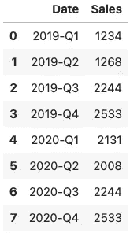
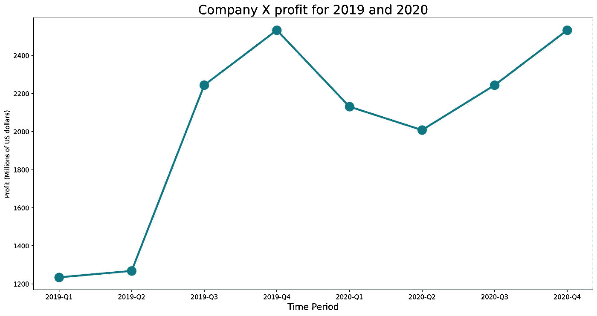
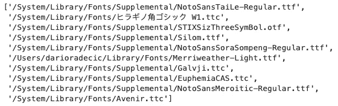
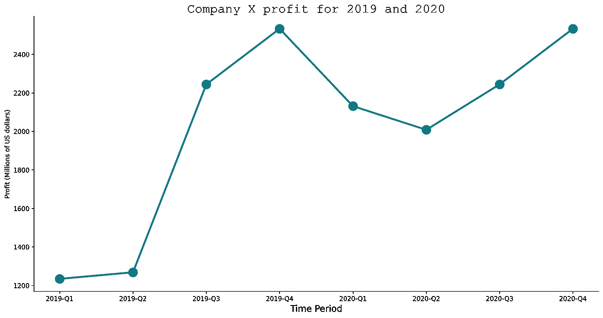

# 如何在 Matplotlib 中使用自定义字体——在 5 分钟或更短时间内

> 原文：<https://towardsdatascience.com/how-to-use-custom-fonts-with-matplotlib-in-5-minutes-or-less-57c63ece2a11?source=collection_archive---------12----------------------->

## 使用自定义字体(包括 TTF)使您的可视化效果更加引人注目

默认情况下，Matplotlib 可视化效果会很难看。对你来说，幸运的是，几行代码就可以做很多调整。今天，我们将看看改变字体，并解释为什么它通常是一个好主意。

这篇文章的结构如下:

*   自定义字体—为什么？
*   使用内置字体
*   使用 TTF 文件中的自定义字体
*   结论

# 自定义字体—为什么？

为什么不呢？默认的不会让你走远。如果你的公司有一个独特的品牌，为什么不尽可能使用它呢？

让我们来看看默认样式是什么样子的。没有数据就没有数据可视化，所以让我们先声明一个简单的数据集。它包含一家虚构公司的虚拟季度销售额:

以下是数据集的外观:

图 1-虚拟可视化数据集(作者提供的图片)

让我们用折线图和散点图来展示这些数据。我们将保留大多数默认样式，只移除顶部和右侧的脊线:

这是视觉效果:

图 2 —使用默认字体的可视化效果(作者提供的图片)

正如你所看到的，字体看起来不错，但我不知道有哪个品牌使用 DejaVu Sans 作为他们的首选字体。接下来看看怎么改。

# 使用内置字体

Matplotlib 使得使用安装在机器上的字体变得容易。您可以使用以下代码片段列出前十种可用字体:

结果如下:

图 3-预装字体(作者图片)

如果您想要整个列表，请移除`[:10]`。您可以指定参数`font`的值，以便在标题或轴标签中使用感兴趣的字体。

以下代码片段向您展示了如何在标题中使用 *Courier 新*字体:

这是可视化效果的样子:

图 4 —预装系统字体的可视化效果(图片由作者提供)

但是你知道在使用之前不需要安装字体吗？你所需要的只是一个 TTF 文件。接下来让我们探索一下它是如何工作的。

# 使用 TTF 文件中的自定义字体

要跟进，请从[这里](https://fonts.google.com/specimen/Merriweather?preview.text_type=custom)(或任何其他地方)下载梅里韦瑟字体。解压缩文件，并将路径复制到文件夹。

从这里，我们可以使用 Matplotlib 中的`font_manager`从文件中添加字体。你需要在循环中一个接一个地添加字体。

添加后，我们将把整个 Matplotlib 字体系列设置为 Merriweather，这样我们就不必到处手动指定字体。

完成后，您可以像往常一样进行可视化:

结果如下图所示:

图 5 —使用自定义 TTF 字体的可视化效果(图片由作者提供)

这就是在 Matplotlib 中添加自定义字体有多简单！接下来让我们总结一下。

# 结论

今天的文章很短，但很中肯。你已经学会了如何将你的品牌融入到数据可视化中，如果你想在所有媒体上传递一致的信息，这是一项基本技能。

如果你喜欢这篇文章，请继续关注博客——更多类似的文章即将发表。

喜欢这篇文章吗？成为 [*中等会员*](https://medium.com/@radecicdario/membership) *继续无限制学习。如果你使用下面的链接，我会收到你的一部分会员费，不需要你额外付费。*

 [## 通过我的推荐链接加入 Medium-Dario rade ci

### 作为一个媒体会员，你的会员费的一部分会给你阅读的作家，你可以完全接触到每一个故事…

medium.com](https://medium.com/@radecicdario/membership) 

# 了解更多信息

*   [每位数据科学家必读的 3 本编程书籍](/3-programming-books-every-data-scientist-must-read-db1d3a1a284c)
*   [脊线图:用 Python 可视化数据分布的最佳方式](/ridgeline-plots-the-perfect-way-to-visualize-data-distributions-with-python-de99a5493052)
*   [Python 字典:你需要知道的一切](/python-dictionaries-everything-you-need-to-know-9c2159e5ea8a)
*   [如何用 Python 发送漂亮的电子邮件——基本指南](/how-to-send-beautiful-emails-with-python-the-essential-guide-a01d00c80cd0)
*   新的 M1 macbook 对数据科学有好处吗？让我们来看看

# 保持联系

*   关注我的 [Medium](https://medium.com/@radecicdario) 了解更多类似的故事
*   注册我的[简讯](https://mailchi.mp/46a3d2989d9b/bdssubscribe)
*   在 [LinkedIn](https://www.linkedin.com/in/darioradecic/) 上连接
*   查看我的[网站](https://www.betterdatascience.com/)

*原载于 2021 年 4 月 1 日 https://betterdatascience.com**[*。*](https://betterdatascience.com/python-matplotlib-fonts/)*