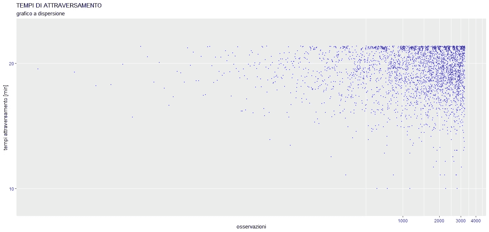
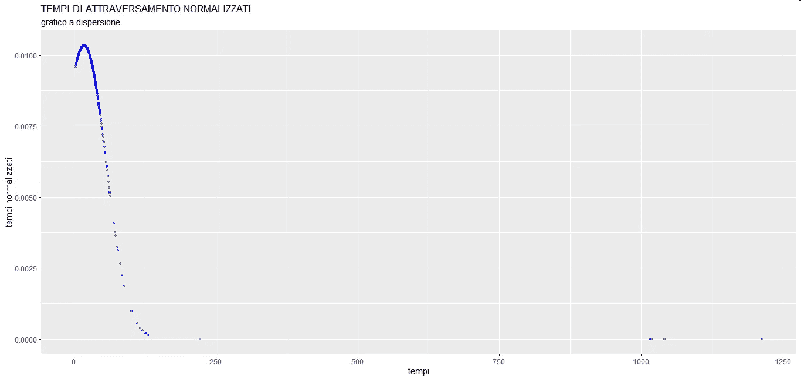
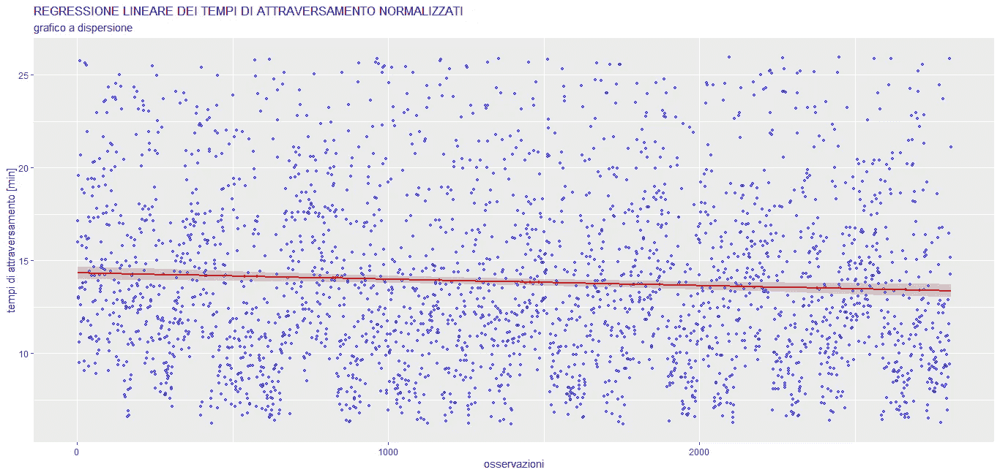
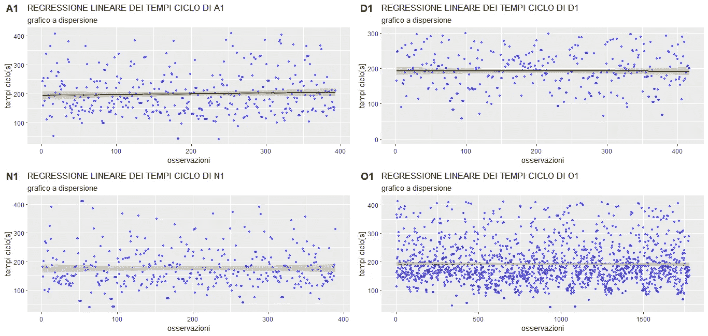
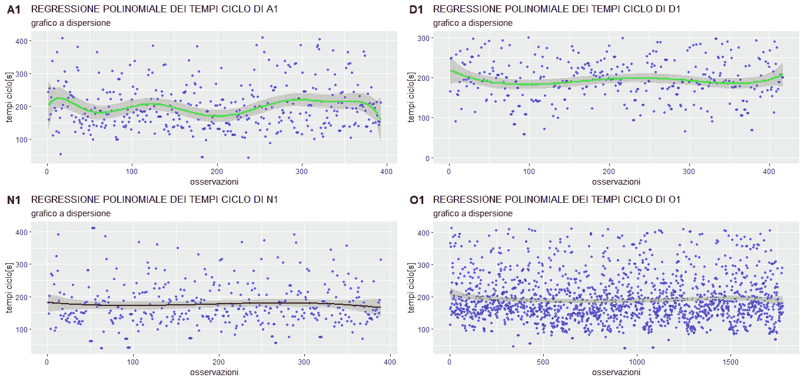
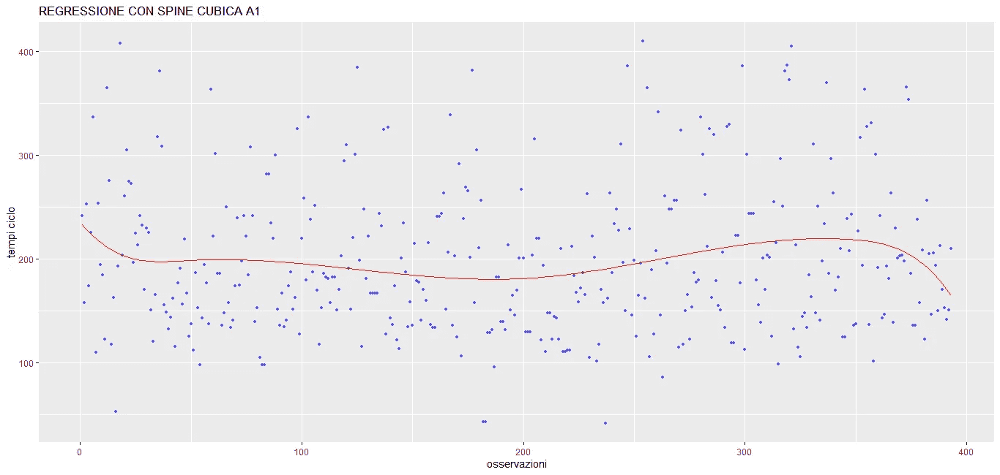
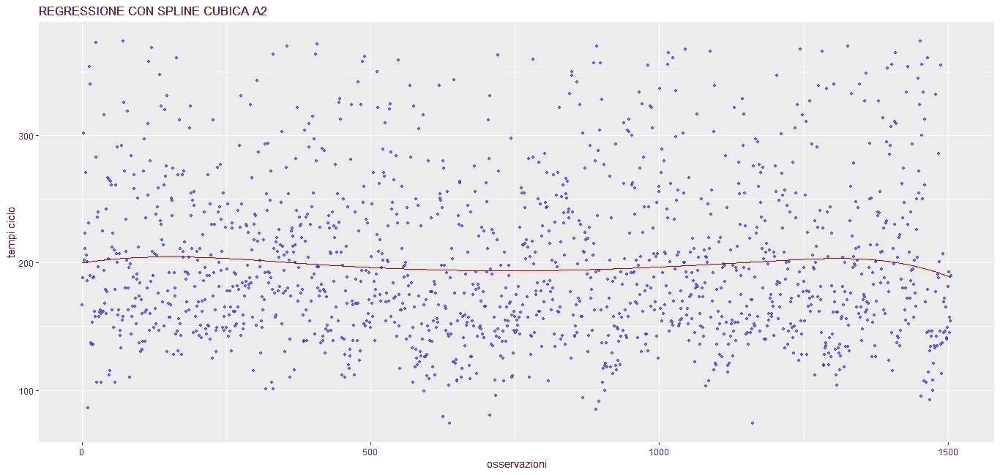
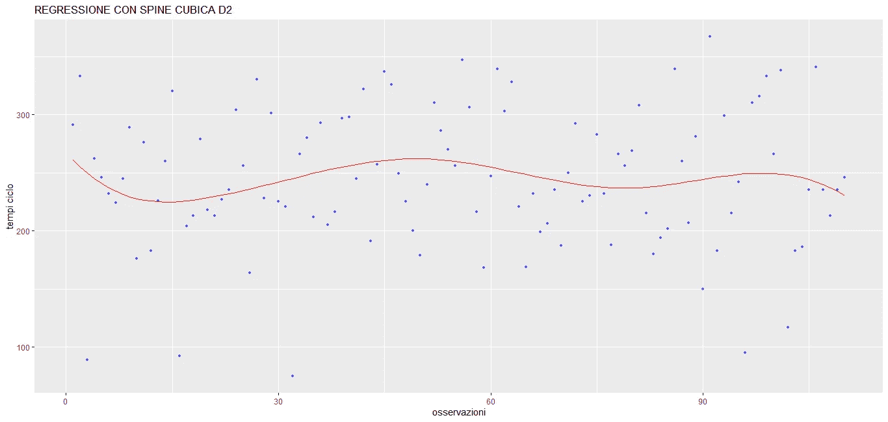

# 如何在工业生产环境中使用数据科学

> 原文：<https://towardsdatascience.com/how-to-use-data-science-in-industrial-production-environments-6accf24afeb2?source=collection_archive---------21----------------------->

## 关于如何在工业生产环境中使用数据科学的方法源于我的学士论文

在 [Unsplash](https://unsplash.com/s/photos/assembly-line?utm_source=unsplash&utm_medium=referral&utm_content=creditCopyText) 上拍摄的 [ThisisEngineering RAEng](https://unsplash.com/@thisisengineering?utm_source=unsplash&utm_medium=referral&utm_content=creditCopyText)

这篇文章来源于我的工业工程学士论文“用数据科学技术进行生产数据分析”。我的论文来自真实的工业世界，所以我可以使用真实的工业数据，创建一个对我的论文有用的案例研究。

# 介绍

我研究了一个分三个阶段制造的特定对象:两个组装阶段和一个系统运行测试阶段。该系统已经批量生产了三年，因此操作员对他们的工作非常有信心。我的分析集中在装配线的流程交付时间(*)和两个装配阶段的周期时间(**)。在我的分析中，我还没有考虑操作测试周期时间，因为在过去的几个月中发生了一些变化，数据仍然有点脏。

# 这项研究的统计基础

在这个案例研究中，我使用回归模型来研究数据集；特别是:线性回归、多项式回归和样条回归。这个想法是细分每个操作员在两个装配阶段的周期时间；这样回归方法可以帮助我找到:

*   每个装配阶段最快的操作员
*   每个装配阶段的常量运算符

如何理解一个操作者在工作中是否恒常？从数学上讲，当一个变量在图表中是一条垂直线或水平线时，我们可以说它是常数；这就是回归，尤其是线性回归，帮助我的地方。

# 数据分析

现在来说说数据，看看数据分析是怎么做出来的。但是在继续之前，我必须说整个数据分析都是用 r。

## 流程提前期分析

首先，我研究了装配线流程提前期。我已经使用 r 中的“read excel”库导入了数据。绘制了一个散点图，其中“观察值”在“x”轴上，“流程交付时间”在“y”轴上，结果如下:

流程提前期分析。图片由作者提供。

正如我们所看到的，有很大的数据分散；事实上，我不得不使用双对数标度，以便图表可以在特定的维度上绘制。所以，我在这项研究中首先要面对的是数据清洗。我问自己:流程提前期的哪些值太小了？哪些数值过高？我可以用什么标准来排除过高和过低的值？

我决定使用高斯正态函数对数据集进行归一化，结果如下:

通过标准化数据绘制的图。图片由作者提供。

我们可以看到，这是一条右偏的高斯曲线；此时，我已经计算了平均值(m)和标准偏差(s ),并清理了(m-s；m+s)范围。数据清理后，我用线性回归线绘制了流程交付时间的散点图，结果如下:

清理流程交付周期数据:线性回归散点图。图片由作者提供。

我发现了一条负斜率线；这是什么意思？这意味着随着观察的增加，过程交付时间减少；但是为什么会这样呢？有两个答案:

*   操作员已经在该系统上工作过多次，他们获得了专业知识
*   外部修改已经使流程交付周期缩短

由于该系统已经制造了三年，正如我在本文开始时所说，流程交付周期缩短的正确答案是第二个。

正如我之前所说的，在过去的几个月中，一些变化使我避免研究功能测试周期时间；这些变化也会影响流程交付时间，从而缩短交付时间。

这是第一个结果:使用线性回归方法，流程交付时间随着负斜率线的减少而减少。

# 第一个装配阶段:周期时间分析

首先，我得说这个组装阶段是一个“标准阶段”。我所说的标准装配阶段是什么意思？我的意思是，所涉及的操作是典型的工业装配线；例如，在一个标准的，我们可以找到像螺丝，机械和物理装配等操作。为了更好地理解它，请考虑这样一个事实，即周期时间取决于操作员对该阶段的信心(他们做了数百次)，而不是他们的手工技能。在第二个组装阶段，我们将了解什么是非标准的组装阶段，这样在本文的后面会更加清楚。

我已经确定了至少贡献了 400 次观察的操作员；操作符有四个:操作符 A、D、N、o。然后，我已经使用我们在流程交付周期分析中看到的相同方法清理了数据，所以我不再重复了。那么，让我们来看看第一个装配阶段的数据分析。

## 线性回归模型

我做的第一件事是对四个运算符进行线性回归，结果如下:

周期时间:四个操作员的线性回归散点图。图片由作者提供。

从图中我们可以看出，除了运算符 A，线性回归看起来是水平线；对于这个算符，直线有一点正斜率。当然，这种分析不足以得出任何结论。事实上——这也是这项研究的重点——统计学中的水平回归线有明确的含义:两个变量之间没有回归；换句话说，观察值和周期时间之间没有联系。

从数学上来说，我们可以在这里停下来说:“没有回归”，也许会中断研究。但是我们在一个工程领域，所以我问自己:“如果观察值和周期时间之间没有联系，这意味着什么？”。答案非常简单:对于任何观察，平均周期时间都是相同的；换句话说，操作者的周期时间是一致的；这是一个伟大的成果！

无论如何，这项研究还没有完成。我想深入回归方法，以表明那些水平线是真正水平的。怎么做呢？首先我做了一个残差分析。从残差分析来看,“多重 R 平方”值都接近于零。这发生在两种情况下:

1)线性回归模型不是描述数据的最佳方法

2)回归线真的是水平的

此外，通过残差分析，我可以找到每个操作员的周期时间；事实上，R 给了我们截距的值，由于这条线是水平的，这个值就是实际的周期时间。因此，在这一点上，我决定更深入地尝试用多项式回归模型来分析数据。

## 多项式回归模型

我问自己的第一个问题是:完美拟合数据的最佳多项式次数是多少？我怎么找到它？

回答这些问题有不同的方法:

*   随着多项式次数的增加进行残差分析迭代
*   随着多项式次数的增加进行图形迭代

选择这种方式或那种方式没有对错:无论如何，这是一个迭代的问题，决定何时停止迭代；但是我们什么时候停止？

对于残差分析，我们可以参考“调整后的 R 平方”值；一个好的方法是研究每次迭代的值；我们应该看到它在每次迭代中增加，在某一点上它应该减少；当它下降时，尤其是接近零时，这是一个好迹象，表明这与最符合数据的多项式次数有关。

相反，对于图形迭代，我们只是实现一个多项式回归，每次迭代的次数增加，我们可以用图形方式看到哪条曲线最符合数据；在一定程度上，这些曲线应该看起来都是相同的:我们只选择与“所有相似曲线”相关的最小程度。

在这个案例研究中，我使用了这两种方法，只是为了进行一些实践。

在下图中，我们可以看到四个运算符的迭代结果:

周期时间:四个操作员的多项式回归散点图。图片由作者提供。

通过分析图形，我可以说，对于算子 N 和 O，曲线实际上是一条线，呈现非常小的波动，但这些波动在域的边界上。与算子 D 相关的曲线似乎是可疑的，但在这种情况下，波动也在域的边界。相反，对于 operator A 曲线，毫无疑问:数据的最佳近似值是一条曲线(7 次曲线)。

总结:拟合操作员 A 数据的最佳曲线似乎是 7 次多项式。拟合运算符 N 和 O 数据的最佳曲线似乎是一条水平线。对于算子 D，曲线有些疑问:它甚至可能是一条水平线。为了更加确定这些结果，我使用了样条回归方法。

## 样条回归模型

为了简单起见，我使用了一个三次样条来研究数据。我已经决定沿着 x 轴在每个域的 25%、50%和 75%的位置上施加样条线结，这是一个相当标准的选择。

这是运算符 A 样条:

周期时间:操作员 A 样条散点图

相反，对于其他三个运算符，当尝试进行样条回归时，R 给了我一个错误，这是一个好结果；事实上，这意味着没有样条可以插值数据。因此，最符合数据的曲线实际上是一条(水平)线。

这一结论是对这一装配阶段研究的自然完成，因为对于这三个操作符，多项式回归方法对最符合数据的曲线留下了一些疑问。相反，样条消除了任何疑虑:因为没有样条，所以曲线实际上是每个操作符的一条线。

# 第二装配阶段:周期时间分析

应用于第二组装阶段的研究的方法论与之前相同，所以我只是直奔结果；但在此之前，有几件事要说。

这个装配阶段是非标准的。事实上，在这一阶段，操作者手动将垫圈施加到产品的整个外表面上。可以理解这一阶段与操作员的手工技能的关系。

因此，记住第一阶段的研究，这里的期望是发现大多数运营商显示周期时间振荡。

这意味着，对它们中的大多数来说，描述数据的最佳模型是样条模型。

因此，我发现四个操作者中有两个在周期时间中出现振荡，这些是他们的样条:

周期时间:操作员 A 样条散点图

周期时间:带操作员 D 样条的散点图

对于另外两个操作者，最好地描述数据的方法当然是一条水平线，这意味着它们在其周期时间内保持不变。

# 结论

最后，我想强调本研究中使用的方法的重要性，并谈谈本研究的一些可能的应用。

## 方法:对流程进行异常检测

这个案例研究的重要性依赖于方法，它是对流程的异常检测。事实上，对于每个操作者，我都进行了线性回归研究——首先找到了周期时间；然后，我通过多项式回归和样条回归来验证插值曲线是直线还是 n 次曲线。如果曲线是一条水平线，我们可以接受——就像我们在工程领域中一样——残差分析结果接近 0，这意味着该线在一定范围内是水平的(可能有一个小的正斜率或负斜率)。

因此，这种方法使我能够找到速度最快的操作员和/或在工作中最稳定的操作员，也就是那些在周期时间内呈现水平线的操作员。

# 这项研究的可能应用

该方法与操作员技能矩阵相结合，可用于:

1)根据数据，为每种产品找到最快和最稳定的运算符

2)拥有基于数据的替身操作员

3)在不参与生产环境的情况下研究生产时间，有几个好处:

3a)访问全部可用的历史数据，而不是对一小部分数据(在实际参与生产环境时注册的数据)做出假设。

3b)在生产环境中参与时，注册的数据不可能 100%干净。我的意思是，操作人员可能会有某种情绪上的参与，在他们的工作中感觉有点“被监督”。

因此，生产环境中唯一可用的注册数据只能为我们提供真实情况的一部分，此外，由于脏数据，这甚至可能是错误的。

— — — -

我想公开感谢卡洛·德拉戈教授对这项研究的指导

— — — -

(*)对于流程交付周期，我指的是完全制造某种产品所需的总时间。它从产品“进入”装配线开始计算，直到产品“离开”装配线

(**)周期时间是指完全完成一个制造阶段所需的时间。

*我们一起连线吧！*

[中型 ](https://federicotrotta.medium.com/)

[*LINKEDIN*](https://www.linkedin.com/in/federico-trotta/) *(向我发送连接请求)*

*如果你愿意，你可以* [*订阅我的邮件列表*](https://federicotrotta.medium.com/subscribe) *这样你就可以一直保持更新了！*

考虑成为会员:你可以免费支持我和其他像我一样的作家。点击 [*这里*](https://federicotrotta.medium.com/membership) *成为会员。*