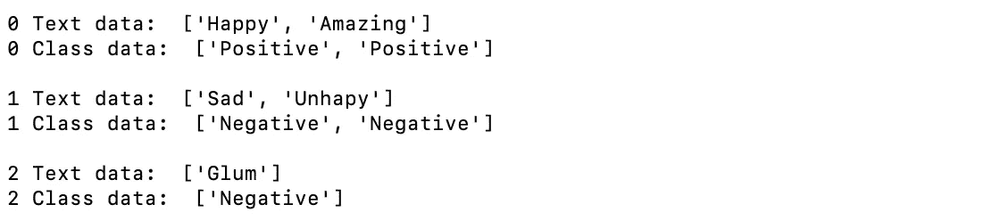

# 如何在 PyTorch 中为自定义文本数据使用数据集和数据加载器

> 原文：<https://towardsdatascience.com/how-to-use-datasets-and-dataloader-in-pytorch-for-custom-text-data-270eed7f7c00?source=collection_archive---------2----------------------->

## 在本教程中，您将学习如何使用 PyTorch 中的 DataLoader 创建自定义数据集并管理它。


来源:[https://thenounproject . com/term/natural-language-processing/2985136/](https://thenounproject.com/term/natural-language-processing/2985136/)

创建 PyTorch 数据集并使用 Dataloader 管理它可以保持数据的可管理性，并有助于简化您的机器学习管道。数据集存储所有数据，Dataloader 可用于迭代数据、管理批处理、转换数据等等。

# 导入库

```
import pandas as pd
import torch
from torch.utils.data import Dataset, DataLoader
```

**熊猫**对于创建数据集对象来说并不重要。然而，它是管理数据的强大工具，所以我打算使用它。

**torch.utils.data** 导入创建和使用数据集和数据加载器所需的函数。

# 创建自定义数据集类

```
class CustomTextDataset(Dataset):
    def __init__(self, txt, labels):
        self.labels = labels
        self.text = textdef __len__(self):
        return len(self.labels)def __getitem__(self, idx):
        label = self.labels[idx]
        text = self.text[idx]
        sample = {"Text": text, "Class": label}
        return sample
```

***类 custom text Dataset(Dataset):***创建一个名为‘custom text Dataset’的类，你可以随意调用这个类。传递给该类的是我们之前导入的数据集模块。

***def __init__(self，text，labels):*** 初始化类时需要导入两个变量。在这种情况下，变量被称为“文本”和“标签”，以匹配将要添加的数据。

***self.labels = labels&self.text = text:***导入的变量现在可以通过 self . text 或 self . labels 在类内的函数中使用

***def _ _ len _ _(self):***这个函数被调用时只返回标签的长度。例如，如果数据集有 5 个标签，那么将返回整数 5。

***def __getitem__(self，idx):*** 这个函数被 Pytorch 的 Dataset 模块用来获取一个样本，构造数据集。初始化时，它将循环通过这个函数，从数据集中的每个实例创建一个样本。

*   ***【idx】***传递给函数的是一个数字，这个数字就是数据集将要循环的数据实例。我们使用前面提到的 ***self.labels*** 和 ***self.text*** 变量与传入的' ***idx*** '变量来获取当前实例的数据。然后，这些当前实例被保存在名为“标签”和“数据”的变量中。
*   接下来，声明一个名为' ***sample*** '的变量，它包含一个存储数据的字典。这存储在由数据集中所有数据组成的另一个字典中。在用数据初始化这个类之后，它将包含许多标记为“文本”和“类”的数据实例。你可以把“文本”和“类”命名为任何东西。

# 初始化 CustomTextDataset 类

```
# define data and class labels
text = ['Happy', 'Amazing', 'Sad', 'Unhapy', 'Glum']
labels = ['Positive', 'Positive', 'Negative', 'Negative', 'Negative']# create Pandas DataFrame
text_labels_df = pd.DataFrame({'Text': text, 'Labels': labels})# define data set object
TD = CustomTextDataset(text_labels_df['Text'],                               text_labels_df['Labels'])
```

首先，我们创建两个名为 ***【文本】和【标签】*** 的列表作为例子。

**text_labels_df = pd。DataFrame({'Text': text，' Labels': labels}):** 这不是必需的，但是 Pandas 是一个用于数据管理和预处理的有用工具，可能会在 PyTorch 管道中使用。在本节中，包含数据的列表“文本”和“标签”保存在 Pandas 数据帧中。

***TD = custom text dataset(Text _ labels _ df[' Text ']，Text _ Labels _ df[' Labels ']):***这将使用传入的' Text '和' Labels '数据初始化我们之前创建的类。这些数据将成为该类中的“self.text”和“self.labels”。数据集保存在名为 TD 的变量下。

***数据集现已初始化，可以使用了！***

# 一些代码向你展示数据集内部发生了什么

这将向您展示数据是如何存储在数据集中的。

```
# Display text and label.
print('\nFirst iteration of data set: ', next(iter(TD)), '\n')# Print how many items are in the data set
print('Length of data set: ', len(TD), '\n')# Print entire data set
print('Entire data set: ', list(DataLoader(TD)), '\n')
```

***输出:***

*数据集的第一次迭代:{'Text': 'Happy '，' Class': 'Positive'}*

*数据集长度:5*

*整个数据集:[{'Text': ['Happy']，' Class': ['Positive']}，{'Text': ['Amazing']，' Class': ['Positive']，{'Text': ['Sad']，' Class': ['Negative']}，{ ' Text ':[' unhappy ']，' Class': ['Negative']}，{'Text': ['Glum']，' Class ':[' Negative ']]}]]]]]*

# 如何使用' ***collate_fn'*** 对数据进行预处理

在机器学习或深度学习中，需要在训练之前清理文本并将其转化为向量。DataLoader 有一个方便的参数叫做 ***collate_fn。*** 该参数允许您创建单独的数据处理函数，并在数据输出前将该函数内的处理应用于数据。

```
def collate_batch(batch): word_tensor = torch.tensor([[1.], [0.], [45.]])
    label_tensor = torch.tensor([[1.]])

    text_list, classes = [], [] for (_text, _class) in batch:
        text_list.append(word_tensor)
        classes.append(label_tensor) text = torch.cat(text_list)
     classes = torch.tensor(classes) return text, classesDL_DS = DataLoader(TD, batch_size=2, collate_fn=collate_batch)
```

例如，创建两个张量来表示单词和类。实际上，这些可能是通过另一个函数传入的单词向量。然后这个批处理被解包，然后我们将单词和标签 tensors 添加到列表中。

然后，单词张量被连接起来，类别张量的列表，在本例中为 1，被组合成单个张量。该函数现在将返回已处理的文本数据，准备用于训练。

要激活此功能，只需在初始化 DataLoader 对象时添加参数***collate _ fn = Your _ Function _ name***。

# 训练模型时如何循环访问数据集

我们将在不使用 ***collate_fn*** 的情况下遍历数据集，因为这样更容易看到 DataLoader 是如何输出单词和类的。如果上述函数与 ***collate_fn*** 一起使用，那么输出将是张量。

```
DL_DS = DataLoader(TD, batch_size=2, shuffle=True)for (idx, batch) in enumerate(DL_DS): # Print the 'text' data of the batch
    print(idx, 'Text data: ', batch['Text']) # Print the 'class' data of batch
    print(idx, 'Class data: ', batch['Class'], '\n')
```

***DL_DS = DataLoader(TD，batch_size=2，shuffle=True) :*** 这用我们刚刚创建的 Dataset 对象“TD”初始化 DataLoader。在本例中，批量大小设置为 2。这意味着当您遍历数据集时，DataLoader 将输出 2 个数据实例，而不是一个。有关批次的更多信息，请参见本文。Shuffle 将在每个时期重新排列数据，这将阻止模型学习训练数据的顺序。

***for (idx，batch)in enumerate(DL _ DS):***遍历我们刚刚创建的 DataLoader 对象中的数据。***【DL _ DS】***返回批次的索引号以及由两个数据实例组成的批次。

***输出:***



如您所见，我们创建的 5 个数据实例以 2 个为一批输出。因为我们有奇数个训练样本，所以最后一个样本在自己的批次中输出。每个数字— 0、1 或 2 代表一个批次。

# 完整代码