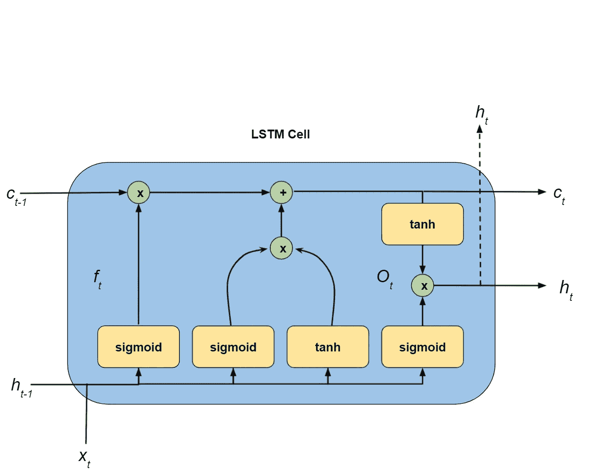
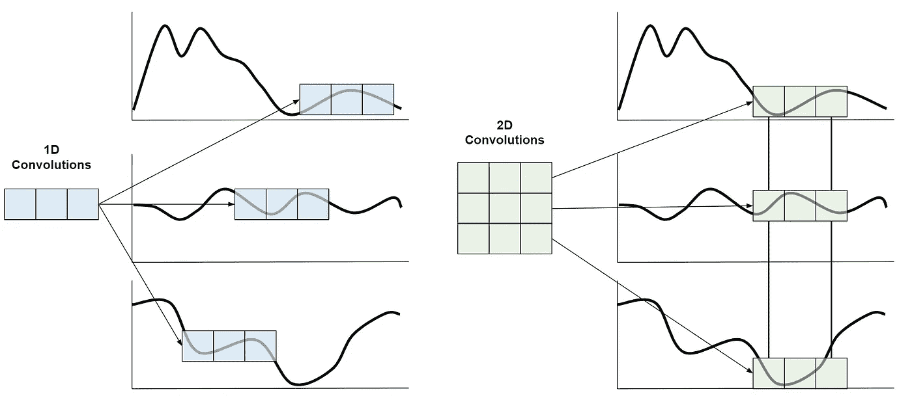

# 如何对时间序列数据使用深度学习

> 原文：<https://towardsdatascience.com/how-to-use-deep-learning-for-time-series-data-f641b1b41a96?source=collection_archive---------3----------------------->

## [实践教程](https://towardsdatascience.com/tagged/hands-on-tutorials)

## 了解时间序列深度学习的可用选项


由[埃里克·维特索](https://unsplash.com/@ewitsoe?utm_source=medium&utm_medium=referral)在 [Unsplash](https://unsplash.com?utm_source=medium&utm_medium=referral) 上拍摄的照片

关于机器学习和数据科学，ime 系列数据通常被单独归为一类。然而，由于分布随着时间和顺序测试而变化，数据科学的这一领域可能很难管理。

本文将介绍三种不同的深度学习模型，用于基于时序数据创建预测模型。第一个将是 LSTM，随后是两个具有一维卷积和二维卷积的 CNN。

我包含了代码块，这样您可以通过简单地更新正在使用的数据和调整参数来复制和重用这些代码。

**请随意将本页加入书签，以供将来参考。**

请注意，这些模型可能比时间序列预测所需的要多得多。然而，从简单的模型和 2D 表格数据开始，您可以对您可能期望的性能进行基准测试。

要将时间序列数据转换为 2D 数据，请在整个可用时间段或时间段的子集内进行聚合。这里不讨论其他选择，其中最常见的是自回归(AR)模型。

# 数据，数据，数据

任何精通数据的科学家都知道，数据争论、操作和全面的数据工程是数据科学家最耗时的任务。特别是有了机器学习和深度学习，这个任务就更复杂了。例如，与使用表格数据(基本熊猫数据框架或 2D 数字阵列中的数据)的模型相比，时间序列数据需要额外的维度才能使模型正常运行。

将数据处理成三维或四维的直接方法是**一次考虑一个实例**。这样，您可以一次查看一个实例的数据，以在进一步转换之前确认正确的信息(如标准时间间隔)。

```
X = []for i in instances:
    # ‘df’ is a 2D pandas dataframe or numpy array
    df = generate_instance(i) # Produce a single instance here
    X.append(df)X_3D = np.array(X)
X_4D = X_3D.reshape((X_3D.shape[0], X_3D.shape[1], X_3D.shape[2], 1))
```

对于每个实例，创建一个 2D 数据帧或 numpy 数组。该数据帧的列将包含特征，行代表单个实例的不同时间步长。

一次创建一个实例，并将它们添加到列表中。一旦每个数据帧都在一个列表中，就转换成一个 numpy 数组，然后轻松地将信息输入到下面的模型中。

请注意，每个实例必须具有相同的尺寸。如果它们不同，你会得到一些令人兴奋的错误。

对于二维卷积，数据必须有一个额外的维度。对于多元时间序列数据，这意味着使用 reshape 函数添加另一个维度。

# 模型的结构

这些模型使用“relu”或 sigmoid 激活函数以及最终输出的 sigmoid 激活。

对于这些模型，您可以调整卷积层数、内核大小、过滤器数量、学习速率、密集层中的节点数量、LSTM 单元数量、批量大小和池大小。

这里的模型被建立来处理使用多元时间序列数据的分类问题，并使用二元交叉熵作为它们的损失函数。此外，这些模型包括根据其发生率的比例类加权。最后用 Adam 优化对整个网络进行优化。

## T-CNN 模型:

两个 CNN 模型的结构遵循相似的格式:

1.  数据经过一系列一维或二维的卷积层。
2.  汇集层。合并后，输出被展平并连接到完全连接的图层。
3.  在完全连接的层之后，产生预测的概率。

## **LSTM 模式:**

1.  数据通过具有可变数量单元的 LSTM 单元。
2.  输出被展平并连接到完全连接的图层。
3.  在完全连接的层之后，产生预测的概率。

结构故意保持相似。因此，很容易只交换 CNN 和 LSTM 模型之间不同的第一层。

# 超参数和导入

```
from tensorflow.keras.models import Sequential
from tensorflow.keras.layers import LSTM, Dense, Flatten, Conv1D, Conv2D, MaxPooling1D, MaxPooling2D
from tensorflow.keras.optimizers import Adam, schedules, SGDKERNEL_SIZE = 2
POOL_SIZE = 2
N_FILTERS = 24
BATCH_SIZE = 128
LEARNING_RATE = 0.00001
DENSE_UNITS = 50
LSTM_UNITS = 50
EPOCHS = 100N_STEPS = X.shape[1]
N_FEATURES = X.shape[2]
class_weight = {0: 1., 1: 1/np.mean(y_train)}ACTIVATION_FUNC = ‘relu’
FINAL_ACTIVATION = ‘sigmoid’LOSS_FUNC = ‘binary_crossentropy’
METRIC = ‘accuracy’
OPTIMIZER = Adam(learning_rate=LEARNING_RATE)# Split you own data from X_3D or X_4D, and a target
X_train, y_train, X_val, y_val = None
X_test, y_test = None
```

这里有几件事需要注意。我认为数据的第一个维度是实例的数量，第二个维度是时间步长的数量，第三个维度是特征的数量。对于 2D 卷积模型的四维数据，第四维是“虚拟”维度，以便进行适当的处理。然而，其余的维度保持相同的解释。

**根据您为这些 Keras 型号使用的**后端，了解订购很重要。不幸的是，约定并不一致，这可能是您错误的来源。如果是这种情况，请考虑调整数据的形状，以更改维度的顺序。

我还特意将训练、校准和测试数据设置为“无”,以便您可以根据自己的喜好调整数据分割。在拟合期间，校准集用于评估模型。

关于如何为不同类型的问题和训练模型分离数据的更多细节，你可以阅读这篇文章:

</how-to-select-a-data-splitting-method-4cf6bc6991da>  

# **长短期记忆模型**

长短期记忆模型(LSTM)是递归神经网络(RNN)的一种变体。这些模型由多个通道组成，数据可以通过这些通道来维护以前步骤中的信息，以便在将来的步骤中使用。

此处显示的预测模型中使用的 LSTM 单元遵循相同的结构。乍一看，它们看起来很复杂，但通过一些观察可以直观地解释。

穿过 LSTM 单元有两条主要路径；这些大致可以解释为短时记忆和长时记忆。短期是通过单元的底部路径，长期是通过单元的顶部路径。



LSTM 细胞(作者照片)

对于短期记忆，注意输入是如何被引导到这条路径的。正如人们对短期记忆的预期，模型与新数据 Xt 和上一步的输出相互作用。然后，该数据在单元中有几个可能的路径。

长期记忆是沿着细胞顶部的路径。这条路径有来自先前长期记忆输出的输入。然后通过细胞，基于来自几个不同通道的更新来更新长期记忆。

从短期到长期，LSTM 细胞的不同路径通过所使用的激活函数和中间输出的组合来最清楚地区分。

请务必注意，sigmoid 函数用于某些路径，双曲正切函数用于其他路径。这个选择是有意义的。这里的重要观察结果是，sigmoid 函数的输出为 0 到 1。相比之下，双曲正切函数的输出是-1 比 1。

*现在，为什么会有区别呢？*

在短期和长期记忆路径之间的第一个通道中，激活是 sigmoid 函数，这意味着输出在 0 和 1 之间。因此，这条路径决定了当前步骤的输入是否对长期记忆更重要。如果这个输出是零，那么这个输出和前一个长期记忆输出之间的最终乘积为 0。另一方面，如果这个输出更接近于 1，那么先前的长期记忆会持续。

第二和第三通道分别使用 sigmoid 和双曲线正切激活。这种组合作为一个两步过程，根据双曲正切函数的-1 到 1 输出来确定当前信息是否相关，以及它的贡献是正还是负。细胞的这一部分基本上回答了这两个问题。然后将当前时间步长对长期记忆的贡献添加到长期记忆中。

最终路径结合了当前时间步长和包含在长期记忆路径中的当前理解。这条通路的输出成为下一个 LSTM 细胞的输出。

## LSTM 模型的设置

```
model = Sequential()model.add(
    LSTM(LSTM_UNITS, activation=ACTIVATION_FUNC, 
         input_shape=(N_STEPS, N_FEATURES) 
))
model.add(Flatten())
model.add(Dense(DENSE_UNITS, activation=ACTIVATION_FUNC))
model.add(Dense(1, activation=FINAL_ACTIVATION))model.compile(
    optimizer=OPTIMIZER,
    loss=LOSS_FUNC,
    metrics=[tf.keras.metrics.AUC(), METRIC]
)
```

# **卷积神经网络**

卷积网络是深度学习中最复杂的模型之一；它们通常由许多不同的层组成，并且这些层可以有不同的行为。

与具有全连接层的标准神经网络相比，卷积神经网络使用卷积层、汇集层和全连接层。一些先进的模型甚至使用了这些层越来越复杂的变化。

卷积神经网络 CNN 通常与图像和视频机器学习应用相关联，因为它们能够有效地捕捉像素之间的关系，并建立开放的这些关系以模拟日益复杂的结构。

在其核心，这些网络依靠其卷积层来有效地捕捉邻近像素之间的关系。然而，这种架构不限于多维图像。例如，很容易将时间序列数据转换成与 CNN 一致的格式。

您还可以使用卷积来模拟时间序列中不同步骤之间的交互。与图像相反，一维卷积可以模拟先前和未来时间步骤的行为，以从系列中捕捉复杂的关系。

一些一维卷积非常常见，你可能在不知道的情况下使用过它们。**例如，移动平均是一种卷积**类型，其中每一步的权重相等。所以，粗略地说，你可以把一维卷积看作不同长度的移动平均。周期中的每个时间步长的权重不同。



卷积比较(作者供图)

# 1D 卷积—时间序列 CNN

```
model = Sequential()
# Add one or more convolutional layers
model.add(Conv1D(filters=N_FILTERS, kernel_size=10, activation=ACTIVATION_FUNC))model.add(MaxPooling1D(pool_size=2))
model.add(Flatten())
model.add(Dense(DENSE_UNITS, activation=ACTIVATION_FUNC))
model.add(Dense(1, activation=FINAL_ACTIVATION))
model.compile(
    optimizer=OPTIMIZER, 
    loss=LOSS_FUNC,
    metrics=[tf.keras.metrics.AUC(), METRIC]
)
```

当你有多个时间序列时，一维卷积仍然是可能的；但是，使用二维卷积组合不同的序列可以捕获更复杂的关系。

这些高维卷积**捕捉不同时间序列**之间的关系。

# **2D 卷积——时间序列 CNN**

```
model = Sequential()
# Add one or more convolutional layers
model.add(Conv2D(
    filters=N_FILTERS,
    padding=”same”,
    kernel_size=(2,2),
    activation=ACTIVATION_FUNC,
    input_shape=(N_STEPS, N_FEATURES, 1)),
)model.add(MaxPooling2D(pool_size=2))
model.add(Flatten())
model.add(Dense(DENSE_UNITS, activation=ACTIVATION_FUNC))
model.add(Dense(1, activation=FINAL_ACTIVATION))model.compile(
    optimizer=OPTIMIZER,
    loss=LOSS_FUNC,
    metrics=[tf.keras.metrics.AUC(), METRIC]
)
```

# **拟合模型**

为了训练每个模型，您可以使用以下相同的代码块。因为模型被假定为分类器，所以拟合包括类别权重。在大多数情况下，职业并不是完全平衡的，所以这个增加考虑到了这一点。

```
model.fit(
    X_train, y_train, epochs=EPOCHS,
    verbose=1, class_weight=class_weight,
    batch_size=BATCH_SIZE,
    validation_data=(X_val, y_val),
)
```

# **结论**

时间序列问题有许多活动部分。然而，许多其他简单得多的模型也可以用于合理程度的性能。

当从多变量时间序列数据中创建分类器(或回归器)时，我还忽略了一些更多涉及时间的部分。两个最重要的是:

*   当时间步长不一致时会发生什么，以及如何标准化数据和处理差距。
*   深度学习模型架构如何优化，不是所有的模型都是生而平等的。虽然您可能不需要 100 层的网络，但您仍然可以从一些调整中受益。

然而，使用多元时间序列数据构建模型可能是一项令人愉快的任务。它迫使您不要将所有数据都视为可用于 scikit-learn 模型的表格数据。这些模型非常灵活，可以捕捉复杂的时间相关关系。你应该将它们添加到你现有的车型库中。

*如果你有兴趣阅读关于新颖的数据科学工具和理解机器学习算法的文章，可以考虑在 Medium 上关注我。*

*如果你对我的写作感兴趣，想直接支持我，请通过以下链接订阅。这个链接确保我会收到你的会员费的一部分。*

<https://zjwarnes.medium.com/membership> 