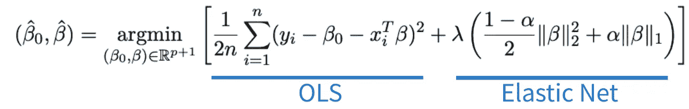
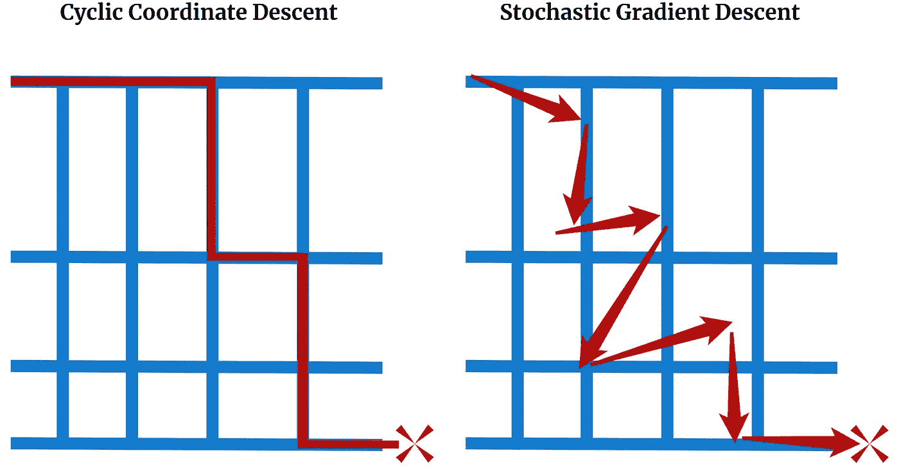
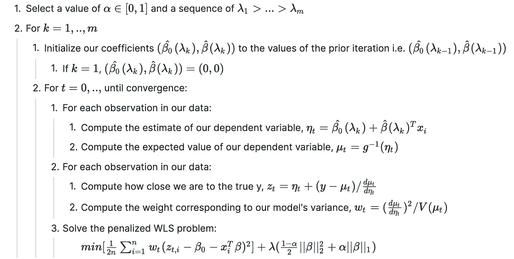

# 如何对任意 GLM 使用弹性网正则化

> 原文：<https://towardsdatascience.com/how-to-use-elastic-net-regularization-with-any-glm-6eab524bbcc6?source=collection_archive---------11----------------------->

## [思想和理论](https://towardsdatascience.com/tagged/thoughts-and-theory)

## 斯坦福研究人员开发的新算法及其在 r。

广义线性模型(GLMs)是使用最广泛的推理建模技术之一。它们的简单性使它们易于解释，因此当向利益相关者传达因果推理时，它们是非常有效的工具。

弹性网正则化是一种广泛使用的正则化方法，是与 GLMs 的逻辑配对-它删除了不重要和高度相关的特征，这些特征会损害准确性和推断性。这两种方法是任何数据科学工具包的有用部分。


[JESHOOTS.COM](https://unsplash.com/@jeshoots?utm_source=medium&utm_medium=referral)在 [Unsplash](https://unsplash.com?utm_source=medium&utm_medium=referral) 上拍照

在 2021 年 3 月之前，GLMs 和弹性网正则化的组合相当复杂。然而，斯坦福大学的研究人员发表了一篇论文，利用循环坐标下降允许有效计算任何链接函数的模型系数，而不仅仅是简单的链接函数。他们还在著名的 R 包 *glmnet 中实现了这个模型。*

在这篇文章中，我们将讨论 GLMs 的基本原理，弹性网络正则化，并了解这两者如何协同工作。让我们开始吧…

# 技术 TLDR

在 R 中， *glmnet* 包现在支持所有的链接函数族。如果您的链接是规范的，将一个字符串传递给`family`参数。如果没有，则传递一个家族函数。请注意，您可以查看文档以获得受支持的规范函数的列表。

在后端，这个包有两个主要的变化…

1.  **用 OLS 求解器替代最大似然法。**注意，这仅适用于非规范链接函数——规范链接仍使用 OLS 求解。
2.  **用迭代加权最小二乘法(IRLS)求解。需要 IRLS(也称为费希尔评分),因为不保证最大似然是凹的。**

# 好的，我想我明白了。但是这种新方法实际上是如何工作的呢？

让我们慢一点，从 GLM 实际工作方式开始。

## 什么是广义线性模型(GLM)？

GLM 是一个相当简单的概念，从 20 世纪 70 年代就有了。随着大数据的兴起，它们已经成为开发推理模型的宝贵工具，即，为我们的数据提供统计有效结论的模型。

为什么你会问？

嗯，GLM 的只是带有额外技巧的线性回归:链接函数。链接函数的目的是转换我们的因变量，以便线性模型能够更好地拟合。

让我们看一个简单的例子。


图 1:使用日志链接功能的 OLS 对 GLM。图片作者。

在图 1 的顶部，我们有一条由 GLM 拟合的指数曲线，没有连接函数。是的，这只是简单的线性回归。不是很合适，对吧？

因为我们知道数据大致遵循指数分布，所以我们使用带有*对数*链接函数的 GLM，并观察到更好的拟合(下图)。

从推理的角度来看，使用 GLM 拟合数据的主要好处是我们可以像线性回归一样解释系数。因此，在我们的例子中，X 的一个单位的变化导致 *y* 的*自然对数*的 1.007 的变化。如果您想更进一步，查看给定的 *x* 的 *y* 的原始单位，我们可以取对数的倒数 *exp(1.007 * x)* ，以获得 *x* 的任意值的拟合 *y* 。

很有用吧？

现在，GLM 链接函数的选择取决于因变量的结构。在上面的例子中，我们的数据是连续的，看起来是指数型的，所以我们使用了对数分布。如果是整数数据，我们会使用泊松分布。如果它是连续的并且大致呈正态分布，我们将使用高斯(又名正态)分布。个人最喜欢的是 Tweedie 分布，它本质上是一种泊松分布，允许许多 0 值。

## 什么是弹性网正规化？

现在我们已经了解了 GLM 的，让我们看看这篇文章的主人公，弹性网正规化。

任何类型的正则化的目的是去除无用预测值的影响。此外，弹性网络正则化也不例外— **它移除了高度相关且不会提高我们模型准确性的预测因子。**

因此，让我们假设我们正在寻找一个 GLM 来模拟股票价格(顺便说一下，这可能不是一个好主意)。我们的因变量是能源行业 ETF*XLE*的价格。我们的独立预测变量是:

*   *星期几*
*   *前一天 XLE 的价格*
*   *前两天 XLE 的价格*
*   前两天你衬衫的颜色

如果你用这些预测值来拟合价格，我们会认为一周中的*天，昨天的 XLE 价格，*和*两天前的 XLE 价格*会高度预测今天的价格。遗憾的是，你的衬衫颜色对价格没有影响，因此弹性网会将我们的系数缩小到 0。

但是，我们有一个问题。如果我们观察昨天和两天前的价格之间的相关性，我们会注意到高共线性。共线性会阻止模型收敛并降低我们系数的可解释性，因此 elasitc net 发现了这一点，并降低了两天前的*价格的系数。*

第一种方法是通过将系数缩小到零来去除不重要的系数，这种方法称为拉索(或 L1)正则化。第二种方法是减少与其他预测因子相关的预测因子的系数大小，称为岭回归(或 L2 正则化)。

这两个组件协同工作被称为弹性净回归。

## 弹性网正则化的数学

随着一些直觉的发展，让我们看看 OLS 线性回归的弹性网的数学定义。



图 2:弹性网正则化公式。图片作者。

在图 2 中，我们可以看到，我们正在寻找能够最大限度降低方括号中值的模型系数。左边是 OLS 项，它计算误差平方和。在右边，我们有我们的弹性网正则化项。让我们快速定义一下这些变量…


稍微研究一下这个方程后，我们会注意到α是一个非常重要的参数。实际上，我们只允许 alpha 取 0 到 1 之间的值。因此，如果α= 0，L1 项抵消，我们最终得到岭回归。相反，如果α= 1，L2 项抵消，我们得到套索。

通常，我们希望获得岭和套索的好处，因此α-大约 0.5 既可以将系数缩小到零，又可以利用岭回归的系数缩减能力。

很酷，对吧？

最后一点:lambda 不是用户指定的参数。相反，用户指定一个 lambdas 范围，而弹性网试图确定最佳的一个。这里，lambda 完全控制偏差-方差权衡。如果 lambda 很大，我们会进行更多的正则化，从而创建一个低偏差/高方差模型。如果 lambda 为 0，我们将减少正则化并专注于准确性，从而创建高偏差/低方差模型。

这就是你要的——简而言之，弹性网络正则化。

## 为什么弹性网对所有的链接功能都不起作用？

正如您可能想象的那样，能够将弹性网络正则化应用于许多不同类型的链接函数是非常有用的。然而，直到最近，还有一些复杂的解决方法来让弹性网络与某些链接功能一起工作。但是斯坦福大学的研究人员取得了突破，他们一直在 R(编程语言)中率先使用 GLMs，他们开发了一种新方法，允许弹性网络为所有链接函数工作。

简而言之，OLS 最小化适用于*规范*的链接函数。在这种情况下，锥形意味着链接函数具有某些保证其形状为凹形的性质(想想抛物线，如 *x* )。其他更复杂的链接函数不一定有**常数**和**正**二阶导数，因此它们的形状可能会不规则，这使得找到全局最小值更加困难。

# 解决方案

新方法巧妙地避开了 OLS，而是利用了最大似然估计(MLE)，这是另一种流行的拟合标准。最大似然法的缺点是它需要一个分步求解器——我们必须迭代地测试值，直到我们达到一个足够最优的解。最重要的是，MLE 并不总是保证全局最小值，所以从技术上讲，我们可能会错过一组更好的系数。

但是，在实践中，MLE 产生了稳健的结果。

## R 中的解

如前所述，研究人员致力于提高 R 处理所有类型链接函数的能力。著名的 *glmnet* 包已经更新，支持规范和非规范链接函数。

但是，你怎么知道你的链接函数是否规范呢？

好吧，如果你的链接函数是*高斯，二项式，泊松，多项式，考克斯，*或者*高斯，*它是正则的。现在这不是一个完整的列表，但是这些是目前由 *glmnet* 支持的规范链接。

**在编码方面，如果你的函数在那个列表中，你可以把链接函数族作为一个字符串传递。如果不是，你需要传递一个家族函数。**参见下面的例子:

```
library(glmnet)# canonical exmaple - pass gaussian string
fit <- glm(y ~ x, family = **"gaussian"**)# non-canonical exmaple - pass quasi-poisson function
fit <- glm(y ~ x, family = **quasipoisson()**)
```

有了这次更新，我们现在可以选择任何最能代表我们数据的分布，不管它有多复杂。如果我们觉得有创意，我们甚至可以创造一些新的链接功能。

## 但是这个解决方案实际上是如何工作的呢？

新的优化算法使用了一种叫做*循环坐标下降*的方法。与基于梯度的优化不同，基于梯度的优化通过模型的导数(如随机梯度下降)来计算“山”，坐标下降使用原始数据。从那里，它沿着这些坐标移动，寻找全局最小值。

概念化这两者之间的区别的一个方法是通过思考旧金山这个城市。它有许多山丘，代表我们的特征空间。山的高度是我们的模型拟合的估计值，纬度和经度是正在优化的两个特征。

循环坐标下降使用旧金山的道路来寻找最低点，其中每条道路代表我们变量的不同组合。另一方面，梯度下降完全忽略了道路，只是以最陡的坡度下山。



图 3:循环坐标下降与随机梯度下降。图片作者。

循环坐标下降的好处是你不需要根据模型的导数计算一个完整的梯度，这对于某些链接函数是不可能的。

为了完整起见，我们将在这里讨论优化算法。这将是技术性的，所以请随意跳到实现说明和注释。

本文中标记为*算法 1* 的主要算法如下:



这里面有很多，但是让我们快速总结一下。在初始化了一组可能的λ值后，我们遍历每个值，并尝试最小化该值的损失，搜索最佳的λ值。然而，因为我们使用最大似然法而不是 OLS，我们需要使用循环坐标下降法。然后，我们希望在最后一步中最小化加权最小二乘(WLS)表达式，这涉及到另一个类似的算法。

我发现只盯着算法是有帮助的，但是如果你对细节感兴趣，可以看看论文的第 2.3 节。

# 实施说明

*   当运行弹性网正则化时，通常我们要同时使用套索和脊。所以，最好尝试不同的α值，看看保留了哪些变量。如果你想要优化，使用交叉验证来找到 alpha 的最佳值是一个好主意。
*   选择一个好的连接函数对于模型的准确性和稳定性至关重要。
*   选择更“高级”的链接功能可以节省时间。一个例子是使用特威迪分布而不是零膨胀泊松分布——如果我知道特威迪分布，我可以在论文上节省很多时间。
*   通常最好将预测值标准化，这样它们的范围就不会影响您的变量选择。z 分数也非常容易解释，如果需要，可以转换回原始单位。
*   R 中的 *glmnet* 包为 GLMs 的易用性铺平了道路。大多数其他语言落后于这个包几个发布版本，但是希望很快会有一个支持所有链接功能的 python 库。

*感谢阅读！我将再写 44 篇文章，将“学术”研究引入 DS 行业。查看我关于使用 GLMs 进行推理建模的链接/想法的评论。*