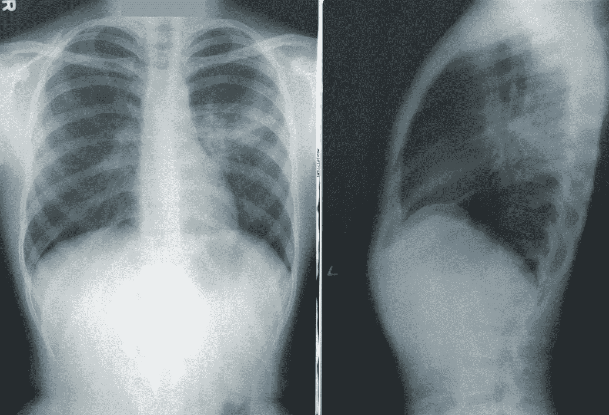
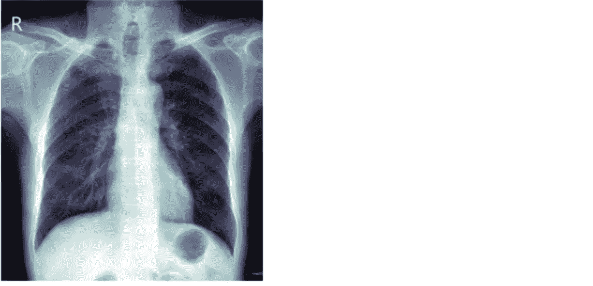
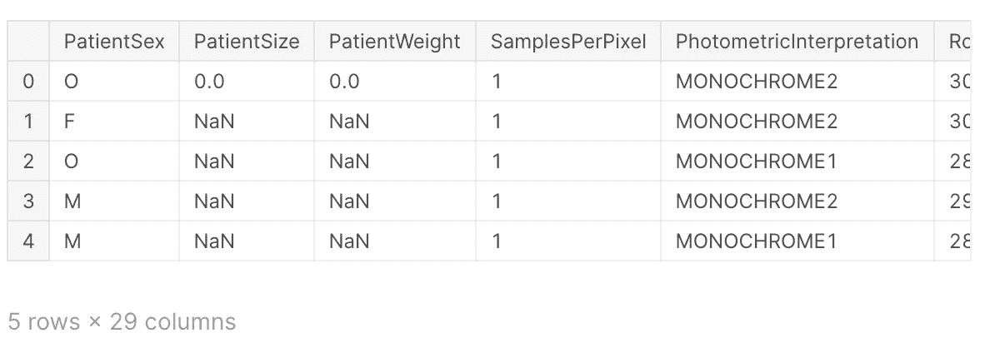

# 如何使用 fastai 评估 DICOM 医学文件

> 原文：<https://towardsdatascience.com/how-to-use-fastai-to-evaluate-dicom-medical-files-738d7f7bc14d?source=collection_archive---------25----------------------->

开始 Kaggle 医学竞赛



机器学习意味着你可以像放射科医生一样*看东西——*📸[*疾控*](https://unsplash.com/photos/NMZdj2Zu36M)

Kaggle 竞赛可能会非常激烈，仅仅获得领域知识就需要做大量的前期工作。

我有相当多使用 fastai 的经验，现在，这并不意味着我总是在最后的比赛中使用它，但它是一个快速原型化和学习数据集的伟大工具。

本文将向您展示一些有用的技巧，帮助您快速了解 DICOM 医学文件及其相关数据。这篇文章不会包含所有的代码，这些代码在 Kaggle 上与大家分享。所以我会在这里添加一些片段，但会把你[指向 Kaggle](https://www.kaggle.com/crained/vinbigdata-fastai-get-started) 上的完整笔记本。还用了[惊艳](https://docs.fast.ai/tutorial.medical_imaging.html) fastai [医学影像教程学习](https://docs.fast.ai/tutorial.medical_imaging.html)。

你可能会问自己的第一个问题(或者如果你在谷歌搜索“fastai dicom 文件”就不会问):什么是 dicom 文件？

# 什么是 DICOMs？

**DICOM** 代表(**D**I**I**maging 和**CO**communications in**M**edicine)并且是事实上的标准，其建立了允许医学图像(X 射线、MRI、CT)和相关信息在来自不同供应商、计算机和医院的成像设备之间交换的规则。DICOM 格式提供了一种合适的方法，该方法符合医疗信息交换(HIE)标准和 HL7 标准，HIE 标准用于在医疗机构之间传输与健康相关的数据，HL7 标准是使临床应用能够交换数据的消息标准

DICOM 通常与一个`.dcm`扩展名相关联。DICOM 文件真正令人惊奇的地方在于，它们提供了一种以单独的“标签”存储数据的方式，例如患者信息以及图像/像素数据。DICOM 文件由打包成一个文件的标题和图像数据集组成。

这是我们了解 fastai 如何让您快速查看存储在`.dcm`文件中的信息的好机会。如果你习惯使用 fastai，你会熟悉一些导入，但是要注意医疗导入。这对处理 DICOM 文件很重要。

```
from fastai.basics import *****
from fastai.callback.all import *****
from fastai.vision.all import *****
from fastai.medical.imaging import *****

import pydicom

import pandas **as** pd
```

我使用的数据集在 Kaggle 上: [VinBigData 胸部 x 光异常检测](https://www.kaggle.com/c/vinbigdata-chest-xray-abnormalities-detection)。这是一场有趣的比赛；你可以阅读 Kaggle 上的信息了解更多。作为一个简单的教程，您将在下面看到我访问该文件的代码。该结构非常简单，有一个父文件夹“vinbigdata-胸部-x 射线-异常-检测”,以及包含 DICOM 图像的训练路径:

```
path = Path('../input/vinbigdata-chest-xray-abnormalities-detection')
train_imgs = path/'train'
```

接下来，您可以设置您的图像，以便可以阅读。

```
items = get_dicom_files(train_imgs)
```

Pydicom 是一个 python 包，用于解析 dicom 文件，使访问 DICOM 文件头以及将原始 pixel_data 转换为 python 结构变得更加容易。fastai.medical.imaging 使用 pydicom.dcmread 加载 dicom 文件。

要绘制 X 射线，我们可以在项目列表中选择一个条目，并用 dcmread 加载 DICOM 文件。在这里，我们可以编写一行简单的代码来查看与 dcm 文件相关的有趣的、有潜在价值的数据。

```
#add any number here to pick one single patient 
patient = 3xray_sample = items[patient].dcmread()
```

现在我们可以在 dicom 文件中查看标题元数据。

```
xray_sampleOutput:Dataset.file_meta -------------------------------
(0002, 0000) File Meta Information Group Length  UL: 160
(0002, 0001) File Meta Information Version       OB: b'\x00\x01'
(0002, 0002) Media Storage SOP Class UID         UI: Digital X-Ray Image Storage - For Presentation
(0002, 0003) Media Storage SOP Instance UID      UI: 7ecd6f67f649f26c05805c8359f9e528
(0002, 0010) Transfer Syntax UID                 UI: JPEG 2000 Image Compression (Lossless Only)
(0002, 0012) Implementation Class UID            UI: 1.2.3.4
(0002, 0013) Implementation Version Name         SH: 'OFFIS_DCMTK_360'
-------------------------------------------------
(0010, 0040) Patient's Sex                       CS: 'M'
(0010, 1010) Patient's Age                       AS: '061Y'
(0028, 0002) Samples per Pixel                   US: 1
(0028, 0004) Photometric Interpretation          CS: 'MONOCHROME2'
(0028, 0010) Rows                                US: 2952
(0028, 0011) Columns                             US: 2744
(0028, 0030) Pixel Spacing                       DS: [0.127, 0.127]
(0028, 0100) Bits Allocated                      US: 16
(0028, 0101) Bits Stored                         US: 14
(0028, 0102) High Bit                            US: 13
(0028, 0103) Pixel Representation                US: 0
(0028, 1050) Window Center                       DS: "8190.0"
(0028, 1051) Window Width                        DS: "7259.0"
(0028, 1052) Rescale Intercept                   DS: "0.0"
(0028, 1053) Rescale Slope                       DS: "1.0"
(0028, 2110) Lossy Image Compression             CS: '00'
(0028, 2112) Lossy Image Compression Ratio       DS: "2.0"
(7fe0, 0010) Pixel Data                          OB: Array of 5827210 elements
```

这里有很多信息，好消息是有一个很好的资源可以了解更多信息:

[http://DICOM . NEMA . org/medical/DICOM/current/output/chtml/part 03/Sect _ c . 7 . 6 . 3 . html # Sect _ c . 7 . 6 . 3 . 1 . 4](http://dicom.nema.org/medical/dicom/current/output/chtml/part03/sect_C.7.6.3.html#sect_C.7.6.3.1.4)

最后，你可以看到一张真正的 x 光片。

```
xray_sample.show()
```



还记得上面那些看起来很有趣的元数据吗？你可能想知道如何让它变得有用？好消息是，你可以把这些数据放到一个数据框架中。

作为一个小提示。我将在下面添加两个版本的代码。一个用于 Google Colab 和[点击链接查看更复杂的 Kaggle](https://www.kaggle.com/crained/vinbigdata-fastai-get-started) 版本。任何使用过 Kaggle 的人都知道，有时候你必须做一些改变才能让事情正常进行。

以下是将元数据放入数据帧的简单方法:

```
dicom_dataframe = pd.DataFrame.from_dicoms(items)dicom_dataframe[:5]
```

我将在下面添加一个截图，因为数据是 29 列，将离开页面。



希望这能对你们中的一些人有所帮助。接下来，我将设置边界框来检测 x 射线中的各种疾病。

如果有人在 fastai 和/或医学数据方面做了什么了不起的事情，我想听听！请在下面的回复中让每个人都知道你创造了什么，或者随时在 LinkedIn 上联系。