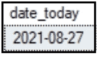
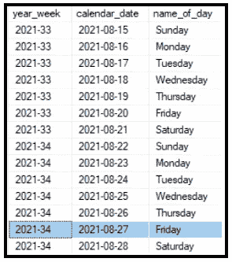
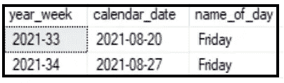
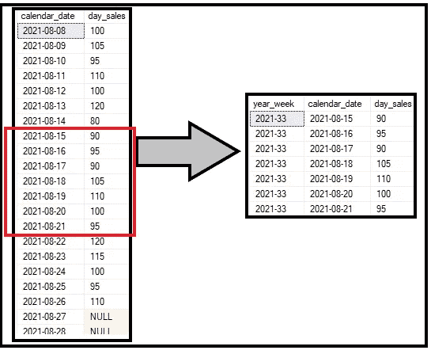
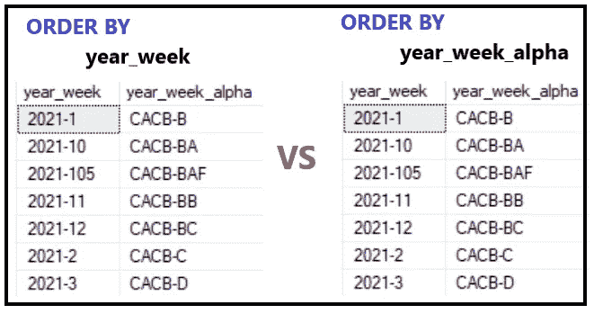

# 如何在报告中使用 GETDATE()

> 原文：<https://towardsdatascience.com/how-to-use-getdate-for-reports-d8cdc504a261?source=collection_archive---------33----------------------->

## 不再需要手动调节！

照片由 Manavita S via Unsplash 拍摄

> 只需复制并粘贴这个查询，转到 WHERE 子句，将其更改为上周，然后运行它。这很简单！”—一些你可能认识的人

每天/每周/每月手动更改查询中的值可能会非常痛苦。这也为人为错误打开了大门。我们将回顾 SQL 的 GETDATE()函数的强大功能，如何将它包含在查询中(例如，也许您有一个总是上周数据的报告)，以及非常重要的是，如何避免日期/周范围的一些问题。

# 这东西到底有什么用？

和所有工具一样，理解一个函数的作用是非常有帮助的。今天的日期是 2021 年 8 月 27 日。让我们看看运行一个 GETDATE 会给我们带来什么(格式为' yyyy-MM-dd '):

作者照片

它会得到执行的日期。当你在《第六感》中发现布鲁斯·威利斯一直都死了的时候，你可能不会有那种惊天动地的震惊……但也很接近了。

# 自动化上周的报告

因此，假设您每周一都有需要提取的数据。该报告只包括前一周的数据。不包括上周或部分当前周之前的周。

为此，你需要一些日历表。在其中，理想情况下，您将拥有一个一年一周的组合列。请在年和周之间包含某种分隔符。如果你的公司还没有这个，我假设你正在你自己的电脑/手机上阅读这篇文章，因为你的公司可能还没有电脑。

现在，很明显，查看今天的日期不会给出我们所说的上周的信息。让我们来看一个表格，其中包含本周和上周的“日历日期”和“年份周”列。

作者照片

# GETDATE() — 7？

您可能习惯于使用 DATEADD 函数，其中一个参数是数字，另一个参数是间隔类型(年、日等)。).当使用 GETDATE 时，你可以简单地说“-7”来获得一周前的日期。现在让我们看看当我们从“calendar_table”中选择 GETDATE()和 GETDATE( ) — 7 时会得到什么。

作者照片

假设我们在星期一运行它。在本例中，我们可以选择 2021–08–16 作为上周的星期一，并提取“year_week”等于“calendar_table”中的值的所有数据，在本例中也是“2021–33”。如果我们在周日运行，上周周日的“year_week”将是我们要使用的变量，仍然是“2021–33”。周六也可以。你明白了。事情正在好转。

> 我们在赚钱，恰恰，恰，恰。我们在赚钱，恰恰，恰，恰。我们在赚钱，恰恰，恰，恰。恰恰，恰，恰，恰，恰，恰，恰，正！—帕梅拉·普金

# 齐心协力

有多种方法可以做到这一点。我们可以使用子查询来选择“year_week ”,并将该子查询放在 WHERE 子句中。我们可以将需要的日期内联。我们甚至可以创建一个变量来存放这个值。

对于这个例子，我推荐使用变量 route，因为当您开始进入更多的临时表、CTE 或子查询以引入多个表时，命名一个变量并将其包含在每个表的 WHERE 子句中可以节省时间。从长远来看，它还减少了代码行数。

现在我们有了“daily_sales”表，我们只想提取上周的行。下面是结果，后面是代码，最后是使用“year_flag”列的有用信息。

作者照片

注意，例如，如果我们想要包含一个滚动的 6 周期间，我们可以创建两个变量。另一个变量可以设置为 GETDATE 之前的不同天数。然后，我们可以在两个“year_week”值之间提取行。

# 为什么前导零很重要？

当创建这个“year_week”列时，非常需要使用一个前导 0 来表示一位数的周。本质上，这些值将像字母一样被读取，0 =A，1 = B，等等。按字母顺序思考这个问题，我们可以看到如果没有前导 0，拉取和排序结果会是什么样子。在本例中，我们提取了“2021–1”和“2021–3”之间的值。

请注意，第 10 周、第 105 周(只是为了展示)、第 11 周和第 12 周都包括在内。在我们的“日历表”中，我们只有第 1–12 周(加上 105 周)。不包括 13 周以上。如果是这样的话，10 到 29 之间的所有星期都会出现。第 30 周不会出现，因为那是 D 后面的 DA。

作者照片

在本例中，我们可以看到，如果我们按“year_week”或“year_week_alpha”排序，我们会得到相同的结果。

# 天空是无限的！

我们不仅限于按天或按周划分范围。我们可以发挥创意，使用季度或年度。我们可以设置像年初至今这样的事情。

我们甚至可以使用一些规则，比如“总是在输出中包括至少 10 周(如果需要的话，返回到上一年)，但是在新的一年的第 10 周之后，然后包括本年度的所有周并删除去年的周”。当新的一年开始，人们不希望在 Power BI 报告中看到可视化的一周的数据时，类似这样的东西会很有帮助。

关于连接和联合的更多信息，请查看这篇更详细的文章。一如既往，有趣的可视化和超级爸爸笑话包括在内。

# 最后的想法

SQL 是一个强大的工具，它让生活变得更加简单。如果使用得当，它可以节省大量时间。当使用常规查询时，GETDATE()函数是一个包裹在温暖的小狗模糊闪光云中的祝福。

这是我们今天的课。一如既往，继续学习！