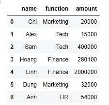
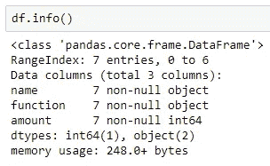
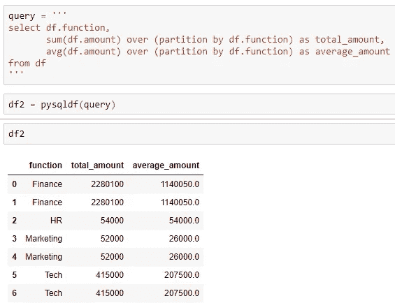
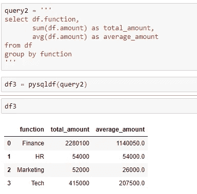
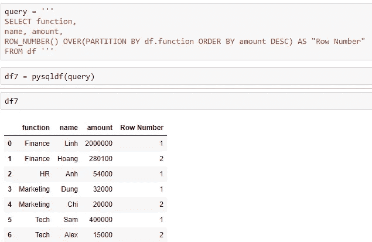
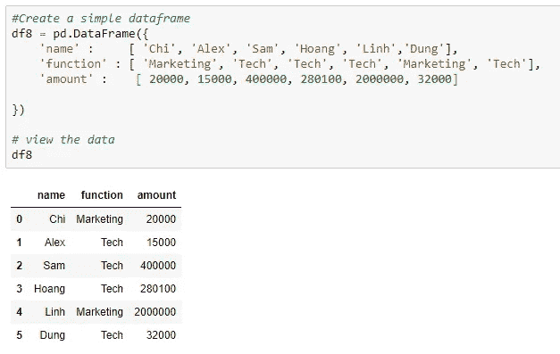
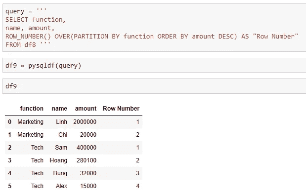
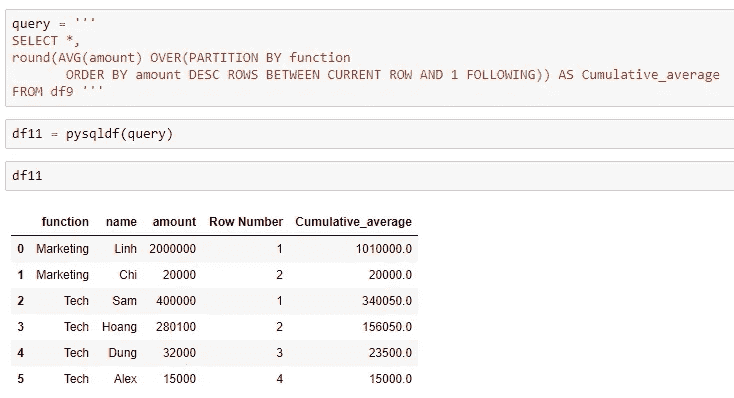

# 如何在 SQL 中使用 Group By 和 Partition By

> 原文：<https://towardsdatascience.com/how-to-use-group-by-and-partition-by-in-sql-f3d241846e3e?source=collection_archive---------3----------------------->


马库斯·斯皮斯克在 [Unsplash](https://unsplash.com?utm_source=medium&utm_medium=referral) 上的照片

# **简介**

当我第一次学习 SQL 时，我有一个问题，就是如何区分通过划分的**和通过**分组的**，因为它们都有一个用于分组的函数。相信很多开始接触 SQL 的人可能都会遇到同样的问题。因此，在这篇文章中我想和你分享一些使用 **PARTITION BY** 的例子，以及它和 **GROUP BY** 在 select 语句中的区别。**

# 探测

## 抽样资料

首先，我创建了一个包含 4 列的简单数据集。下面的 ***df*** 表格描述了不同职能部门的每位员工在公司旅行中会携带的金额和水果种类。



图 1: 测向表



图 2:测向信息

## **分区由 vs 组由**

下面是 **Partition By:** 的语法

```
SELECT expression 1, expression 2, ...
aggregate function () 
OVER (PARTITION BY expression 1 order_clause frame_clause)
FROM table
```

当我们想要在特定的列上进行聚合时，我们可以应用带有 **OVER** 子句的 **PARTITION BY** 子句。让我们看看下面的例子，看看数据集是如何转换的。



图 Partition By 子句的输出

在示例中，我想计算每个函数为旅行带来的总收入和平均收入。截图中可以看到的是我通过查询**分区的结果。**

现在，如果我在上面的例子中使用 **GROUP BY** 而不是 **PARTITION BY** ，结果会是什么样子？

首先， **GROUP BY** 的语法可以写成:

```
SELECT expression 1, expression 2
aggregate function ()
FROM tables
WHERE conditions
GROUP BY expression 1, expression 2
```

当我将它应用到查询中以查找每个函数中的总金额和平均金额时，聚合输出类似于由子句划分的**分区。然而，正如您所注意到的，图 3 的*和图 4 的*结果有所不同。**



图 Group By 子句的输出

*   **GROUP BY** 给出公司中每个职能的结果*(图 4)。*同时，由于我们在 ***df 表*****中有 7 条记录，PARTITION BY** 检索所有 7 行，每行有 total_amount 和 average _ amount*(图 3)。*因此，总之， **PARTITION BY** 检索表中的所有记录，而 **GROUP BY** 只返回有限的数量。
*   还有一点就是 **GROUP BY** 不允许在 select 语句中添加不属于 **GROUP BY** 子句的列。但是，使用**分区 BY** 子句，我们可以添加所需的列。

## 按行号进行分区

我们可以通过和**行号**组合**分区，使行号按特定值排序。例如，如果我想看看每个函数中的哪个人带来的钱最多，我可以很容易地通过将 **ROW_NUMBER** 函数应用于每个团队，并获得每个人的钱数(按降序排列)。**



图 5:行号函数示例

## 用累积值进行分区

***分区由+行无界前置***

为了更容易想象，我将从一个例子开始解释这一部分的思想。

我创建了一个新表*，命名为* ***df8*** 。



图 6:新数据帧(df8)

通过应用 **ROW_NUMBER** ，我得到了按每个函数中每个雇员的金额排序的行号值。基本上直到这一步，在*图 7* 中可以看到，一切都和上面的例子差不多。



图 7:输出

但是，由于我想再计算一列，这是当前行的平均金额和分区中当前行之前的较高值金额。例如在*图 8* 中，我们可以看到:

*   在技术团队中，仅萨姆一人就有平均 40 万的累积金额。
*   但是，在技术小组的第 2 行，平均累计金额是 340050，等于(Hoang 的金额+ Sam 的金额)的平均值。
*   在第 3 行中，Dung 的钱数低于 Hoang 和 Sam，所以他的平均累计金额是(Hoang、Sam 和 Dung 的金额)的平均值

= >这是关于 **ROWS UNBOUNDED PRECEDING 和 PARTITION BY** 子句**和**如何一起使用的一般概念。


图 8:使用**前面无界的**行的累积平均量

***当前行和 1*** 之间按+行划分

这种组合的用途是计算分区中当前行和下一行的聚合值(平均值、总和等)。让我们继续使用***【df9】***数据来看看这是如何实现的。



图 9:当前行和 1 个 之间使用 ***行的累计平均金额***

从*图 9* 中，我们可以得出:

*   在技术功能第 1 行中，Sam 的平均累计金额为 340050，等于她和她在第 2 行中的跟随者(Hoang)的平均金额。
*   然后，Hoang 的平均累积量是第 3 行中 Hoang 的量和 Dung 的量的平均值。

# 结论

在本文中，我提供了我对由划分**分区和由**划分**组的理解，以及使用**分区的一些不同情况。希望以上信息对你有所帮助。****

# **参考**

<https://www.sqlshack.com/sql-partition-by-clause-overview/> 