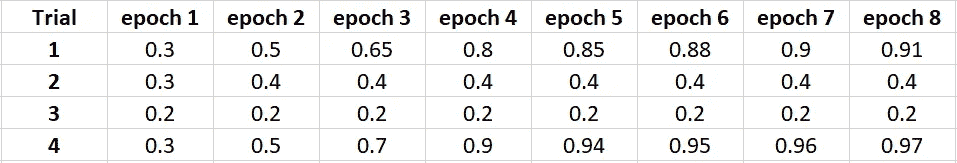
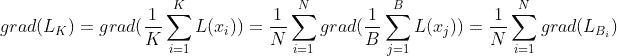
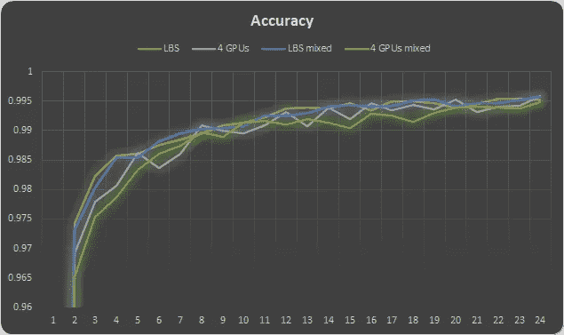

# 如何使用 Horovod 的大批量模拟来优化(高度)分布式训练的超参数调整

> 原文：<https://towardsdatascience.com/how-to-use-horovods-large-batch-simulation-to-optimize-hyperparameter-tuning-for-highly-a815c4ab1d34?source=collection_archive---------20----------------------->

## [理解大数据](https://towardsdatascience.com/tagged/making-sense-of-big-data)

## 一个简单的技术可以帮你省下一大笔钱，以及如何将它与混合精确学习相结合


[杰瑞米·托马斯](https://unsplash.com/@jeremythomasphoto?utm_source=medium&utm_medium=referral)在 [Unsplash](https://unsplash.com?utm_source=medium&utm_medium=referral) 上拍照

受[加快学习速度](https://arxiv.org/pdf/1706.02677.pdf)的愿望激励，今天深度学习领域的一个常见做法是将培训活动分配给多个工作人员(例如 GPU)。在*数据分布式训练*中，每个工人并行地对训练数据的不同子集(本地批次)执行训练步骤，向所有其他工人广播其结果梯度，并基于所有工人计算的梯度更新其模型权重。

在之前的[帖子](/a-guide-to-highly-distributed-dnn-training-9e4814fb8bd3)中，我们扩展了数据分布式培训的一些复杂性和潜在挑战。在本帖中，我们将重点关注在数据分布式训练环境中执行[超参数调整](https://en.wikipedia.org/wiki/Hyperparameter_optimization)的挑战。

我要感谢 Dennis Kreinovich 对分布式训练和混合精度的贡献。

# 介绍

任何深度学习项目必不可少的一部分就是[超参数调优](https://en.wikipedia.org/wiki/Hyperparameter_optimization)。模型*超参数*是我们在运行训练算法之前修复的所有控制设置。它们不同于在训练期间学习的模型*参数*。常见超参数的示例包括:

*   优化器设置:优化器的选择和控制它的设置，例如*学习率*。
*   模型架构:模型层的选择，它们是如何组合在一起的，以及它们是如何配置的。这包括每层的通道数、卷积核的大小、正则化设置、辍学率、批量归一化设置、激活函数的选择等设置。
*   损失函数:损失函数的选择及其各自的配置设置。

不用说，超参数的选择对我们训练算法的成功有决定性的影响。*超参数整定* (HPT)指的是为这些超参数寻找最优值的艺术，也就是寻找最终会导致最优训练结果的值。应当注意，对超参数的所有可行组合进行完全搜索实际上是不可能的。在实践中，大多数团队会修正大量的超参数，并将 HPT 限制到训练控制的子集。它们可以通过限制剩余超参数的搜索空间来进一步简化问题。

每一个成功的深度学习项目都包括某种形式的 HPT，即使在名称上没有明确地这样称呼。当你尝试使用额外的卷积层或信道，或者使用不同的学习率、正则化值、退出率或激活层来训练你的模型，只是为了看看它如何影响你的结果的质量时，你正在执行 HPT。当然，你在 HPT 战略上投入的越多，你成功的可能性就越大。以下是影响 HPT 战略优势的一些方面。

**1。高级参数搜索算法**
给定一个参数搜索空间，有多种方法可以进行搜索。琐碎的算法有*随机搜索*和*网格搜索*。在*随机搜索*中，我们随机选择参数组合。在*网格搜索*中，我们将搜索空间分成一个网格，并在网格的交叉点上测试组合。然而，有许多基于[贝叶斯优化](https://en.wikipedia.org/wiki/Bayesian_optimization)的更高级的算法，已经被证明比*随机搜索*和*网格搜索*执行得好得多(例如，参见这里的)。在撰写本文时，深度学习的 HPT 搜索算法仍然是一个活跃的研究领域。

## 2.实验并行化

显然，并行运行实验将加速 HPT 阶段，使您能够更快地得出关于最佳超参数的结论。然而，由于并行运行 N 个实验，潜在的好处可能比线性(乘以 N)加速要大得多。这是因为并行化增加了实验提前终止的可能性。让我们通过一个简单的例子来证明这一点。假设我们将 HPT 算法定义如下:

*   每个实验最多训练 8 个时期(或固定步数),并在每个时期后评估准确度。
*   在每个时期之后，我们将每个实验的准确度与达到相同步骤的所有其他实验的准确度结果进行比较。任何精度比最高计算精度差 10%以上的实验都将被终止。当一个实验提前停止时，它的相关资源可以用于后续的实验。
*   如果一个实验是唯一剩下的实验，或者如果它以最高的准确度完成了 8 个时期，则该实验被宣布为获胜者。

现在，假设在我们的 HPT 中的给定阶段，我们正在运行 4 个实验，这些实验将产生下表所示的精度:



样本精确度

如果我们并行运行所有四个试验，我们将在 1 个时期后终止试验 3，在 2 个时期后终止试验 2，在 4 个时期后终止试验 1 和试验 4，此时试验 4 将被宣布为获胜者。给定阶段将总共运行 11 个时期。另一方面，如果我们在实验中选择随机顺序并按顺序运行它们，通过应用简单的概率论定律，我们会发现总时期数的*期望值*将是 19.6。在这种情况下，并行化带来了 44%的预期节省。虽然这个例子是人为设计的，但是节省这么多钱的可能性并不遥远。节省的潜力只会随着并行化程度的增加而增加。

## 3.自动化

可以想象，人们可以定义参数搜索空间，选择 HPT 算法，手动实例化所有实验，并监控它们的进展。然而，HPT 算法的手动实现可能缓慢、乏味，并且极易出错。更好的建议是将 HPT 自动化。有许多工具和库支持 HPT 自动化。这些不同之处在于它们为不同的训练环境、搜索算法、并行化、早期停止等提供的支持。最流行的库之一(在撰写本文时)是 [Ray Tune](https://docs.ray.io/en/master/tune/index.html) ，它支持各种各样的训练框架、前沿搜索算法和实验并行化。我希望在以后的文章中扩展 HPT 框架。

这篇博文的重点是实验并行化，或者更具体地说，是在分布式训练环境中运行并行实验的挑战。我们将在下一节介绍这一挑战。

# 挑战——分布式培训环境中的 HPT

一个强有力的 HPT 战略对于一般培训同样重要，对于分布式培训更是如此。这是由于以下两个因素:

1.  **调优的复杂性**:数据分布式训练的净效应是训练批量的显著增加。用 *k* 表示工人数量，用 *b* 表示本地批量，对 *k* 工人进行分布式训练的结果是，在每一个训练步骤中，模型在一个全局批量 *k*b* 样本上进行训练。正如我们在[上一篇文章](/a-guide-to-highly-distributed-dnn-training-9e4814fb8bd3)中所讨论的，随着批量的增加，HPT 会变得更加困难。可能需要更高级的优化器(如 [LAMB](https://arxiv.org/abs/1904.00962) 和 [LARS](https://arxiv.org/abs/1708.03888) )，以及更精细的优化器设置调整。此外，最佳超参数可能高度依赖于全局批次的大小。大小为 X 的全局批次的调整结果可能与大小为 y 的全局批次的调整结果非常不同。
2.  **调整成本**:在高度分散的环境中，培训的成本可能相当高。在单个 GPU 设置中可以容忍的 HPT 策略(例如使用原始搜索算法)的低效率在高成本的分布式设置中是不可原谅的。我们在这里和本文的其余部分提到的成本可以是使用基于云的培训服务的价格，也可以是过度使用公司内部培训资源的机会成本。

正如我们在上面看到的，强 HPT 策略的技术之一是并行化调优实验。并行化既可以加快整个过程，又可以通过提前终止实验来节省成本。在多员工环境中，这种成本节约非常显著。然而，当尝试并行化高度分布式的训练实验时，您可能会发现自己面临一个重大挑战，我们将通过下面的简单示例来演示这个挑战:

假设，如本文中的[所示，您已经选择在 256 个 GPU 上进行训练，并且您的 HPT 算法的给定阶段需要并行运行 8 个实验。通过简单的计算，我们发现您将需要 2048 个 GPU 来并行运行您的 HPT！！您可能没有这个数量的 GPU，即使您有，运行您的 HPT 每小时的成本可能会非常高。例如，云中的 2048 个 GPU 可以轻松地花费数千美元/小时。](https://arxiv.org/pdf/1706.02677.pdf)

## 循环实验

您可以考虑的一个替代实验并行化的选项是以循环方式一次一个时期地执行每个实验。例如，在上面的例子中，我们将在 256 个 GPU 上运行第一个实验一个时期，然后第二个，然后第三个，直到第八个实验。此时，我们将比较中间结果，决定终止哪些实验，然后继续运行第二个时期的剩余实验，然后是第三个时期，依此类推。虽然这种方法花费的时间是完全并行化的 8 倍，但它能够实现相同类型的实验提前终止，并导致运行相同总数的时期。这种方法的问题是，实验之间的上下文切换(包括捕获和保存模型状态以及重建计算图)可能会引入大量开销，尤其是在分布式训练设置中。因此，早期终止实验的能力所带来的总体成本节约将低于并行化的情况。

我们在这篇文章中提出的解决方案是通过使用*大批量模拟*在更少的工人身上运行平行实验。

# 大批量模拟

在*大批量模拟* (LBS)中，我们仅使用 *Y ( < X)* 工人来模拟对 *X* 工人的培训，其中 *Y* 是 *X* 的除数，通过在 *Y* 工人上运行与我们在 *X* 工人上相同的全局批量。例如，假设在上一节中看到的示例中，本地(每个工作线程)批处理大小为 32，全局批处理大小为 8192 (32x256)。使用 LBS，我们可以在 32 个 GPU(而不是 256 个)上并行运行 8 个 HPT 实验中的每一个，这样每次运行都将使用大小为 256(而不是 32)的本地批处理。全局批处理的结果大小将是 8192，与我们在 256 个 GPU 上运行时的大小相同。这样，当并行运行 8 个实验(每个实验使用 32 个 GPU)时，我们在 HPT 期间将使用与培训期间相同的 256 个 GPU。这里的 8 个实验也比完全并行化花费更多的时间(超过 2048 个 GPU)。然而，提前终止实验所节省的成本将等同于完全并行化所节省的成本。(事实上，由于梯度共享消息数量的减少，它甚至可能会更好一点。)

如果有可能随意增加培训工人的本地批量，实施 BTS 将是微不足道的。然而，在现实中，批量的大小受到培训工作者的可用内存的限制。为了克服这一点，我们将使用一种叫做*梯度聚合*的技术。

## 梯度聚合

在典型的训练步骤中，我们执行向前传递以计算本地批次的损失，执行向后传递以计算梯度，将结果传播给其他工人，然后根据所有工人计算的梯度更新模型权重。当我们执行梯度聚合时，我们不是立即共享和应用梯度，而是在预定义数量的步骤中收集它们，然后才广播它们的平均值并更新权重。用 *B* 表示本地批量大小，在 *N* 步上执行梯度累加的效果将与用本地批量大小 *N* x *B* 进行训练相同。并且在具有规模为 *B* 的本地批次和具有 *Y* 的工人的 *N* 个步骤上运行梯度聚合，将与具有规模为 *B* 的本地批次和具有*X*=*N*X*Y*个工人的培训具有相同的效果。

这种用于模拟大批量的技术依赖于梯度计算的线性，即依赖于批量大小*K*=*N*x*B*的梯度与批量大小*N*B*B*的梯度平均值之间的等价性。



总之，我们提出的解决方案是使用 *Y* 工人模拟一个有 *N* x *Y* 工人的培训课程，通过对每个工人的 *N* 步执行梯度聚合。

## 使用 Horovod 的大批量模拟

[Horovod](https://horovod.readthedocs.io/en/stable/index.html) 是一个流行的库，用于执行分布式培训，广泛支持 TensorFlow、Keras、PyTorch 和 Apache MXNet。Horovod 的工作方式是将梯度共享引入梯度计算步骤。虽然有各种方法来实例化 Horovod，但一种常见的方法是使用*distributed optimizer*API 将您的训练优化器与 Horovod 优化器包装在一起，如下面的 TensorFlow 代码片段所示。更多详情参见 [Horovod 文档](https://horovod.readthedocs.io/en/stable/summary_include.html#id9)。

```
import horovod.tensorflow.keras as hvd
*# Initialize Horovod*
hvd.init()
*# Pin GPU, build model, and configure optimizer*
opt = ...
*# Wrap optimizer with Horovod Distributed Optimizer*
opt = hvd.DistributedOptimizer(opt)
```

从 0.21 版本开始， *DistributedOptimizer* API 新增了两个用于编程梯度聚合的标志: *backward_passes_per_step* 和*average _ aggregated _ gradients*。当 *backward_passes_per_step* 设置为大于 1 的值时，Horovod 将在后台使用一个梯度聚合器，该聚合器将在选择的步数上累积梯度，然后共享它们并使用它们将更新应用于模型权重。*average _ aggregated _ gradients*决定是否在共享累积的梯度之前对其进行平均。在下面的代码块中，我们展示了如何修改 Horovod 设置代码，以便将有效的全局批处理大小增加 8 倍:

```
import horovod.tensorflow.keras as hvd
*# Initialize Horovod*
hvd.init()
*# Pin GPU, build model, and configure optimizer*
opt = ...
*# Wrap optimizer with Horovod Distributed Optimizer*
opt = hvd.DistributedOptimizer(
                      opt, 
                      *backward_passes_per_step=8,                 
                      average_aggregated_gradients=True*)
```

## 小心使用

虽然现代深度学习框架为您可能想要做的几乎所有事情提供了高级 API，但深入了解正在发生的事情总是一个好主意，例如，模型层如何工作，您选择的优化器正在运行什么操作，以及在训练步骤中实际发生了什么。当你试图做一些与众不同的事情时，比如 LBS，尤其如此。否则，你可能会发现你的程序失败了，却不知道为什么。以下是一些需要注意的例子:

**定期更新超参数**:当使用 *Y* 工人模拟具有*X*=*N*X*Y*的培训环境时，需要注意的是， *X* 工人环境中的每一步都相当于 *Y* 工人环境中的 *N* 步。一些训练算法要求对优化器超参数进行定期更新。例如，通常的做法是使用[学习率调度器](https://www.tensorflow.org/api_docs/python/tf/keras/callbacks/LearningRateScheduler)以固定的迭代步骤调整优化器学习率。为了使模拟正常工作，我们需要通过将更新的预定步骤乘以系数 *N* 来修改超参数变化的时间表。

**对梯度**的非线性运算:我们所描述的 LBS 技术依赖于梯度计算的线性，也就是说，依赖于一批大小为 *N* x *B* 的梯度与一批大小为*N*B 的梯度的平均值之间的等价性。一些训练算法可能要求对梯度执行非线性操作。非线性操作的一个例子是梯度裁剪。只要这种非线性仅在完全累积的梯度上执行(即，仅在应用梯度时在台阶上执行)，就不会有问题。请注意，TensorFlow 2.5 中的默认行为是对聚集的梯度执行裁剪(参见此处的)。

**在正向传递过程中对模型参数的更新**:我们已经描述的梯度聚集技术通过*反向传递每一步*步骤来延迟梯度更新对模型权重的应用。然而，除了梯度更新，我们还需要考虑模型参数的其他更新。在正向传递期间发生的模型参数更新的一个例子是在[批标准化](https://www.tensorflow.org/api_docs/python/tf/keras/layers/BatchNormalization)层中移动统计的重新计算。假设这些统计数据是在主要(0 级)工作人员上计算的(例如，我们不[同步](https://horovod.readthedocs.io/en/latest/_modules/horovod/torch/sync_batch_norm.html)跨工作人员的批处理标准化统计数据)，我们需要考虑到在模拟环境中，0 级工作人员将看到的数据量将是*backward _ passes _ per _ step*乘以 0 级工作人员在原始环境中看到的数据量。尽管批处理规范化统计数据往往会很快被整理出来，但是这种差异可能会导致评估指标的差异。

在这篇文章的附录中，我们描述了如何将 LBS 与[混合精度](https://www.tensorflow.org/guide/mixed_precision)训练结合起来，这个用例进一步证明了谨慎的必要性。

在下一节中，我们将在一些简单的实验中演示 LBS 的使用。

# 实验

以下实验是在 [Amazon EC2 G4](https://aws.amazon.com/ec2/instance-types/g4/) 实例上运行的。对于单个 GPU 实验，我们使用 g4dn.2xlarge 实例，对于四个 GPU 实验，我们使用 g4dn.12xlarge 实例。实验在 TensorFlow 版本 2.4.1 和 Horovod 版本 0.21.0 上运行。对于所有实验，我们运行了官方的 [Horovod tf.keras mnist](https://github.com/horovod/horovod/blob/master/examples/tensorflow2/tensorflow2_keras_mnist.py) 示例，并做了以下更改:

*   我们应用了附录中描述的必要更改来支持混合精度的 LBS。
*   对于混合精度测试，我们对模型进行了以下突出显示的调整(参见[混合精度](https://www.tensorflow.org/guide/mixed_precision)文档以了解变化):

```
**policy = tf.keras.mixed_precision.Policy('mixed_float16')
tf.keras.mixed_precision.set_global_policy(policy)**mnist_model = tf.keras.Sequential([
    tf.keras.layers.Conv2D(32, [3, 3], activation='relu'),
    tf.keras.layers.Conv2D(64, [3, 3], activation='relu'),
    tf.keras.layers.MaxPooling2D(pool_size=(2, 2)),
    tf.keras.layers.Dropout(0.25),
    tf.keras.layers.Flatten(),
    tf.keras.layers.Dense(128, activation='relu'),
    tf.keras.layers.Dropout(0.5),
    tf.keras.layers.Dense(10),
    tf.keras.layers.Activation('softmax', 
                               **dtype='float32'**, 
                               name='predictions')
])
```

*   为了运行 LBS，我们将 *backward_passes_per_step* 设置为 4，并相应地更新了学习率。

在下面的图表中，我们绘制了四个实验的精度与历元数的函数关系图:在有和没有混合精度设置的情况下在 4 个 GPU 上进行分布式训练，以及在单个 GPU 上运行相应的大批量模拟。



每个历元的精度

在所有情况下，我们看到精度遵循类似的收敛模式。虽然这是在一个简单的模型上演示的，但我们可以看到使用混合精度训练和大批量模拟的潜力。

# 结束语

在本帖中，我们重点讨论了如何使用 LBS 来解决在高度分散的训练环境中进行 HPT 的挑战。LBS 还可以在许多其他场景中发挥作用。这里有一些例子。

## 批量调整

在整篇文章中，我们假设培训工人的数量和全局批量大小都是固定的，并相应地解决了调整其他超参数的挑战。当然，在现实中，两者都可以被视为需要调整的超参数。我们讨论的 LBS 技术提供了一种调整批量大小和评估工人数量的选择如何影响培训质量的创造性方法。这可以通过在多台机器上运行平行实验来完成，每台机器的*向后 _ 走刀 _ 每步*设置值不同。

## 增加单个实例的批量大小

可能存在这样的情况，其中以大批量运行可能不是数据分布式训练的强制副作用，而是用于提高训练性能的期望工具。在这种情况下，可以使用 LBS 来解决内存约束带来的批量限制，并在我们想要的批量上运行训练。

## 动态 GPU 编排

现代人工智能公司面临的挑战之一是如何在多个团队和项目中最有效地分配培训资源。培训资源非常昂贵，而且有强烈的经济动机来最大限度地利用这些资源。一种常见的策略是根据团队的需求和项目优先级在团队之间动态分配 GPU。这种策略的效果是，在培训的不同阶段，你可以接触到不同数量的工人。

如果您依赖低成本的“现场”实例进行培训，也会出现类似的情况。许多云服务提供商为多余的计算实例提供大幅折扣。在 AWS 中这些被称为 [**亚马逊 EC2 Spot 实例**](https://aws.amazon.com/ec2/spot/?cards.sort-by=item.additionalFields.startDateTime&cards.sort-order=asc) ，在 Google Cloud 中它们被称为 [**可抢占 VM 实例**](https://cloud.google.com/compute/docs/instances/preemptible) ，在微软 Azure 中它们被称为 [**低优先级 VM**](https://docs.microsoft.com/en-us/azure/batch/batch-low-pri-vms)。代价是，如果对它们的需求增加，这样的实例可以在使用过程中终止。你会再次发现，在培训过程中，分配的员工数量在不断变化。

考虑到资源分配中这种变化的可能性，明智的做法是在设计培训时考虑到这种可能性。具体来说，在任何给定的时间，您都希望利用尽可能多的可用工作人员，但也不希望重新分配其中的一部分。一个策略可能是天真地培训任何数量的可用工人。然而，全球批量将根据工人数量而变化，正如我们已经看到的，在每种情况下成功的培训并不总是简单的调整*学习率*。基于 LBS 的另一种策略是在各种情况下保持相同的有效批量。下面是这种工作方式的一个例子:

假设您设计您的模型来培训最多 256 名工人，本地批量为 *B* 。然而，当你开始培训时，你发现只有 128 名工人可用。使用伦敦商学院，你可以开始对 128 名工人进行培训，有效的本地批次规模为 *2* x *B* 。现在假设培训开始一小时后，分配给你的员工数量下降到 128 人以下。同样，使用 LBS，您可以重新设置您对 64 名工人的培训，进行有效的本地批量 *4* x *B* 培训。稍后，资源可能会开始释放，并且可能会重新设置您的培训，以便在 256 名员工上运行。

理论上，我们甚至可以通过使用 [Elastic Horovod](https://horovod.readthedocs.io/en/stable/elastic_include.html) 来实施这一策略，而无需停止和重新开始训练，这是 Horovod 的一个引人注目的功能，即使在分配的资源数量发生变化的情况下，也可以进行不间断的训练。然而，在撰写本文时，Horovod APIs 不支持对*backward _ passes _ per _ step*设置的动态更新。想了解更多关于弹性按摩棒好处的信息，请看这篇[最近的文章](/cost-efficient-distributed-training-with-elastic-horovod-and-amazon-ec2-spot-instances-599ea35c0700)。

# 摘要

数据分布式培训带来了许多独特的挑战。幸运的是，这些挑战也是创新和创造力的机会。在这篇文章中，我们接受了在高度分散的训练环境中超参数调整的挑战。我们已经展示了如何使用 Horovod 的梯度聚合支持来实现并行实验以及随之而来的潜在成本效益。高度分散的培训可能很昂贵，应该充分探索任何降低成本的机会。

# 附录:结合大批量模拟和混合精度学习

在[混合精度](https://www.tensorflow.org/guide/mixed_precision)训练中，我们在训练期间混合了 16 位和 32 位浮点类型，而不是仅使用 32 位浮点类型。这个特性可以显著节省运行时间和内存使用。

在这篇文章中，我们将重点关注 TensorFlow 提供的[混合精度](https://www.tensorflow.org/guide/mixed_precision)支持，尽管我们要说的大部分内容也适用于其他框架。关于混合精度的 TensorFlow [指南](https://www.tensorflow.org/guide/mixed_precision)很好地概述了混合精度如何工作以及如何配置。我们将提到与我们的讨论相关的一些混合精度训练的元素。

*   使用 16 位浮点编程时，主要关注的是由于较低的位精度导致的数值[下溢或上溢](https://www.tensorflow.org/guide/mixed_precision#underflow_and_overflow)。实际上，当执行混合精度训练时，最关心的是梯度计算期间下溢的可能性。
*   TensorFlow 支持两种 16 位精度浮点类型，float16 和 [bfloat16](https://en.m.wikipedia.org/wiki/Bfloat16_floating-point_format) 。bfloat16 类型的指数位数与 float32 一样多，并且能够表示相同范围的数字。因此，bfloat16 型不存在下溢问题。虽然有许多处理器支持 bfloat16，但在撰写本文时，TensorFlow 的正式版本只支持 Google TPUs 上的 bfloat16。查看[这篇文章](/how-floating-point-numbers-work-1429907b6d1d)中关于浮点表示如何工作的有趣概述。
*   使用 float16 时，克服下溢可能性的方法是执行[损失缩放](https://www.tensorflow.org/guide/mixed_precision#loss_scaling_overview)。当我们使用损失缩放时，我们在计算梯度之前将损失乘以一个缩放因子，然后在将它们应用于模型权重之前将结果梯度除以相同的因子。通过选择适当的比例因子，我们可以降低下溢的可能性。在 TensorFlow 中，该过程在[losscale optimizer](https://www.tensorflow.org/api_docs/python/tf/keras/mixed_precision/LossScaleOptimizer)中实现。执行的步骤有:
    1。衡量损失
    2。计算梯度
    3。取消渐变比例
    4。如果所有梯度都是有限的，则将它们应用于权重
    5。如果需要，根据当前梯度的统计数据更新比例因子

既然分布式训练和混合精确训练都有加速训练的共同目标，我们自然会对两者的结合感兴趣。特别是，我们需要基于 LBS 的解决方案来执行混合精度的 HPT。遗憾的是，Horovod 中 LBS 的当前默认实现与 TensorFlow 中的[losscale optimizer](https://www.tensorflow.org/api_docs/python/tf/keras/mixed_precision/LossScaleOptimizer)的默认实现不兼容。然而，幸运的是，通过对每个特性进行小的修改，这些特性可以通过编程和谐地工作。以下是将 LBS 与混合精度相结合时需要解决的问题:

1.  **处理梯度中的 Nan 值**:损失缩放的副作用之一是，由于数值溢出，我们可能偶尔会在梯度中得到 Nan 或 Inf 值。如果 [LossScaleOptimizer](https://www.tensorflow.org/api_docs/python/tf/keras/mixed_precision/LossScaleOptimizer) 遇到这样的值，它简单地丢弃梯度并继续下一步。然而，目前 Horovod 中的梯度聚合代码没有考虑 Nan 值的可能性。这个问题的细节以及建议的修改可以在[这里](https://github.com/horovod/horovod/issues/2957)找到，但是需要覆盖默认的 Horovod 行为。希望这将在 Horovod 的未来版本中得到解决。
2.  **何时更新缩放系数**:如上所述，[losscale optimizer](https://www.tensorflow.org/api_docs/python/tf/keras/mixed_precision/LossScaleOptimizer)基于梯度统计对缩放系数进行周期性更新。在上一节中，我们建议在 LBS 期间应用超参数的定期更新时要谨慎。在这种情况下，如果我们不能将缩放系数的更新与我们应用(和重置)聚集梯度的步骤对齐，我们不仅会在大批量模拟中失败，而且还可能会完全无法训练。如果梯度在其缩放状态下累积(例如 TensorFlow 2.3)，并且我们在累积期间重置缩放，则聚集的梯度将具有不匹配的缩放系数。因此，得到的未缩放梯度将是不正确的。即使梯度在其未缩放的状态下被累积(例如 TensorFlow 2.4 和 2.5)，也有可能[losscale optimizer](https://www.tensorflow.org/api_docs/python/tf/keras/mixed_precision/LossScaleOptimizer)将无法找到合适的缩放因子。
    为了解决这个问题，您需要覆盖由[lossscaleproptimizer](https://www.tensorflow.org/api_docs/python/tf/keras/mixed_precision/LossScaleOptimizer)调用的损失比例[更新](https://github.com/tensorflow/tensorflow/blob/a4dfb8d1a71385bd6d122e4f27f86dcebb96712d/tensorflow/python/keras/mixed_precision/loss_scale_optimizer.py#L325)函数，以便损失比例更新仅应用于梯度聚合器被重置的步骤。见[这里](https://github.com/horovod/horovod/issues/2957)有一种方法可以解决这个问题。
3.  **梯度量化的非线性**:需要记住的一点是，使用低精度时固有的量化构成了对梯度的非线性操作。事实上，你很可能会发现一批尺寸为 *N* x *B* 的梯度和 *N* 批尺寸为 *B* 的梯度的平均值之间存在很小的数字差异。当然，即使使用 32 位浮点数，量化也是存在的，但是数量上的影响远没有那么明显。尽管如此，我们还没有发现由于非线性而影响训练的数值差异，但是知道这一点是有好处的。

请注意，根据您使用的 TensorFlow 版本，可能需要进行一些额外的更改，以便将这两种功能结合起来。更多详情见[此处](https://github.com/horovod/horovod/issues/2957)。