# 如何使用 LightGBM 和 boosted 决策树预测销售

> 原文：<https://towardsdatascience.com/how-to-use-lightgbm-and-boosted-decision-trees-forecast-sales-cf65ce8ab645?source=collection_archive---------13----------------------->

## 使用机器学习构建数据以预测未来销售的广泛指南。它介绍了如何使用 python 创建滞后变量、滚动方法和基于时间的功能。它涵盖了如何执行目标编码，训练测试分裂的时间相关模型，并建立一个梯度推进树模型预测下个月的零售商的销售。


Photo by [褚 天成](https://unsplash.com/@encourline?utm_source=unsplash&utm_medium=referral&utm_content=creditCopyText) on [Unsplash](https://unsplash.com/s/photos/shopping-electornics?utm_source=unsplash&utm_medium=referral&utm_content=creditCopyText)

# 问题陈述

大多数公司对了解他们未来的业绩感兴趣。上市公司必须向投资者提供指导，说明他们认为下一季度或下一年的财务表现会如何。

为了能够回答公司在未来时期的表现，许多公司雇佣分析师来构建预测业务表现的分析解决方案。这种分析往往侧重于平均历史表现，并将其外推至未来结果。移动平均线和滚动窗口是一种常见的做法，也是长期以来的标准做法。

随着数据科学的最新发展，这些模型可以使用更复杂的技术(如梯度推进三)得到显著改善。

在本指南中，我们将使用 ML 为一家俄罗斯零售商预测下个月的销售额。我们将预测每个商店售出的每件商品的销售量。

通过将数据组织为月度预测，我们可以利用我们拥有的关于商店和产品的非常精细的数据。我们将使用在 t-n 时刻获取的历史销售数据来预测 t+n 时刻的未来销售。

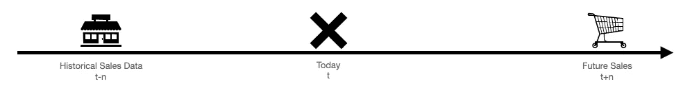

作者图片

# 数据

该数据集来源于 kaggle 的预测未来销售竞赛，包括几个数据文件，我们必须将它们结合在一起。对于那些了解数据库建模的人来说，sales_train 文件或训练集可以被认为是星型模式中的事实表，其中 items、item_ categories 和 shops 是我们可以用主键连接的维度表。

测试文件是具有类似关系的另一个事实。sales_train 文件和测试文件的关键区别在于，销售文件是**每日**，测试文件是**每月**。通常在实践中，我们可能希望预测月销售额，以便最终消费者更容易理解。这意味着我们还必须将每日数据汇总到每月数据，以便将其输入到我们的模型中。

数据集包含以下文件:

*   **sales_train.csv** —培训集。2013 年 1 月至 2015 年 10 月的每日历史数据。
*   **test.csv** —测试集。你需要预测这些商店和产品在 2015 年 11 月的销售额。
*   **sample_submission.csv** —格式正确的示例提交文件。
*   **items.csv** —物品/产品的补充信息。
*   **item_categories.csv** —关于物品类别的补充信息。
*   **shop . CSV**-店铺补充信息。

```
## Import lots of libraries to use
import pandas as pd
import numpy as np
from google_trans_new import google_translator
import seaborn as sns
import matplotlib.pyplot as plt
from sklearn.metrics import mean_squared_error
%matplotlib inline
from itertools import product
import time
from sklearn.model_selection import KFold
from sklearn import base
import lightgbm as lgb
from lightgbm import LGBMRegressor
from sklearn.preprocessing import LabelEncoder, OneHotEncoder, RobustScaler
from sklearn.model_selection import GridSearchCV, cross_val_score, StratifiedKFold, learning_curve, KFold, train_test_split
import calendar
from datetime import datetime
```

让我们读入数据。

```
## allows us to pick up the european formatting of the dates in the trainset
dateparse = lambda x: pd.datetime.strptime(x, ‘%d.%m.%Y’) # importing the trainset with dates correctly formatted
sales = pd.read_csv(‘sales_train.csv’, parse_dates = [‘date’], date_parser = dateparse)#import the rest of the files
test = pd.read_csv(‘test.csv’)
items = pd.read_csv(‘items.csv’)
item_categories = pd.read_csv(‘item_categories.csv’)
shops = pd.read_csv(‘shops.csv’)
```

现在我们已经读入了所有的文件，我们开始一个一个地分析文件。从项目类别开始。

## 项目类别文件

不幸的是，文件是俄文的。为了更好地理解数据，我们可以将单个类别转换成对非俄语使用者有意义的数据点。为此，我们可以使用 googletrans 将类别名称翻译成英语。我们将把翻译后的值存储在一个名为 **Category_type 的列中。**

```
item_categories.head()
```

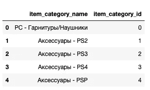

作者图片

不会说俄语可能是一个劣势，但我们可以看到，似乎我们有一个模式，其中有一个单词后面跟着 PS2、PS3、PS4 和 PSP。这看起来很像它与各种索尼 playstation 平台有关。也许第一个可以帮助我们将这些物品归类在一起。我们来翻译一下单词，看看。

```
# Starting with translating the column item_category name from Russian to English. We will then append that to the original dataframe.
translator = google_translator()  
list_a = []
for word in item_categories['item_category_name']:
    try:
        a = translator.translate(word)
        list_a.append(a)
    except:
        list_a.append(word)
item_categories['English_Name'] = list(list_a)
print(list_a)
```


作者图片

这个翻译并不完美，因为它漏掉了一些术语。我们可以手动搜索单词，并用我们资助的最佳翻译替换它们，以便我们的类别更容易使用。

```
## Программы means Programs
item_categories[‘English_Name’]= item_categories[‘English_Name’].str.replace(“Программы”, “Programs”)## Книги means Books
item_categories[‘English_Name’]= item_categories[‘English_Name’].str.replace(“Книги”, “Books”)item_categories.head()
```

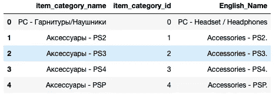

作者图片

啊哈！看起来每个项目类别的第一部分都有类别类型。在我们的例子中，类别类型是附件。让我们把它提取出来，存储在一个名为 Category_type 的新特性中。

```
## Create a feature called Variable type by splitting the English_Name strings where they either have a paranthesis or a dash.
list_a = []
for row in item_categories['English_Name']:
        a = row.replace('(','-').split(' -')[0] ## replacing the opening parantheses with dash so we can use str.split function to split on it.
        list_a.append(a)
item_categories['Category_type'] = list(list_a)
## Lets check out the categories we have
pd.DataFrame((item_categories['Category_type'].unique()))
```

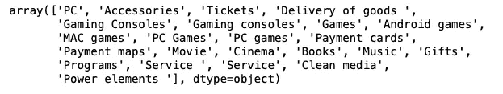

看起来几个类别有相似的名称和含义。比如**游戏** **主机**和**游戏主机**实际上是同一类型的品类。让我们清理一下，让这个新特性更加统一。

```
## Let's clean up some of this output in the categories:## Game Consoles are really the same thing as Gaming Consoles
item_categories['Category_type']= item_categories['Category_type'].str.replace("Gaming Consoles", "Game Consoles")## Payment cards with a lowercase c is the same as Payment Cards with upper case C
item_categories['Category_type']= item_categories['Category_type'].str.replace("Payment cards", "Payment Cards")## Cinema and movie tends to be synomomous. Let's change "The Movie" category type to Cinema
item_categories['Category_type']= item_categories['Category_type'].str.replace("The Movie", "Cinema")## Pure and Clean Media Seem Similar. Let's combine into Pure/Clean Media
item_categories['Category_type']= item_categories['Category_type'].str.replace("Clean media", "Pure/Clean Media")
item_categories['Category_type']= item_categories['Category_type'].str.replace("Pure Media", "Pure/Clean Media")
```

因为这个数据集比较大(对于笔记本电脑来说，无论如何都要处理)，所以让我们删除不打算使用的列。这将允许我们在笔记本电脑上使用更少的内存。我们去掉英文名称 categories_name，只留下类别类型。

```
item_categories = item_categories.drop([‘item_category_name’,’English_Name’],axis =1)
```

**商店**

这个文件包含了商店的名称。它可以用作获取销售文件中商店 Id 名称的关键字。因为这个文件也是俄语的，我们将再次把单词翻译成英语。一旦我们有了英文名称，我们将提取这些商店所在的城市，并将其作为一个特征。

```
shops.head()
```

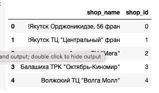

作者图片

尽管我学习了如何用俄语拼写配饰，但我担心我的俄语还不够好，看不清商店的名字。让我们把它们翻译成英语，看看这些单词是什么意思。

```
## Let’s translate this into English
translator = google_translator() 
list_a = []
for word in shops[‘shop_name’]:
 a = translator.translate(word)
 list_a.append(a)
shops[‘English_Shop_Name’] = list_a
shops
```

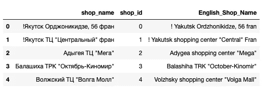

作者图片

貌似城市是第一个词，后面是购物中心，TC 或者，SEC 之类的。让我们试着从这里提取城市。一些谷歌化的词让我觉得所有我检查过的地方，不管是 TC 还是 SEC 都是在购物中心。因此，我们没有创建一个突出的店铺名称的一部分。

我们将创建一个仅包含城市名称(第一个单词)的**城市**变量，并通过按空格分割 English _ Shops _ Name 字符串来创建一个名为**城市类型**的特性。

因为像圣彼得堡这样的城市名称中有一个空格，所以我们去掉了句号后面的空格和感叹号后面的空格。

```
list_a = []
for row in shops[‘English_Shop_Name’]:
 a = row.replace(‘. ‘,’’).replace(‘! ‘,’’).split(‘ ‘)[0] ## remove spaces follwing period or exclaimation point and split based on spaces. First word is city
 list_a.append(a)
shops[‘City’] = list(list_a)
## Lets check out the categories we have
pd.DataFrame((shops[‘City’].unique()))
```

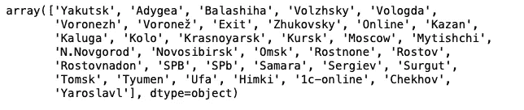

作者图片

因为我们已经从中提取了城市信息，所以我们删除了商店名称，英文商店名称。

```
shops = shops.drop([‘shop_name’,’English_Shop_Name’],axis = 1)
shops.head()
```

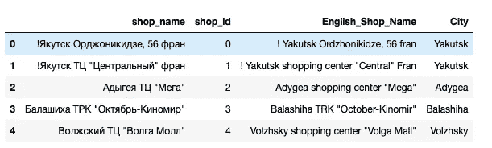

作者图片

# 汇总数据

因为任务是进行每月预测，所以在进行任何编码之前，我们需要将数据聚集到每月级别。下面的代码单元正是为了这个目的。它还将 item_cnt_day 变量重命名为 Target(一旦我们将它设为每月聚合)。

```
gb = sales.groupby(index_cols,as_index=False).agg({'item_cnt_day':{target = 'sum'}})temp['total'] = pd.DataFrame(project_data.groupby(col1)[col2].agg({'total':'count'})).reset_index()['total']index_cols = [‘shop_id’, ‘item_id’, ‘date_block_num’]# For every month we create a grid from all shops/items combinations from that month
grid = [] 
for block_num in sales[‘date_block_num’].unique():
 cur_shops = sales[sales[‘date_block_num’]==block_num][‘shop_id’].unique()
 cur_items = sales[sales[‘date_block_num’]==block_num][‘item_id’].unique()
 grid.append(np.array(list(product(*[cur_shops, cur_items, [block_num]])),dtype=’int32'))#turn the grid into pandas dataframe
grid = pd.DataFrame(np.vstack(grid), columns = index_cols,dtype=np.int32)#get aggregated values for (shop_id, item_id, month)
gb = sales.groupby(index_cols,as_index=False).agg({‘item_cnt_day’: ‘sum’})gb.columns = [‘shop_id’, ‘item_id’, ‘date_block_num’, ‘target’]
# gb = sales.groupby(index_cols,as_index=False).agg({‘item_cnt_day’:{‘target’:’sum’}})#fix column names
# gb.columns = [col[0] if col[-1]==’’ else col[-1] for col in gb.columns.values]
#join aggregated data to the grid
all_data = pd.merge(grid,gb,how=’left’,on=index_cols).fillna(0)
#sort the data
all_data.sort_values([‘date_block_num’,’shop_id’,’item_id’],inplace=True)
```

有时我们的训练数据中会有异常值。在这个特定的数据集中，我们知道如果我们的目标值为 20 或更大。这意味着，如果我们看到一个大于 20 的值，我们会自动将其称为 20。这对我们的 RMSE 分数有重大的积极影响。这可能并不总是适用于所有的预测模型。

```
all_data[‘target’]=all_data[‘target’].clip(0,20)
```

# 合并数据集

接下来，我们用训练集和测试集创建一个数据帧。我们将用 item_categories、items 和 shops 来加入它。我们将使用这个数据框架来创建我们的许多特征，并尽可能减少将它们应用于多个数据框架的需要。例如，当我们创建滞后变量时，我们需要为训练集、验证集和测试集创建它们。通过将所有数据合并到一个数据帧中，我们只需这样做一次。

在现实世界中，我们将构建一个预处理管道，将训练中使用的相同特征工程应用于未标记数据。那是另一天的话题。

我们将联合训练和测试设备。正如我们从上面的代码中看到的，我们在测试集中缺少了两列。这些是日期块编号和目标。现在，我们将把目标设定为零。我们还会将数字 34 分配给日期块编号。date_block_num 对应于数据集中的月份，因此由于我们需要预测下个月的 item_counts，我们将简单地查找训练集的最大值并加 1。(最大值为 33)

```
## Assign 34 to date_block_num and 0.0 to target
test[‘date_block_num’] = 34
test[‘target’] = 0.0TEST_ID = test[‘ID’] ## in case we need this later## Then we need to union them and save that back as our all_data dataframe
all_data = pd.concat([all_data,test], axis =0, sort=True)
all_data = all_data.drop(columns = [‘ID’])
```

接下来，我们将 all_data 数据框架与 items、item_categories 和 shops 数据框架合并。因为我们希望避免创建重复的行，所以我们将添加一些行计数检查器，以确保我们不会添加任何新行或删除任何行。

```
## Calculate number of rows prior to merge
prior_rows = all_data.shape[0]## Merge the sales train data with the items, item categoris and shops datasets to get the names of items, their categories and the shop names
all_data = pd.merge(all_data, items, on = “item_id”)
all_data = pd.merge(all_data, item_categories, on = “item_category_id”)
all_data = pd.merge(all_data, shops, on = “shop_id”)## Calcualte number and print of rows dropped (should be zero)
print(“Dropped {} rows”.format(prior_rows — all_data.shape[0]))
```

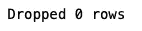

作者图片

# 特征工程

因为我们有大量可能具有预测性的数据，所以我们需要将其预处理成我们的模型可以使用的格式。这通常被称为特征工程。

## 处理日期、季节和日期

日期可以告诉我们很多关于销售的事情。例如，二月份的销售额可能低于一月份，仅仅是因为二月份的天数比其他月份少。日子的类型也很重要。更多的周末可能意味着更多的人经常光顾商店。季节也很重要，六月的销售可能与十二月不同。我们将创建与所有这些项目相关的功能。

首先，我们需要提取每个日期块的月份和日期，并将其存储在一个数据帧中。

```
## Pull out the last date of each dateblock and append it to the 
from datetime import datetime
list_a = []
for dateblock in sales[‘date_block_num’].unique():
 a = sales[sales[‘date_block_num’] == dateblock]
 a = max(a[‘date’])
 list_a.append(a)

list_a.append(datetime.strptime(‘2015–11–30’,’%Y-%m-%d’)) ## Manually adding the month for the test set
## Transform it to dataframe so we can merge with all_data
list_a = pd.DataFrame(list_a)
## Give the data a descriptive column header
list_a.columns = [‘Month_End_Date’]
```

现在已经提取了月份和日期，我们可以计算每个月中有多少个星期一、星期二等。

```
## Let’s calculate the number of specific days are in each month.
import calendar
## Create the empty lists
mon_list = []
tue_list = []
wed_list = []
thu_list = []
fri_list = []
sat_list = []
sun_list = []## Calculate the number of a specific day in a given month (for example, number of mondays in March of 2015)
for date in list_a[‘Month_End_Date’]:
 mon_list.append((len([1 for i in calendar.monthcalendar(date.year,date.month) if i[0] != 0])))
 tue_list.append((len([1 for i in calendar.monthcalendar(date.year,date.month) if i[1] != 0])))
 wed_list.append((len([1 for i in calendar.monthcalendar(date.year,date.month) if i[2] != 0])))
 thu_list.append((len([1 for i in calendar.monthcalendar(date.year,date.month) if i[3] != 0])))
 fri_list.append((len([1 for i in calendar.monthcalendar(date.year,date.month) if i[4] != 0])))
 sat_list.append((len([1 for i in calendar.monthcalendar(date.year,date.month) if i[5] != 0])))
 sun_list.append((len([1 for i in calendar.monthcalendar(date.year,date.month) if i[6] != 0])))## Add these to our list we created with the dates
list_a[‘Number_of_Mondays’] = mon_list
list_a[‘Number_of_Tuesdays’] = tue_list
list_a[‘Number_of_Wednesdays’] = wed_list
list_a[‘Number_of_Thursdays’] = thu_list
list_a[‘Number_of_Fridays’] = fri_list
list_a[‘Number_of_Saturdays’] = sat_list
list_a[‘Number_of_Sundays’] = sun_list
```

我们还可以提取与年、月和月中天数相关的特征。

```
## Create the empty listsyear_list = []
month_list = []
day_list = []## Next lets calculate strip out the number of days in a month, the number of the month and the number of the year
for date in list_a['Month_End_Date']:
    year_list.append(date.year)
    month_list.append(date.month)
    day_list.append(date.day)## Add to our dataframe
list_a['Year'] = year_list
list_a['Month'] = month_list
list_a['Days_in_Month'] = day_list
```

list_a 数据帧可以与 all_data 数据帧合并，我们还添加了一些日期特性。

```
## Merge the new dataframe with the all_data, using the index and the date_block_num as keys
all_data = pd.merge(all_data, list_a, left_on = ‘date_block_num’, right_index = True)
```

## 价格变量

我们最初的方法是添加交易的计数，我们没有对项目的价格做任何事情。让我们计算每月价格的平均值，并将该特性与我们的 all_data 数据框架合并。

```
## adding the average monthly price within a monthly block for each item at each store to the dataset
a = sales.groupby([‘date_block_num’,’shop_id’,’item_id’])[‘item_price’].mean()
a = pd.DataFrame(a)
all_data = pd.merge(all_data,a,how = “left”, left_on = [‘date_block_num’,’shop_id’,’item_id’], right_on = [‘date_block_num’,’shop_id’,’item_id’])
```

## 物品首次售出后的月数&物品上次售出后的月数

这些特征显示了自第一次出售该物品和最后一次出售该物品以来的日期块(月)的数量。这将有助于我们了解该商品有多新，并可能告诉我们该商品已不再销售。

我们将计算每个项目的最小值。这将给出它售出的第一个月。然后，我们将计算该数字与当前日期块之间的差值，以查看该项目的“旧”程度。

```
a = all_data.groupby(‘item_id’)[‘date_block_num’].min()
a = pd.DataFrame(a)
a = a.reset_index()
a.columns = [‘item_id’,’min_item_sale_date_block_num’]
all_data = pd.merge(all_data,a, left_on = ‘item_id’, right_on = ‘item_id’)
all_data[‘Months_Since_Item_First_Sold’] = all_data[‘date_block_num’]- all_data[‘min_item_sale_date_block_num’]
```

测试集中的一些数据是针对我们从未见过的产品的。让我们创建一个特性，只计算特定商品在第一个月的平均月销售额。我们会让其余的人归零。

我们还将把相同的逻辑应用于商品类别和商店 id 的组合。我们可以按类别计算第一个月的平均销售额

```
a = all_data[all_data[‘Months_Since_Item_First_Sold’] == 0].groupby([‘item_category_id’,’Months_Since_Item_First_Sold’])[‘target’].mean()
a = pd.DataFrame(a)
a = a.reset_index()
a.columns = [‘item_category_id’,’Months_Since_Item_First_Sold’,’avg_first_months_sales_by_item_category_id’]
all_data = pd.merge(all_data,a, left_on = [‘item_category_id’,’Months_Since_Item_First_Sold’], right_on = [‘item_category_id’,’Months_Since_Item_First_Sold’], how = ‘left’)
all_data[‘avg_first_months_sales_by_item_category_id’] = all_data[‘avg_first_months_sales_by_item_category_id’].fillna(0)
```

按类别和店铺 ID 计算第一个月的平均销售额。

```
a = all_data[all_data[‘Months_Since_Item_First_Sold’] == 0].groupby([‘item_category_id’, ‘Months_Since_Item_First_Sold’,’shop_id’])[‘target’].mean()
a = pd.DataFrame(a)
a = a.reset_index()
a.columns = [‘item_category_id’,’Months_Since_Item_First_Sold’,’shop_id’,’avg_first_months_sales_by_item_category_and_shop’]
all_data = pd.merge(all_data,a, left_on = [‘item_category_id’,’Months_Since_Item_First_Sold’,’shop_id’], right_on = [‘item_category_id’,’Months_Since_Item_First_Sold’, ‘shop_id’], how = ‘left’)
all_data[‘avg_first_months_sales_by_item_category_and_shop’] = all_data[‘avg_first_months_sales_by_item_category_and_shop’].fillna(0)
```

## 滞后变量

如果只允许我用一个数据点来预测下个月的销售额，我可能会用这个月的销售额。这个月的销售额是一个滞后变量。在时间序列分析中，目标变量的滞后是很常见的。我们将创建几个滞后变量(上个月的销售额)。我们将重复这一过程几个月。

为了创建一个滞后函数，熊猫图书馆有一个非常有用的函数叫做 shift。我们将它包裹在一个循环中，以产生几个月的多重滞后。我们还使用内置的填充值函数使 na 值为零。

```
## With pandas shift function
for each in [1,2,3,4,5,6,12]:
    all_data[str("target_lag_"+str(each))] = all_data.groupby(['date_block_num','shop_id','item_id'])['target'].shift(each, fill_value = 0)
```

更多！滞后很有趣。让我们使用每个月的平均值以及类别、城市、商店或商品来创建特征。我们可以在模型中使用这些特征的滞后。

```
## Average number of sales by month and by item
all_data[‘avg_monthly_by_item’] = all_data.groupby([‘item_id’, ‘date_block_num’])[‘target’].transform(‘mean’)## Average number of sales by month and by shop
all_data[‘avg_monthly_by_shop’] = all_data.groupby([‘shop_id’, ‘date_block_num’])[‘target’].transform(‘mean’)## Average number of sales by month and by category
all_data[‘avg_monthly_by_category’] = all_data.groupby([‘Category_type’, ‘date_block_num’])[‘target’].transform(‘mean’)## Average number of sales by month and by city
all_data[‘avg_monthly_by_city’] = all_data.groupby([‘City’, ‘date_block_num’])[‘target’].transform(‘mean’)
```

## **移动平均线**

另一种为数据添加更多特征的方法是创建滚动或移动平均值。滚动平均具有很强的预测性，有助于确定目标的历史水平。让我们创建两个滚动平均值，3 个月和 6 个月。

```
## 3-months rolling average
all_data[‘target_3_month_avg’] = (all_data[‘target_lag_1’] + all_data[‘target_lag_2’] +all_data[‘target_lag_3’]) /3## 6-months rolling average
all_data[‘target_6_month_avg’] = (all_data[‘target_lag_1’] + all_data[‘target_lag_2’] +all_data[‘target_lag_3’] + all_data[‘target_lag_4’] + all_data[‘target_lag_5’] +all_data[‘target_lag_6’]) /6
```

请注意我们是如何明确计算这些平均值的。这也可以通过熊猫滚动和平均功能来实现。

```
## 3-months rolling average
all_data['target_3_month_avg'] = all_data.groupby(['date_block_num','shop_id','item_id'])['target'].rolling(3, fill_value = 0).mean()## 6-months rolling average
all_data['target_6_month_avg'] = all_data.groupby(['date_block_num','shop_id','item_id'])['target'].rolling(3, fill_value = 0).mean()
```

# 提高内存使用率

哇，我们创造了很多功能。因为我们只使用一台笔记本电脑，所以我们应该确保将它存储在尽可能小的数据帧中。让我们检查内存使用情况和数据帧的数据类型。

```
all_data.info(memory_usage = “deep”)
```

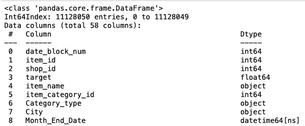

运行 info 时，在输出的底部，您会看到数据框中不同数据类型的数量以及它们的总内存使用情况。

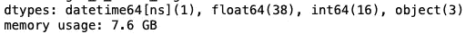

由于其中许多被列为 int64 或 float64，我们可能会将它们减少到更小的空间数据类型，如 int16 或 float8。向下转换意味着我们将每个特性的数据类型减少到最低可能的类型。

```
for column in all_data:
 if all_data[column].dtype == ‘float64’:
 all_data[column]=pd.to_numeric(all_data[column], downcast=’float’)
 if all_data[column].dtype == ‘int64’:
 all_data[column]=pd.to_numeric(all_data[column], downcast=’integer’)
## Dropping Item name to free up memory
all_data = all_data.drop(‘item_name’,axis =1)
## Let’s check the size
all_data.info(memory_usage = “deep”)
```

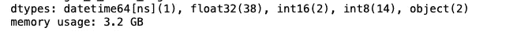

作者图片

使用向下转换，我们能够将数据集的大小减少到一半。

# 列车测试拆分

在更传统的最大似然模型中，我们会随机地将观测值分配给训练集、测试集和验证集。在预测情况下，我们需要考虑时间对数据集的影响，并相应地构建我们的训练和测试验证。既然我们的数据集已经向下转换，我们可以开始将数据分为训练(前 32 个月)、验证(第 33 个月)和返回到我们的测试集(第 34 个月)。

```
X_train = all_data[all_data.date_block_num < 33]
Y_train = all_data[all_data.date_block_num < 33][‘target’]
X_valid = all_data[all_data.date_block_num == 33]
Y_valid = all_data[all_data.date_block_num == 33][‘target’]
X_test = all_data[all_data.date_block_num == 34]
```

# 更多功能工程—目标编码

## 我们为什么以编码为目标？

XGBoost 和 LightGBM 等梯度增强的基于树的模型很难处理高基数的分类变量。目标编码通过用平均结果替换字符串或文本值，帮助将分类变量转换为数值。例如，如果一个*【PS3】*的平均销售量是 300，PS2 是 200，我们将用 300 替换*【PS3】*的字符串，用 200 替换 PS2。事实上，一个模特现在可以知道我们应该期待 PS3 的销量超过 PS2 的销量。这种类型的特征工程有助于提高模型性能。

## 为什么要正规化？

简单地计算目标变量的平均值会导致过度拟合，并且通常会降低模型推广到新数据的能力。所以我们需要规范

## 正则化技术:

*   培训数据中的交叉验证循环
*   缓和
*   添加随机噪声
*   排序和计算扩展平均值

我们将只在训练数据中进行交叉验证循环。首先，我们将定义两个助手函数，这是我从[https://medium . com/@ pouryayria/k-fold-target-encoding-dfe 9a 594874 b](https://medium.com/@pouryaayria/k-fold-target-encoding-dfe9a594874b)中获得的

```
## Helpder Function to KFold Mean encoding
class KFoldTargetEncoderTrain(base.BaseEstimator,
                               base.TransformerMixin):
    def __init__(self,colnames,targetName,
                  n_fold=5, verbosity=True,
                  discardOriginal_col=False):
        self.colnames = colnames
        self.targetName = targetName
        self.n_fold = n_fold
        self.verbosity = verbosity
        self.discardOriginal_col = discardOriginal_col
    def fit(self, X, y=None):
        return self
    def transform(self,X):
        assert(type(self.targetName) == str)
        assert(type(self.colnames) == str)
        assert(self.colnames in X.columns)
        assert(self.targetName in X.columns)
        mean_of_target = X[self.targetName].mean()
        kf = KFold(n_splits = self.n_fold,
                   shuffle = False, random_state=2019)
        col_mean_name = self.colnames + '_' + 'Kfold_Target_Enc'
        X[col_mean_name] = np.nan
        for tr_ind, val_ind in kf.split(X):
            X_tr, X_val = X.iloc[tr_ind], X.iloc[val_ind]
            X.loc[X.index[val_ind], col_mean_name] = X_val[self.colnames].map(X_tr.groupby(self.colnames)[self.targetName].mean())
            X[col_mean_name].fillna(mean_of_target, inplace = True)
        if self.verbosity:
            encoded_feature = X[col_mean_name].values
            print('Correlation between the new feature, {} and, {} is {}.'.format(col_mean_name,self.targetName,                    
                   np.corrcoef(X[self.targetName].values,
                               encoded_feature)[0][1]))
        if self.discardOriginal_col:
            X = X.drop(self.targetName, axis=1)
        return X## Helper function to get the Kfold Mean encoded on the test setclass KFoldTargetEncoderTest(base.BaseEstimator, base.TransformerMixin):

    def __init__(self,train,colNames,encodedName):

        self.train = train
        self.colNames = colNames
        self.encodedName = encodedName

    def fit(self, X, y=None):
        return self
    def transform(self,X):
        mean =  self.train[[self.colNames,
                self.encodedName]].groupby(
                                self.colNames).mean().reset_index() 

        dd = {}
        for index, row in mean.iterrows():
            dd[row[self.colNames]] = row[self.encodedName]
        X[self.encodedName] = X[self.colNames]
        X = X.replace({self.encodedName: dd})
        return X
```

现在我们已经定义了两个助手函数，让我们用它们开始对变量进行均值编码:

*   项目标识
*   商店标识
*   城市
*   类别 _ 类型
*   项目 _ 类别 _ 标识

```
## item_id mean encoding
targetc = KFoldTargetEncoderTrain(‘item_id’,’target’,n_fold=5)
X_train = targetc.fit_transform(X_train)## shop_id mean encoding
targetc = KFoldTargetEncoderTrain(‘shop_id’,’target’,n_fold=5)
X_train = targetc.fit_transform(X_train)## City mean encoding
targetc = KFoldTargetEncoderTrain(‘City’,’target’,n_fold=5)
X_train = targetc.fit_transform(X_train)## Category_type mean encoding
targetc = KFoldTargetEncoderTrain(‘Category_type’,’target’,n_fold=5)
X_train = targetc.fit_transform(X_train)## Item_category_id mean encoding
targetc = KFoldTargetEncoderTrain(‘item_category_id’,’target’,n_fold=5)
X_train = targetc.fit_transform(X_train)
```

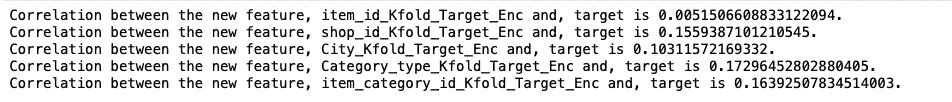

作者图片

对测试集应用类似的转换。

```
## Transform validation & test set## Apply item id mean encoding to test set
test_targetc = KFoldTargetEncoderTest(X_train,’item_id’,’item_id_Kfold_Target_Enc’)
X_valid = test_targetc.fit_transform(X_valid)
X_test = test_targetc.fit_transform(X_test)## Apply shop id mean encoding to test set
test_targetc = KFoldTargetEncoderTest(X_train,’shop_id’,’shop_id_Kfold_Target_Enc’)
X_valid = test_targetc.fit_transform(X_valid)
X_test = test_targetc.fit_transform(X_test)## Apply city mean encoding to test set
test_targetc = KFoldTargetEncoderTest(X_train,’City’,’City_Kfold_Target_Enc’)
X_valid = test_targetc.fit_transform(X_valid)
X_test = test_targetc.fit_transform(X_test)## Apply Category_type mean encoding to test set
test_targetc = KFoldTargetEncoderTest(X_train,’Category_type’,’Category_type_Kfold_Target_Enc’)
X_valid = test_targetc.fit_transform(X_valid)
X_test = test_targetc.fit_transform(X_test)## Apply item_category_id mean encoding to test set
test_targetc = KFoldTargetEncoderTest(X_train,’item_category_id’,’item_category_id_Kfold_Target_Enc’)
X_valid = test_targetc.fit_transform(X_valid)
X_test = test_targetc.fit_transform(X_test)
```

# 最终数据集

我们正在接近。我们的特写完成了。让我们做一些检查，以确保我们只有我们将使用的功能。

```
## drop first 12 months since we have lagged variables
X_train = X_train[X_train.date_block_num > 12]## Assign target variables to seperate variables
y= X_train[‘target’]
Y_valid = X_valid[‘target’]## Drop Categorical Variables that we mean encoded, the target and the item codes.
columns_to_drop = [‘target’, ‘Category_type’,’City’,’Month_End_Date’, ‘item_category_id’]
X_train= X_train.drop(columns_to_drop, axis = 1)
X_valid = X_valid.drop(columns_to_drop, axis = 1)
X_test = X_test.drop(columns_to_drop, axis = 1)
```

# 使用 LightGBM 建模

LightGBM 是一个梯度推进框架，使用基于树的学习算法。它被设计为分布式和高效的，具有以下优点:

*   训练速度更快，效率更高。
*   更低的内存使用率。
*   精确度更高。
*   支持并行和 GPU 学习。
*   能够处理大规模数据。

LightGBM 非常擅长处理大于 100K 记录的数据集，并且与 XGBoost 相比速度相对较快。

我们需要将训练和验证转换成建模所需的 lgb 数据集结构。

```
lgb_train = lgb.Dataset(X_train, y)
lgb_eval = lgb.Dataset(X_valid, Y_valid, reference=lgb_train)
```

像大多数增强模型一样，我们需要调整我们的超参数。这些是我最成功的，但这并不意味着它们是“终极”的。一般来说，当我调整参数时，我倾向于遵循文档提供的指导。

> LightGBM 使用逐叶树生长算法，而许多其他流行的工具使用逐深度树生长算法。与深度增长相比，叶子增长算法可以更快地收敛。然而，如果不使用合适的参数，叶向生长可能会过度拟合。
> 
> 为了使用逐叶树获得良好的结果，以下是一些重要的参数:
> 
> **叶子数。**这是控制树形模型复杂度的主要参数。理论上，我们可以设置 num_leaves = 2^(max_depth)来获得与深度方向树相同数量的叶子。然而，这种简单的转换在实践中并不好。原因是，对于固定数量的叶子，按叶排序的树通常比按深度排序的树更深。不受约束的深度会导致过度拟合。因此，在尝试调整 num_leaves 时，我们应该让它小于 2^(max_depth).例如，当 max_depth=7 时，深度方向的树可以获得良好的准确性，但是将 num_leaves 设置为 127 可能会导致过度拟合，而将其设置为 70 或 80 可能会获得比深度方向更好的准确性。
> 
> **叶中最小数据。**这是一个非常重要的参数，可以防止逐叶树中的过度拟合。它的最佳值取决于训练样本的数量和 num_leaves。将其设置为较大的值可以避免树长得太深，但可能会导致欠拟合。实际上，对于大型数据集，将其设置为数百或数千就足够了。最大深度。您还可以使用 max_depth 来显式限制树深度。

```
# specify the configurations as a dict
params = {
 ‘boosting_type’: ‘gbdt’,
 ‘objective’: ‘regression’,
 ‘metric’: ‘rmse’,
 ‘num_leaves’: 31,
 ‘learning_rate’: 0.05,
 ‘feature_fraction’: 0.9,
 ‘bagging_fraction’: 0.8,
 ‘bagging_freq’: 5,
 ‘verbose’: 0,
 ‘num_threads’ : 4
}print(‘Starting training…’)
# train
gbm = lgb.train(params,
 lgb_train,
 num_boost_round=10000,
 valid_sets=lgb_eval,
 early_stopping_rounds=100)print(‘Saving model…’)
# save model to file
gbm.save_model(‘model.txt’)print(‘Starting predicting…’)
# predict
y_pred = gbm.predict(X_valid, num_iteration=gbm.best_iteration)
# eval
print(‘The rmse of prediction is:’, mean_squared_error(Y_valid, y_pred) ** 0.5)
```

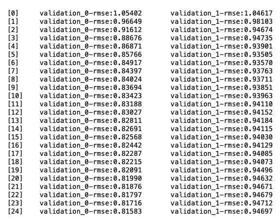

让我们来看看特征重要性图。

```
num_features = 50
indxs = np.argsort(gbm.feature_importance())[:num_features]

feature_imp = pd.DataFrame(sorted(zip(gbm.feature_importance()[indxs],X_train.columns[indxs])), columns=[‘Value’,’Feature’])plt.figure(figsize=(20, 20))
sns.barplot(x=”Value”, y=”Feature”, data=feature_imp.sort_values(by=”Value”, ascending=False))
plt.title(‘Top {} LightGBM Features accorss folds’.format(num_features))
plt.tight_layout()
plt.show()
```

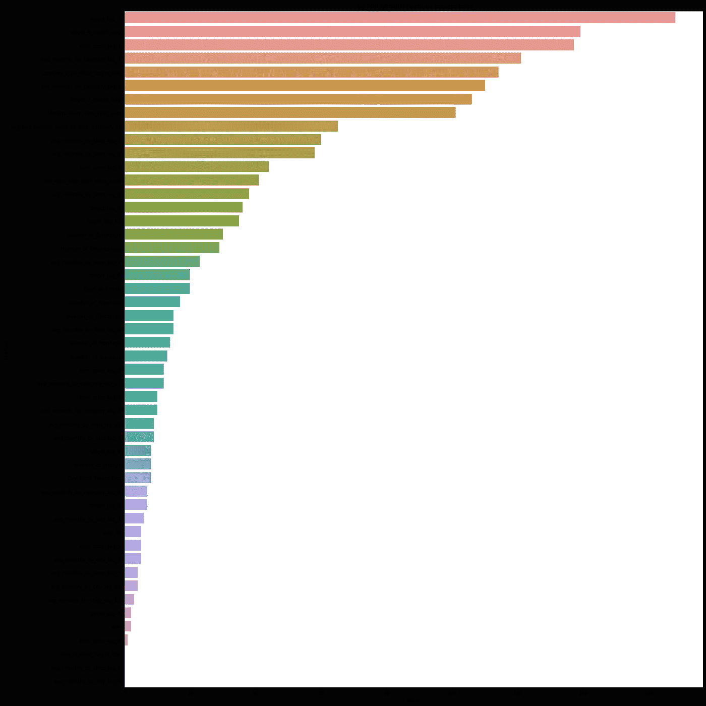

作者图片

就是这样，我们成功地训练了一个 LightGBM 模型来预测下个月的销售额。

如果你觉得这很有用，请为这个故事鼓掌。