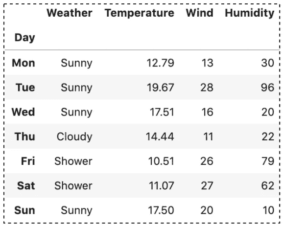

# 如何使用 loc 和 iloc 在 Pandas 中选择数据

> 原文：<https://towardsdatascience.com/how-to-use-loc-and-iloc-for-selecting-data-in-pandas-bd09cb4c3d79?source=collection_archive---------0----------------------->

## 熊猫帮助你开始数据分析的提示和技巧


[克莱班克斯](https://unsplash.com/@claybanks?utm_source=unsplash&utm_medium=referral&utm_content=creditCopyText)在 [Unsplash](/s/photos/select?utm_source=unsplash&utm_medium=referral&utm_content=creditCopyText) 上拍摄的照片

当选择数据帧上的数据时，熊猫`loc`和`iloc`是两个最受欢迎的。它们快捷、快速、易读，有时还可以互换。

在本文中，我们将探索`loc`和`iloc`之间的差异，看看它们的相似之处，并检查如何用它们执行数据选择。我们将讨论以下主题:

1.  `loc`和`iloc`的区别
2.  通过单个值进行选择
3.  通过值列表进行选择
4.  通过切片选择数据范围
5.  通过条件选择并可调用
6.  当标签是从 0 开始的整数时,`loc`和`iloc`可以互换

> 源代码请查看[笔记本](https://github.com/BindiChen/machine-learning/blob/master/data-analysis/030-pandas-loc-and-iloc/pandas-loc-and-iloc.ipynb)。

# 1.`loc`和`iloc`的区别

`loc`和`iloc`的主要区别在于:

*   `loc`是基于标签的，这意味着您必须根据行和列的**标签**来指定行和列。
*   `iloc`是基于整数位置的，所以你必须通过它们的**整数位置值**(基于 0 的整数位置)来指定行和列。

以下是`loc`和`iloc`的一些区别和相似之处:


loc 和 iloc 的异同(图片由作者提供)

为了进行演示，我们创建了一个 DataFrame，并使用 **Day** 列作为索引来加载它。

```
df = pd.read_csv('data/data.csv', **index_col=['Day']**)
```



作者图片

# 2.通过单个值进行选择

`loc`和`iloc`都允许输入单个值。我们可以使用以下数据选择语法:

*   `loc[row_label, column_label]`
*   `iloc[row_position, column_position]`

例如，假设我们想要检索星期五的温度值。

使用`loc`，我们可以传递行标签`'Fri'`和列标签`'Temperature'`。

```
# To get Friday's temperature
>>> df.**loc['Fri', 'Temperature']**10.51
```

等效的`iloc`语句应该采用行号`4`和列号`1`。

```
# The equivalent `iloc` statement
>>> df.**iloc[4, 1]**10.51
```

我们也可以使用`:`返回所有数据。例如，要获取所有行:

```
# To get all rows
>>> df.loc**[:, 'Temperature']**Day
Mon    12.79
Tue    19.67
Wed    17.51
Thu    14.44
Fri    10.51
Sat    11.07
Sun    17.50
Name: Temperature, dtype: float64# The equivalent `iloc` statement
>>> df**.iloc[:, 1]**
```

要获取所有列:

```
# To get all columns
>>> df**.loc['Fri', :]**Weather        Shower
Temperature     10.51
Wind               26
Humidity           79
Name: Fri, dtype: object# The equivalent `iloc` statement
>>> df**.iloc[4, :]**
```

注意以上 2 个输出为**系列**。`loc`和`iloc`当结果为一维数据时，将返回一个**系列**。

# 3.通过值列表进行选择

我们可以将标签列表传递给`loc`来选择多行或多列:

```
# Multiple rows
>>> df.**loc[['Thu', 'Fri'], 'Temperature']**Day
Thu    14.44
Fri    10.51
Name: Temperature, dtype: float64# Multiple columns
>>> df.**loc['Fri', ['Temperature', 'Wind']]**Temperature    10.51
Wind              26
Name: Fri, dtype: object
```

类似地，可以将整数值列表传递给`iloc`来选择多行或多列。下面是使用`iloc`的等价语句:

```
>>> df**.iloc[[3, 4], 1]**Day
Thu    14.44
Fri    10.51
Name: Temperature, dtype: float64>>> df**.iloc[4, [1, 2]]**Temperature    10.51
Wind              26
Name: Fri, dtype: object
```

以上所有输出都是**系列**，因为它们的结果都是一维数据。

例如，当结果是二维数据时，输出将是一个**数据帧**，以访问多个行和列

```
# Multiple rows and columns
rows = ['Thu', 'Fri']
cols=['Temperature','Wind']df.**loc[rows, cols]**
```


等效的`iloc`语句是:

```
rows = [3, 4]
cols = [1, 2]df.**iloc[rows, cols]**
```

# 4.通过切片选择数据范围

Slice(写为`start:stop:step`)是一种强大的技术，允许选择一系列数据。当我们想要选择两个项目之间的所有内容时，这非常有用。

## `loc`带切片

使用`loc`，我们可以使用语法`A:B`从标签 **A** 到标签 **B** 中选择数据(包括 **A** 和 **B** ):

```
# Slicing column labels
rows=['Thu', 'Fri']df.loc[rows, **'Temperature':'Humidity'** ]
```


作者图片

```
# Slicing row labels
cols = ['Temperature', 'Wind']df.loc[**'Mon':'Thu'**, cols]
```


作者图片

我们可以使用语法`A:B:S`从标签 **A** 中选择数据，以步长 **S** 标记 **B** (包括 **A** 和 **B** ):

```
# Slicing with step
df.loc[**'Mon':'Fri':2** , :]
```


作者图片

## `iloc`带切片

使用`iloc`，我们也可以使用语法`n:m`来选择从位置 **n** (包含)到位置 **m** (不包含)的数据。然而，这里的主要区别是端点( **m** )被排除在`iloc`结果之外。

例如，选择从位置 0 到 3 的列(不包括):

```
df.iloc[[1, 2], **0 : 3**]
```


作者图片

同样，我们可以使用语法`n:m:s`选择从位置 **n** (包含)到位置 **m** (不包含)的数据，步长为 **s** 。注意端点 **m** 被排除。

```
df.iloc[0:4:2, :]
```


作者图片

# 5.通过条件选择并可调用

## 情况

`**loc**` **带条件**

我们通常希望根据条件过滤数据。例如，我们可能需要找到湿度大于 50 的行。

使用`loc`，我们只需要将条件传递给`loc`语句。

```
# One condition
df.loc[**df.Humidity > 50**, :]
```


作者图片

有时，我们可能需要使用多个条件来过滤数据。例如，查找湿度大于 50 且天气为阵雨的所有行:

```
## multiple conditions
df.loc[
    **(df.Humidity > 50) & (df.Weather == 'Shower')**, 
    ['Temperature','Wind'],
]
```


作者图片

`**iloc**` **同条件**

对于`iloc`，如果将条件直接传递到语句中，我们将得到一个**值错误**:

```
# Getting ValueError
df.**iloc[df.Humidity > 50, :]**
```


作者图片

我们得到这个错误是因为`iloc`不能接受布尔序列。它只接受布尔列表。我们可以使用`list()`函数将一个系列转换成一个布尔列表。

```
# Single condition
df.iloc[**list(df.Humidity > 50)**]
```

类似地，我们可以使用`list()`将多个条件的输出转换成一个布尔列表:

```
## multiple conditions
df.iloc[
    **list((df.Humidity > 50) & (df.Weather == 'Shower'))**, 
    :,
]
```

## 可调用函数

`**loc**` **带有可调用的**

`loc`接受一个**可调用的**作为索引器。callable 必须是具有一个参数的函数，该函数返回有效的索引输出。

例如选择列

```
# Selecting columns
df.loc[:, **lambda df: ['Humidity', 'Wind']**]
```


并使用可调用的过滤数据:

```
# With condition
df.loc[**lambda df: df.Humidity > 50**, :]
```


作者图片

`**iloc**` **带有可调用的**

`iloc`也可以带一个**可调用的**作为索引器。

```
df.iloc[**lambda df: [0,1]**, :]
```


作者图片

为了用 callable 过滤数据，`iloc`需要`list()`将条件的输出转换成一个布尔列表:

```
df.iloc[**lambda df: list(df.Humidity > 50)**, :]
```


作者图片

# 6.当标签是从 0 开始的整数时，`loc`和`iloc`可以互换

为了演示，让我们创建一个数据帧，用从 0 开始的整数作为标题和索引标签。

```
df = pd.read_csv(
    'data/data.csv', 
    **header=None,** 
    **skiprows=[0],**
)
```

使用`header=None`，熊猫将生成以 0 为基的整数值作为头。有了`skiprows=[0]`，我们一直在用的那些头**天气**、**温度、**等都将被跳过。


作者图片

现在，`loc`，一个基于标签的数据选择器，可以接受单个整数和一个整数值列表。例如:

```
>>> df**.loc[1, 2]** 19.67 >>> df**.loc[1, [1, 2]]** 1    Sunny
2    19.67
Name: 1, dtype: object
```

他们工作的原因是那些整数值(`1`和`2`)被解释为指数的 ***标签*** 。这种用法是**而不是**一个带有索引的整数位置，有点混乱。

在这种情况下，通过单个值或值列表进行选择时，`loc`和`iloc`可以互换。

```
>>> df.**loc[1, 2]** == df.**iloc[1, 2]**
True>>> df.**loc[1, [1, 2]]** == **df.iloc[1, [1, 2]]**
1    True
2    True
Name: 1, dtype: bool
```

请注意，通过切片和条件选择时，`loc`和`iloc`将返回不同的结果。它们本质上是不同的，因为:

*   切片:端点从`iloc`结果中排除，但包含在`loc`中
*   条件:`loc`接受布尔序列，但`iloc`只能接受布尔列表。

# 结论

最后，这里是一个总结

`loc`基于标签，允许的输入有:

*   单个标签`'A'`或`2`(注意`2`被解释为索引的*标签*。)
*   标签列表`['A', 'B', 'C']`或`[1, 2, 3]`(注意`1, 2, 3`解释为索引的*标签*。)
*   带标签的切片`'A':'C'`(两者都包含)
*   条件、布尔序列或布尔数组
*   一个只有一个参数的`callable`函数

`iloc`基于整数位置，允许的输入有:

*   整数，例如`2`。
*   整数列表或数组`[1, 2, 3]`。
*   整数切片`1:7`(端点`7`除外)
*   条件，但只接受布尔数组
*   一个有一个参数的函数

当熊猫数据帧的标签是从 0 开始的整数时,`loc`和`iloc`可以互换

希望这篇文章能帮助你节省学习熊猫数据选择的时间。我建议你查看一下[文档](https://pandas.pydata.org/pandas-docs/stable/user_guide/indexing.html)来了解你可以做的其他事情。

感谢阅读。请查看[笔记本](https://github.com/BindiChen/machine-learning/blob/master/data-analysis/030-pandas-loc-and-iloc/pandas-loc-and-iloc.ipynb)获取源代码，如果你对机器学习的实用方面感兴趣，请继续关注。

## 你可能会对我的其他一些熊猫文章感兴趣:

*   [Pandas cut()函数，用于将数值数据转换为分类数据](/all-pandas-cut-you-should-know-for-transforming-numerical-data-into-categorical-data-1370cf7f4c4f)
*   [使用熊猫方法链接提高代码可读性](https://medium.com/@bindiatwork/using-pandas-method-chaining-to-improve-code-readability-d8517c5626ac)
*   [如何对熊猫数据帧进行自定义排序](/how-to-do-a-custom-sort-on-pandas-dataframe-ac18e7ea5320)
*   [为了数据分析你应该知道的所有熊猫移位()](/all-the-pandas-shift-you-should-know-for-data-analysis-791c1692b5e)
*   [何时使用 Pandas transform()函数](/when-to-use-pandas-transform-function-df8861aa0dcf)
*   [你应该知道的熊猫串联()招数](/pandas-concat-tricks-you-should-know-to-speed-up-your-data-analysis-cd3d4fdfe6dd)
*   [Pandas 中 apply()和 transform()的区别](https://medium.com/@bindiatwork/difference-between-apply-and-transform-in-pandas-242e5cf32705)
*   [所有的熊猫合并()你应该知道](/all-the-pandas-merge-you-should-know-for-combining-datasets-526b9ecaf184)
*   [在熊猫数据帧中处理日期时间](/working-with-datetime-in-pandas-dataframe-663f7af6c587)
*   [熊猫阅读 _csv()你应该知道的招数](https://medium.com/@bindiatwork/all-the-pandas-read-csv-you-should-know-to-speed-up-your-data-analysis-1e16fe1039f3)
*   [用 Pandas read_csv()](/4-tricks-you-should-know-to-parse-date-columns-with-pandas-read-csv-27355bb2ad0e) 解析日期列应该知道的 4 个技巧

更多教程可以在我的 [Github](https://github.com/BindiChen/machine-learning) 上找到