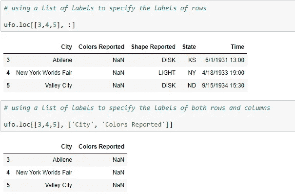
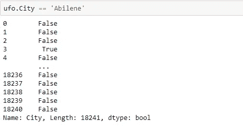

# 如何在熊猫身上使用 loc

> 原文：<https://towardsdatascience.com/how-to-use-loc-in-pandas-49ed348a4117?source=collection_archive---------3----------------------->

## 了解如何使用 pandas Python 库中的 loc 方法


马库斯·斯皮斯克在 [Unsplash](https://unsplash.com?utm_source=medium&utm_medium=referral) 上的照片

为熊猫的数据帧建立索引是一项非常重要的技能。索引仅仅意味着在数据帧或系列中选择特定的行和/或列。

在本教程中，我们将学习 ***loc*** 方法，这是最简单的和最通用的*方法来索引 pandas 中的数据帧。*

## 制作数据框

我们将使用 jupyter 笔记本中的[这里](http://bit.ly/uforeports)找到的 ufo 目击数据集。让我们将数据读入数据帧，看看 ufo 数据帧的前 5 行:


我们 ufo 数据帧的前 5 行

让我们看看关于我们的数据框架的其他一些信息:


> 我们使用了 **shape** 和 **columns** dataframe 属性来分别获取数据帧的形状(行数、列数)和列名。

# 锁定方法

索引数据帧最通用的方法可能是[***loc***](https://pandas.pydata.org/pandas-docs/stable/reference/api/pandas.DataFrame.loc.html)方法。loc 既是 dataframe 又是 series 方法，这意味着我们可以对这些 pandas 对象中的任何一个调用 loc 方法。当在数据帧上使用 ***loc*** 方法时，我们通过使用以下格式指定*我们想要的行和列:*

> data frame . loc[指定的行:指定的列]

有**种不同的**方式来指定我们想要选择的行和列。例如，我们可以传入一个**单个标签、一个标签列表或数组、一个带标签的切片对象或一个布尔数组**。

让我们来看一下这些方法！

## 使用单一标签

我们可以指定哪些*行和/或哪些*列的一种方法是使用标签。对于行，标签是该行的索引值，对于列，列名是标签。例如，在我们的 ufo 数据帧中，如果我们只想要第五行以及所有的列，我们将使用如下:

```
ufo.loc[4, :]
```


单一标签

> **我们传入的标签永远被解释为标签。它永远不会被解释为沿着索引的整数位置。**所以我们通过使用特定行的**标签**来指定我们想要的行，这是 4，因为我们想要所有的列，我们将只使用冒号。

*注意:我们可以省略冒号，我们会得到相同的输出，但是，为了代码可读性，最好保留冒号，以明确显示我们需要所有列。*

## 标签的列表或数组

假设我们想要多个*行和/或列*。我们如何指定它？嗯，使用标签，我们可以输入一个**标签列表，或者使用你可能熟悉的类似于切片符号**的东西。

让我们从**标签列表**开始:



标签列表

*注意我们如何用标签列表指定行和列标签。*

## 切片对象

我们也可以使用以下格式的**切片符号**:

> 开始标签:停止标签

**然而，与使用列表或字符串的切片符号相反，开始和停止标签都包含在我们的输出**中:


带标签的切片对象

> 请注意行标签 3、4 和 5 是如何包含在我们的输出数据帧中的。还要注意 City、Colors Reported 和 Shape Reported 列是如何包含在内的，即使我们使用 slice 对象停止在 Shape Reported。记住，ufo.columns 返回了一个列表，其顺序为城市、报告的颜色、报告的形状、州和时间。我们包括从城市标签到形状报告标签的所有内容，其中还包括颜色报告标签。

## 布尔数组

最后，我们可以使用布尔值数组**。然而，这个布尔值数组的长度必须与我们正在使用的轴的长度相同。例如，根据我们上面使用的 ***shape*** 属性，我们的 ufo dataframe 的形状为 *(18241，5)* ，意味着它有 18241 行 5 列。**

**所以如果我们想用一个布尔数组来指定我们的行，那么它也需要有 18241 个元素的长度。如果我们想使用一个布尔数组来指定列，它需要有 5 个元素的长度。创建这个布尔数组最常见的方法是使用一个 ***条件，它创建一个可对齐的布尔序列*** 。**

**例如，假设我们只想选择包含 *Abilene* 的行作为 ufo 目击事件发生的城市。我们可以从以下情况开始:**

```
ufo.City == ‘Abilene’
```

****

**注意这是如何返回长度为 18241 并且由布尔值(真或假)组成的熊猫序列(或类似数组的对象)的。**这是我们需要能够使用这个布尔数组使用 loc 方法指定我们的行的值的确切数目**!**

**想象我们将这一系列真值和假值覆盖在 ufo 数据帧的索引上。只要这个序列中有一个真的布尔值，这个特定的行将被选中并显示在我们的数据帧中。**

***我们可以在上面看到，第一个真值出现在第 4 行，标签为 3，这意味着一旦我们用 loc 方法使用这个布尔值数组，我们将看到的第一行是标签为 3 的行(或 ufo 数据帧中的第 4 行)*。**

```
ufo.loc[ufo.City == ‘Abilene’, :]
```

****

**阿比林的不明飞行物目击事件**

> **这正是我们所看到的！我们已经使用长度等于原始数据帧中的行数的布尔值数组指定了我们想要的行。**

## **可调用函数**

**我们还可以向 ***loc*** 方法传递一个可调用的函数来指定行和/或列。该函数将接受一个参数，该参数将是**调用序列或数据帧**，并且必须返回一个用于索引的**有效输出，该输出可以是上面我们讨论过的任何方法(比如布尔数组)。****

**例如，我们可以使用 lambda 函数获得与上面相同的数据帧，其中包括所有以 Abilene 为城市的行:**

```
ufo.loc[lambda df: df.City == ‘Abilene’, :]
```

> **我们使用带有一个参数的 lambda 函数来指定行。传递给 lambda 函数的参数是 ufo 数据帧(被索引的数据帧)。lambda 函数返回一个布尔数组，然后用于指定行。**

**</lambda-expressions-in-python-9ad476c75438> ** 

## **结合这些方法**

**记住，我们可以**组合**这些不同的指定行和列的方式，这意味着我们可以对行使用一种索引方式，对列使用不同的方式。例如:**

```
ufo.loc[ufo.City == ‘Abilene’, ‘City’:’State’]
```

****

> **请注意我们如何使用返回布尔值数组的条件来指定行，以及如何使用标签来指定列的切片对象。**

**如果你喜欢阅读这样的故事，并想支持我成为一名作家，考虑注册成为一名媒体成员。每月 5 美元，你可以无限制地阅读媒体上的故事。如果你注册使用我的 [***链接***](https://lmatalka90.medium.com/membership) *，我会赚一小笔佣金。***

**<https://lmatalka90.medium.com/membership> ** 

## **结论**

**在本教程中，我们学习了如何使用 ***loc*** 方法索引熊猫数据帧。我们了解了 ***loc*** 方法是如何既是 series 方法又是 dataframe 方法，并可用于在索引 dataframe 时指定行和列。我们研究了指定行和列的不同方法，包括**标签的单个或列表、带标签的切片对象、通常使用条件创建的布尔数组，以及返回任何上述内容的可调用函数**。最后，我们学习了如何将这些不同的方法结合起来，同时用于索引熊猫的数据帧。**