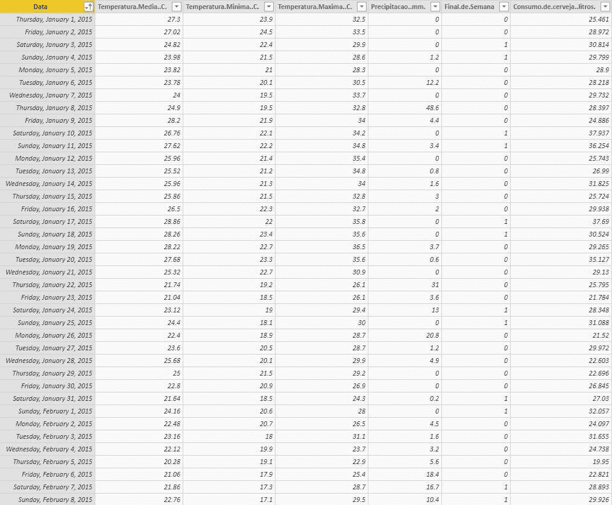
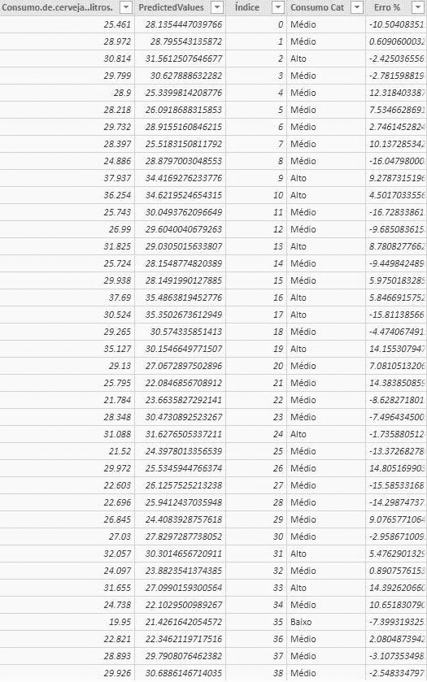
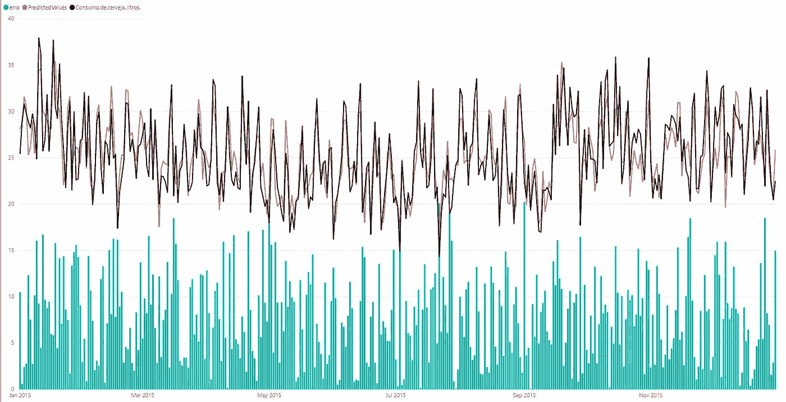
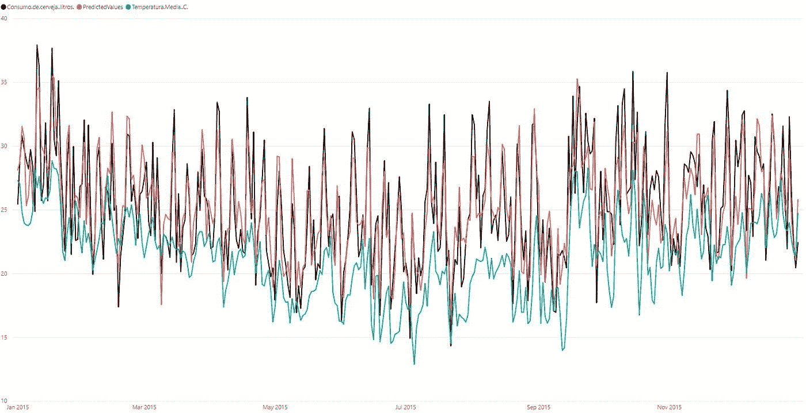
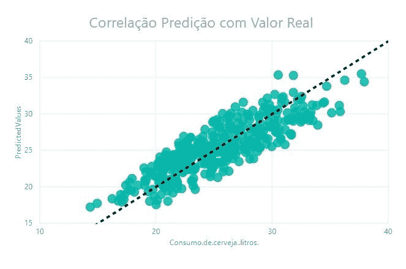
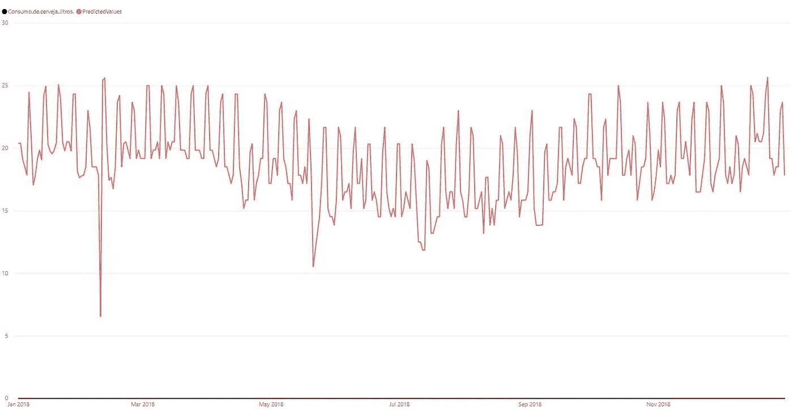
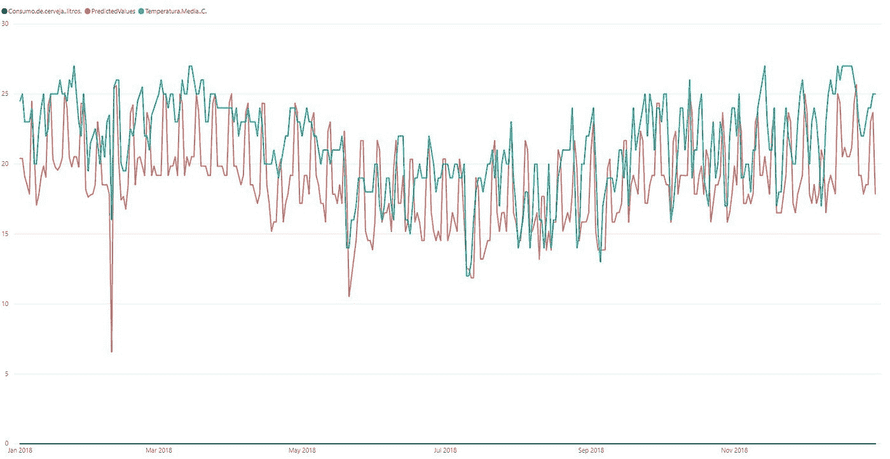
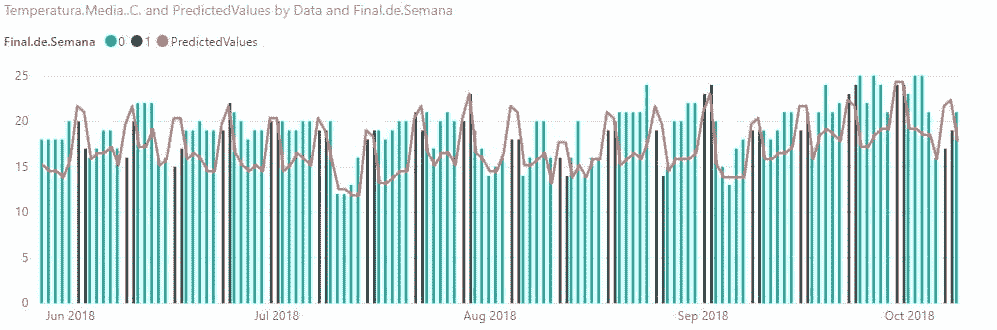
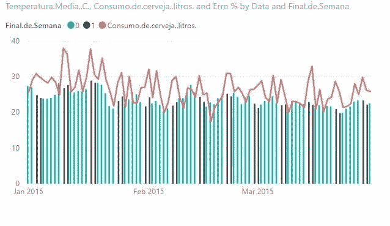

# 如何用 R 在 Power BI 中使用机器学习

> 原文：<https://towardsdatascience.com/how-to-use-machine-learning-in-power-bi-with-r-6b6a930f0310?source=collection_archive---------32----------------------->

## 用人工智能赋能您的仪表盘

微软最近一直在大力调整开源技术，并将人工智能技术融入其产品中，Power BI 也包括在这一计划中。Power BI 是当今构建仪表板的主要工具之一，微软每天都在增加其开发能力和灵活性。

为了使仪表板的开发可行，Power BI 有几个用于数据处理的功能，其中最重要的一个是与 R 的集成工具，以及最近与 Python 的集成。使用 R 和 Python 开发语言的选项在 BI 工具中开辟了大量的可能性，其中一个可能性是使用机器学习工具并直接在 Power BI 中构建模型。

在本文中，我将从以下主题开始，逐步讲解如何使用 R 语言在 PowerBI 中直接使用机器学习模型进行训练和预测:

1.  安装依赖项
2.  分析数据
3.  动手——代码
4.  结果
5.  结论

## 1.安装依赖项

第一步是在您的机器上安装 R Studio，因为开发将使用 R 语言。尽管 PowerBI 与 R 语言有着本机集成，但它要求用户在机器上安装 R 包。

可以通过这个链接下载:[https://www.rstudio.com/products/rstudio/download/](https://www.rstudio.com/products/rstudio/download/)

安装完成后，您必须打开 R studio 并安装依赖库。

*   脱字号
*   数据集
*   monomvn

要在 R 中安装软件包，R-bloggers 网站有一个很棒的教程，教你如何在 R Studio 中安装和加载软件包。链接:[https://www . r-bloggers . com/2013/01/how-to-install-packages-on-r-screens/](https://www.r-bloggers.com/2013/01/how-to-install-packages-on-r-screenshots/)

## 分析数据

该数据集是从 kaggle.com 网站获得的，包括圣保罗一所大学的啤酒消费数据，以及每天的最低、最高和平均温度以及体积降雨量。

为了添加另一个重要的功能，我创建了一个名为“周末”的列，指示当天是周六还是周日，因为周末的消费量较高，所以我可以考虑周五，但对于这一时刻，我决定更保守一些。



数据集—作者

## 3-实践-代码

对于测试，我使用 monomvn 包(Bayesian Ridge Regression)建立了一个贝叶斯线性回归模型，以预测每天的啤酒消费数据(升),并通过 10 倍的交叉验证进行验证。

在本文中，我不会深入讨论这个模型及其结果，因为我们的目标是更多地关注与 Power BI 的集成，而不是建模。

代码的第一部分导入库

```
library(caret)
library(datasets)
library(monomvn)
```

在我们将 Power BI 数据作为数据集导入后，在 R

```
mydata <- dataset
mydata <- data.frame(mydata)
```

有了它，我们就可以创建模型并进行预测。在这种情况下，我没有定义测试数据集，我只是使用带有 CV10 验证的训练数据集来简要分析训练指标。

```
fitControl <- trainControl(
  method = "repeatedcv",
  number = 10,
  repeats = 10)

lmFit <- train(mydata[1:365, 2:6],mydata[1:365,7], method ='bridge',trControl = fitControl)

predictedValues <- predict(lmFit,newdata = mydata[, 2:6])
```

最后，我们用模型预测生成的值在 PowerBI 数据集中创建了一个新列。

```
mydata$PredictedValues <- predictedValues
```

**完整代码**

```
library(caret)
library(datasets)
library(monomvn)

mydata <- dataset
mydata <- data.frame(mydata)

fitControl <- trainControl(
  method = "repeatedcv",
  number = 10,
  repeats = 10)

lmFit <- train(mydata[1:365, 2:6],mydata[1:365,7], method ='bridge',trControl = fitControl)

predictedValues <- predict(lmFit,newdata = mydata[, 2:6])

mydata$PredictedValues <- predictedValues
```

## 4 —结果

下面是包含真实值、预测值和误差(%)的完整数据集。训练的平均误差为 **7.82%** ，最大 20.23%，最小 0.03%



预测—作者

下面是一个图表，黑色表示真实数据，红色表示预测数据，蓝色表示整个测试期间的误差。



真实 x 预测—作者

## 4.1-与温度的相关性

当绘制啤酒消费量(黑色/红色)与温度(蓝色)的关系图时，我们看到消费量很好地遵循了月份之间的温度变化，包括温度变化的“微观”(每日)变化和“宏观”(趋势)。我们看到温度的上升导致了更大的消费，例如在一年的岁末年初，这是夏天，而冬天较低的温度导致了啤酒消费的减少。



预测和温度—作者

## 4.2.真实数据和预测之间的相关性

在实际值和模型预测值之间应用相关性，我们会得到集中在黑色虚线(下图)中的理想数据，在这种情况下，预测数据将等于实际数据。通过制作这个相关图，我们可以看到模型预测的分散程度，以及预测的集中程度是被低估还是被高估。

当分析相关图时，我们看到初始模型的离差没有那么高，平均变化为 7.8%，如前所述。当分析数据的集中度时，我们看到模型在预测值大于或小于真实值之间变化，但在大多数情况下，模型略微高估了消费数据，预测的消费高于真实值。



预测 x 真实数据相关性—作者

## 4.3 测试— 2018 年数据

在用 2015 年的数据训练模型之后，我试图获得用于推断的数据，并获得了 2018 年圣保罗市的温度和降雨量数据的数据集。

下面要注意的是，2018 年数据中的推断值显示了与真实数据相同的模式，随着温度的降低，年中的消费量减少，周末出现峰值。



2018 年测试数据预测—作者

## 4.3.1 温度相关性

然后用蓝色标出的数值和温度一起证明了消费和温度之间的相关性，并在推断数据中展示了其全年的动态。



2018 年温度测试数据预测—作者

## 4.3.2 周末的季节性

解释季节性周期的一种方式是周末啤酒消费量的增加，我们可以在平均温度的消费量图表下方看到，黑色条代表周末、周六和周日。



与周末的相关性(测试)—作者

这种季节性也发生在实际数据中，当我们绘制 2015 年的实际消费时，高消费模式在周末重复出现，这表明该模型尽管简单，但却很好地适应了数据动态。



与周末的相关性(火车)—作者

## 5.结论

Power BI 作为一种图形工具，除了能够同时呈现数据库本身的探索性视图之外，还提供了从机器学习模型输出开发分析可视化的巨大多功能性和速度。对于在分析领域工作的开发人员来说，将机器学习模型的功能整合到 BI 工具中无疑是一项重大进步，PowerBI 以简单实用的方式带来了这一功能。

最后，关于这篇文章或机器学习、PowerBI、R、Python 等话题的任何问题或建议，请随时在 LinkedIn 上联系我:[https://www.linkedin.com/in/octavio-b-santiago/](https://www.linkedin.com/in/octavio-b-santiago/)