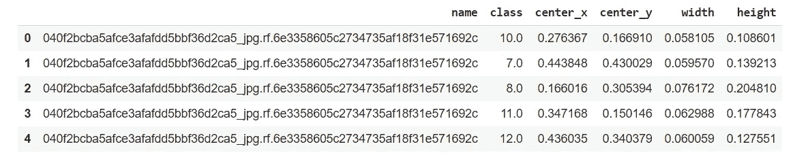
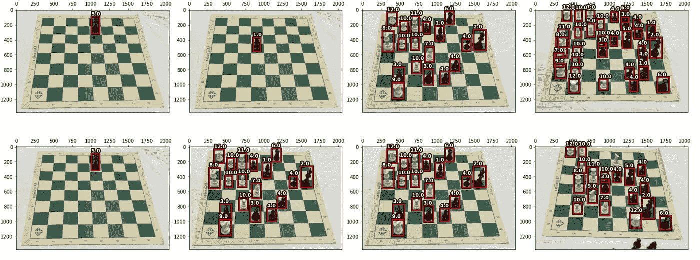
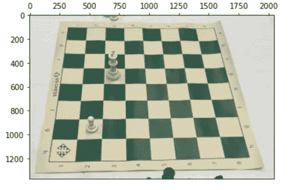
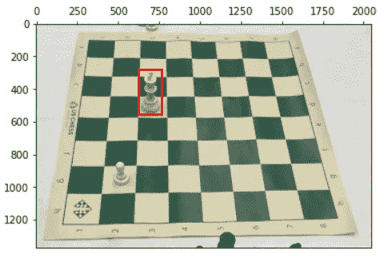
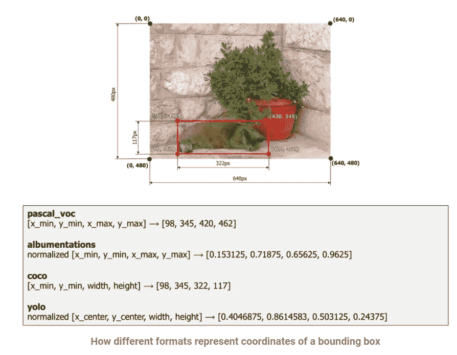
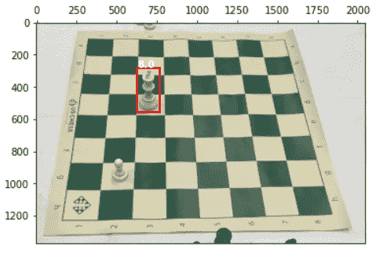
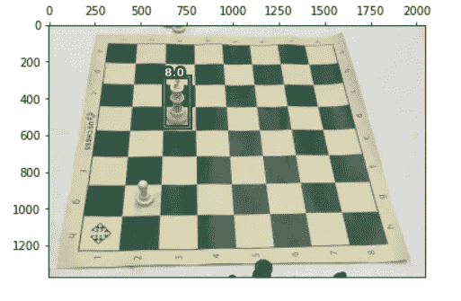
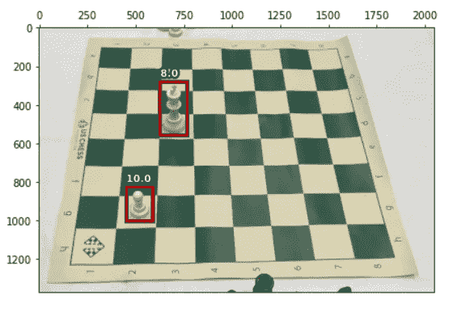

# 如何使用 Matplotlib 绘制对象检测数据集中的样本

> 原文：<https://towardsdatascience.com/how-to-use-matplotlib-for-plotting-samples-from-an-object-detection-dataset-5877fe76496d?source=collection_archive---------11----------------------->

## 为目标检测绘图

## 关于如何使用 Matplotlib 为对象检测任务绘制图形的简短教程


帕特里克·托马索在 [Unsplash](https://unsplash.com?utm_source=medium&utm_medium=referral) 上的照片

可视化数据集中的样本对于有效探索机器学习任务至关重要。它提供了关键的见解，帮助您从模型架构、数据扩充等几个可用选项中缩小选择范围。与分类或回归任务相比，绘制来自对象检测数据集的样本更加棘手。

下面是一个简短的教程，介绍如何使用 Matplotlib 库为对象检测样本创建高质量的绘图。

## 下载数据集和其他文件

我们将使用 Yolov5 PyTorch 版本的国际象棋数据集，你可以从 https://public.roboflow.com/object-detection/chess-full/23[下载。我们还将使用上一篇文章](https://public.roboflow.com/object-detection/chess-full/23)[“使用对象检测数据集在 PyTorch 中创建数据集管道的一般方法”](/a-tutorial-on-creating-data-pipeline-for-object-detection-using-pytorch-and-fastai-eae20a4e8472)中的数据帧。

如果你还没有这样做，请读一读。以下是数据框的链接。

1.  [https://raw . githubusercontent . com/varun 9213/Blog _ machine _ learing/main/Data _ Blog _ 1/train _ FD . CSV](https://raw.githubusercontent.com/Varun9213/Blog_machine_learing/main/Data_blog_1/train_fd.csv)
2.  [https://raw . githubusercontent . com/varun 9213/Blog _ machine _ learing/main/Data _ Blog _ 1/valid _ FD . CSV](https://raw.githubusercontent.com/Varun9213/Blog_machine_learing/main/Data_blog_1/train_fd.csv)
3.  [https://raw . githubusercontent . com/varun 9213/Blog _ machine _ learing/main/Data _ Blog _ 1/test _ FD . CSV](https://raw.githubusercontent.com/Varun9213/Blog_machine_learing/main/Data_blog_1/train_fd.csv)

你可以从[这里](https://github.com/Varun9213/Blog_machine_learing/blob/main/Plotting_blog_2.ipynb)下载完整的笔记本教程。

现在，让我们开始编码吧！！

首先，导入教程所需的所有库和文件

```
!pip install fastai --upgrade

from fastai import *
from fastai.vision.all import *
from fastai.imports import *
import cv2, os
from matplotlib import patches, text, patheffectsroot = Path("/content/data")!curl -L "https://public.roboflow.com/ds/pK9BobmV9A?key=G9IUWXkCZA" > roboflow.zip; unzip roboflow.zip; rm roboflow.ziptrain_df = pd.read_csv
("[https://raw.githubusercontent.com/Varun9213/Blog_machine_learing/main/Data_blog_1/train_fd.csv](https://raw.githubusercontent.com/Varun9213/Blog_machine_learing/main/Data_blog_1/train_fd.csv)")valid_df = pd.read_csv
("[https://raw.githubusercontent.com/Varun9213/Blog_machine_learing/main/Data_blog_1/valid_fd.csv](https://raw.githubusercontent.com/Varun9213/Blog_machine_learing/main/Data_blog_1/valid_fd.csv)")test_df = pd.read_csv
("[https://raw.githubusercontent.com/Varun9213/Blog_machine_learing/main/Data_blog_1/test_fd.csv](https://raw.githubusercontent.com/Varun9213/Blog_machine_learing/main/Data_blog_1/test_fd.csv)")train_df.head()
```



作者图片

# 履行

让我们先来看看我们希望最终的剧情是怎样的。



作者图片

好了，现在我们心中有了一个明确的目标，让我们看看实现。

如果你读过我以前的帖子，我喜欢把一个问题分解成更小的部分，所以，让我们从绘制数据集的图像开始，只为图像中的一个对象绘制一个边界框。

```
train_images = get_image_files(root/"train")fig, ax = plt.subplots()
path_img = train_images[0]img = cv2.imread(str(path_img))
img = cv2.cvtColor(img, cv2.COLOR_RGB2BGR)ax.xaxis.tick_top()
ax.imshow(img)
```



作者图片

> ***注****get _ image _ files()*是一个 fastai 函数，返回父目录下所有图片的路径列表，可以访问[https://docs.fast.ai/](https://docs.fast.ai/)进一步探索库。

```
def get_target_ds(name, df):
  rows = df[df["name"] == name[:-4]]
  return rows["class"].values, rows[bboxes_cols].valuesbboxes_cols = ["center_x", "center_y", "width", "height"]
labels, boxes = get_target_ds(path_img.name, train_df)x = (boxes[0][0] - boxes[0][2]*0.5)*img.shape[1]
y = (boxes[0][1] - boxes[0][3]*0.5)*img.shape[0]
w = boxes[0][2] * img.shape[1]
h = boxes[0][3] * img.shape[0]fig, ax = plt.subplots(figsize = (6,9))ax.xaxis.tick_top()
ax.imshow(img)
ax.add_patch(patches.Rectangle((x,y),w,h, fill=False, edgecolor='red', lw=2))
```



作者图片

好了，现在让我们来分解这个代码块，看看这个盒子到底是如何出现在图像中的。

ax.add_patch()是一个 Matplotlib 方法，用于在绘图上绘制一个图形或一个补丁，我们在这里使用它来绘制一个由边界框坐标给出的矩形。

补丁。Rectangle()是我们传递给 add_patch()方法的参数，该方法随后将矩形绘制到图像上。注意，需要传递给函数的边界框的格式是 *((x_min，y_min)，width，height)* 然而，数据集为边界框提供的格式是不同的，必须转换成所需的格式。

当我们选择数据集的 Yolo 版本时，边界框的格式是*【x _ center，y_center，width，height】。N* 注意，这里的坐标已经标准化，必须根据图像的分辨率按比例缩小。



来源:物体检测的白蛋白文档

> **注意**您可以在此处[找到的相册文档中的图像](https://albumentations.ai/docs/getting_started/bounding_boxes_augmentation/)向您展示了坐标系在大多数绘图和增强库中是如何工作的。与我们通常使用的坐标系相比，它是上下颠倒的。它还向您展示了边界框的坐标是如何以各种格式表示的。

最后，让我们给盒子加上相应的标签。

```
fig, ax = plt.subplots(figsize = (6,9))
ax.xaxis.tick_top()
ax.imshow(img)ax.add_patch(patches.Rectangle((x,y),w,h, fill=False, edgecolor='red', lw=2))**ax.text(x,(y-50),str(labels[0]),verticalalignment='top',
color='white',fontsize=10,weight='bold')**
```



作者图片

这个图中似乎还缺少一些东西，我们的目标图比我们刚刚创建的要干净得多。

不同之处在于我们的目标图缺少轮廓，让我们添加轮廓以获得更清晰的图。

```
fig, ax = plt.subplots(figsize = (6,9))
ax.xaxis.tick_top()
ax.imshow(img)ax.add_patch(patches.Rectangle((x,y),w,h, fill=False, edgecolor='red', lw=2))**.set_path_effects([patheffects.Stroke(linewidth=4, foreground='black'), patheffects.Normal()])**ax.text(x,(y-50),str(labels[0]),verticalalignment='top',
color='white',fontsize=10,weight='bold')**.set_path_effects([patheffects.Stroke(linewidth=4, foreground='black'), patheffects.Normal()])**
```



作者图片

是啊！这个看起来好多了。最后，总结一下，让我们为每一步创建函数，并在图像中用相应的标签画出所有的方框。同样，让我们创建一个函数来为多个样本生成图。

```
def get_bb(bboxes, img): boxes = bboxes.copy()
  boxes[:,0] = (boxes[:,0] - boxes[:,2]*0.5)*img.shape[1]
  boxes[:,1] = (boxes[:,1] - boxes[:,3]*0.5)*img.shape[0]
  boxes[:,2] = boxes[:,2] * img.shape[1]
  boxes[:,3] = boxes[:,3] * img.shape[0] if boxes.shape[0] == 1 : return boxes
  return np.squeeze(boxes)def img_show(img, ax = None, figsize=(7,11)):
  if ax is None: fig, ax = plt.subplots(figsize=figsize)
  ax.xaxis.tick_top()
  ax.imshow(img) return axdef draw_outline(obj):
  obj.set_path_effects([patheffects.Stroke(linewidth=4,  foreground='black'), patheffects.Normal()])def draw_box(img, ax, bb):
  patch = ax.add_patch(patches.Rectangle((bb[0],bb[1]), bb[2], bb[3], fill=False, edgecolor='red', lw=2))
  draw_outline(patch)def draw_text(ax, bb, txt, disp):
  text = ax.text(bb[0],(bb[1]-disp),txt,verticalalignment='top'
  ,color='white',fontsize=10,weight='bold')
  draw_outline(text)def plot_sample(img, bboxes, labels, ax=None, figsize=(7,11)):
  bb = get_bb(bboxes, img)
  ax = img_show(img, ax=ax)
  for i in range(len(bboxes)):
    draw_box(img,ax,bb[i])
    draw_text(ax, bb[i], str(labels[i]), img.shape[0]*0.05)def multiplot(dim:tuple, df, images, idxs = None, figsize=(18,10)):
  if idxs is None: idxs = np.random.randint(0, len(images)-1,          dim[0]*dim[1])
  fig, ax = plt.subplots(dim[0],dim[1], figsize=figsize)
  plt.subplots_adjust(wspace=0.1, hspace=0)
  fig.tight_layout()
  for i in range(dim[0]):
    for j in range(dim[1]):
      img = images[idxs[(i+1)*j]]
      labels, bboxes = get_target_ds(img.name, df)
      img = cv2.imread(str(img), cv2.IMREAD_UNCHANGED)
      img = cv2.cvtColor(img, cv2.COLOR_RGB2BGR)
      plot_sample(img, bboxes, labels, ax=ax[i][j]) plot_sample(img, boxes, labels)
```



作者图片

```
multiplot((2,4), train_df, train_images, figsize=(20,8))
```


作者图片

# 结论

在完成一个机器学习项目后，你意识到你的大部分编码时间都花在了预处理、EDA、绘制样本、增强和构建管道上。从长远来看，熟悉打印库可以节省大量时间。

我希望这篇文章能帮助你更有效地使用这些绘图功能。我将在下一篇文章中讨论数据增强，在我看来，如果使用得当，它会给你带来最佳的性能。

敬请关注，谢谢！！