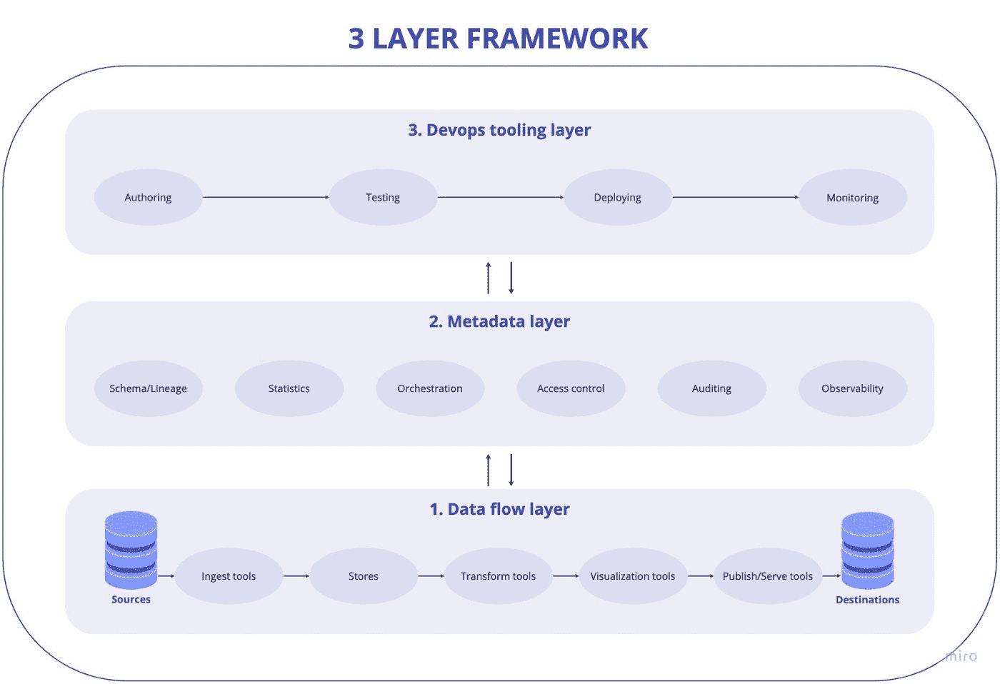
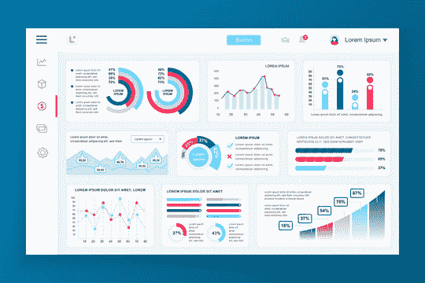
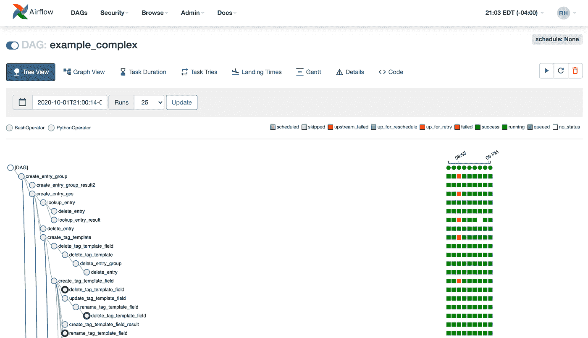
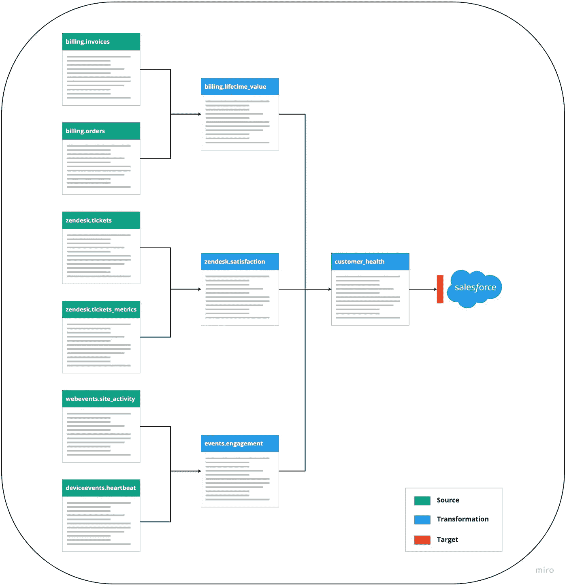
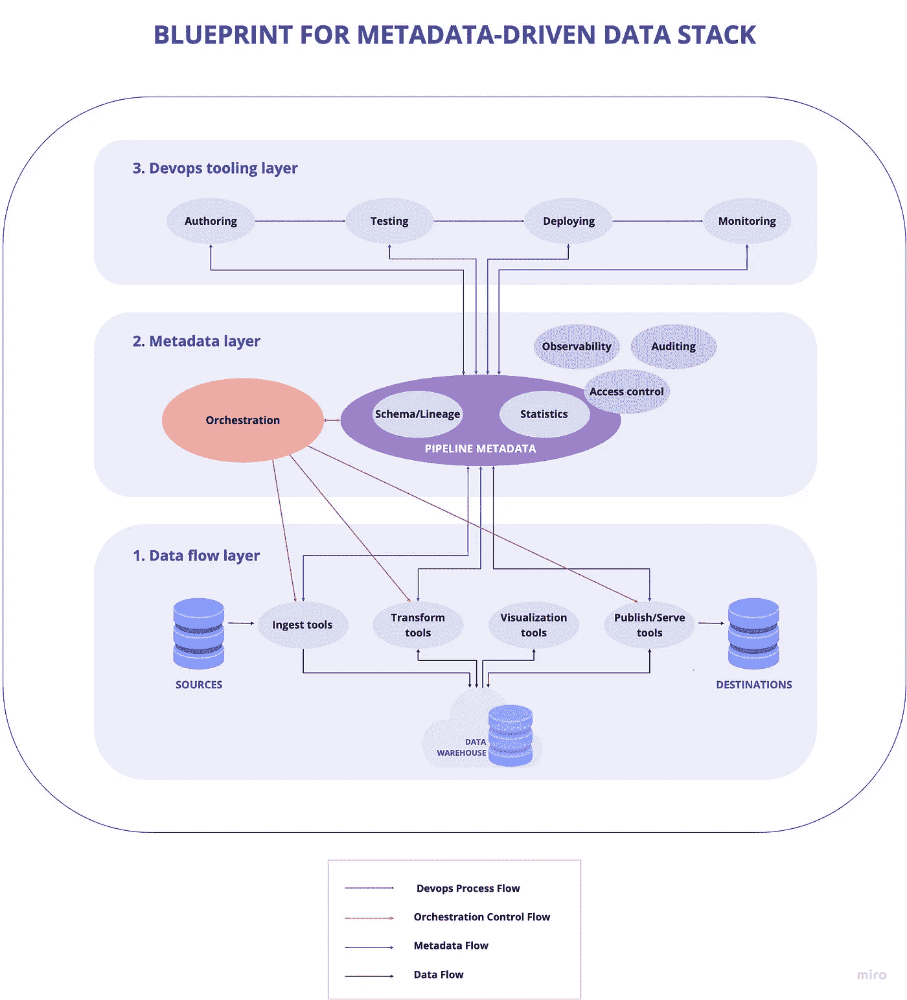
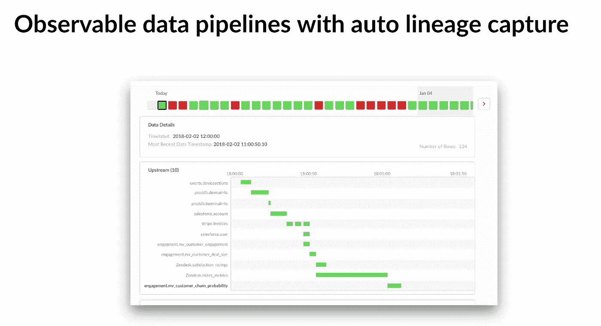

# 如何使用元数据让您的数据堆栈面向未来

> 原文：<https://towardsdatascience.com/how-to-use-metadata-to-future-proof-your-data-stack-97c4885f97f6?source=collection_archive---------12----------------------->

## *消除元数据孤岛、分散的专业知识和长期的数据管理复杂性。*

当构建或重新思考他们的数据堆栈时，组织通常以工具优先的心态来完成任务。我们最近查看了流行的工具，如 Fivetran、dbt、Airflow 和 Looker on Snowflake，并注意到许多参考架构和实施计划都过于复杂。不一定要这样。

我们推荐了一个[简化概念框架](https://www.datacoral.com/blog/the-3-things-to-keep-in-mind-while-building-the-modern-data-stack/)来考虑构建数据堆栈。我们相信，让元数据驱动堆栈提供了清晰的关注点分离，并鼓励简单性。此外，它还帮助数据团队进行战略性思考，并使用*正确的*工具来满足他们的数据战略需求。

我们的三层框架如下所示:

*   第 1 层:数据流
*   第 2 层:元数据
*   第 3 层:开发运维工具

图片由 Datacoral 提供。

让我们更深入地了解为什么元数据对于构建可伸缩和可维护的数据堆栈如此重要；为什么元数据是大多数公司事后才想到的；以及如何采用整体平台方法来满足数据目标。

# 缺少元数据

全球各地的公司都在构建数据堆栈，并在数据团队上投入巨资，这导致了用于管理数据处理、状态管理和配置的工具激增。这些工具非常适合构建接收和转换数据的管道，但是它们最终会产生元数据孤岛。这些孤岛导致不同工具之间的阻抗不匹配，从而导致缺乏内聚智能。通过将元数据从一个工具转换到另一个工具，需要大量粘合代码来集成工具。

为什么？在很大程度上，数据堆栈是基于普遍的业务需求零碎构建的。当您是一家拥有少量数据的小公司时，很难证明采用平台方法来构建数据架构是正确的。但是，随着公司的发展，工具越来越多，导致数据堆栈的视图支离破碎，复杂性呈指数级增长。

业务领导需要有价值的见解，而数据团队需要稳定的基础设施，以支持处理数百万条记录的数据管道。业务领导希望根据最新数据做出最新决策，而数据团队则担心模式更改对转型工作的连锁影响。我们可以看到数据堆栈的目标会有多快出现分歧。

*当业务洞察力、稳定的基础设施和干净的元数据结合在一起时，有意义的价值可以在数据堆栈中快速轻松地获得。提供的图像是一个库存图像。*

有一种元数据优先的方法来解决更广泛的行业开始看到的问题，但还不能完全解决。最近几个月，我们已经看到几个以元数据为中心的产品上市，这非常令人鼓舞。但是，这些产品中的大多数解决了更简单的短期问题，如数据源、仪表板、机器学习作业和电子表格的编目，以支持搜索、审计和合规性。这些元数据搜索工具真的很有用，但是它们并没有解决公司真正需要有一个一致堆栈的平台方法。

今天的元数据工具集中了来自不同系统的元数据，并试图提供一个单一窗口来显示整个堆栈中发生的事情。但是，不同工具之间的元数据并不一致，因为每个工具的构建方式不同，这意味着需要做更多的工作来标准化元数据。用元数据标准化玩打地鼠很快就会过时。数据从业者经常发现遗留的元数据系统并不总是最新的，所以工具本身随着对元数据的关注而变得陈旧。然后，元数据系统的主要用例变成了审计和遵从，只有当审计和遵从需求实际出现时才这样做。

> **如果你在构建完你的数据栈的其余部分后，还在考虑元数据系统*，从某种意义上来说，你还没有选择构建整体数据栈的道路。***

当前的元数据解决方案最终强化了工具优先的思想。我们认为数据团队应该以一种非常不同的方式考虑元数据——使元数据成为数据管道关键路径的一部分。

我们认为元数据需要驱动整个系统。元数据层是关键，但通常是在实际数据堆栈本身之后添加的。元数据不是设计数据管道的关键路径的一部分，因此缺乏数据堆栈内的长期可预测性。

# 为什么是元数据？

我们今天所知的数据工程主要由复杂的集成和由各种工具驱动的定制代码组成。正如我们刚刚讨论的，有利的一面是数据连接器和转换工具的可用性和商品化。它们使得统一原始数据集和计算 KPIs 指标变得前所未有的简单。缺点是缺乏集成和端到端的智能。更重要的是，这些缺点增加了为应用程序、AI/ML 模型和业务领导者提供有意义的见解的难度。

数据堆栈最终会提供数据，但不能保证数据的质量。

如果工具是分散的，元数据是孤立的，团队最终会拥有分散的专业知识。少数人成为了 Fivetran 专家，一些人成为了 dbt 奇才，还有一些人成为了气流大师。很快，数据堆栈就产生了“一个工具导致另一个工具”的思维模式。如果没有工具之间的本机集成，就没有显示数据管道健康状况的统一端到端视图，也没有对模式依赖关系的整体理解。当出现数据问题时会发生什么？正如我们在[数据框架文章](https://blog.datacoral.com/the-3-things-to-keep-in-mind-while-building-the-modern-data-stack-3/)中所探讨的，在这种情况下，调试流程相当复杂——在分析师、分析工程师和数据工程师之间，他们需要找到正确的工具，然后才能排除错误。

这些是关键的日常问题，增加了从数据堆栈中获取价值的摩擦。如果没有将数据堆栈作为一个平台的长期战略观点，可能会出现更深层次的问题。

*数据调试流程。摘自《走向数据科学》文章* [构建现代数据堆栈时要牢记的 3 件事](/the-3-things-to-keep-in-mind-while-building-the-modern-data-stack-5d076743b33a)。图片由 Datacoral 提供。

高价值的平台不是偶然建立起来的——它们需要一些前瞻性思维和前期投资架构的意愿。如果开局良好，该平台将允许在有意义的约束下实现有机增长。我们的主张是，首先投资于元数据对于建立一个可持续的数据平台至关重要。了解和规划元数据使得编排高效且可伸缩。DevOps 创作工具开发变得更加容易。预防性地解决了数据和代码冲突。转换变更和编排逻辑保持同步。

我们如何培养一种元数据思维模式？我们从数据管道开始。

# 数据管道给数据堆栈带来了活力

数据管道没有得到太多的爱([尽管有相反的努力](https://devops.com/falling-back-in-love-with-data-pipelines/))，但是它们给数据栈带来了生命。从表面上看，它们似乎足够简单，甚至非技术人员也能理解它们的工作。在转换数据以生成洞察之前，数据从源移动到数据仓库，管道的效用立即为人所知。

如果一个管道给栈带来了生命，那么**管道元数据就是栈**的脉冲。我们将它视为需要管理并始终保持“干净”的命脉。**保持整洁的唯一方法是将元数据层放在数据堆栈成功的关键路径上。**因此，我们必须将元数据定位为管道的主要驱动力，否则它将成为另一个信息源。

通过跟踪和理解元数据，我们保持数据干净。清洁度允许系统无问题运行，并提供自我记录和可观察性。其他工具可以更轻松地使用干净的元数据。如果没有干净的元数据，很难理解数据的质量和新鲜度。

*管道元数据是关于管道本身的所有信息，如配置、运行时状态。图片由阿帕奇气流公司提供。*

今天的数据管道是使用 ETL 系统构建的，ETL 系统通常是工作流管理器。这些系统可以运行相互依赖的作业，并允许工程师将这些作业和依赖关系手工编码到管道中。

换句话说，数据管道由移动和转换数据的作业组成。一个作业的输出数据被用作另一个作业的输入数据，使得这些作业相互依赖。数据管道本质上变成了图，更具体地说，是 Dag(有向无环图)，其中节点是作业，边表示作业之间的依赖关系。当执行数据管道时，我们必须确保作业以正确的依赖顺序运行。这种基于依赖性的执行是编排系统的工作。

# 工作流程管理

通常，ETL 工具是围绕编排系统构建的；[气流](https://airflow.apache.org/)就是一个很好的例子。数据工程师在工作流管理器中编写定义这些作业及其依赖关系的管道代码。工作流管理器解释该管道代码，以正确的顺序执行作业。数据工程师负责确保所有的数据依赖关系都正确地转换为工作流管理器要解释的作业依赖关系。

这些工作流管理器被提供关于作业及其依赖性的配置，并生成关于作业执行的元数据。但是对于一个分析师来说，数据依赖比工作依赖更重要。数据管道的元数据由以下内容组成:

1.  连接器配置:如何从源中检索数据(以增量方式或快照方式)，定期获取更改的行还是连续读取更改日志。
2.  批处理配置:获取数据或刷新转换的频率
3.  沿袭:不同的转换如何依赖来自连接器和其他转换的数据。此外，出版商如何依赖底层数据
4.  管道运行时元数据:成功处理步骤、失败、新鲜度检查结果、用作管道中任务障碍的数据质量度量、历史同步的历史以及重新处理动作的日志
5.  模式变化:输入数据和相应转换的模式如何随时间变化的历史。

通常，这些信息的大部分隐藏在作业定义本身或 ETL 系统或工作流管理器管理的元数据中，因此这些信息不会清楚地暴露给其他应用程序。通常需要集成到不同的系统中，然后该系统将这些元数据用于其他应用程序。

# 孤立管道元数据的挑战

在我们的[简化概念框架文章](https://blog.datacoral.com/the-3-things-to-keep-in-mind-while-building-the-modern-data-stack-3/)中，我们回顾了一个示例数据堆栈，包括:

*谱系图显示了可能受数据转换作业影响的模式依赖关系。*图片由 Datacoral 提供。

*   用于摄取的五川
*   用于转换的 dbt
*   视觉化的观察者
*   存储用雪花
*   用于编排的气流

在这个例子中，气流是工作流管理器。触发 dbt 运行的任务被调度为在隐含理解 Fivetran 通常何时引入数据的情况下运行。

我们将使用一个常见的场景，Fivetran 每天从 Salesforce 和 MySQL 提取数据，并将其加载到 Snowflake。dbt 模型将来自这两个来源的数据结合起来，计算出每日报告。通常，Fivetran 在每天凌晨 1 点左右引入数据，因此为了安全起见，Airflow 可以将 dbt 安排在凌晨 3 点运行。大多数时候，这是有效的。

但是有一天，由于 MySQL 超载，从 MySQL 中提取数据有延迟，所以 Fivetran 被延迟了，直到凌晨 3:05 才导入数据。到那时，Airflow 已经触发了 dbt 运行，这意味着 Salesforce 数据是最新的，而 MySQL 数据不是，因此模型刷新会导致不正确的数据。

现在想象一下，Fivetran 每小时递增地接收 MySQL 数据，但是每天接收一次 Salesforce 数据。您马上会遇到一个问题，那就是必须等待全天 24 小时的 MySQL 更新和 Salesforce 的每日更新。这个问题通过在气流中编写几个传感器来解决，这些传感器等待 24 次 MySQL 摄取和一天的 Salesforce 摄取。当传感器满意时，一个任务触发 dbt 运行。

这种类型的设置会带来一些挑战。我们称之为围绕元数据的“裂脑”:

1.  dbt 为转换构建自己的 DAG，该 DAG 的操作复杂度与 Airflow 不同，air flow 是一个复杂的工作流管理器。dbt 更像是一个数据建模工具，而不是像 Airflow 一样的成熟的工作流管理器，因此很难找出如何在不重新计算整个 DAG 的情况下进行有效的再处理。
2.  Airflow 没有任何关于数据依赖性的信息，因为这些信息封装在 dbt 中。这意味着当 dbt 中的查询发生变化时，比如当 dbt 中的查询连接三个表而不是两个表时，作业依赖关系不会自动更新。因此，当三个表中只有两个被更新时，Airflow 可能会触发 dbt 运行，从而导致信息丢失。
3.  Airflow 没有关于 Fivetran 的数据加载器的信息。当 Fivetran 加载出现延迟时，或者如果从 Fivetran 加载的数据不完整，Airflow 不会察觉，它只会触发 dbt 运行。
4.  要将每天的数据获取更改为每小时的数据获取，团队必须更改 Airflow 中的代码，以适当地处理下游的作业依赖性。

这些问题没有一个是不可解决的，但是它们需要在 Airflow 中实现大量的代码，以便理解数据依赖性并添加传感器来保证数据质量，等等。但是，即使在气流中设置了代码，数据管道的持续维护也需要昂贵的工程时间。对查询的每次更改都会导致更新气流管道的工作。而且涉及多个系统的事实意味着调试问题要花很长时间。

孤岛式管道元数据系统中出现的典型问题包括:

*   元数据被孤立在不同的系统中，导致了“大脑分裂”的问题此外，不同系统之间的编排不一致，如 fivetran 和 dbt。
*   重要的责任在于一个外部的工作流管理器，如气流来协调过程。这需要大量的编码来正确设置。
*   像模式更改、历史同步和重新处理这样的持续操作很难在不同的系统之间进行协调。
*   创作越来越困难，因为很难预见变化的影响
*   调试堆栈中的问题很困难，因为必须在多个系统之间跳转。

# 元数据优先设计的蓝图

我们提出了一种架构，其中我们首先定义元数据本身。我们首先对可能存在的元数据进行建模，而不是担心数据管道功能的不同部分是如何工作的(比如如何从不同的源接收数据，如何转换数据本身，以及如何编排整个管道)。

一旦我们定义了元数据本身，我们就可以构建由元数据驱动的编排。这个管道元数据从 ETL 系统的外部开始。ETL 系统使用这些元数据进行操作，它自己的元数据非常少。然后，其余的用例可以依赖元数据来执行它们的操作。

元数据层本身可以被认为有四个组成部分:

1.  用于审计和可观察性的纯元数据应用程序
2.  用于访问控制的增强元数据
3.  模式、沿袭和统计的管道元数据
4.  管弦乐编曲

从元数据开始，围绕它构建一切。图片由 Datacoral 提供。

当确定编排和堆栈的每个其他部分都依赖于元数据时，可以用一致的方式设计数据堆栈的所有组件。使用孤立的方法，只需生成元数据并将其捕获到元数据系统中。这使得元数据成为数据堆栈中的二等公民，元数据工具只对审计和合规性问题有用，并且只在需要时有用。

元数据优先的思想意味着编排可以自动协调模式更改、历史同步和重新处理如何在数据流的不同步骤中传播。正如我们在上面的例子中所展示的，孤立的元数据给编排和转换工作带来了许多不必要的挑战，而这些挑战本来可以通过提前规划元数据来解决。

# Datacoral 的元数据方法

Datacoral 的数据管道平台采用元数据优先的方法构建。我们的优势显而易见，因为我们的平台帮助我们只见树木不见森林。我们只需监控元数据，就可以完全透明地输入和输出数据。事实上，我们提供了自动模式发现和变更传播。工程师和分析师可以轻松地为转换编写 SQL 查询，并为视图设置数据间隔，而不用担心冲突和数据完整性问题。一旦我们开始合作，我们就帮助我们的客户变得重视元数据。

【Datacoral 干净元数据的下一级可观察性提供了自动谱系捕获，可全面洞察数据管道的每一步。图片由 Datacoral 提供。

我们不仅捕获数据沿袭，而且我们的编排实际上利用数据沿袭来确保仅当上游数据更新时才执行转换。我们的连接器在从任何来源接收每一条新数据时都会发布元数据。我们的编排检查谱系图，以根据所接收的每一条新数据来判断哪些转换可以运行。当转换所依赖的所有数据都被更新时，编排触发转换。并且，当转换运行时，它再次触发编排系统更新沿袭图中的依赖关系。不仅如此，甚至模式变化也通过谱系图传播。我们的客户不会遇到数据错误，因为我们的平台带有内置的数据质量检查，当每条新数据进入数据堆栈时都会触发该检查。Datacoral 能够确保仓库中的所有数据都是一致的。

如果没有干净的元数据，或者没有将元数据放在数据管道的关键路径中，所有这些都是不可能的。我们的平台自动理解数据依赖。我们自动进行数据质量检查，并提供内置的可观察性，因为所有的元数据都已经可用。我们的平台和连接器可以扩展到任何规模，这要归功于[我们屡获殊荣的无服务器架构](https://www.linkedin.com/feed/update/urn:li:activity:6768650491963437056/)，它提供了简单性和有机增长的能力。

我们的平台不是构建数据堆栈的零敲碎打的方法。因为我们对元数据和现代公司的数据期望有一个整体的理解，所以我们不会面临许多团队在按需工具集合方面遇到的问题。集成和一致的设计从第一天起就可用，我们的客户不需要大量的定制代码来集成不同的系统。

我们在行业中看到的最大挑战是涉及的系统数量。我们提供了一个模型，在这个模型中，我们从配置和状态管理元数据的清晰定义开始，然后构建数据处理和编排。我们的服务受到管理，因此我们的客户不必成为工具和开发专家。Datacoral 的管道将接收、转换、模型构建和发布服务与堆栈中每个变更的端到端视图连接起来。

# 结论

由工具组合构建的数据堆栈不可避免地会导致孤立的元数据、分散的专业知识和长期的数据管理复杂性。我们不仅在与新客户的日常交往中看到这一点，而且解决这些问题的新工具也在不断涌现。工具优先的思想需要大量的定制代码，并且不能保证数据管道和元数据的端到端可见性。即使像 Airflow 这样可靠的工作流管理解决方案也需要持续的代码维护和大量的工程投资。

当元数据作为数据管道的关键路径的一部分进行管理时，可以实现显著的短期和长期优势。像 Datacoral 这样的工具利用干净的元数据来实现自动的沿袭捕获和模式更改传播。借助级联数据依赖关系的现成可视化，可以快速轻松地更改转换作业。团队能够更快地行动，他们可以花更多的时间处理数据，而不是被迫从事管道工作。

在 Datacoral，我们针对数据堆栈的[简化概念框架](https://blog.datacoral.com/the-3-things-to-keep-in-mind-while-building-the-modern-data-stack-3/)并没有停留在元数据层。关于数据流和 devops 工具层，我们将在以后的文章中分享更多内容。干净的元数据为可扩展、可持续、可管理和低成本的数据堆栈打开了新的大门。在我们的下一篇文章中，我们将强调其中的一些优势。

我们希望这篇文章强调了在数据行业内围绕元数据首先需要什么，以及它在现代数据堆栈的所有级别上提供的好处进行对话的必要性。如果你对我们的元数据第一的论文有任何想法，给我们在 hello@datacoral.co 写信。