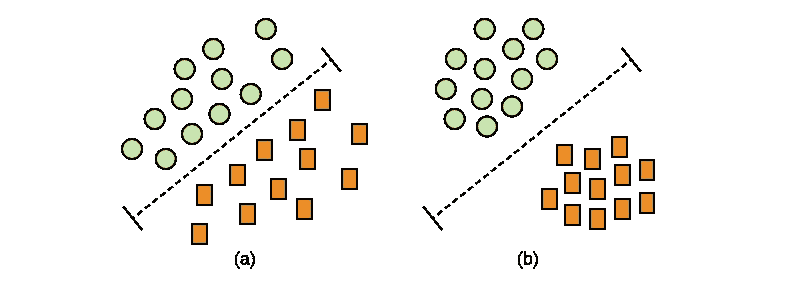
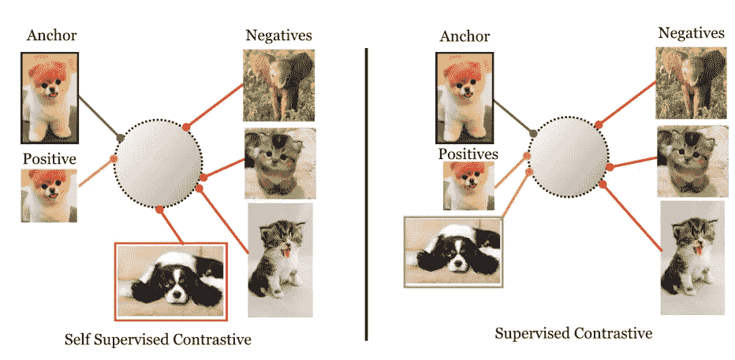
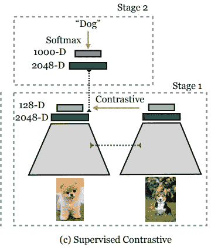
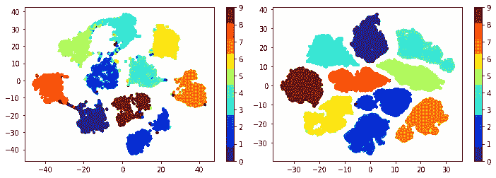
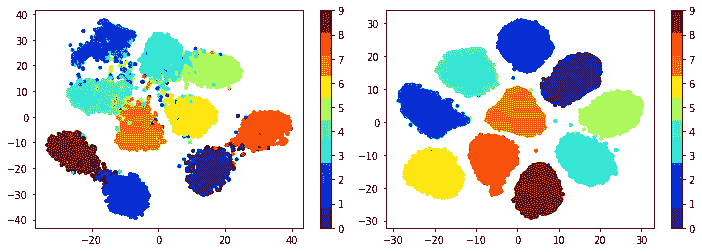
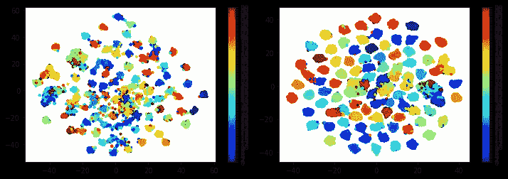
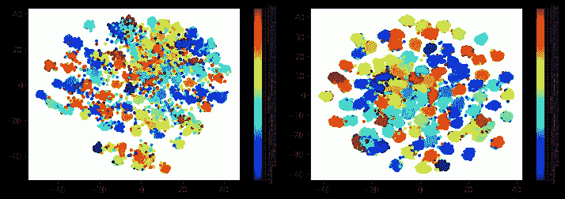

# 如何使用度量学习:嵌入是你所需要的

> 原文：<https://towardsdatascience.com/how-to-use-metric-learning-embedding-is-all-you-need-f26e01597375?source=collection_archive---------9----------------------->

## [实践教程](https://towardsdatascience.com/tagged/hands-on-tutorials)

## 找出常规分类和度量学习之间的区别，并通过我在 PyTorch 中实现的监督对比损失亲自尝试一下


[Boitumelo Phetla](https://unsplash.com/@writecodenow) 通过 unsplash

机器学习中最简单、最常见的任务之一就是分类。例如，在计算机视觉中，你希望能够微调普通卷积神经网络(CNN)的最后几层，以正确地将样本分类到某些类别(类)。然而，有几种根本不同的方法来实现这一点。

公制学习就是其中之一，今天我想和大家分享一下如何正确使用它。为了让事情变得实际，我们将看看[监督的对比学习](https://arxiv.org/abs/2004.11362) (SupCon)，这是对比学习的一部分，而对比学习又是度量学习的一部分，但稍后会有更多的介绍。

**完整代码**可以在 [GitHub repo](https://github.com/ivanpanshin/SupCon-Framework) 中找到。

# 分类通常是如何完成的

在我们深入度量学习之前，首先了解分类任务通常是如何解决的，这实际上是一个好主意。今天实用计算机视觉最重要的想法之一是卷积神经网络，它们由两部分组成:编码器和头部(在这种情况下是分类器)。


[哈桑](https://neurohive.io/en/author/muneeb/)通过神经蜂巢

首先，你拍摄一幅图像，并计算出一组能够捕捉该图像重要品质的特征。这是使用卷积和池操作完成的(这就是为什么它被称为卷积神经网络)。之后，您将这些特征分解到单个向量中，并使用常规的全连接神经网络来执行分类。在实践中，您采用一些在大型数据集(如 ImageNet)上预先训练的模型(例如 ResNet、DenseNet、EfficientNet 等)，并在您的任务中对其进行微调(或者只是最后几层，或者是整个模型)。

然而，这里有几件事需要注意。首先，*通常*你只关心网络 FC 部分的输出。也就是说，您获取其输出，并将其提供给损失函数，以便保持模型学习。换句话说，您并不真正关心网络中间发生了什么(例如，编码器的功能)。其次，*(再次，通常)*你用一些基本的损失函数，比如交叉熵，来训练这整件事。



[Kolluru](https://medium.com/@skolluru?source=post_page-----29d89edfe200--------------------------------) via 媒介

为了对这个两步过程(编码器+ FC)有更好的直觉，你可以这样想:编码器将图像映射到一些高维空间(例如，在 ResNet18 的情况下，我们谈论的是 512 维，而对于 resnet 101–2048)。之后，FC 的目标是在这些代表样本的点之间画一条线，以便将它们映射到类。这两样东西是同时训练的。所以你试图优化特性，同时“在高维空间中画线”。

这种方法有什么问题？嗯，没什么，真的。它实际上工作得很好。但这并不意味着没有其他方法。

# 度量学习

现代机器学习中最有趣的想法之一(至少对我个人来说)被称为度量学习(或深度度量学习)。简而言之:如果我们不去研究 FC 层的输出，而是更仔细地研究编码器生成的特征，会怎么样呢？如果我们设法用一些损失函数来优化这些特征，而不是网络末端的逻辑，会怎么样？这实际上就是度量学习的内容:用编码器生成好的特征(嵌入)。

但是“好”是什么意思呢？如果你仔细想想，在计算机视觉中，你希望相似的图像有相似的特征，而不相似的图像有截然不同的特征。

# 监督对比学习



Prannay Khosla via arxiv

好吧，假设在度量学习中，我们只关心好的特征。但是有监督的对比学习是怎么回事呢？老实说，这种特定的方法没有什么特别的。这只是最近的一篇论文，提出了一些不错的技巧和一个有趣的两步方法:

1.  训练一个好的编码器，能够为图像生成好的特征。
2.  冻结编码器，添加一个 FC 层，然后就这样训练。

你可能想知道常规分类器训练有什么不同。不同的是，在常规训练中，你同时训练编码器和 FC。另一方面，在这里，你先训练一个像样的编码器，然后冻结(*不再训练*)，只训练 FC。这种逻辑背后的直觉是，如果我们设法首先为图像生成真正好的特征，那么优化 FC 应该很容易(正如我们前面提到的，它的目标是优化分隔样本的线)。

# 培训过程的细节

下面我们来深挖一下中控实现的细节。



[Prannay Khosla](https://arxiv.org/search/cs?searchtype=author&query=Khosla%2C+P) via arxiv

在检查训练回路之前，关于中控有一点你要了解的是正在训练的是什么模型。这很简单:编码器(如 ResNet、DenseNet、EffNet 等)，但没有用于分类的常规 FC 层。

代替分类头，这里我们有一个投影头。投影头是 2 个 FC 层的序列，将编码器功能映射到一个更低的维度空间(通常为 128 维，您甚至可以在上图中看到该值)。使用投影头的原因是，模型学习 128 个精心选择的特征比学习来自编码器的所有几千个特征更容易。

好了，是时候最后检查一下训练循环了。

1.  构建一批 N 个图像。与其他度量学习方法不同，您不需要太在意那些样本的选择。能拿多少就拿多少，剩下的由损耗来处理。
2.  将这些图像通过网络成对转发，其中一对被构造为[ *增强(image_i)* ，*增强(image_i)* ]，得到嵌入。将它们正常化。
3.  拿某个形象做锚。在批中查找同一类别的所有图像。把它们作为阳性样本。找出所有不同类别的图像。用它们做阴性样本。
4.  将 SupCon 损失应用于标准化嵌入，使正样本彼此更接近，同时远离负样本。
5.  训练完成后，删除投影头，并在编码器上添加 FC(就像在常规分类训练中一样)。冻结编码器，并微调 FC。

这里需要记住几件事。第一，训练完成后，去掉投影头更有利可图，在它之前使用特性。作者解释这一事实是由于头部信息的损失，因为我们降低了嵌入的大小。第二，扩充的选择很重要。作者提出了裁剪和颜色抖动的组合。第三，Supcon 一次处理批中的所有图像(因此，不需要构造成对或三元组)。并且批量中的图像越多，model 就越容易学习(因为中控有一个隐式正反硬挖掘的质量)。第四，实际上可以停在第四步。这意味着可以仅使用嵌入进行分类，而无需任何 FC 层。为此，计算所有训练样本的嵌入。然后，在验证时，为每个样本计算一个嵌入，将其与每个训练嵌入进行比较*(比较=余弦距离)*，取最相似的，取其类。

# PyTorch 实现

PyTorch 中实际上有一个中控的半官方[实现](https://github.com/HobbitLong/SupContrast)。不幸的是，它包含非常恼人的隐藏错误。其中最严重的一个:回购的创建者使用了自己的 ResNets 实现，由于其中的一些 bug，批量大小比常规 torchvision 模型低两倍。最重要的是，回购没有验证或可视化，所以你不知道什么时候停止训练。在我的报告中，我修正了所有这些问题，并为稳定的训练增加了更多的技巧。

更准确地说，在我的实现中，您可以访问:

1.  用[白蛋白](https://github.com/albumentations-team/albumentations)增强
2.  Yaml 配置
3.  t-SNE 可视化
4.  使用 AMI、NMI、mAP、precision_at_1 等指标进行两步验证(针对投影头前后的特征) [PyTorch 指标学习](https://github.com/KevinMusgrave/pytorch-metric-learning)。
5.  [指数移动平均线](https://github.com/fadel/pytorch_ema)用于更稳定的训练，随机移动平均线用于更好的概括和公正的整体表现。
6.  自动混合精确训练，以便能够以更大的批量(大约 2 倍)进行训练。
7.  标签平滑丢失，以及第二阶段训练的[lr finder](https://github.com/davidtvs/pytorch-lr-finder)(FC)。
8.  支持 [timm 模型](https://github.com/rwightman/pytorch-image-models)和 [jettify 优化器](https://github.com/jettify/pytorch-optimizer)
9.  固定种子以便使训练具有确定性。
10.  基于验证、日志保存重量—到常规。txt 文件，以及 TensorBoard 日志，以备将来检查。

从包装盒上看，repo 支持 Cifar10 和 Cifar100。然而，添加自己的数据集是非常简单的。为了运行整个管道，请执行以下操作:

```
python train.py --config_name configs/train/train_supcon_resnet18_cifar10_stage1.ymlpython swa.py --config_name configs/train/swa_supcon_resnet18_cifar100_stage1.ymlpython train.py --config_name configs/train/train_supcon_resnet18_cifar10_stage2.ymlpython swa.py --config_name configs/train/swa_supcon_resnet18_cifar100_stage2.yml
```

在那之后，你可以在相应的朱庇特笔记本中检查 t-SNE 可视化。例如，对于 Cifar10 和 Cifar100，您可能会看到如下内容:



Cifar10 与 t-SNE，验证和培训(中控)，图片由作者提供



具有 t-SNE 的 Cifar10，验证和训练(交叉熵)，图片由作者提供



带有 t-SNE 的 Cifar100，验证和培训(中控)，图片由作者提供



带有 t-SNE 的 Cifar100，验证和训练(交叉熵)，图片由作者提供

# 最后的想法

度量学习是一件非常强大的事情。然而，我很难达到普通 CE/LabelSmoothing 所能提供的准确度。此外，它还可能在训练期间计算量大且不稳定。我在各种任务(分类、超出分布预测、推广到新类别等)上测试了中控和其他度量损失，使用中控这样的东西的优势还不清楚。

等等，那有什么意义？我个人认为这里有两点。首先，中控(和其他度量学习方法)仍然可以提供比 CE 更结构化的集群，因为它直接优化了该属性。第二——多一项技能/工具让你尝试一下还是很有好处的。因此，有可能使用一组更好的扩充或不同的数据集(可能使用更细粒度的类)，SupCon 可以产生更好的结果，而不仅仅是与常规分类训练相当。

所以我们必须尝试和实验。没有免费的午餐，对吗？