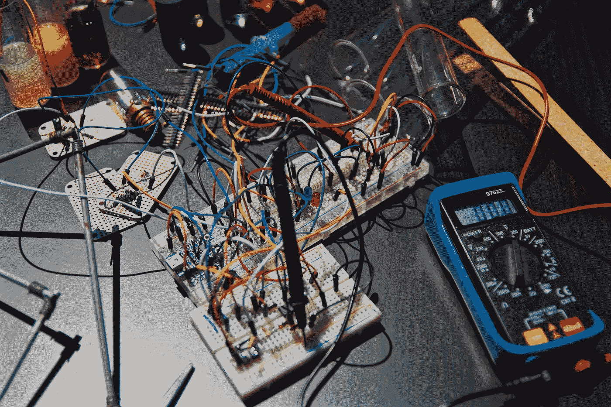
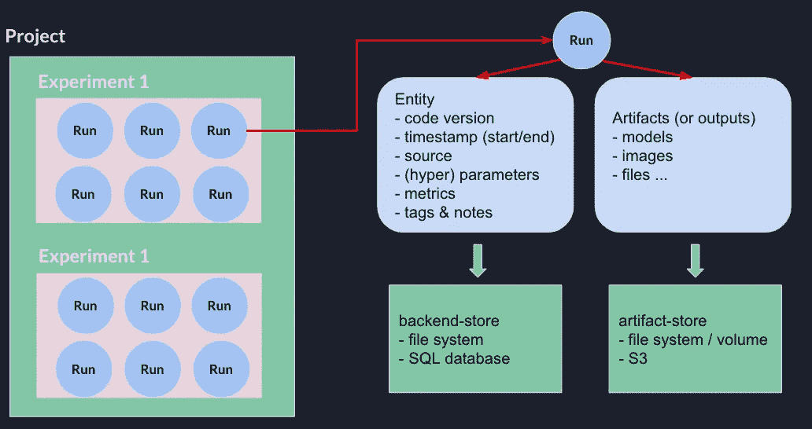
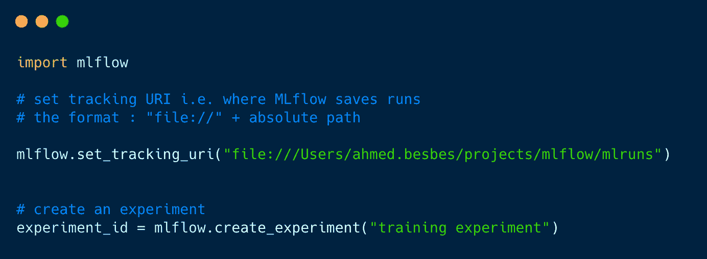
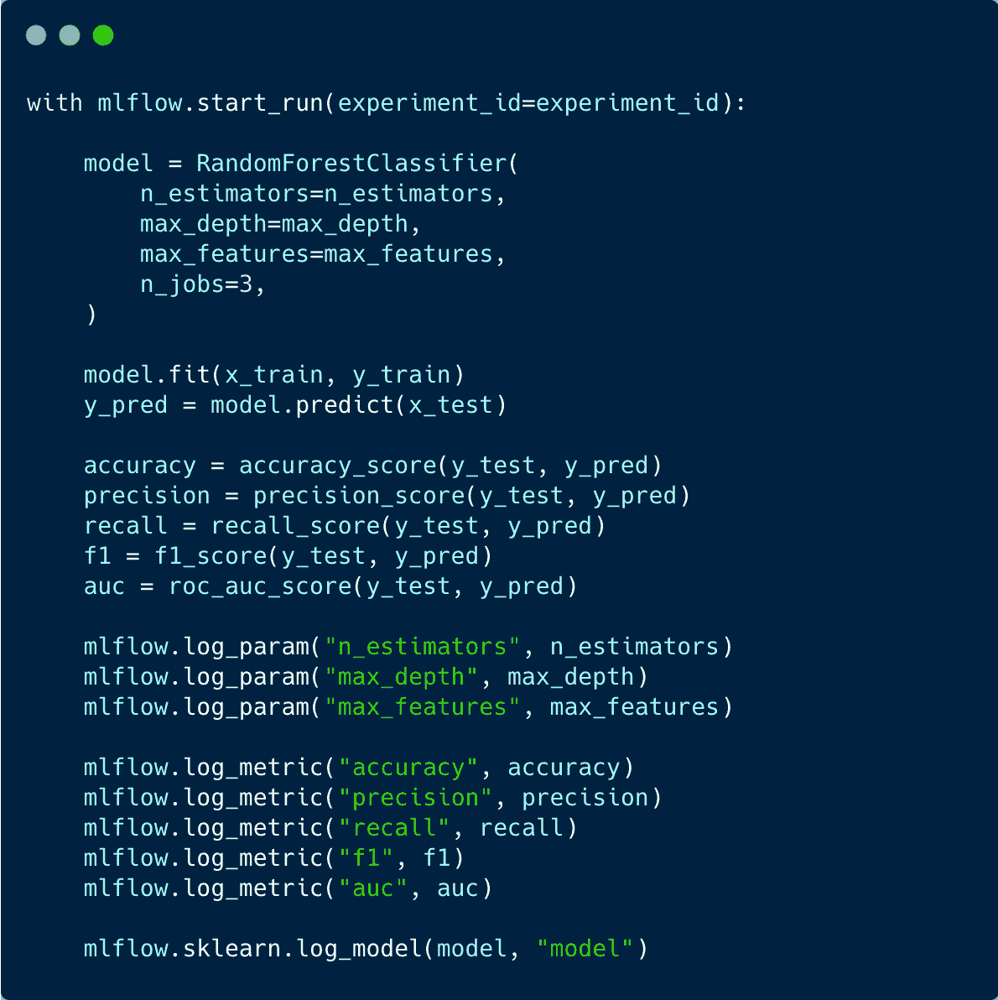
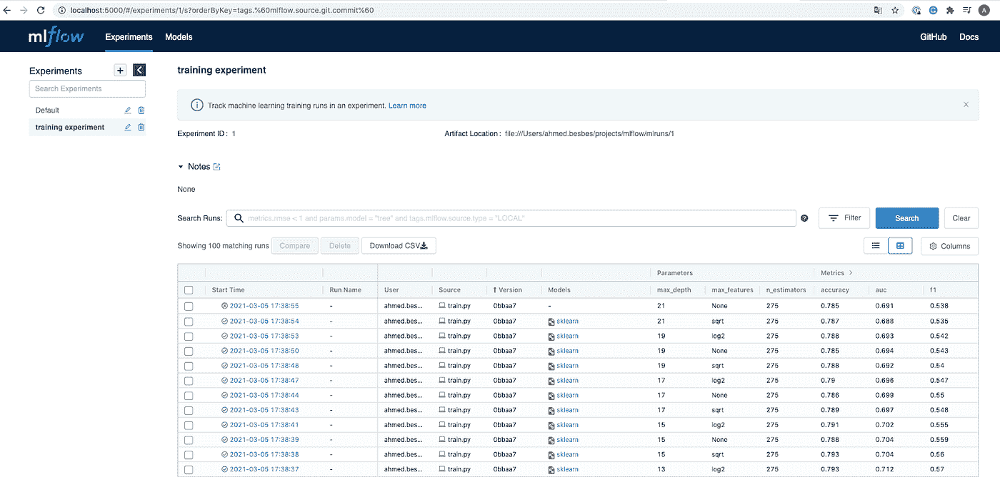
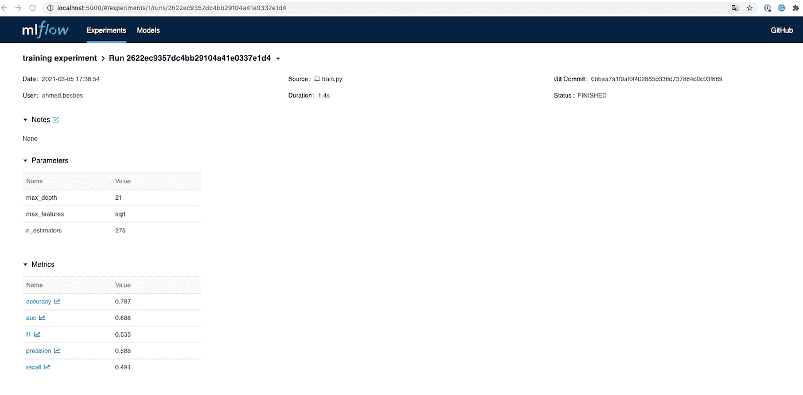
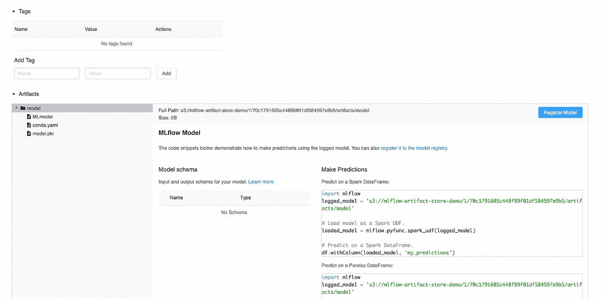
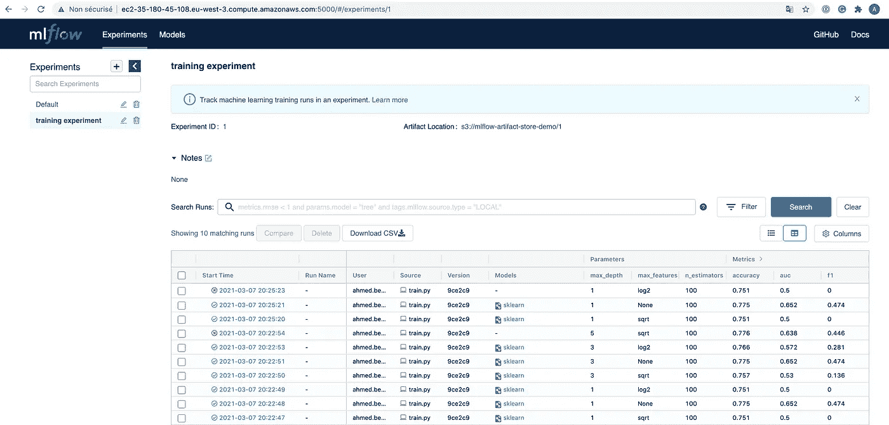

# 如何在 AWS 上使用 MLflow 来更好地跟踪你的机器学习实验

> 原文：<https://towardsdatascience.com/how-to-use-mlflow-on-aws-to-better-track-machine-learning-experiments-bbcb8acded65?source=collection_archive---------17----------------------->

## 再现性的一步



尼古拉斯·托马斯在 [Unsplash](https://unsplash.com?utm_source=medium&utm_medium=referral) 上拍摄的照片

我们都知道**跟踪你的机器学习实验有多痛苦。**

你训练了一堆不同风格的模型:随机森林，XGBoost，神经网络…

对于每个模型，您将探索一个**范围的超参数**。然后计算一些测试数据的性能指标**。**

有时，您**通过添加或删除特征并再次重新训练您的模型来更改训练数据**。

其他时候，你必须在团队中工作，并与其他数据科学家比较你的结果。

> 你如何管理这些实验，使它们易于追踪和重现？你如何比较你的结果？

MLflow 非常适合这些任务。我们将在这篇文章中看到如何在本地使用它，以及如何在 AWS 上设置它。

让我们来看看！

*PS*:想更深入的现场使用 MLflow，看看我的视频教程:*

*PS**:你可以在我的 Github 上找到代码* [*回购*](https://github.com/ahmedbesbes/mlflow) *。*

# 什么是 MLflow

*“ML flow 是一个开源平台，用来管理***包括* ***实验*** *，* ***再现性*** *，* ***部署*** *，以及一个* ***中央模型注册表。****”—mlflow.org**

*简而言之，MLflow 是一个包，您可以将其安装到 python 环境中，以便:*

*   *执行实验跟踪**(本文主题)***
*   *以可复制的方式打包数据科学代码*
*   *部署模型*
*   *从开发到生产管理模型*

*MLflow 可与任何机器学习或深度学习框架集成，如 Scikit-learn、TensorFlow、PyTorch、h2o.ai、XGBoost 等。*

*此外，它也是云不可知的。你可以在任何地方运行**:AWS，谷歌云平台或者 Azure 机器学习。我们将在这篇文章中看到如何在 AWS 上设置它。等到最后看看是怎么做的😉。***

# ***使用 MLFlow 跟踪的快速入门***

***MLflow tracking 是一个组件，可以帮助您非常轻松地记录您的机器学习实验。***

***它被组织成**个实验**并且每个实验被分成**次运行。*****

******

***作者图片— MLflow 术语***

***实验的一个例子可以是“训练二元分类器”。在这种情况下，每次运行对应一个模型拟合。***

***在不同的运行中拟合不同的模型时，您可以使用 MLflow 来跟踪**大量**数据:***

*   *****参数:**您使用什么来调整您的模型(例如，n_estimators、max_depth、epochs、kernel_size、dropout、batch_size 等。)***
*   ***您的模型的**指标**(损失、AUC、MAE、MSEF1 分数，准确性，R 平方(r2))***
*   *****数据**:你的模型在每次运行中使用的不同版本的数据。***
*   *****保存的模型:**与每次运行相关的二进制输出(想想 pickle 文件)***
*   ***代码产生的其他输出,如图像、CSV、文本、HTML***
*   *****源**:负责运行的脚本/笔记本文件名 git 提交***
*   *****标签和注释:**个人或团队注释***

# ***如何在我的代码中使用 MLflow？***

***相当容易。***

*   ***首先使用`pip`安装 mlflow:***

```
*****pip install mlflow*****
```

*   ***导入`mlflow`并使用`set_tracking_uri`方法设置 MLflow 存储每次运行结果的路径***
*   ***用适当的名称调用`create_experiment`方法***

******

***为了能够在每次运行时记录您的参数、指标并保存您的模型，您必须通过将`experiment_id`指定为参数，将您的代码包装在`mlflow.start_run`上下文中。***

***在这个上下文中，MLflow 创建一个具有唯一 id **(run_id)的运行。**本次运行将等待任何要跟踪的信息。***

*   ***使用`mlflow.log_param`方法可以保存参数***
*   ***可以使用`mlflow.log_metric`方法保存指标***
*   ***将(scikit-learn)模型保存为 artifcat 可以通过调用`mlflow.sklearn.log_model`以简单的方式完成***

******

***作者图片***

# ***好了，现在发生了什么？成绩在哪里？***

***MLflow 提供了一个很好的用户界面来可视化每次运行的结果，以及相互比较运行结果。***

***要启动 UI，在`mlruns`目录的相同位置运行以下命令:***

```
*****mlflow ui*****
```

***这将在端口 5000 启动一个本地服务器。***

***在左边，你会看到实验。在右边，你会看到跑道。该表是交互式的，您可以对运行进行排序，通过指定查询进行搜索，甚至进行比较(在第二个视图中)。***

******

***作者图片— MLflow UI(运行)***

***点击一次跑步后，您将被重定向到另一个包含更多详细信息的页面。***

***度量、参数、持续时间、状态、git 提交:***

******

***作者图片— MLflow UI(运行详情)***

***以及模型输出和工件:***

******

***作者提供的图片— MLflow UI(运行输出)***

# *****在 AWS 上设置跟踪服务器*****

***到目前为止，我们在本地使用 MLflow。如果我们想与其他同事合作并在团队中跟踪实验，这并不理想。***

***幸运的是，设置远程 MLflow 跟踪服务器非常容易。让我们看看这是怎么做到的。***

*****在本节中，我将使用 AWS，因此，如果您想要重现这些步骤，请确保您拥有一个帐户。*****

*****1 —使用 MLflow** 设置远程 EC2 机器***

*   ***创建一个 IAM 用户。拿起`Access key ID`和`Secret access key`凭证，将它们存放在安全的地方。我们以后会需要它们。***
*   ***对于同一个用户，创建一个 s3 存储桶来存储未来的工件:给这个存储桶命名。我的是`mlflow-artifact-store-demo`，但是你不能摘。注意，您不需要为您的 bucket 定制配置(例如，它不需要是公共的)***
*   ***启动一个 EC2 实例:它不必很大。一个`t2.micro`有资格自由层做得很好***
*   ***将此实例的安全组配置为接受端口 5000 和任何 IP 地址上的入站 HTTP 流量，以便可以从外部访问 MLflow 服务器***
*   ***使用 SSH 连接到您的实例，并运行以下命令来安装 pip、pipenv 和 mlflow***

```
***# install pip
sudo apt update
sudo apt install python3-pip# install 
sudo pip3 install pipenv
sudo pip3 install virtualenv

export PATH=$PATH:/home/[your_user]/.local/bin/# install mlflow, awscli and boto3
pipenv install mlflow
pipenv install awscli
pipenv install boto3***
```

*   ***在 EC2 机器上，使用用户凭证配置 AWS，以便跟踪服务器可以访问 s3 并在 UI 上显示工件。
    输入`aws configure`，然后按照提示输入凭证***
*   ***通过将主机定义为`0.0.0.0`并将`--default-artifact-root`定义为 S3 桶，在 EC2 实例上启动一个 MLflow 服务器***

```
*****mlflow server -h 0.0.0.0 --default-artifact-root s3://mlflow-artifact-store-demo*****
```

***现在您的 EC2 机器已经正确配置好了。***

*****2 —设置您的环境*****

***要允许 MLflow 将运行从您的本地环境推送到 EC2 和 S3，您必须:***

*   ***通过`pip install boto3`在本地安装 boto3***
*   ***将 AWS 凭证设置为环境变量，以便 MLflow 拥有 S3 读写访问的适当权限***

```
*****export AWS_ACCESS_KEY_ID=<your-aws-access-key-id>
export AWS_SECRET_ACCESS_KEY = <your-aws-secret-access-key>*****
```

*   ***将代码中的跟踪 URI 更改为**HTTP://<public-DNS>:5000*****

***现在一切都应该设置正确。***

***如果再次执行代码，运行将不再保存在本地，而是保存在远程跟踪服务器上，您可以通过访问 URL 来检查远程跟踪服务器。***

******

***作者提供的图片— MLflow UI(在远程服务器上)***

# *****快速笔记*****

*   ***像我们这样设置 MLflow 对于相对较小的团队中的小项目来说是很好的。然而，它还不能投入生产。事实上，您必须保护对 MLflow UI 的访问，并在 EC2 上创建一个服务，以便在启动时在后台启动 MLflow***
*   ***你可以在 [**数据块**](https://databricks.com/) 上使用 MLFlow 的托管版本***
*   ***MLflow 跟踪与您正在进行的工作类型无关，无论是 NLP、计算机视觉还是无监督学习。只要您有指标和参数要跟踪，MLFlow 是一个很好的选择。***

***感谢阅读！所有代码都可以在我的 Github [repo](https://github.com/ahmedbesbes/mlflow) 上获得。***