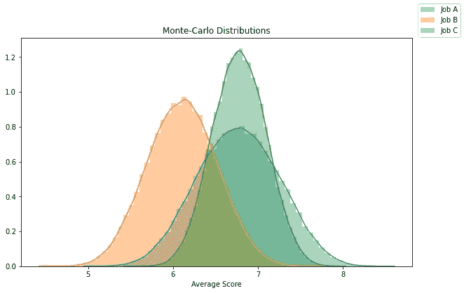

# 如何使用蒙特卡罗模拟帮助决策

> 原文：<https://towardsdatascience.com/how-to-use-monte-carlo-simulation-to-help-decision-making-a0a164bc8619?source=collection_archive---------6----------------------->

## 使用蒙特卡罗模拟来做出现实生活中的决策

来源:https://unsplash.com/photos/vBWsG91aR_U

最近，我面临着一个非常困难的决定。出于不同的原因，我不得不在各种有趣的工作机会中做出选择。几个不眠之夜之后，我意识到一件事:为什么不用我所掌握的工具来帮我做决定呢？

本文将向您展示如何构建蒙特卡洛模拟来帮助您在生活中做出任何类型的决定。我将比较三个不同的工作机会，类似于我面临的问题。**很明显，所有呈现的信息都是 100%虚构的，并不代表我所面对的现实。换句话说，它只是一个例子！**

我们开始吧！

## 什么是蒙特卡洛模拟？

蒙特卡洛模拟是一种数学技术，用于在处理上述结果的不确定性时估计所有可能的结果。这个想法很简单。

假设你需要在回家的两条路上做出选择。第一个平均需要 20 分钟。它的灯很少，车也很少。很有可能你总是会在你期望的时间到达。第二个平均需要 15 分钟。然而，经常有更多的交通，灯等。有很多不确定性，你可能要花 10 到 45 分钟。

蒙特卡洛模拟通过利用概率分布建立可能结果的模型。通过模拟实验，比如说 10，000 次，你可以很好地了解各种选择的风险有多大。然后你可以决定哪条路更适合你。

## 设置模拟

假设你正在处理各种各样的工作机会。做决定的挑战在于总有一些不确定性。例如，你并不总是确切地知道你将做什么，谁将是你的同事，这份工作将如何帮助你的职业发展，等等。

这就是蒙特卡洛的用武之地。下面是设置实验要遵循的三个步骤。

1.  定义做出决策的所有变量(工资、条件、地点、工作生活平衡等)。)
2.  定义每个变量的重要性(权重)。换句话说，什么对你最重要？
3.  对于每个选项，为每个变量定义一个您认为合适的可能性范围(本例中为 10 分)。当然，范围越大，就意味着你对这个变量的评分越不确定！范围代表变量的概率分布。

当然，第 2 部分和第 3 部分需要更定性方法。分数是基于你对事物的感知，你的观点。有人定义的 10/10 工作环境因人而异，没有简单通用的方法来量化。

然而，这种方法的有趣之处在于，它可以帮助你找出你潜意识中对各种选项的偏见。事实上，通过对所有变量本身进行分级，你可能会意识到一个选项在大多数方面都处于领先地位。

## 代码

这是我用来创建蒙特卡洛模拟的 Python 代码。

*   在第 6 行，我定义了所有要考虑的变量。
*   第 10 行是将所有权重分配给不同变量的地方。
*   第 14 行非常重要。它是根据您为此变量提供的范围生成随机值的地方。
*   第 20-22 行包含列表的列表，每个变量的等级范围。例如，对于 A，第一个列表[4，9]意味着`work` 变量可以在模拟中的等级 4 和 9 之间的任何地方找到自己。

## 结果

这是经过 10，000 次迭代后得到的分布。

我们看到似乎有两个最爱，作业 A 和作业 C。有趣的是，作业 A 的分布更广，而作业 C 似乎更安全，可能是因为不确定性更少。

模拟允许我们在多次迭代中比较各种选项，以确定这些选项的实际风险有多大。然后，用户的任务是决定与期权相关的额外风险是否值得回报。

## 结论

当存在不确定性时，蒙特卡罗模拟可以帮助做出决策，因为我们事先不知道变量的确切结果。这是一个非常简单而强大的技术。对于任何给定的实际问题，可以随意重用和修改代码。

非常感谢你的阅读！