# 如何像知道自己在做什么一样使用正态分布

> 原文：<https://towardsdatascience.com/how-to-use-normal-distribution-like-you-know-what-you-are-doing-1cf4c55241e3?source=collection_archive---------23----------------------->

## 变得非常擅长正态分布


**照片由** [**伊娃**](https://www.pexels.com/@eva-elijas?utm_content=attributionCopyText&utm_medium=referral&utm_source=pexels) **上** [**像素**](https://www.pexels.com/photo/dirty-texture-wall-winter-5941184/?utm_content=attributionCopyText&utm_medium=referral&utm_source=pexels)

## 介绍

你在半夜叫醒一个统计学家，问他们关于正态分布的公式。半睡半醒时，他们会不折不扣地背诵这个公式:


正态分布是我们宇宙中最基本的东西之一。它几乎无处不在，自然，科学，数学。即使是最疯狂的现象，如质子相互碰撞，人群的行动等。可以用正态分布来模拟。

当我们绘制正态分布数据时，通常会形成一个钟形模式:

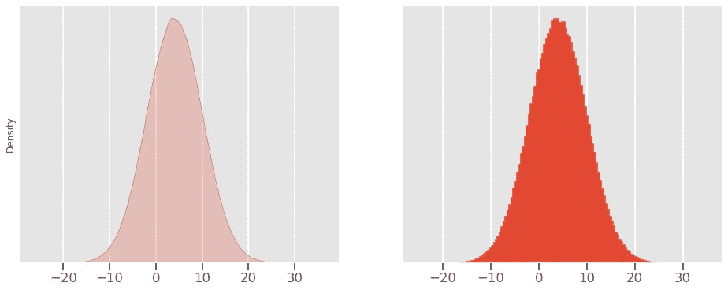

这就是为什么你也会听到它被称为**钟形曲线**或**高斯分布**(以发现它的德国数学家卡尔·高斯命名)。

这在商业领域也有许多含义。它无处不在，以至于数据科学家和统计学家从正态假设开始分析许多新数据。此外，由于我们将在后面讨论的[中心极限定理](https://en.wikipedia.org/wiki/Central_limit_theorem)，即使基础分布不正态，您也可以导出正态分布。

在这篇文章中，您将学习如何在您的日常工作流程中使用这种发行版，方法是建立理论上的理解，并通过代码应用这些思想。

[](https://ibexorigin.medium.com/membership) [## 通过我的推荐链接加入 Medium-BEXGBoost

### 获得独家访问我的所有⚡premium⚡内容和所有媒体没有限制。支持我的工作，给我买一个…

ibexorigin.medium.com](https://ibexorigin.medium.com/membership) 

获得由强大的 AI-Alpha 信号选择和总结的最佳和最新的 ML 和 AI 论文:

[](https://alphasignal.ai/?referrer=Bex) [## 阿尔法信号|机器学习的极品。艾总结的。

### 留在循环中，不用花无数时间浏览下一个突破；我们的算法识别…

alphasignal.ai](https://alphasignal.ai/?referrer=Bex) 

## 正态分布预告

正态分布是你在分析过程中能想到的最好的东西。它有许多“好”的属性，使得它很容易使用和获得结果。

之前我们看了 ND 的钟形曲线。曲线的高度由标准偏差值决定。较小的标准差意味着更多的数据点聚集在平均值周围，而较大的值表示分布更加分散。这也可以解释为曲线的密度(稍后将详细介绍)是由标准偏差决定的。

ND 的平均值围绕 x 轴移动中心:

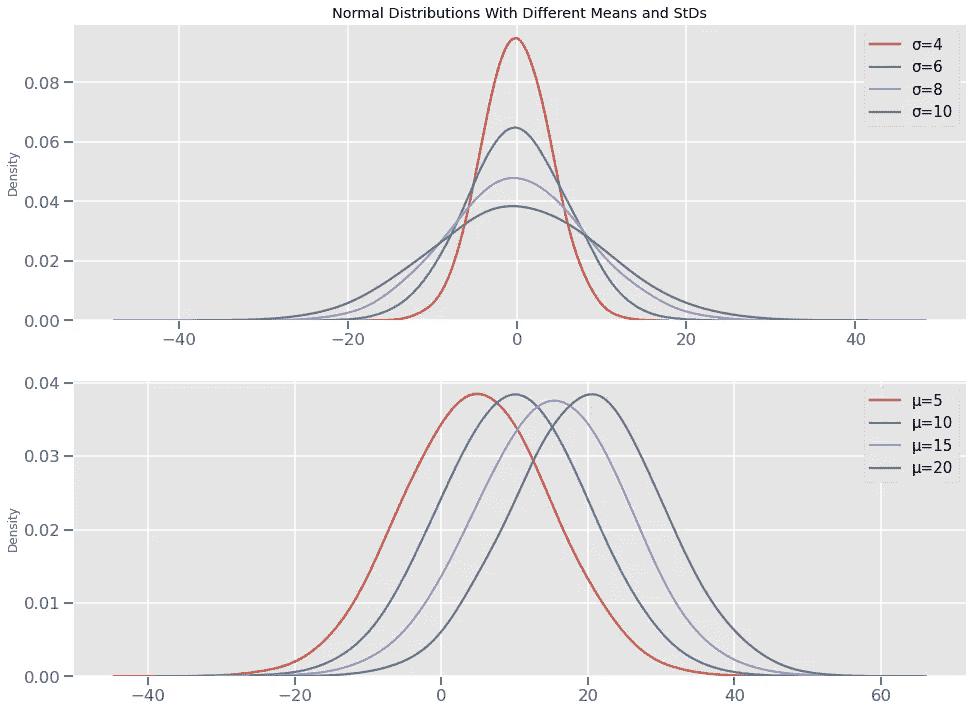

如你所见，理论上完美的 ND 有一个单峰，它也是对称线穿过分布的地方。此外，这些陈述可以是关于完美的 ND:

*   平均值、中值和众数都相等。
*   正好一半的值在对称线的左边，一半在右边。
*   曲线下的总面积始终等于 1。

当然，真实数据很少遵循完美的钟形模式。然而，估计完美 ND 和基础分布之间的相似性是值得的，以查看我们是否可以安全地将其视为正态分布。我们将在接下来的几节中看到如何生成这个相似性过程。

## PDF 到底是什么？

到目前为止，我们一直在看 NDs 的图，但我们没有问是什么函数产生这些图。要回答这个问题，你需要理解什么是连续概率分布。

根据描述性统计，有两种类型的数据:离散的和连续的。通过计数记录的任何数据都是离散的(整数值)，如考试成绩、每天吃的苹果数量、遇到红灯停下来的次数等。相反，连续数据是通过测量记录的任何数据，如身高、体重、距离等。时间本身也被认为是连续的数据。

连续数据的一个定义方面是相同的数据可以用不同的度量单位表示。例如，距离可以用英里、公里、米、厘米、毫米来度量，列表 ***继续*** 。无论多小，对于连续数据都可以找到更小的度量单位。这也意味着一次测量可以有无限多的小数点。

在概率上，如果一个随机实验产生了连续的结果，那么它就会有一个连续的概率分布。例如，假设随机变量 *X* 以英寸为单位存储每天的降雨量。现在，降雨量几乎不可能是一个整数值，因为我们不能说今天的降雨量是 2 英寸，而不是一个水分子的多或少。发生这种情况的概率很小，我们可以有把握地说是零。

其他值也是如此，例如 2.1 或 2.0000091 或 2.000000001。下雨的几率总是 0。这就是为什么对于连续分布，我们有不同的函数，叫做概率密度函数。如果你正在阅读我最近的[帖子](/how-to-use-poisson-distribution-like-you-know-what-you-are-doing-c095c1e477c1?source=your_stories_page-------------------------------------)，概率密度函数会计算离散事件的概率，比如掷骰子、掷硬币或任何其他的[伯努利试验](/how-to-think-probabilistically-with-discrete-distributions-ea28e2bcafdc?source=your_stories_page-------------------------------------)。

概率质量函数将结果的概率编码为高度。以下是单个骰子滚动的 PMF 图示例:

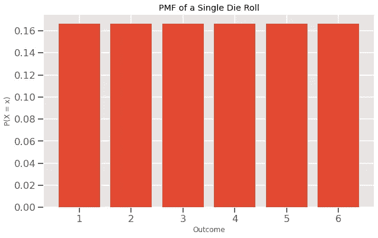

如您所见，每个条形的高度代表单一结果的概率，如 1、3 或 5。它们都处于相同的高度，因为模具辊具有不连续的均匀分布。

现在，概率密度函数使用一个*面积*来表示某个概率。在我解释为什么之前，想想如果他们也在高度上编码概率会发生什么。如我所说，连续数据取某个值的概率很小，以至于高度都下降到 0，如下所示:

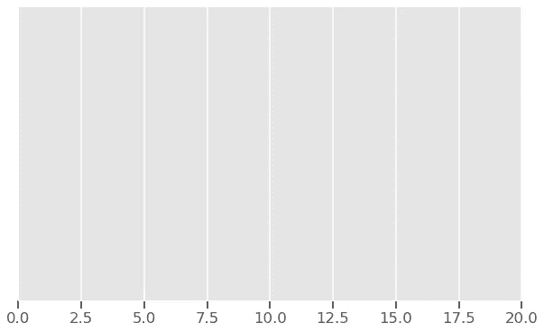

还记得统计学家最喜欢的公式吗？

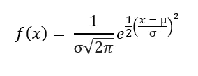

这是正态分布的概率密度函数的公式。仅凭一己之力，它做不了多少事情。对于已知平均值和标准偏差的 ND，您可以在函数中输入任何 *x* 值。它输出 x 轴上该点处曲线的高度。注意，我不是说*概率，而是说*曲线的高度。我说过，对于连续分布，面积代表了一定的概率。图上的细线没有面积，所以我们需要重新定义我们最初的问题。

对于我们观察每天降雨量的随机实验，我们将不再问诸如降雨量为 3 英寸或 2.5 英寸的概率是多少之类的问题，因为答案总是 0。相反，我们现在问的是降雨量在 1.6 到 1.9 英寸之间的概率是多少。这相当于问这两条线之间的曲线下的面积是多少:

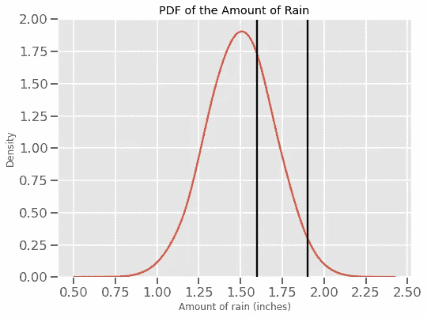

对于那些做过微积分作业的人来说，它是用这个积分公式计算的:

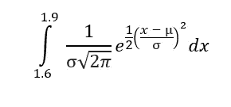

> 等等等等。先别走。我们在这里不会手工计算，甚至不会使用代码。稍后我会向你展示一个更简单的计算方法。

上面的公式得出了一个 0 到 1 之间的数字，即降雨量在 1.6 到 1.9 英寸之间的概率。现在，一个显而易见的问题是，既然没有给出概率，我们如何解释亚轴。嗯，我根本没有资格回答这个问题，所以我建议你看看 StackExchange 的这个[帖子](https://stats.stackexchange.com/questions/491127/what-does-y-axis-mean-in-continuous-probability-distribution)，看看 3Blue3Brown 的这个[超赞的视频](https://www.youtube.com/watch?v=ZA4JkHKZM50)。

接下来，我们将讨论累积分布函数，它为我们提供了一个更好的工具来计算面积下的概率，也许是 NDs 的一个改进的可视化。

## 累积分布函数

在这一点上，我想我们已经同意正态分布图有一条曲线。我们已经看到了钟形的，现在，是时候看看乙状结肠了:

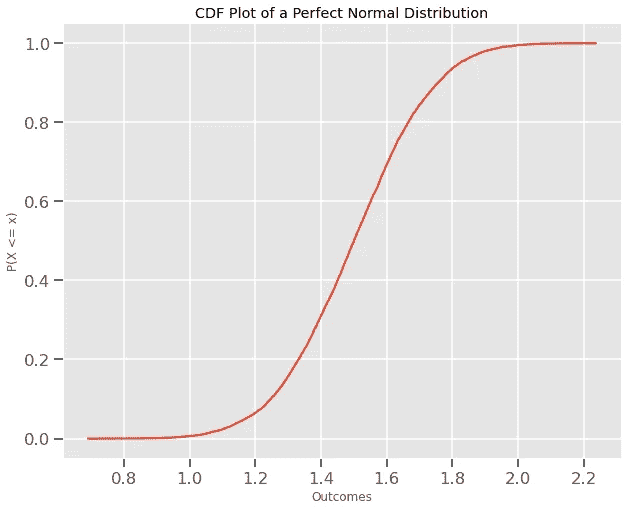

在解释这个之前，我们先了解一下什么是累积分布函数(CDF)。我们最好从一个简单的例子开始:

```
Cdf.from_seq([1, 2, 3, 4, 5, 6])
```


如果我们从任何分布中取一个随机数并输入到 CDF 中，结果告诉我们得到一个小于或等于该随机数的值的概率。以上是单个模辊的 CDF。模具辊具有 1、2、3、4、5、6 的分布。假设我们随机选择了 4 个。

从我们的分布中观察到小于或等于 4 的值的概率是多少？根据上面的 CDF，是 0.6666。同样，有 100%的机会观察到小于或等于 6 的值，因为在我们的分布中所有的值都小于或等于 6。

在符号中，这看起来像这样:

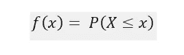

因此，要计算 CDF，第一步是计算每个结果的个体概率。然后，任何值 *x* 的累积概率将是我们分布中所有有序个体概率的总和，直到 *x* 。

现在，回到正态分布的 CDF，我们可以很容易地解释它:


这条曲线也被称为 s 形曲线。ND 的平均值是曲线的中心:

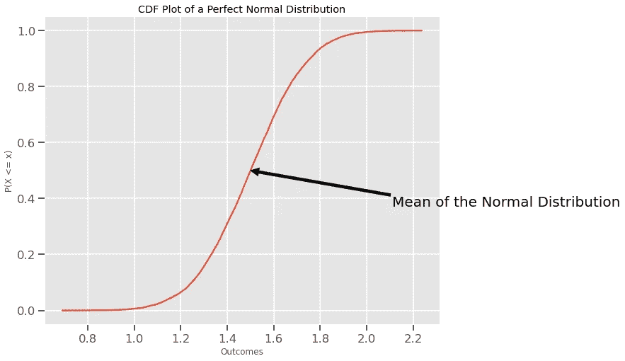

使用 CDF，你不必使用 ND 的公式。例如，要找到 *X* 落在 1.6 和 1.9 之间的概率，您将找到上限的 CDF 并减去下限的 CDF:

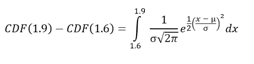

这么简单！

## 最后，Python 正常的东西

最后，我将揭示我是如何绘制所有这些钟形曲线和 CDF 的。首先，任何分布的钟形曲线都可以用 Seaborn 的`kdeplot`函数生成。

为了绘制这个分布图，我们需要创建分布图本身。这可以通过使用`numpy.random.normal`来完成:

这里，我们从平均值为 5、标准差为 2 的正态分布中抽取 10k 个样本。接下来，我们将使用`kdeplot`来制作曲线:

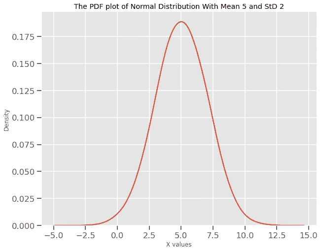

`kdeplot`将任意值序列作为分布。它的`bw_adjust`参数控制曲线的平滑度。有关该功能的更多信息，请访问[文档](https://seaborn.pydata.org/generated/seaborn.kdeplot.html)。

现在，创建 CDF 还需要做一些工作。我们可以手工生成它，但是我们将使用`empiricaldist`库的`Cdf`功能:

```
from empiricaldist import Cdf
```

`Cdf`有一个`from_seq`方法可以计算任何分布的 CDF:

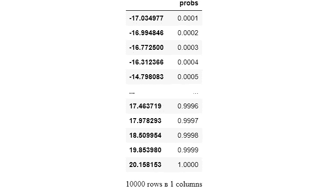

接下来，我们将用`pyplot`绘制这个分布图:

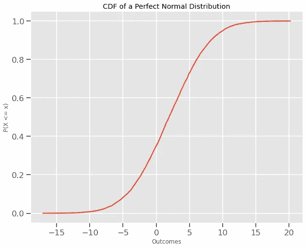

正如所料，我们在图上看到平滑的 s 形曲线。

最后，我们将看一个实际的用例。我们将使用 CDF 图来找出给定的分布是否正态。例如，我将从 Seaborn 加载 Iris 数据集:

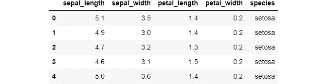

在前面的章节中，许多自然现象遵循正态分布，因此我们可以假设鸢尾花物种的测量值遵循正态分布。让我们看看我们有多正确:

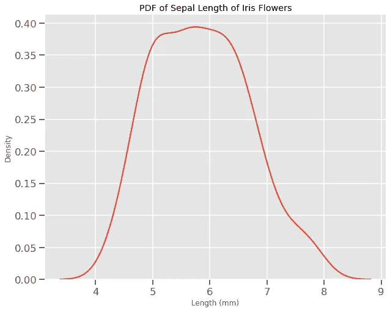

从一个眼球估计就已经可以看出，我们的假设是不正确的。不过，为了确保绘制完美的正常 ND 进行比较会更好。你问哪一个？当然，NDs 有无限多种，那么我们如何选择一种呢？

好吧，明智的做法是画出与基础分布具有相同均值和标准差的 ND，这样两个分布会很接近:

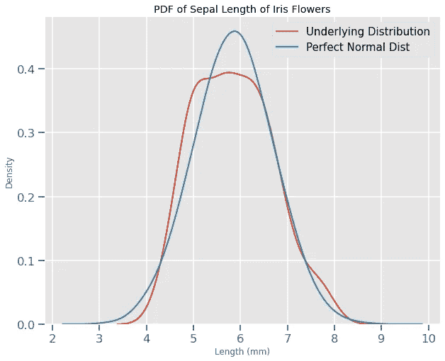

现在，更清楚的是，这两种分布是完全不同的。然而，在许多情况下，这两种分布彼此非常接近，但又不完全相同，即不是正态分布。对人眼来说，比较接近的钟形曲线不是一件容易的事情。所以我们需要用更好的视觉来比较这样的分布。我想你已经猜到了，但是我们将使用 CDF。

我们将使用与上面相同的技术，但是将 PDF 替换为 CDF:

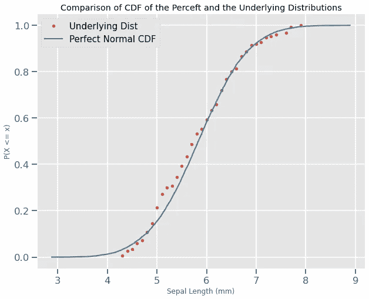

像往常一样，我们生成萼片长度的 CDF 并绘制成一条线。接下来，我们取萼片长度的平均值和标准差，并用这些参数生成一个完美的正态分布。然后，我们也为其生成 CDF，并将它们绘制在彼此之上。为了清楚起见，我用点作为标记，省略了线条样式。这个视图提供了比逐行比较更好的视觉比较。

现在，解释这个，我们可以看到分布并没有很大的不同。我们还必须考虑到样本量非常小(150)。

简而言之，如果你想模拟一个正态分布，使用`np.random.normal`。尝试增加样本量以获得更好的准确性。如果你想知道一个分布是否是正态分布，试着用基本分布的参数画出它的 CDF 和一个完美 nd 的 CDF。

## 结论

我们已经谈了这么多了。尽管如此，关于正态分布还有很多东西要学。也就是说，我们没有涵盖中心极限定理或经验法则，或许多其他主题。我留下了一些帮助我理解这个主题的资源链接:

*   [正态分布【Brilliant.org ](https://brilliant.org/wiki/normal-distribution/#:~:text=assumption%20is%20valid.-,Empirical%20Rule,99.7%25%20within%203%20standard%20deviations.)
*   [Brilliant.org 的中心极限定理](https://brilliant.org/wiki/central-limit-theorem/)
*   [正态分布](https://www.khanacademy.org/math/statistics-probability/modeling-distributions-of-data/more-on-normal-distributions/v/introduction-to-the-normal-distribution)由可汗学院提供
*   维基百科[页面](https://en.wikipedia.org/wiki/Normal_distribution)