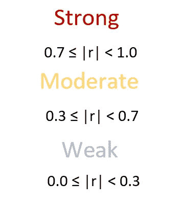
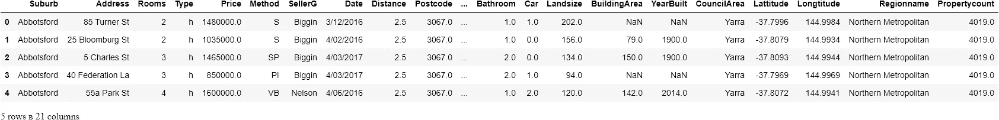
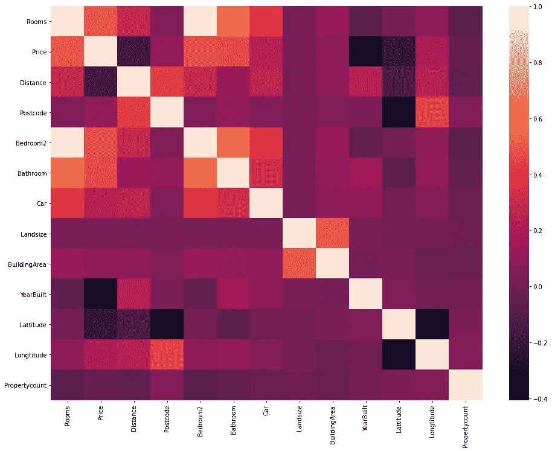
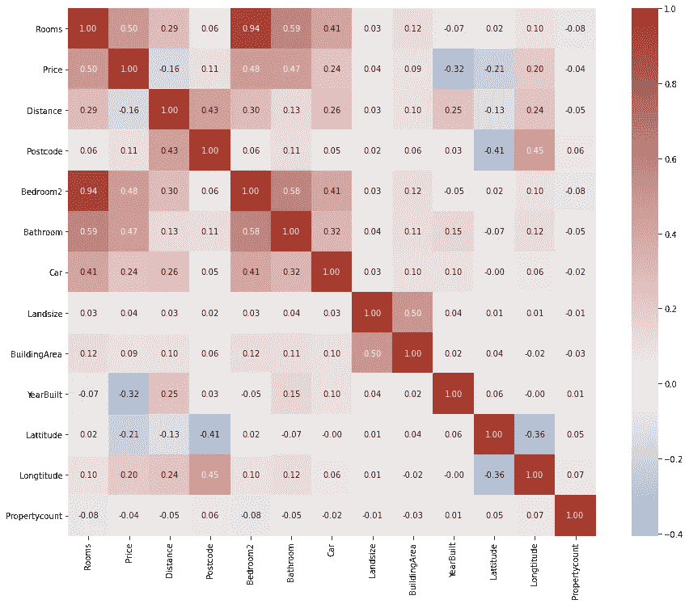
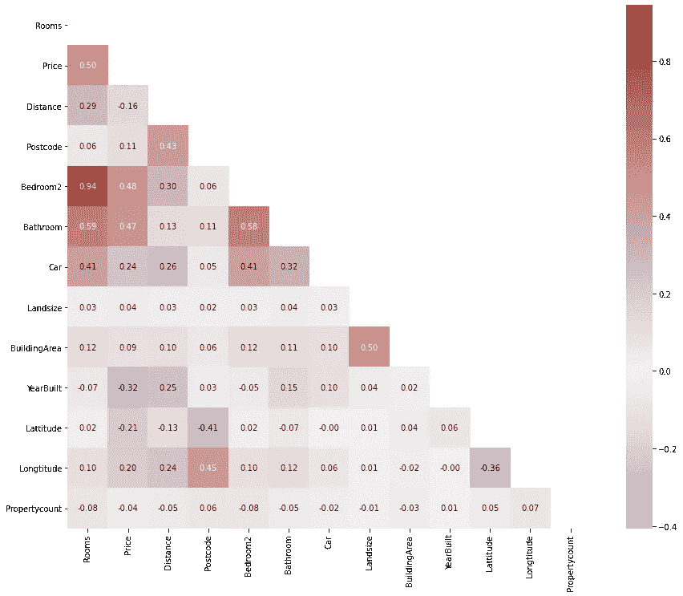
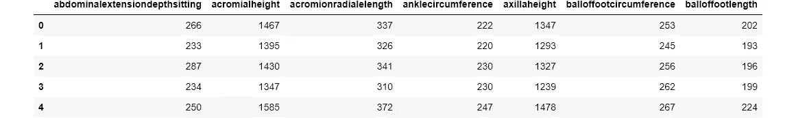
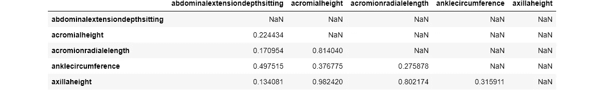

# 如何使用成对相关性进行鲁棒的特征选择

> 原文：<https://towardsdatascience.com/how-to-use-pairwise-correlation-for-robust-feature-selection-20a60ef7d10?source=collection_archive---------3----------------------->

## 将久经考验的方法添加到您的武器库中


**照片由** [**Pixabay**](https://www.pexels.com/@pixabay?utm_content=attributionCopyText&utm_medium=referral&utm_source=pexels) **上** [**像素**](https://www.pexels.com/photo/2-grey-and-black-birds-45853/?utm_content=attributionCopyText&utm_medium=referral&utm_source=pexels)

## 相关系数是多少？

在我上一篇关于特性选择的文章中，我们关注了一种基于特性的移除技术。在本帖中，我们将探讨一种更可靠、更稳健的方法，让我们看到特性之间的联系，并决定它们是否值得保留。正如你从标题中所看到的，这种方法使用成对相关。

首先，让我们简单的接触一下皮尔逊相关系数——通常表示为 *r* 。该系数可用于量化单个指标中两个分布(或特征)之间的线性关系。它的范围从-1 到 1，-1 是完全负相关，+1 是完全正相关。



作者图片

例如，身体测量通常有很强的正相关性。你可以预期高个子会有更长的胳膊和腿，或者宽肩膀的人会更重。还有，冰淇淋的销量和温度负相关，或者跑得越远越慢等等。

> 关于如何使用、解释和理解相关系数的深入指导，请参考我的另一篇文章[。](https://towardsdev.com/how-to-not-misunderstand-correlation-75ce9b0289e)

但是相关系数和机器学习或者特征选择有什么关系呢？嗯，假设两个特征之间的相关系数是 0.85。这意味着在 85%的情况下，您可以仅使用特性 1 的值来预测特性 2。换句话说，如果数据集中有要素 1，则要素 2 不会带来太多新信息。这就是为什么保留特征 2 没有意义，因为它只会在训练模型时增加复杂性。

使用成对相关进行要素选择就是这么回事-识别高度相关的要素组并仅保留其中一个要素，以便您的模型可以使用尽可能少的要素获得尽可能大的预测能力。

[](https://ibexorigin.medium.com/membership) [## 通过我的推荐链接加入 Medium-BEXGBoost

### 获得独家访问我的所有⚡premium⚡内容和所有媒体没有限制。支持我的工作，给我买一个…

ibexorigin.medium.com](https://ibexorigin.medium.com/membership) 

获得由强大的 AI-Alpha 信号选择和总结的最佳和最新的 ML 和 AI 论文:

[](https://alphasignal.ai/?referrer=Bex) [## 阿尔法信号|机器学习的极品。艾总结的。

### 留在循环中，不用花无数时间浏览下一个突破；我们的算法识别…

alphasignal.ai](https://alphasignal.ai/?referrer=Bex) 

## 绘制完美的相关矩阵

识别高度相关特征的最快且通常是最好的方法是使用相关矩阵。该矩阵显示了数据集中每一对数值要素之间的相关性。

让我们来看一个使用墨尔本住房数据集的例子，该数据集包含 13 个数字特征:



计算矩阵很容易通过调用 DataFrame 上的`.corr()`方法来完成。接下来，我们将它传递给 Seaborn 的热图函数，通常这样做是为了生成漂亮的视觉效果:



是的，默认热图没有那么好。让我们给它补个妆:



首先，我们创建一个定制的发散调色板(蓝色->白色->红色)。然后，我们将颜色条以 0 为中心，使注释能够看到每个相关性，并使用 2 个小数点。

如您所见，矩阵将每对之间的相关性显示两次，因为 A 和 B 之间的相关性与 B 和 A 之间的相关性相同。此外，对角线由 1 组成，表示特征与其自身的相关性。所有这些额外的信息会让人分心。这就是为什么我们要去掉矩阵的上半部分:



在上面代码片段的第 4 行，我们创建了一个 2D 布尔掩码。首先，`np.ones_like`创建一个 2D numpy 数组，其形状与填充了`True`值的相关矩阵相同。然后，将这个数组传递给`np.triu`，将它转换成适合我们需要的布尔掩码。我们只是将这个面具传递给`heatmap`的`mask`论证，这给了我们上面美丽的情节。

下面是一个绘制这些完美相关矩阵的小函数:

即使我们可以通过编程找到所有高度相关的特性，我们仍然应该直观地探索它们。因为像上面这样的热图有助于我们了解相关性是否有意义。例如，新生婴儿的数量可能与附近鹳的数量高度相关，尽管这没有任何意义。这就是为什么要进行视觉探索，以查看各组特征是否实际上相互关联，以及寻找它们之间的联系是否有意义。

## 如何移除高度相关的特征

现在，让我们看看我们如何实际删除高度相关的功能。这次我们将使用不同的数据集— [Ansur 数据集](https://www.kaggle.com/seshadrikolluri/ansur-ii)。它包含了 6000 名美国陆军人员的所有可以想象的身体尺寸，还包含了 98 个数字特征。这是一个练习要素选择技能的绝佳数据集，因为该数据集中有许多相关的要素:



我们将只处理数字特征，因此，我们将隔离它们:

> 顺便说一句，试图用这么多特征来绘制数据集的相关矩阵是没有用的。

我们的目标是消除强烈的相关性，无论是负面的还是正面的。因此，我们这次将通过在`.corr()`上链接`.abs()`方法来构建具有相关性绝对值的矩阵:

接下来，我们再次创建一个布尔掩码，用于矩阵的子集化:

使用熊猫数据帧的`mask`方法(相关矩阵是一个数据帧)将 NaN 值放在矩阵的上半部分和对角线上:

```
>>> reduced_matrix.iloc[:5, :5]
```



接下来，我们需要设置一个阈值来决定是否删除某个特性。应该仔细选择这个阈值，并且只有在彻底了解数据集的情况下才能选择。对于我们的例子，我们将选择阈值 0.9:

上面的列表理解找到了满足阈值 0.9 的所有其他列。使用`any`可以让我们不使用嵌套的 for 循环，就像这样:

列表理解无疑是一个更好的解决方案。注意，如果我们没有将`NaN`放在矩阵的上半部分和对角线上，我们将丢失所有相关的特征，而不是保留其中的一个。

下面是一个函数，它对任意阈值执行上述操作，并返回要删除的列的列表:

现在，让我们实际删除这些列:

现在，让我们看看放弃这么多特性是否是正确的选择。我们将通过训练两个`RandomForestRegressor`来检查这一点:一个在完整数据集上，一个在缩减的、特征选择的数据集上。目标重量以磅为单位- `Weightlbs`:

我们得到了一个非常好的结果，即使有这么多的功能。现在，让我们在特征选择的数据帧上重复上述内容:

我们的测试分数只降低了 2%,而运行时间却减少了两倍。

## 结论

总之，使用成对相关允许我们检测高度相关的特征，这些特征不会给数据集带来新的信息。因为这些特性只会增加模型的复杂性，增加过度拟合的机会，并且需要更多的计算，所以应该去掉它们。

然而，在使用这种技术之前，通过做[适当的 EDA](/my-6-part-powerful-eda-template-that-speaks-of-ultimate-skill-6bdde3c91431) 来彻底理解你的数据集。总是寻找没有意义的相关性，例如，没有联系的随机相关特征。

如果你不知道接下来要读什么，这里我为你挑选了一些:

[](/how-to-use-variance-thresholding-for-robust-feature-selection-a4503f2b5c3f) [## 如何使用方差阈值进行鲁棒特征选择

### 即使删除 50 个功能，也能获得相同的性能

towardsdatascience.com](/how-to-use-variance-thresholding-for-robust-feature-selection-a4503f2b5c3f) [](/11-times-faster-hyperparameter-tuning-with-halvinggridsearch-232ed0160155) [## HalvingGridSearch 将超参数调谐速度提高了 11 倍

### 连续减半彻底粉碎了 GridSearch 和 RandomSearch

towardsdatascience.com](/11-times-faster-hyperparameter-tuning-with-halvinggridsearch-232ed0160155) [](/beginners-guide-to-xgboost-for-classification-problems-50f75aac5390) [## XGBoost 分类问题入门指南

### 利用最热门的 ML 库实现一流的分类性能

towardsdatascience.com](/beginners-guide-to-xgboost-for-classification-problems-50f75aac5390) [](https://towardsdev.com/intro-to-object-oriented-programming-for-data-scientists-9308e6b726a2) [## 面向数据科学家的面向对象编程介绍

### 自己用 OOP 基础实现一个简单的线性回归

towardsdev.com](https://towardsdev.com/intro-to-object-oriented-programming-for-data-scientists-9308e6b726a2)