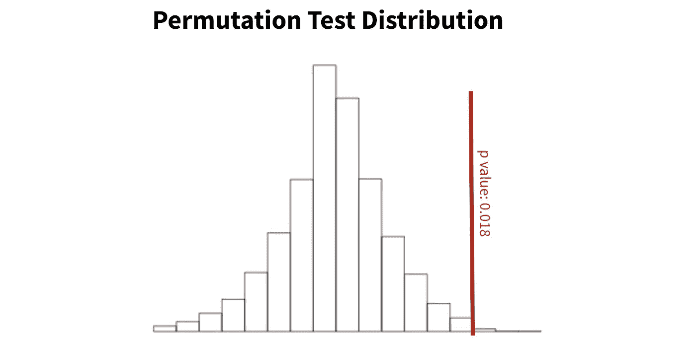
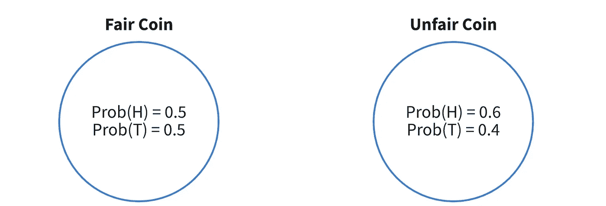
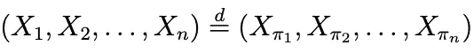

# 如何使用排列测试

> 原文：<https://towardsdatascience.com/how-to-use-permutation-tests-bacc79f45749?source=collection_archive---------1----------------------->

## 排列测试及其如何应用于时序数据的演练。

排列检验是非参数检验，只需要很少的假设。所以，当你不太了解你的数据生成机制(总体)时，排列测试是确定统计显著性的有效方法。



图 1:排列测试分布的例子。红色垂直线是我们的观测数据测试统计。这里，98.2%的排列分布在红线以下，表明 p 值为 0.018。图片作者。

斯坦福大学研究人员最近发表的一篇论文将排列测试框架扩展到了时间序列数据，这是一个排列测试通常无效的领域。这个方法非常数学化，而且是全新的，所以几乎没有支持，也没有 python/R 库。然而，它非常高效，可以大规模实施。

在本帖中，我们将讨论排列测试的基础，并简要概述时间序列方法。

让我们开始吧。

# 技术 TLDR

置换检验是非参数检验，只依赖于可交换性的假设。

为了得到 p 值，我们随机抽样(没有替换)我们感兴趣的变量的可能排列。p 值是检验统计量大于观测数据的样本比例。

时间序列数据很少可以交换。考虑到缺乏可交换性，我们将检验统计量除以标准误差的估计值，从而将检验统计量转换为 t 统计量。这个“学生化”过程允许我们对不可交换的数据进行自相关测试。

# 但是，排列测试实际上是如何工作的呢？

让我们慢一点，真正理解排列测试…

## 排列测试 101

排列测试非常简单，但是惊人的强大。

**排列检验的目的是估计总体分布**、**、**我们的观察值来自的分布。从那里，我们可以确定我们的观察值相对于总体是多么稀少。

在图 2 中，我们看到了排列测试的图形表示。有 5 个观察值，由每一行和两个感兴趣的列表示，**风险**和**死亡**。


图 2:排列测试的框架。图片作者。

首先，我们开发了我们感兴趣的变量的许多排列，标记为 P1，P2，…，P120。在这一步的最后，我们将从我们的总体中获得大量的理论数据。然后将这些图结合起来估计人口分布。

请注意，我们永远不会看到重复的排列— **排列测试对所有可能的排列进行采样，而不进行替换。**

其次，我们可以计算我们的 p 值。使用中位数作为我们的测试统计量(尽管它可以是从我们的数据中得到的任何统计量)，我们将遵循以下步骤:

1.  计算观察数据的中位数(死亡数列)。
2.  对于每个排列，计算中间值。
3.  确定比我们观察到的中位数更极端的排列中位数的比例。这个比例就是我们的 p 值。

如果你喜欢代码，这里有一些计算 p 值的 pythonic 伪代码:

```
permutations = permute(data, P=120)observed_median = median(data)
p_medians = [median(p) for p in permutations]p_val = sum(p > observed_median for p in p_medians) / len(p_medians)
```

既然我们理解了这个方法，让我们决定什么时候使用它。

## 排列检验的假设

排列测试之所以吸引人，是因为它们是非参数的，并且只需要假设可交换性。让我们依次讨论这两个概念。

参数方法假设了一个潜在的分布。非参数方法不会。就这么简单。


图 3:参数化和非参数化可视化。图片作者。

现在使用参数方法要求我们对数据的分布有信心。例如，在 A/B 测试中，我们可以利用中心极限定理得出结论，观察到的数据将呈现正态分布。从那里我们可以运行 t 检验，并获得 p 值。

然而，在其他情况下，我们无法知道分布，所以我们必须利用非参数方法。

出于测试目的，参数和非参数方法都估计总体分布。主要区别在于**参数测试利用假设来创建分布，而非参数测试利用重采样。**

太好了。让我们继续讨论可交换性。

可交换性指的是一系列随机变量。从形式上讲，如果一个序列的任意排列具有与原序列相同的联合概率分布，则该序列是可交换的。



图 4:一枚有偏见的硬币的形象化。图片作者。

因此，在图 4 中我们可以看到两枚硬币。左边的硬币是公平的，有 50%的正面(H)和 50%的反面(T)。正确的硬币有 60%的机会正面朝上。

如果我们多次抛硬币，我们会有一个可交换的序列。同样，如果我们多次投掷不公平的硬币，我们会有一个可交换的序列。然而，如果我们在公平和不公平硬币之间交替，我们将没有一个可交换的序列。

**如果我们的数据生成机制(硬币)的分布发生变化，我们的序列不再可交换。**



图 5:互换性的定义。图片作者。

在数学上，我们定义可交换性，如图 5 所示。左边的序列是原始数据，右边的序列是原始数据的排列。如果它们具有相同的分布，它们是可交换的。

# 时间序列相关性的排列检验

通常，时间序列数据是不可交换的——以前的值可能是未来值的决定因素。如果你有强有力的证据证明你的时间序列数据确实是可交换的，那么你可以运行一个常规的排列测试，但是如果没有，你需要利用下面的方法。

[论文](https://arxiv.org/pdf/2009.03170.pdf)讨论了在时间序列数据集上运行自相关测试的方法，但是概念可以推广到其他测试。还要注意，对于所有值，自相关只是一个值和它的前一个值之间的相关性。

我们将简单地介绍一下这个方法，因为它非常非常复杂。但是，方法如下:

1.  估计我们的自相关值的标准误差。
2.  通过除以标准误差，将我们的统计转换为 t 统计。
3.  做个 t 检验。

第 2 节概述了标准误差的计算，特别是等式 2.9 和 2.12。不幸的是，我们不打算在这里讨论它们，因为它们实在太长了。

# 摘要和实施说明

现在，您已经了解了置换测试的步骤，以及如何将它们应用于不可交换的时间序列数据的一些信息。

总而言之，排列测试很棒，因为它们是非参数的，并且只需要可交换性的假设。排列测试对我们的数据进行多种排列，以估计我们人口的分布。从那里，我们可以给我们观察到的数据分配一个 p 值。对于不可交换的时间序列数据，本文概述了一种方法。

最后，这里有一些关于实现的注意事项:

*   当有许多行时，您不能开发所有可能的排列。取而代之的是，对那些没有替换的排列进行抽样，以估计分布。
*   **当样本量很小或者参数假设不满足时，排列检验是有效的。因为我们只要求可交换性，所以它们非常健壮。**
*   排列检验往往比参数检验给出更大的 p 值。
*   如果你的数据在实验中是随机的，你可以使用一个简单的随机测试。
*   时间序列自相关方法需要平稳数据。如果您的数据不稳定，请查看[差异](https://machinelearningmastery.com/remove-trends-seasonality-difference-transform-python/)。

*感谢阅读！我会再写 34 篇文章，把学术研究带到 DS 行业。查看我的评论，链接到这篇文章的主要来源和一些有用的资源。*