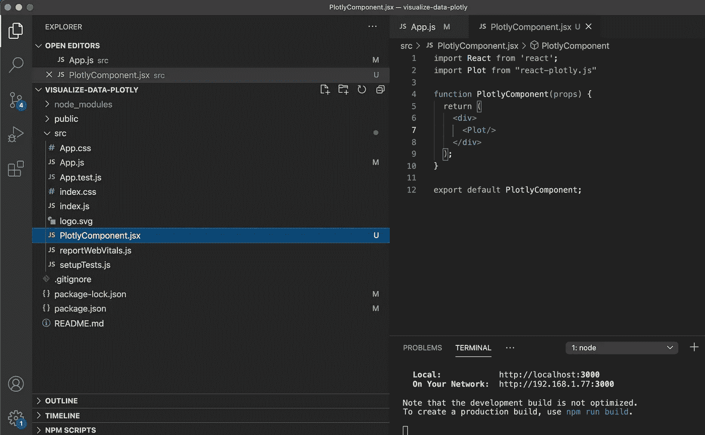
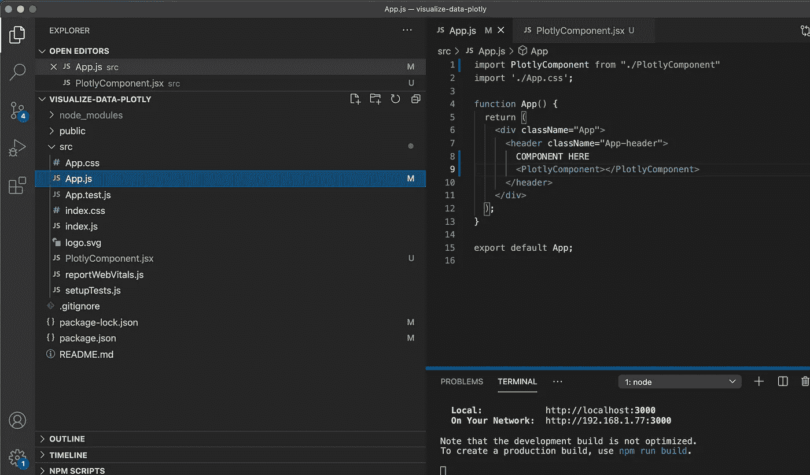
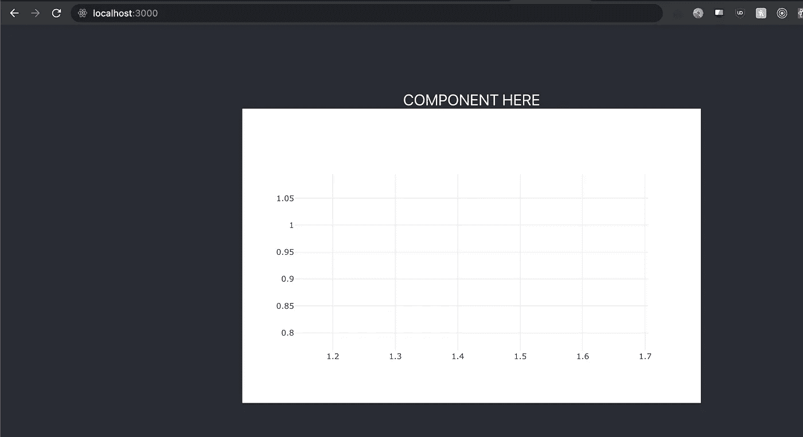
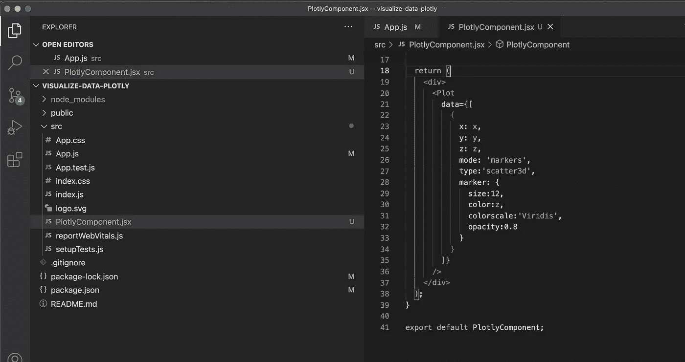
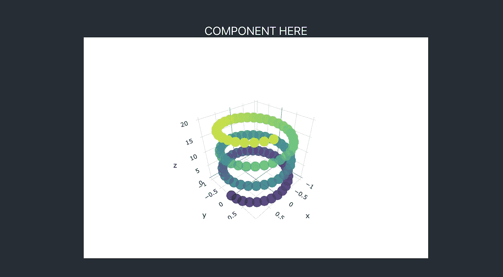
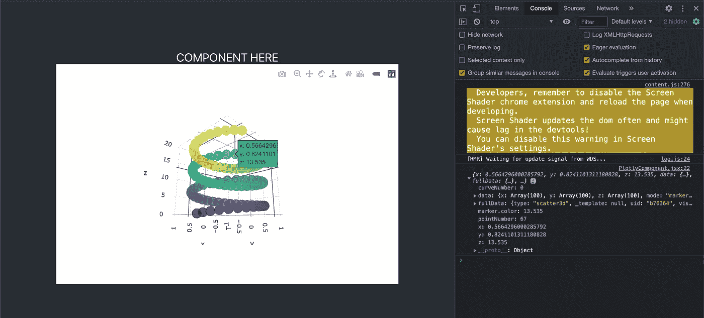

# 如何在 React 中使用 Plotly.js 来可视化您的数据并与之交互

> 原文：<https://towardsdatascience.com/how-to-use-plotly-js-in-react-to-visualize-and-interact-with-your-data-ab4c2c67e8f6?source=collection_archive---------13----------------------->

## 简单易懂的教程

## 在 React 中使用 Plotly.js 的简短教程


卢卡斯·布拉塞克在 [Unsplash](https://unsplash.com?utm_source=medium&utm_medium=referral) 上的照片

几个月前，我写了一篇关于[如何用 Python Plotly](/how-to-visualize-interactive-3d-network-with-python-plotly-4ef6989d83cc) 可视化交互式 3D 网络(或数据)的教程，我想为 Plotly.js 再写一篇可能是个好主意

有人可能更喜欢 Plotly.js 而不是 Python Plotly 的原因之一可能是因为加载速度——我曾经编写过一个 React + Flask 应用程序(其中数据集和 Plotly 图形都在 Flask 上),当我将其与我的 React + Plotly.js 应用程序进行比较时，Plotly.js 的交互性和加载速度要好得多。

所以这里有一个快速教程，教你如何用 React 来使用 Plotly.js！ʕ•́ᴥ•̀ʔっ♡

本教程的最终代码可以在这个 GitHub 资源库中找到:[https://GitHub . com/reine 0017/mini-Tutorials/tree/master/React-Tutorials/visualize-data-plot ly](https://github.com/Reine0017/mini-tutorials/tree/master/React-Tutorials/visualize-data-plotly)。

让我们从一个基本的 React 应用程序开始。在所需的项目目录中，运行:

```
npx create-react-app .
```

然后运行:

```
npm start
```

来打开网页。

接下来，我们要安装 Plotly.js 库。您可以参考此[链接](https://www.npmjs.com/package/react-plotly.js)获取安装说明。但是基本上，你只需要运行(从上面链接的 npm 包页面):

```
npm install react-plotly.js plotly.js
```

好了，现在安装已经完成，让我们开始写一些代码吧！

有大量不同的情节，地图和图表，你可以玩 Plotly。在本教程中，我们将了解如何使用 Plotly.js 创建一个简单的螺旋形交互式 3D 散点图。

让我们首先创建 Plotly 组件，然后导入 react-plotly 库。之后，只需像这样键入<plot>组件:</plot>



一旦我们将其导入到 App.js 文件中，



这是它带来的结果:



只是一个没有数据的空图(因为我们没有输入任何数据)

现在，让我们用一些数据填充图表。你可以去他们的官方网站[看看你能用 Plotly 创建什么样的可视化效果。](https://plotly.com/python/)

由于我们想在本教程中创建一个螺旋 3D 图形，我们将首先获得该 3D 图形的 x、y 和 z 数据坐标:

接下来，让我们用这些数据填充我们的<plot>组件。</plot>



对于您想要的图表，您可以使用更多的参数。但在这种情况下，我只对它做了一些小的修改。下面是最终结果:



这个 3D 散点图是完全交互式的，当用户点击它时，您也可以配置某些动作。出于演示的目的，我将只让它在控制台记录它的坐标 onClick。

要注册用户的点击(在图中的坐标点上)，我们可以写如下内容:

```
onClick={(data) => { console.log(data.points[0])}}
```

在<plot>组件内部。</plot>

下面是最终结果:



今天的教程到此为止！希望这是有帮助的，如果你有任何问题，请随时评论或给我发信息。谢谢你们读了这篇文章，很高兴

阴谋诡计！ʕ•́ᴥ•̀ʔっ♡

我真的不喜欢无耻的插头，但如果你已经在考虑每月 5 美元获得中等会员资格，如果你能使用我的推荐链接来注册，我会非常感激——[https://reine-ran.medium.com/membership](https://reine-ran.medium.com/membership):)