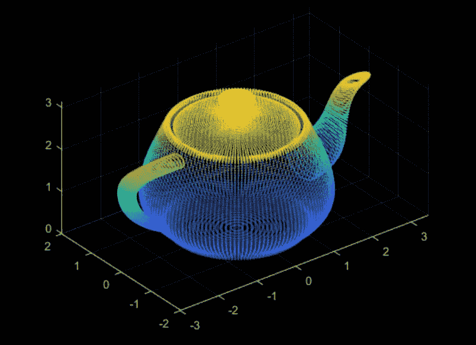
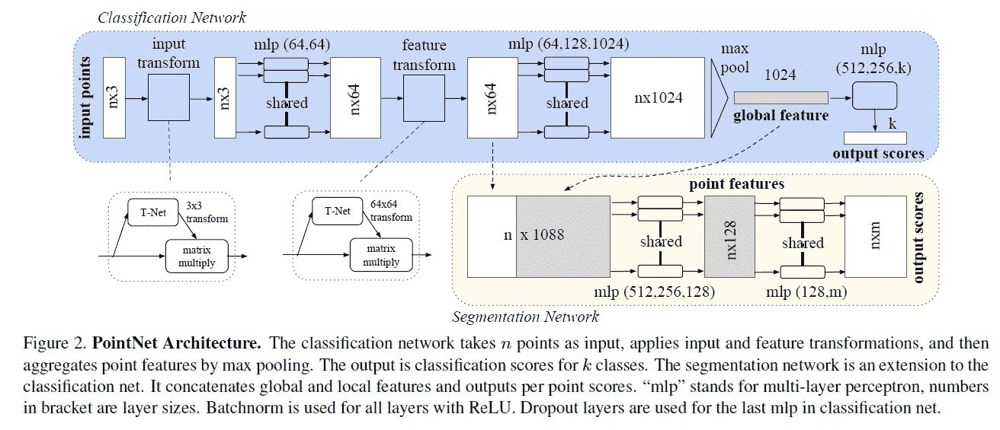
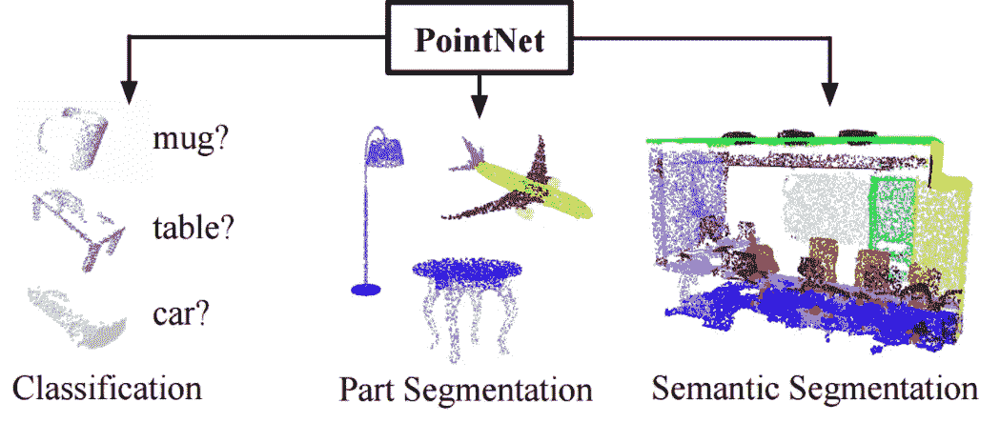
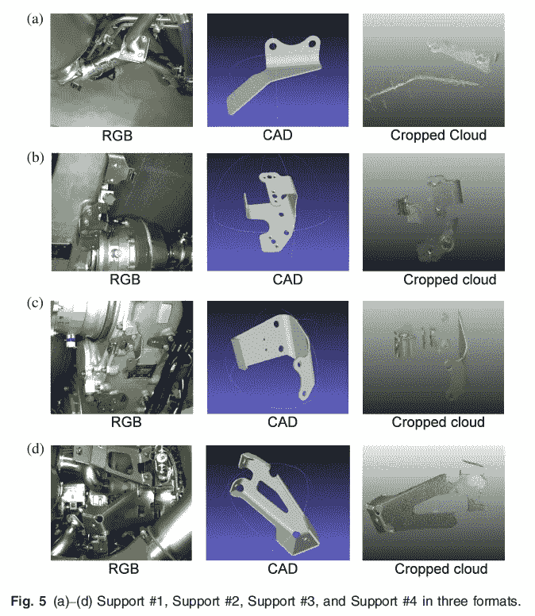
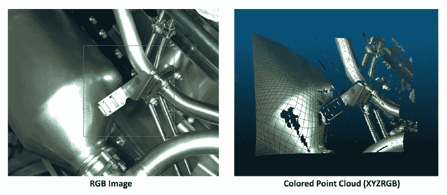
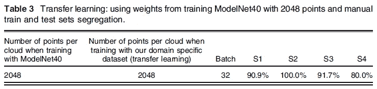

# 如何在工业环境中使用 PointNet 实现 3D 计算机视觉

> 原文：<https://towardsdatascience.com/how-to-use-pointnet-for-3d-computer-vision-in-an-industrial-context-3568ba37327e?source=collection_archive---------18----------------------->

## 我们如何使用来自工业 3D 传感器的数据测试 PointNet

来自 revopoint3d 的图像

# 三维计算机视觉

3D 计算机视觉是一个迷人的领域！

我们可以用多种形式在 3D 中表示 2D 的场景，而不是用一组像素值。

一些著名的形式:

*   深度图像，也称为 RGBD，其中 D 代表深度。
*   3D 点云，其中有一组在 3D 参考框架中表示的点。
*   体素，我们将 3D 场景表示为一组立方体。
*   网格，我们对 3D 点云进行三角剖分，以获得连接 3D 点的平滑三角形。

有很多经典算法使用 3D 图像来做各种很酷的应用，如增强现实。

但是深度学习已经在这个领域掀起了风暴(就像它在许多其他领域一样！).现在，我们有了神经网络，它正在取代经典算法，并大幅超越其性能。

# 3D 计算机视觉的深度学习

已经有几种方法将深度学习应用于 3D 图像。

一种著名的方法是名为 PointNet 的神经网络，它将 3D 点云作为输入。

这个网络可以用于几个任务:分类，语义分割和部分分割，如下图所示。

图片来自 PointNet paper [1]

网络的架构出奇的简单！

它将 N 个点作为一组无序的 3D 点。

它应用一些变换来确保点的顺序无关紧要。

然后，这些点通过一系列 MLP(多层感知器)和 max pooling 层，最终获得全局特征。

为了分类，这些特征然后被馈送到另一个 MLP，以获得代表 K 个类别的 K 个输出。

对于分割，添加另一个子神经网络以获得逐点分类。

图片来自原始纸张[1]

# 工业背景下的点网

PointNet 可以处理原始格式的 3D 点云。

这意味着许多行业可以将它与 3D 传感器结合使用。

我们和一些前同事一起对此进行了实验，并发表了一篇论文[2]概述了我们所做的一些实验。

实验的目标是尝试和分类 4 种不同类型的“工业支持”。这些“工业支架”可以在飞机底盘内找到。下图显示了 4 种类型的支架。

图片来自我们的论文[2]

# 我们学到了什么

我们做了几次实验来实现我们对这些点云进行分类的目标。我们没有太多的数据，所以我们必须找到允许我们利用有限数据集进行深度学习的方法。下文提到了一些重要的调查结果。

## 1.具有不完美三维点云的点网

我们发现，即使点云远非完美，也可以对使用工业 3D 传感器获得的点云应用 PointNet。例如，在下图中，您可以在左侧看到某个场景的 2D 图像，在右侧看到表示同一场景的 3D 点云，这些点云是使用 3D 工业传感器获取的。正如你可以清楚地看到，收购远非完美。但即使是这样的收购，我们也能得到一些非常有趣的结果。

图片来自我们的论文[2]

## 2.迁移学习可以用在 3D 点云上，就像在 2D 图像上一样

由于我们的数据量有限，我们尝试对 3D 点云使用迁移学习，就像对 2D 图像一样。

我们使用了一个名为 ModelNet40 的数据集，它由 12000 多个 CAD 模型组成，分为 40 个类。我们首先在这个数据集上训练 PointNet，然后在我们的小数据集上对它进行微调。下表显示了我们利用迁移学习获得的一些结果。我们实现了一些非常高的精度！

图片来自我们的论文[2]

## 3.影响点网性能的重要因素

当涉及到性能时，输入点云中包含的点数可能是一个重要因素。由于我们可以控制输入点云的大小，我们用几个值进行了实验，我们发现根据这个数字，精度可以变得非常高或非常低。这是有意义的，因为我们的点云已经不完美，所以当我们对它们进行缩减采样时，我们会丢失更多信息，而这些信息对于通过点网学习良好的特征可能是有价值的。

我们发现另一个非常重要的因素是用于获得 PointNet 最终输入的采样算法的类型。

从点的数量来看，来自 3D 传感器的原始点云可能非常大，因此我们总是需要对它们进行下采样。为此，我们使用了 2 种不同的算法:*随机采样*和 f *最优点采样(FPS)。*后一种算法擅长保留对结果产生积极影响的有意义的云结构。

# 结论

在本文中，我们介绍了 PointNet，一种用于 3D 点云的深度神经网络，如何用于来自工业传感器的 3D 数据。我们看到了它是如何用于将点云分成 4 个不同的类别，即使它们是不完美的。我们还看到了一些因素，如输入点的数量和采样算法的类型如何影响结果。

# 参考

[1]查尔斯·r·齐，，凯春莫，列奥尼达·j·吉巴斯." *PointNet:用于三维分类和分割的点集深度学习*"

[2]伊万·米哈伊洛夫、伊戈尔·约万切维奇、努尔·伊斯拉姆·莫赫塔里、让-何塞·奥尔特乌。"*在结构化工业环境中使用三维传感器进行分类*"

作者制作的图像

我是一名机器学习工程师，致力于解决具有挑战性的计算机视觉问题。我想帮助你学习应用于计算机视觉问题的机器学习。以下是方法。

1.  通过帮助您了解该领域的最新动态。我几乎每天都在 [**、LinkedIn**](https://www.linkedin.com/in/nour-islam-mokhtari-07b521a5/) 和 [**、Twitter**](https://twitter.com/NourIslamMo)****上分享小型博客帖子。**那就跟我去吧！**
2.  **每周给你一份我的 [**时事通讯**](https://nourislam.ck.page/dc3e8b7e12) 上那些琐碎帖子的摘要。所以订阅吧！**
3.  **通过在 Medium 上写关于机器学习不同主题的文章。所以跟我来吧！**
4.  **给你一份免费的机器学习工作清单，帮助你检查你需要学习的所有要点，如果你计划在 ML，特别是在计算机视觉方面的职业生涯。你可以在这里 获得核对表 [**。**](https://www.aifee.co/free-resources)**

**5.最后但同样重要的是，通过与你分享我的 [**免费入门张量流课程**](https://aifee.teachable.com/p/introduction-to-tensorflow-2-for-computer-vision) ，它有超过 ***4 小时*的视频内容**，你可以在那里问我任何问题。**

**此外，如果您有任何问题或者您只是想聊聊 ML，请随时在 LinkedIn 或 Twitter 上联系我！**