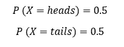
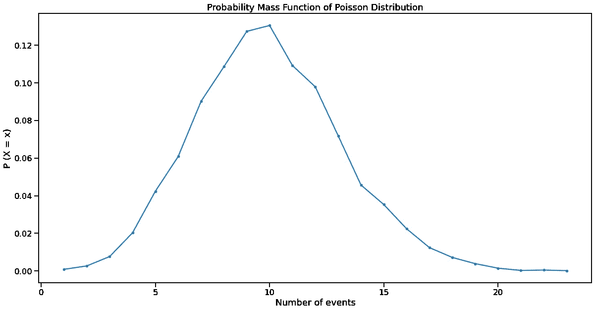

# 如何使用泊松分布像你知道你在做什么

> 原文：<https://towardsdatascience.com/how-to-use-poisson-distribution-like-you-know-what-you-are-doing-c095c1e477c1?source=collection_archive---------15----------------------->

## 幸运的是，这些情况下有泊松分布


**照片由** [**安德里亚·皮亚卡迪奥**](https://www.pexels.com/@olly?utm_content=attributionCopyText&utm_medium=referral&utm_source=pexels) **发自** [**像素**](https://www.pexels.com/photo/senior-man-using-vr-goggles-in-studio-3831136/?utm_content=attributionCopyText&utm_medium=referral&utm_source=pexels)

## 故事

你从事自由职业已经 10 年了。到目前为止，你的平均年收入大约是 80，000 美元。今年，你觉得自己停滞不前，决定达到 6 位数。为了做到这一点，你想从计算这个令人兴奋的成就发生的概率开始，但你不知道如何去做。

事实证明，你并不孤单。在这个世界上，有许多情况下，某个随机事件的发生率是已知的，而企业希望找到该事件在未来发生的几率是高于还是低于这个发生率。

例如，已经知道自己平均销售额的零售商会试图猜测他们在黑色星期五或网络星期一等特殊日子会多赚多少钱。这将帮助他们储存更多的产品，并相应地管理他们的员工。

在本帖中，我们将讨论泊松分布背后的直觉，泊松分布用于模拟上述情况，如何理解和使用它的公式，以及如何使用 Python 代码模拟它。

[](https://ibexorigin.medium.com/membership) [## 通过我的推荐链接加入 Medium-BEXGBoost

### 获得独家访问我的所有⚡premium⚡内容和所有媒体没有限制。支持我的工作，给我买一个…

ibexorigin.medium.com](https://ibexorigin.medium.com/membership) 

获得由强大的 AI-Alpha 信号选择和总结的最佳和最新的 ML 和 AI 论文:

[](https://alphasignal.ai/?referrer=Bex) [## 阿尔法信号|机器学习的极品。艾总结的。

### 留在循环中，不用花无数时间浏览下一个突破；我们的算法识别…

alphasignal.ai](https://alphasignal.ai/?referrer=Bex) 

## 离散概率分布

> 这篇文章假设你对概率有基本的了解。如果没有，请查看这篇[伟大的](/probability-concepts-explained-introduction-a7c0316de465)文章。

在我们开始这篇文章的真正内容之前，我们将对离散概率分布有所了解。

首先，让我们定义什么是离散的。在描述统计学中，离散数据是通过计数记录或收集的任何数据，即整数。例如考试成绩、停车场的汽车数量、医院的分娩数量等。

然后，有随机实验，有离散的结果。例如，掷硬币有两种结果:正面和反面(1 和 0)，滚动骰子有 6 种不连续的结果，等等。如果一个随机变量 *X* 被用来存储一个离散实验的可能结果，它将有一个离散的概率分布。

> 概率分布记录了随机实验的所有可能结果。

举一个简单的例子，让我们建立一次抛硬币的分布:



那很容易。如果我们想以编程的方式记录分布，它应该是 Python 列表或 Numpy 数组的形式:


然而，你可以想象，对于有许多可能结果的大型实验来说，以这种方式构建分布并找到概率变得不可能。值得庆幸的是，每一个发明的概率分布都有自己的公式来计算任何结果的概率。对于离散概率分布，这些函数被称为概率质量函数(PMF)。更详细的解释，请阅读我在[上一篇关于离散分布的文章](/how-to-think-probabilistically-with-discrete-distributions-ea28e2bcafdc)。

## 泊松分布

我们将通过案例研究开始理解泊松分布。说你真的很喜欢在医院里看新生儿。根据您的观察和报告，您知道医院平均每小时观察 6 名新生儿。


照片由[米哈尔·巴尔·哈伊姆](https://unsplash.com/@michalbarhaim?utm_source=medium&utm_medium=referral)在 [Unsplash](https://unsplash.com?utm_source=medium&utm_medium=referral) 拍摄

你发现你明天要出差，所以在去机场之前，你想最后一次去医院。因为你要离开几个月，你想看到尽可能多的新生儿，所以你想知道在飞机起飞前一小时看到 10 个或更多婴儿的可能性。

如果我们将观察新生婴儿视为随机实验，结果将遵循经典的泊松分布。原因是它满足泊松分布所需的所有条件:

*   有一个已知的事件发生率:平均每小时 6 个新生儿
*   事件独立发生:一个婴儿的出生不影响下一个的时间
*   已知的比率是不变的:每小时婴儿的平均数量不会随着时间而改变
*   两件事不会在完全相同的时刻发生
*   (提醒:每个结果都是独立的)

泊松分布有许多重要的商业含义。企业通常使用它来预测特定一天的销售额或客户数量，因为他们知道平均日费率。做出这样的预测有助于企业在生产、调度或人员配备方面做出更好的决策。例如，库存过多意味着低销售活动的损失，或者没有足够的货物意味着失去商业机会。

简而言之，泊松分布有助于发现事件在固定时间间隔内发生的概率大于或小于已经记录的比率(通常表示为 *λ (lambda)* )。

其概率质量函数由以下公式给出:


在哪里

*   k 是成功的次数(期望事件发生的次数)
*   λ是给定的速率
*   *e* 是欧拉数:e = 2.71828…
*   *k！*是 *k* 的阶乘

> 如果你仍然对 PMFs 感到不舒服，请阅读我的[上一篇文章](/how-to-think-probabilistically-with-discrete-distributions-ea28e2bcafdc)。

使用这个公式，我们可以发现看到 10 个新生婴儿的概率，知道平均比率是 6:


不幸的是，只有 4%的机会看到 10 个婴儿。

> 我们不会详细讨论这个公式是如何推导出来的，但是如果你好奇，可以看看汗学院的这个视频。

仍然有一些要点你必须记住。尽管有一个已知的比率，但它只是一个平均值，所以事件发生的时间完全是随机的。例如，你可以连续观察两个婴儿的出生，或者你可能要等半个小时才能看到下一个。

此外，在实践中，速率λ可能不总是恒定的。这甚至可以适用于我们的新生儿实验。即使这个条件不成立，我们仍然可以将分布视为泊松分布，因为泊松分布足够接近来模拟情况的行为。

## 模拟泊松分布

使用`numpy`从泊松分布中模拟或抽取样本非常容易。我们首先导入它并使用它的`random`模块进行模拟:

```
import numpy as np
```

为了从泊松分布中抽取样本，我们只需要速率参数 *λ* 。我们将它插入`np.random.poisson`函数，并指定样本数:

```
poisson = np.random.poisson(lam=10, size=10000)
```

这里，我们模拟一个比率为 10 的分布，有 10k 个数据点。为了看到这种分布，我们将绘制其 PMF 的结果。虽然我们可以手工完成，但是已经有一个非常好的库叫做`empiricaldist`，作者是 Allen B. Downey，他是著名书籍的作者，比如 *ThinkPython* 和 *ThinkStats* 。我们将在我们的环境中安装并导入它的`Pmf`函数:

```
from empiricaldist import Pmf  # pip install empiricaldist
```

`Pmf`有一个名为`from_seq`的函数，它接受任意分布并计算 PMF:

```
poisson = np.random.poisson(lam=10, size=10000)pmf_poisson = Pmf.from_seq(poisson)
pmf_poisson
```


回想一下，PMF 显示了每个独特结果的概率，所以在上面的结果中，结果在`probs`下作为指数和概率给出。让我们使用`matplotlib`来绘制它:



正如所料，最高概率是平均值(速率参数，λ)。

现在，让我们假设我们忘记了泊松分布的 PMF 公式。如果我们正在做观察新生儿的实验，我们将如何发现看到 10 个新生儿的概率为 6？

首先，我们用给定的利率作为参数来模拟完美的泊松分布。此外，我们确保抽取大量样本以提高准确性:

我们正在对一个比率为 6、长度为 100 万的分布进行抽样。接下来，我们发现他们中有多少人生了 10 个孩子:

所以，我们在 41114 次试验中观察了 10 个婴儿(每个小时可以认为有一次试验)。然后，我们将这个数字除以样本总数:

```
>>> births_10 / 1e60.041114
```

如果你记得，使用 PMF 公式，结果是 0.0413，我们可以看到，我们的手动编码解决方案是一个非常接近的匹配。

## 结论

关于泊松分布还有很多要说的。我们讨论了基本用法及其在商业世界中的含义。泊松分布仍然有有趣的部分，例如它如何与二项式分布相关。为了全面理解，我建议阅读这些高质量的文章，它们也有助于我对该主题的理解:

*   [Brilliant.org 文章](https://brilliant.org/wiki/poisson-distribution/)
*   [由我最喜欢的作家之一威尔·科尔森](/the-poisson-distribution-and-poisson-process-explained-4e2cb17d459)[在 Medium 上发布](https://medium.com/u/e2f299e30cb9?source=post_page-----c095c1e477c1--------------------------------)
*   [Statisticshowto.com 文章](https://www.statisticshowto.com/poisson-distribution/)
*   一如既往😊，维基百科[页面](https://en.wikipedia.org/wiki/Poisson_distribution#)
*   Numpy [文档](https://numpy.org/doc/stable/reference/random/generated/numpy.random.poisson.html)共`np.random.poisson`篇