# 如何使用 py caret——低代码 ML 的库

> 原文：<https://towardsdatascience.com/how-to-use-pycaret-the-library-for-lazy-data-scientists-91343f960bd2?source=collection_archive---------3----------------------->

## [入门](https://towardsdatascience.com/tagged/getting-started)

## 用最少的代码训练、可视化、评估、解释和部署模型


由 [Armando Arauz](https://unsplash.com/@armandoarauz?utm_source=unsplash&utm_medium=referral&utm_content=creditCopyText) 在 [Unsplash](https://unsplash.com/s/photos/carrot?utm_source=unsplash&utm_medium=referral&utm_content=creditCopyText) 上拍摄的照片

当我们处理有监督的机器学习问题时，很容易看到随机森林或梯度推进模型的表现，如果我们对结果满意，就停止实验。如果只用一行代码就能比较许多不同的模型，会怎么样？如果您可以将数据科学过程中从功能工程到模型部署的每一步都减少到只有几行代码，那会怎么样？

这正是 PyCaret 发挥作用的地方。PyCaret 是一个高级的低代码 Python 库，只需几行代码就可以轻松比较、训练、评估、调优和部署机器学习模型。在其核心，PyCaret 基本上只是许多数据科学库的大型包装器，如 Scikit-learn、Yellowbrick、SHAP、Optuna 和 Spacy。是的，您可以使用这些库来完成相同的任务，但是如果您不想编写大量代码，PyCaret 可以为您节省大量时间。

**在本文中，我将演示如何使用 PyCaret 快速轻松地构建一个机器学习项目，并为部署准备最终模型。**

# 正在安装 PyCaret

PyCaret 是一个有很多依赖项的大型库。我建议使用 Conda 专门为 PyCaret 创建一个虚拟环境，这样安装不会影响任何现有的库。要在 Conda 中创建和激活虚拟环境，请运行以下命令:

```
conda create --name pycaret_env python=3.6
conda activate pycaret_env
```

要安装默认的较小版本的 PyCaret，并且只安装所需的依赖项，可以运行以下命令。

```
pip install pycaret
```

要安装 PyCaret 的完整版本，您应该改为运行以下命令。

```
pip install pycaret[full]
```

安装 PyCaret 后，停用虚拟环境，然后使用以下命令将其添加到 Jupyter。

```
conda deactivate
python -m ipykernel install --user --name pycaret_env --display-name "pycaret_env"
```

现在，在您的浏览器中启动 Jupyter 笔记本后，您应该能够看到将您的环境更改为您刚刚创建的环境的选项。

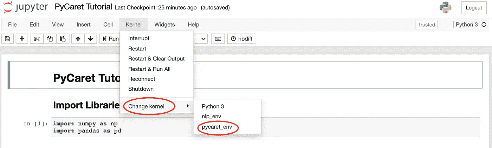

改变 Jupyter 中的 Conda 虚拟环境。

# 导入库

您可以在这个 [GitHub 资源库](https://github.com/AmolMavuduru/PyCaretTutorial)中找到本文的完整代码。在下面的代码中，我简单地导入了 Numpy 和 Pandas 来处理这个演示的数据。

```
import numpy as np
import pandas as pd
```

# 读取数据

对于这个例子，我使用了 Kaggle 上的[加州房价数据集](https://www.kaggle.com/camnugent/california-housing-prices)。在下面的代码中，我将这个数据集读入一个数据帧，并显示该数据帧的前十行。

```
housing_data = pd.read_csv('./data/housing.csv')
housing_data.head(10)
```

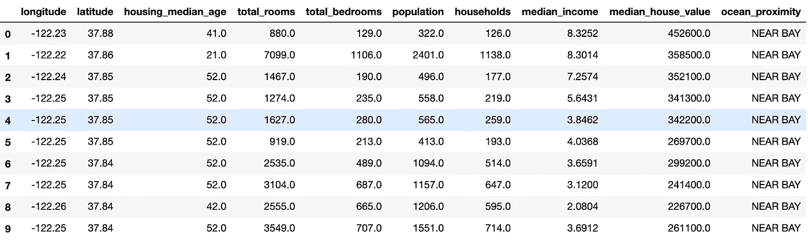

住房数据集的前十行。

上面的输出让我们了解了数据的样子。数据主要包含数字特征，其中一个分类特征表示每栋房屋与海洋的距离。我们试图预测的目标列是 **median_house_value** 列。整个数据集总共包含 20，640 个观察值。

# 初始化实验

现在我们有了数据，我们可以初始化一个 PyCaret 实验，它将预处理数据并为我们将在这个数据集上训练的所有模型启用日志记录。

```
from pycaret.regression import *reg_experiment = setup(housing_data, 
                       target = 'median_house_value', 
                       session_id=123, 
                       log_experiment=True, 
                       experiment_name='ca_housing')
```

如下面的 GIF 所示，运行上面的代码预处理数据，然后生成一个带有实验选项的数据帧。

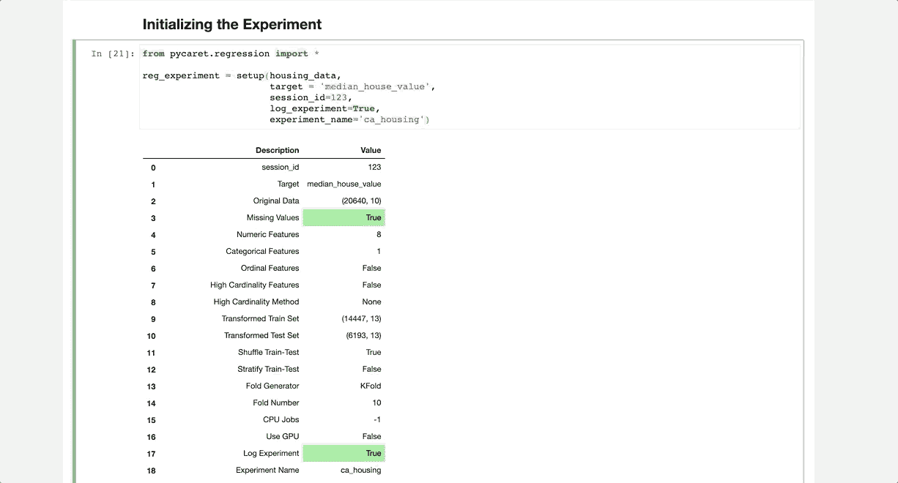

Pycaret 设置函数输出。

# 比较基线模型

我们可以一次比较不同的基线模型，用下面的代码所示的 **compare_models** 函数找到实现最佳 K 倍交叉验证性能的模型。出于演示的目的，我在下面的例子中排除了 XGBoost。

```
best_model = compare_models(exclude=['xgboost'], fold=5)
```

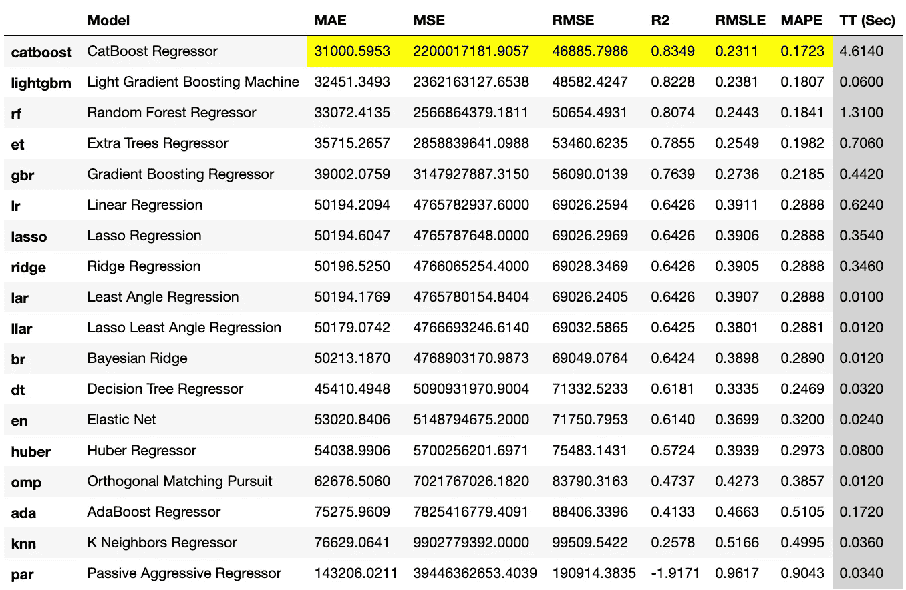

不同模型的比较结果。

该函数生成一个数据框，其中包含每个模型的性能统计数据，并突出显示性能最佳的模型的指标，在本例中是 CatBoost 回归器。

# 创建模型

我们也可以用 PyCaret 只用一行代码训练一个模型。create_model 函数只需要一个与您想要训练的模型类型相对应的字符串。您可以在这个函数的 [PyCaret 文档页面](https://pycaret.readthedocs.io/en/latest/api/regression.html#pycaret.regression.create_model)上找到可接受字符串和相应回归模型的完整列表。

```
catboost = create_model('catboost')
```

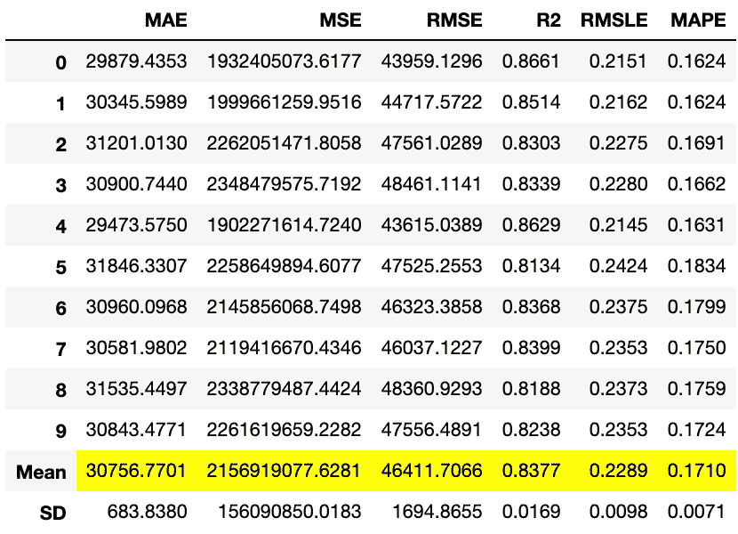

c **reate_model** 函数生成上面的数据帧，其中包含已训练的 CatBoost 模型的交叉验证指标。

# 超参数调谐

现在我们有了一个训练好的模型，我们可以通过超参数调整进一步优化它。只需一行代码，我们就可以调整这个模型的超参数，如下所示。

```
tuned_catboost = tune_model(catboost, n_iter=50, optimize = 'MAE')
```

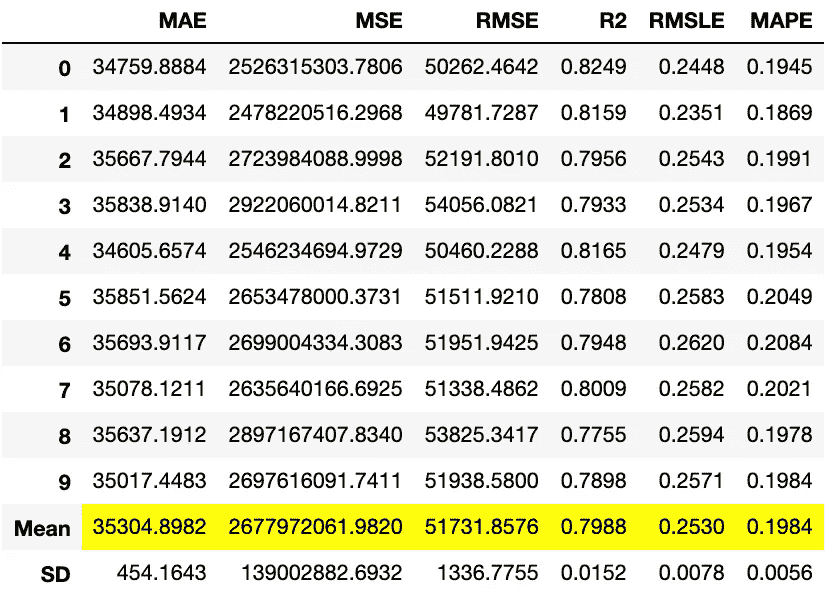

10 倍交叉验证的超参数调整结果。

最重要的结果，在本例中是平均指标，用黄色突出显示。

# 可视化模型的性能

我们可以使用 PyCaret 创建许多图表来可视化模型的性能。PyCaret 使用另一个名为 [Yellowbrick](https://www.scikit-yb.org/en/latest/) 的高级库来构建这些可视化。

## 残差图

默认情况下， **plot_model** 函数将为回归模型生成残差图，如下所示。

```
plot_model(tuned_catboost)
```

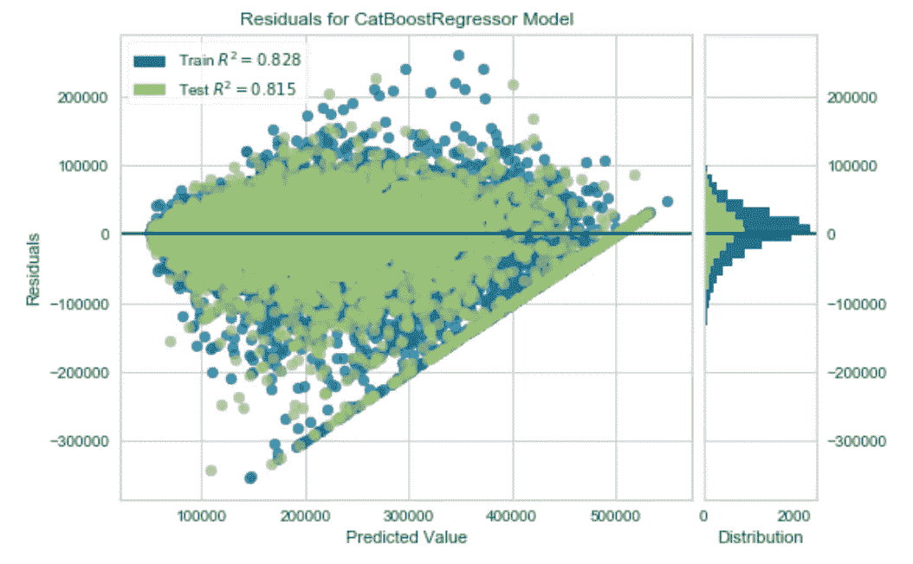

调整后的 CatBoost 模型的残差图。

## 预计误差

我们还可以通过创建预测误差图，将预测值与实际目标值进行对比。

```
plot_model(tuned_catboost, plot = 'error')
```

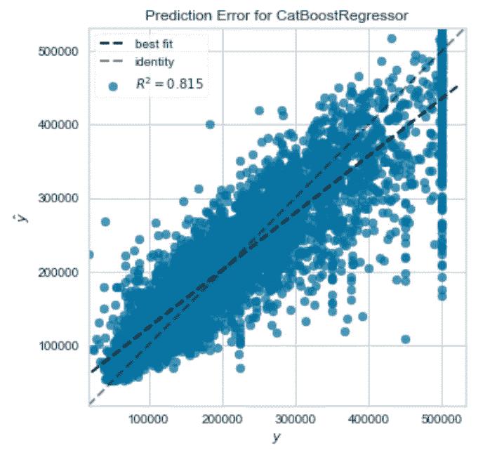

调整后的 CatBoost 回归器的预测误差图。

上面的图特别有用，因为它为我们提供了 CatBoost 模型的 R 系数的可视化表示。在理想情况下(R = 1)，预测值与实际目标值完全匹配，该图将只包含沿单位虚线的点。

## 特征重要性

我们还可以可视化模型的特征重要性，如下所示。

```
plot_model(tuned_catboost, plot = 'feature')
```

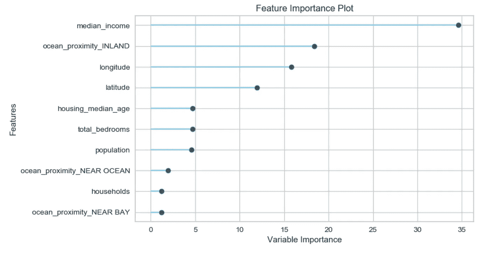

CatBoost 回归器的特征重要性图。

根据上面的图，我们可以看到**中值收入**特征是预测房价时最重要的特征。由于这一特征对应于房屋所在区域的中值收入，因此这一评估非常合理。建造在高收入地区的房子可能比低收入地区的房子更贵。

## **使用所有地块评估模型**

我们还可以用 **evaluate_model** 函数创建多个图来评估一个模型。

```
evaluate_model(tuned_catboost)
```

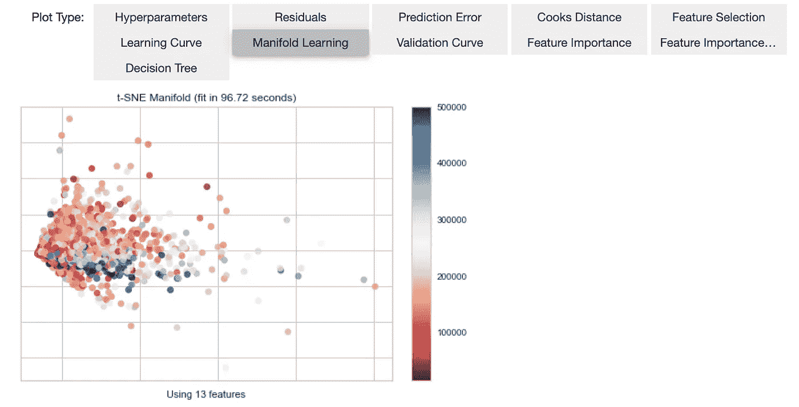

使用 evaluate_model 函数创建的接口。

# 解释模型

**解释模型**函数是解释模型预测的有用工具。这个函数使用一个名为 SHAP 的可解释机器学习库，我在下面的文章中提到过。

[](/how-to-make-your-machine-learning-models-more-explainable-f20f75928f37) [## 如何让你的机器学习模型更容易解释

### 尤其是在向非技术人员演示时。

towardsdatascience.com](/how-to-make-your-machine-learning-models-more-explainable-f20f75928f37) 

只用一行代码，我们就可以为模型创建一个 SHAP [蜂群图](https://shap.readthedocs.io/en/latest/example_notebooks/api_examples/plots/beeswarm.html)。

```
interpret_model(tuned_catboost)
```

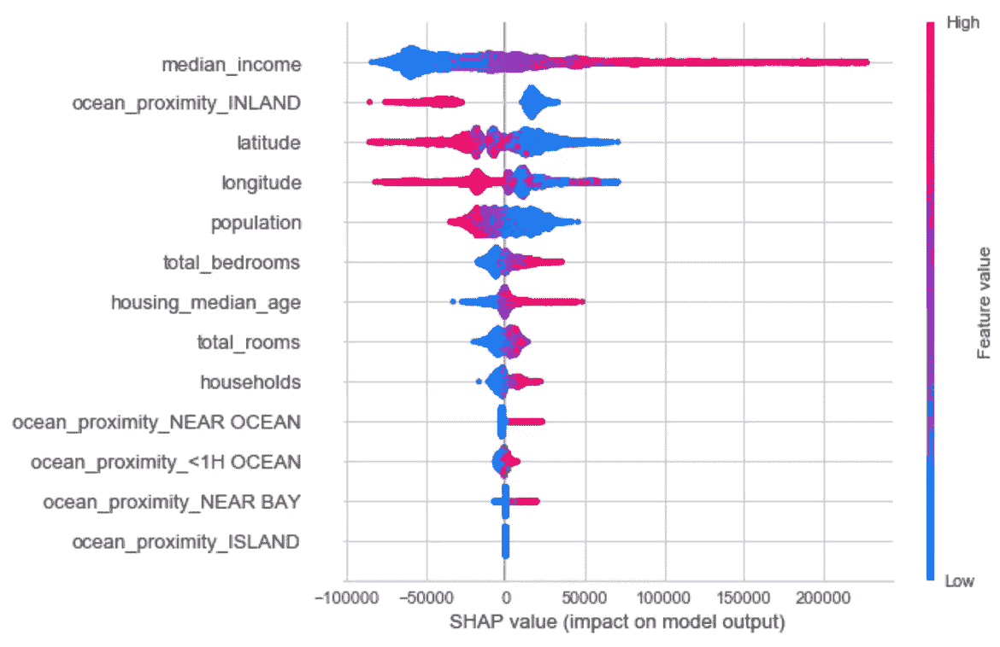

通过调用解释模型函数生成的 SHAP 图。

根据上图，我们可以看到**中值收入**字段对预测的房价影响最大。

# AutoML

PyCaret 还有一个运行自动机器学习(AutoML)的函数。我们可以指定想要优化的损失函数或度量，然后让库接管，如下所示。

```
automl_model = automl(optimize = 'MAE')
```

在这个例子中，AutoML 模型碰巧也是一个 CatBoost 回归器，我们可以通过打印出模型来确认这一点。

```
print(automl_model)
```

运行上面的 print 语句会产生以下输出:

```
<catboost.core.CatBoostRegressor at 0x7f9f05f4aad0>
```

# 生成预测

predict_model 函数允许我们通过使用来自实验的数据或新的未知数据来生成预测。

```
pred_holdouts = predict_model(automl_model)
pred_holdouts.head()
```

上面的 predict_model 函数为用于在交叉验证期间验证模型的维持数据集生成预测。该代码还为我们提供了一个数据框架，其中包含由 AutoML 模型生成的预测的性能统计数据。

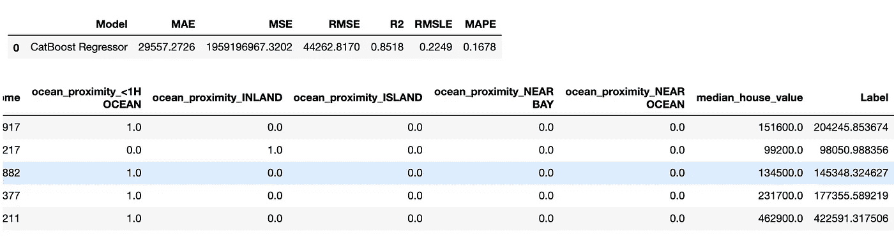

AutoML 模型生成的预测。

在上面的输出中，**标签**列表示 AutoML 模型生成的预测。我们还可以对整个数据集进行预测，如下面的代码所示。

```
new_data = housing_data.copy()
new_data.drop(['median_house_value'], axis=1, inplace=True)
predictions = predict_model(automl_model, data=new_data)
predictions.head()
```

# 保存模型

PyCaret 还允许我们用 **save_model** 函数保存训练好的模型。该函数将模型的转换管道保存到 pickle 文件中。

```
save_model(automl_model, model_name='automl-model')
```

我们也可以用 **load_model** 函数加载保存的 AutoML 模型。

```
loaded_model = load_model('automl-model')
print(loaded_model)
```

打印加载的模型会产生以下输出:

```
Pipeline(memory=None,
         steps=[('dtypes',
                 DataTypes_Auto_infer(categorical_features=[],
                                      display_types=True, features_todrop=[],
                                      id_columns=[], ml_usecase='regression',
                                      numerical_features=[],
                                      target='median_house_value',
                                      time_features=[])),
                ('imputer',
                 Simple_Imputer(categorical_strategy='not_available',
                                fill_value_categorical=None,
                                fill_value_numerical=None,
                                numer...
                ('cluster_all', 'passthrough'),
                ('dummy', Dummify(target='median_house_value')),
                ('fix_perfect', Remove_100(target='median_house_value')),
                ('clean_names', Clean_Colum_Names()),
                ('feature_select', 'passthrough'), ('fix_multi', 'passthrough'),
                ('dfs', 'passthrough'), ('pca', 'passthrough'),
                ['trained_model',
                 <catboost.core.CatBoostRegressor object at 0x7fb750a0aad0>]],
         verbose=False)
```

从上面的输出中我们可以看到，PyCaret 不仅在管道的末端保存了训练好的模型，还在管道的开始保存了特征工程和数据预处理步骤。现在，我们在单个文件中有一个生产就绪的机器学习管道，我们不必担心将管道的各个部分放在一起。

# 模型部署

既然我们已经有了准备生产的模型管道，我们也可以使用 **deploy_model** 函数将模型部署到云平台，比如 AWS。在运行此功能之前，如果您计划将模型部署到 S3 存储桶，则必须运行以下命令来配置 AWS 命令行界面:

```
aws configure
```

运行上面的代码将触发一系列信息提示，比如您需要提供的 AWS Secret Access Key。一旦这个过程完成，您就可以使用 **deploy_model** 函数部署模型了。

```
deploy_model(automl_model, model_name = 'automl-model-aws', 
             platform='aws',
             authentication = {'bucket' : 'pycaret-ca-housing-model'})
```

在上面的代码中，我将 AutoML 模型部署到 AWS 中名为**py caret-ca-housing-model**的 S3 桶中。从这里，您可以编写一个 AWS Lambda 函数，从 S3 获取模型并在云中运行。PyCaret 还允许您使用 **load_model** 函数从 S3 加载模型。

# MLflow UI

PyCaret 的另一个很好的特性是，它可以用一个名为 MLfLow 的机器学习生命周期工具来记录和跟踪你的机器学习实验。运行以下命令将从本地主机在您的浏览器中启动 MLflow 用户界面。

```
!mlflow ui
```

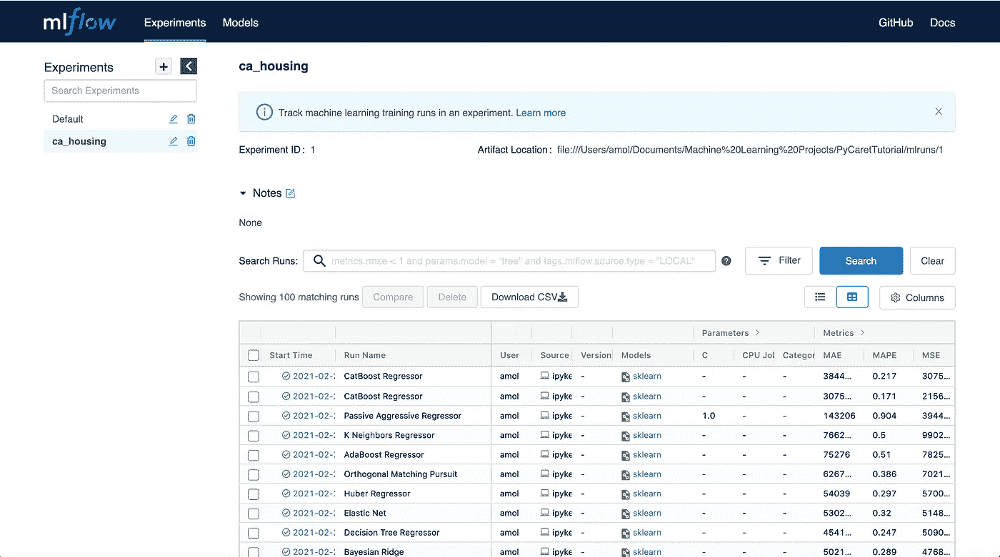

MLFlow 仪表板。

在上面的仪表板中，我们可以看到 MLflow 为您的 PyCaret 实验跟踪不同模型的运行。您可以查看性能指标以及实验中每次运行的运行时间。

# 使用 PyCaret 的利弊

如果您已经读到这里，那么您现在已经对如何使用 PyCaret 有了基本的了解。虽然 PyCaret 是一个很棒的工具，但是如果您计划将它用于您的数据科学项目，您应该了解它的优缺点。

## 赞成的意见

*   低代码库。
*   非常适合简单的标准任务和通用机器学习。
*   为回归、分类、自然语言处理、聚类、异常检测和关联规则挖掘提供支持。
*   使得为模型创建和保存复杂的转换管道变得容易。
*   使可视化模型的性能变得容易。

## 骗局

*   到目前为止，PyCaret 对于文本分类并不理想，因为 NLP 实用程序仅限于主题建模算法。
*   PyCaret 对于深度学习并不理想，并且不使用 Keras 或 PyTorch 模型。
*   你不能用 PyCaret(至少在 2.2.0 版本下)执行更复杂的机器学习任务，比如图像分类和文本生成。
*   通过使用 PyCaret，您为简单和高级代码牺牲了一定程度的控制。

# 摘要

在本文中，我演示了如何使用 PyCaret 来完成机器学习项目中的所有步骤，从数据预处理到模型部署。虽然 PyCaret 是一个有用的工具，但是如果您计划将它用于您的数据科学项目，您应该了解它的优缺点。PyCaret 非常适合使用表格数据的通用机器学习，但从 2.2.0 版本开始，它不是为更复杂的自然语言处理、深度学习和计算机视觉任务而设计的。但它仍然是一个节省时间的工具，谁知道呢，也许开发者将来会增加对更复杂任务的支持？

正如我之前提到的，你可以在 [GitHub](https://github.com/AmolMavuduru/PyCaretTutorial) 上找到这篇文章的[完整代码](https://github.com/AmolMavuduru/PyCaretTutorial)。

# 加入我的邮件列表

你想在数据科学和机器学习方面变得更好吗？您想了解数据科学和机器学习社区的最新图书馆、开发和研究吗？

加入我的[邮件列表](https://mailchi.mp/e8dd82679724/amols-data-science-blog)，获取我的数据科学内容的更新。当你[注册](https://mailchi.mp/e8dd82679724/amols-data-science-blog)时，你还会得到我免费的**解决机器学习问题的逐步指南**！

# 来源

1.  米（meter 的缩写））Ali， [PyCaret:一个用 Python 编写的开源低代码机器学习库](https://pycaret.org/about/)，(2020)，PyCaret.org。
2.  南 M. Lundberg，S. Lee，[解释模型预测的统一方法](https://proceedings.neurips.cc/paper/2017/hash/8a20a8621978632d76c43dfd28b67767-Abstract.html)，(2017)，神经信息处理系统进展 30 (NIPS 2017)。