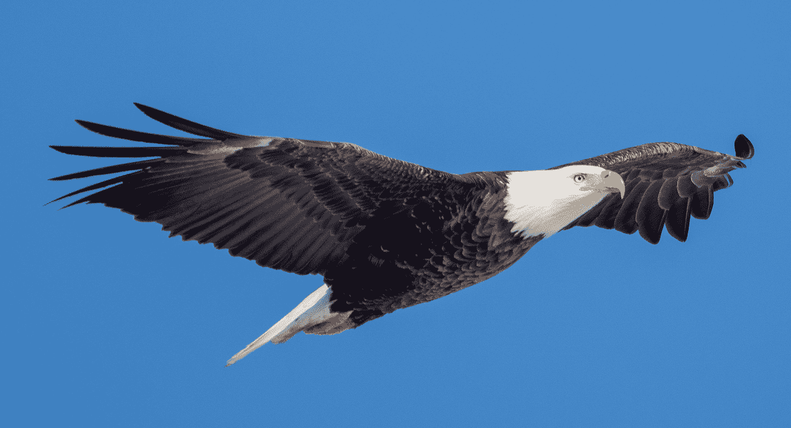
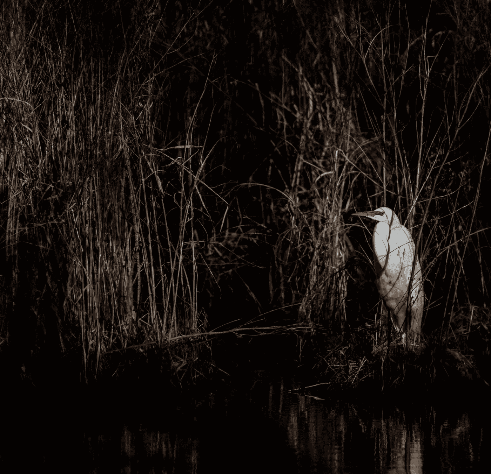
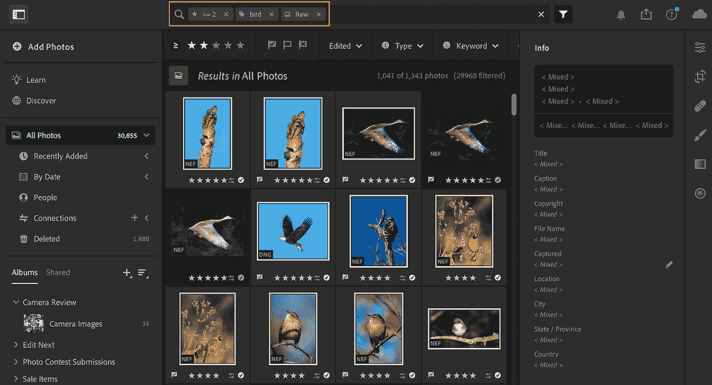
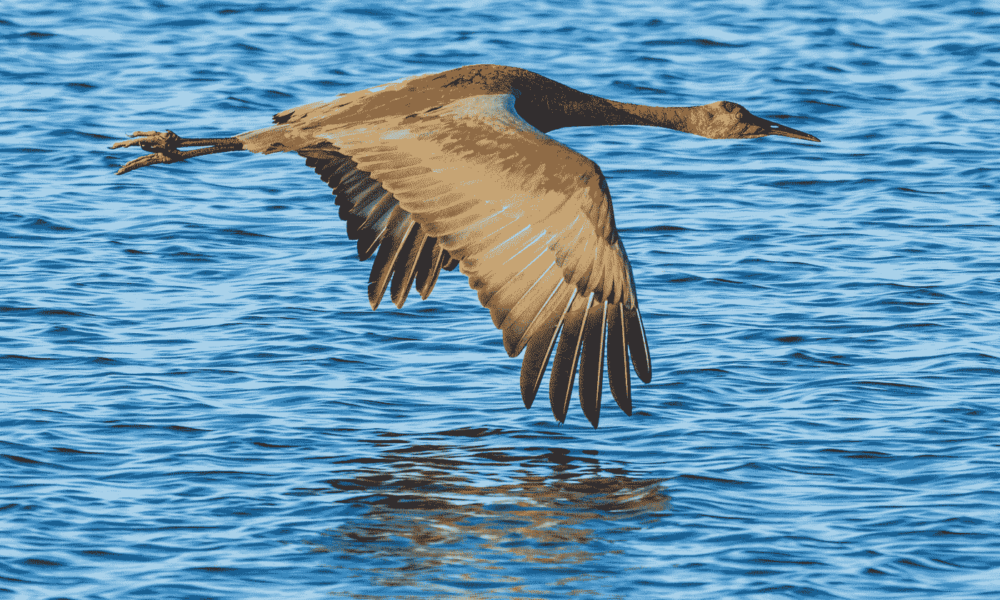
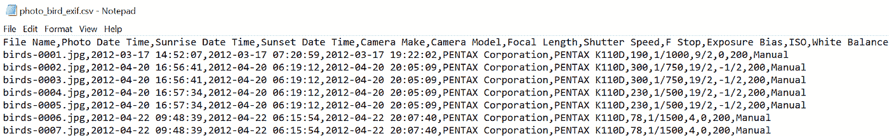
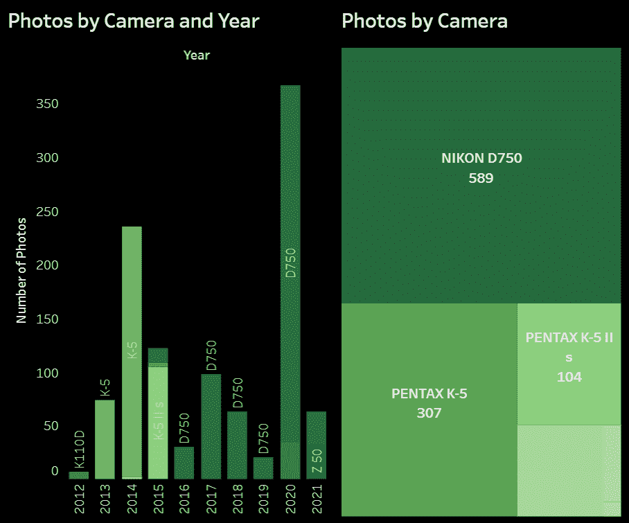
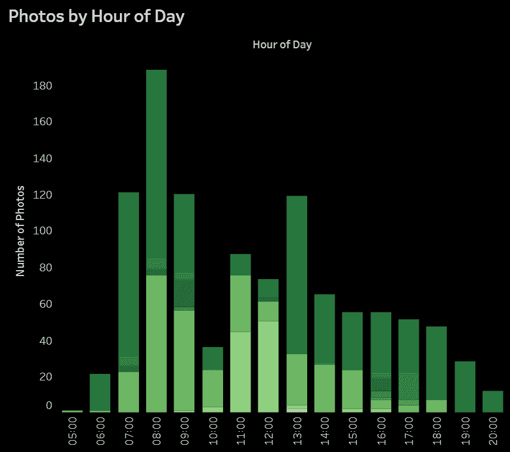
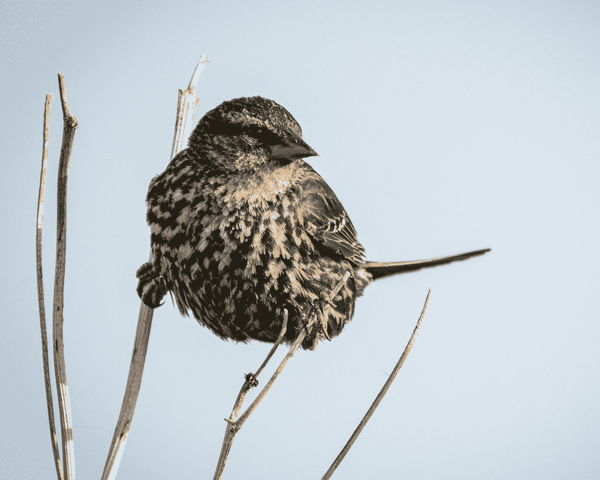

# 如何使用 Python 和 Tableau 分析数码照片元数据

> 原文：<https://towardsdatascience.com/how-to-use-python-and-tableau-to-analyze-digital-photo-metadata-e4d4a744b6a4?source=collection_archive---------26----------------------->

## 本文分享了一个 Python 程序，它使用 exifread 模块读取数字图像文件中的元数据，并使用 Tableau Public 分析细节



成熟的秃鹰。图片由作者提供。

# 介绍

假设你是一名专门拍摄猛禽的野生动物摄影师，比如老鹰、老鹰和猎鹰。你更喜欢捕捉飞行中的鸟的图像(BIF)，尤其是当它们捕获猎物的时候。今天，你站在密西西比河明尼苏达州一侧的河岸上，在佩平湖的下游，紧接着穿过 T2 奇普瓦河口的海峡，在那里流入浩瀚的密西西比河。当秃鹰在水下捕鱼时，你的超长焦镜头对准了它们。

现在，假设您想要分析您在过去十年中拍摄的鸟类照片。不久以前，当被摄对象用胶片拍照时，关于每张照片的信息都是以模拟的形式被记录在胶片上，记录在摄影师的头脑中，也许还被摄影师记录在纸上。相比之下，今天，专用数码相机或智能手机相机记录丰富详细的数字化图像和关于它们的各种元数据。

本文向您展示了如何编写一个 Python 程序，从数码照片文件中提取元数据。然后，它会查找每张照片拍摄日期的日出和日落时间。最后，它将数据写入 CSV 文件，每张照片一条记录。本文还描述了一个 Tableau 公共工作簿，它使用 CSV 文件来组织、查看和分析其中包含的照片元数据。

# 数码照片元数据

当你点击数码相机或智能手机上的快门按钮时，该设备会将来自照片传感器的图像的详细数据写入数字媒体上的文件，如相机的 SD 卡或智能手机的内存。该文件包含在显示器上重建图像所需的数据和元数据，元数据是关于图像的数据。照片编辑软件，如 Adobe Lightroom 和 Photoshop、Microsoft Photos 或 Google Photos，使用图像数据和元数据。用 Python 和其他语言编写的自定义程序也可以读取这些类型的数据。

数码照片元数据以一种标准格式存储，这种格式称为可交换图像文件格式，通常称为 Exif。有关 Exif 结构中包含的字段列表，请参阅由 CIPA 相机和成像产品协会出版的 [Exif 标准](http://www.cipa.jp/std/documents/e/DC-008-2012_E.pdf)的第 42 页。

存储在每个照片文件中的元数据包括与图像相关的值，如日期和时间、相机的品牌和型号以及镜头的品牌和型号。它还包括曝光信息，包括快门速度、感光度(ISO)和光圈(F 档)。



大白鹭。图片由作者提供。

# 本文的案例

当我想象这篇文章时，我想象它将描述一个数据分析项目，它将帮助我确定一天中拍摄鸟类的最佳时间。但它变得更多了。它帮助我理解和反思我的鸟类摄影习惯、技巧和偏好。这可能会支持我拍摄更好的鸟类照片并经常拍摄的目标。

# 照片

为了获得 1，000 多张鸟类照片供该程序处理并与 Tableau Public 一起分析，我在 Adobe Lightroom 中搜索了超过 30，000 张照片的目录，以找到符合这些标准的图像文件:

*   **星级 2/5**—每次拍照后，我会将相机 SD 卡上的照片导入 Lightroom。下一步是后处理，包括检查照片，删除那些模糊、构图不佳或其他不理想的照片，编辑其余的照片，并给每张照片打分。评级是主观的，基于我对照片的喜欢程度，从 1 星到 5 星，其中 1 是可接受的，5 是优秀的。对于这个项目，我选择了评分为 2 或更高的照片。
*   **RAW 的图像类型**——用我的 DSLR 或无反光镜相机，我以 RAW 模式拍摄所有照片，这从传感器捕捉了尽可能多的图像细节。另一种方法是将图像捕获为 JPEG 文件。JPEG 文件是可以接受的，但就其性质而言，相机已经处理并试图优化每张照片，并将其压缩为 JPEG 格式。
*   **鸟的关键词** —在一张鸟的照片之后，我的意图是给每张饲养员的照片加上关键词“鸟”。如果时间允许，我会添加其他关键词，如物种、性别和颜色。这些关键字将帮助我以后搜索和找到鸟类图片。

在这个项目中，我排除了那些我认为是在离家很远的地方拍摄的照片。因为我的相机中设置的日期和时间是当地时区(在我的情况下是美国中部时间)，该时区的日期和时间值被写入每个图像文件。包含我所在时区以外的图片可能会扭曲数据分析的结果。



过滤要从 Lightroom 导出的鸟类照片图像文件。图片由作者提供。

# 本项目中使用的软件

我为这个项目使用了下面列出的软件。

*   **Windows 10 操作系统**——我在大部分专业和个人电脑工作中使用 Windows。
*   **Adobe Lightroom** —我的照片存储在 Adobe Lightroom 的云中(Creative Cloud 版本)。图像 JPEG (*。jpg)文件从 Lightroom 导出，由稍后描述的 Python 程序进行处理。你使用的任何照片编辑软件都可以正常工作。
*   **Python 3.9.2 编程语言**—Python 3 的任何最新版本都应该可以工作。
*   **Visual Studio 社区** —我用过很多版本的微软 Visual Studio。社区版免费。
*   **Tableau Public** —我在 Tableau Public 工作簿的两个仪表板中创建了这个项目中显示的图表。Tableau Public 是流行且强大的 Tableau 商业智能和数据可视化工具的免费版本。公共版本在这个项目中运行良好。但是它的主要限制是只能从有限的文件类型中读取数据，并且只能将工作簿保存到 Tableau 公共服务器。这意味着世界上的任何人都可以查看您使用 Tableau Public 创建的可视化效果。
*   **Windows 记事本** —我用记事本查看 Python 程序创建的 CSV 文件。任何文本或代码编辑器都可以。

***关于软件和操作系统的说明:***

Python 语言应该可以在任何现代操作系统上工作，包括 Mac OS、Linux 和 Windows。Lightroom 和 Tableau Public 版本适用于 Mac OS 和 Windows。虽然微软发布了一个版本的 Visual Studio for Mac OS，但它不支持 Python。但是几乎任何代码编辑器或集成开发环境(IDE)都可以工作。记事本是特定于 Windows 的，但每个操作系统都支持工具来读取文本文件，如程序创建的 CSV 文件。



沙丘鹤。图片由作者提供。

# 程序中使用的 Python 模块

以下是程序中使用的 Python 模块的列表，以及如何使用它们的描述:

*   [**星体**](https://astral.readthedocs.io/en/latest/) —获取日期和时区的日出和日落。
*   [**csv**](https://docs.python.org/3/library/csv.html)**—从每个图像文件的 Exif 数据结构中选择元数据写入 CSV 文件。**
*   **[**日期时间**](https://docs.python.org/3/library/datetime.html) —从日期时间值中提取日期。**
*   **[**Exif Read**](https://pypi.org/project/ExifRead/)**—从保存为 JPEG 格式的图像中读取 Exif 数据(。JPG)文件。****
*   ****[**os**](https://docs.python.org/3/library/os.html) —获取一个目录下的镜像文件的名称。****
*   ****[**pytz**](https://pypi.org/project/pytz/)**—将日出和日落日期时间值从协调世界时(UTC)转换为美国中部时区。这允许相对于拍摄每张照片的日期和时间来确定日出和日落的日期时间值。******

# ******代码******

******该程序的代码分为两个模块。控制器模块运行程序，一个名为 c_photo_exif 的类完成这项工作。这些模块将在以下章节中介绍和显示。******

# ******控制器模块******

******用 C 语言编写的程序有一个 main()函数作为它们的入口点。在 Python 中，我喜欢把入口点称为控制器。这是因为它控制着程序的整体流程。photo_exif_controller.py 文件作为这个程序的入口点和控制器。******

******为了读取图像文件，控制器使用以下值调用 c_photo_exif 类的构造函数(__init__()):******

*   ******包含要读取的图像文件的目录的名称。******
*   ******程序将为每个图像文件写入记录元数据的 CSV 文件的名称。******
*   ******离照片拍摄地最近的城市。******
*   ******照片拍摄地的时区。******

******编写这个程序时假设输入目录中的所有照片都是在大致相同的位置拍摄的。稍后将描述克服这一限制的潜在增强。******

# ******c_photo_exif Python 类******

******文件 c_photo_exif.py 中的 c_photo_exif Python 类是程序的引擎。它执行以下任务:******

1.  ******创建一个 CSV 输出文件，并写入其列名。******
2.  ******遍历指定目录中的图像文件。******
3.  ******从每个文件的 Exif 结构中获取图像元数据。******
4.  ******获取每张照片拍摄当天的日出和日落日期时间值。******
5.  ******将数据写入 CSV 文件。******

******注意: ***由于 c_photo_exif 类的内容大约有 150 行长，所以显示在下面的附录 a 中。*********

********

****CSV 文件中的照片 Exif 数据。图片由作者提供。****

# ****潜在的计划改进和增强****

## ****潜在的改进****

****与大多数概念验证(POC)程序一样，这个程序只执行满足特定需求所需的基本任务。在本例中，它从一组图像文件中读取 Exif 数据，获取与每张照片拍摄日期相关的日出和日落日期时间值，并将数据写入 CSV 文件供以后使用。以下是可对程序进行的潜在改进，以使其为生产做好准备:****

*   ****添加错误处理,这样当出现严重错误(如磁盘故障)时，程序可以正常关闭或重试。****
*   ******将消息写入日志文件**以捕获重要事件，如程序开始时间、结束时间、错误消息和处理的图像文件数量。****

## ****潜在的改进****

****虽然该程序执行其预期的功能，但它可以被增强以服务于额外的用途。以下是一些想法:****

*   ******将输出数据写入关系数据库表**，而不是 CSV 文件。根据需要，将数据写入数据库而不是 CSV 文件可以提供一些优势，例如性能和消除创建重复记录的可能性。****
*   ******从图像文件中获取附加数据**。在本例中，写入输出 CSV 文件的所有内容都是从操作系统(文件名)、每个图像文件中的 Exif 数据结构以及 Astral Python 模块中的日出和日落数据时间值中捕获的。其他有用的数据，如关键字、评级、标题和说明，可能存在于每个图像文件中。我打算学习如何获得这些数据，并在下一篇文章中介绍它们。****
*   ******将输出数据写入 Tableau 超文件**。在这个项目中，Tabeau Pulic 工作簿从 CSV 文件中读取图像元数据，而 Tableau Creator 桌面工作簿可以直接从以 Tableau 专有的 hyperfile 格式编写的文件中获取数据。****
*   ******为上下文**添加其他数据。例如，如果每个鸟类图像文件在标题或关键字字段中包含物种的名称，则可以从单独的数据存储库中获得物种的描述，并将其写入 CSV 文件。****

# ****Tableau 公共工作簿****

****我在这个项目的数据分析部分使用了 Tableau Public。Python 程序编写的 CSV 文件充当 Tableau 工作簿的数据源。使用 Tableau 创建工作表、视觉效果和仪表板的说明超出了本文的范围。但是这两个仪表盘被公布在 Tableau 公共网站上的一个名为[鸟类摄影数据分析](https://public.tableau.com/profile/randall.runtsch#!/vizhome/BirdPhotographyDataAnalysis/BirdPhotosOverview)的工作簿中。请随意下载工作簿，修改它，并将其与您的数码照片的元数据集成在一起。****

## ****鸟类照片概览仪表板****

****这个仪表盘显示了我自 2012 年以来拍摄鸟类的相机的使用数据。它还按镜头长度、快门速度、光圈和 ISO 显示照片数据。****

********

****Tableau 公共照片图表。图片由作者提供。****

## ****按月份和小时显示的鸟类照片****

****这显示了相机在这些时间段拍摄的照片数量:****

*   ****一年中的月份****
*   ****一天中的某个时刻****
*   ****相对于日出的拍摄时间****
*   ****相对于日落的拍摄时间****

********

****Tableau 公共照片图表。图片由作者提供。****

# ****我学到了什么教训？****

****摄影和拍摄好照片是我生活中重要的组成部分。和大多数追求一样，我希望随着时间的推移提高自己的技能和成果。以下是我从这个项目中学到的一些经验，或者直接通过观察数据，或者间接地作为催化剂来反思我多年来的鸟类摄影经历。我想提高我的技术来增加我的守门员比例和图像质量。****

*   ******在相机中设置当地时间** —因为当我离家旅行时，我已经将相机中的日期和时间重置为当地时间，所以我不能总是可靠地确定特定照片是何时拍摄的。从现在起，每当我离开我的时区时，我打算将相机的时间设置为当地时间。幸运的是，有了智能手机，时间会自动改变。****
*   ******在 Lightroom 中或通过智能手机应用程序**为每张照片添加位置信息——直到我进行了这项分析，我才意识到时间和位置数据可以如此紧密地联系在一起。从现在开始，我会在导入后立即将位置信息记录到 Lighroom 中的 keeper photos。我还会尝试使用智能手机上的尼康 SnapBridge 应用程序来自动捕捉每张照片的拍摄位置。****
*   ******为更多的守护者使用最高合理的快门速度** —摄影的一个经验法则是将快门速度设置为镜头焦距的倒数或更高。使用这个规则，700 毫米的焦距保证了 1/700 秒的快门速度。但是设置快门速度涉及到许多变量。例如，相机或镜头可能具有图像稳定功能，这有助于在较低的快门速度下捕捉清晰的图像。另一方面，在鸟类摄影中，拍摄对象通常很远且在移动，因此可能需要更快的快门速度来获得清晰的图像。为了获得更清晰的鸟类照片，我会尝试将快门速度提高到经验法则的倒数以上，无论是使用图像稳定、三脚架还是单脚架。****

********

****雌性红翅乌鸫。图片由作者提供。****

# ****下一步是什么？****

****也许，通过这篇文章，您已经想到了将摄影元数据用于个人或商业项目的方法。以下是我可能会探索的想法:****

*   ****使用 Exif 数据**研究其他类型或主题的摄影模式**，如昆虫、哺乳动物、风景和建筑。或者，我可能会按鸟类研究数据。****
*   ****了解如何以编程方式**从照片文件中获取不是以 Exif 格式存储的额外数据**。例如，也许我对 Lightroom 目录中的许多照片应用的星级和标题可以在应用程序导出的每个 JPEG 文件中找到。有了这些数据点，照片的特征就可以在不同的评级中进行比较和对比。****
*   ******使用存储在每个图像文件中的日期和时间、关键字和潜在位置(GPS)** 来确定每年何时何地返回特定地点，以便有机会拍摄特定种类的鸟类。****

# ****结论****

****到目前为止，您可能对每个数码照片文件的 Exif 文件中存储的元数据有所了解。您还应该了解如何编写 Python 程序来获取元数据并在数据分析项目中使用它。像我一样，也许你可以使用图像元数据来了解你的摄影习惯和技术，并尝试在未来拍出更好的照片。****

# ****关于作者****

****Randy Runtsch 是一名数据分析师、软件开发人员、作家、摄影师、自行车手和冒险家。他和妻子住在美国明尼苏达州东南部。****

****关注 Randy 即将发表的关于公共数据集的文章，以推动数据分析解决方案、编程、数据分析、摄影、自行车旅行、啤酒等。你可以在 shootproof.com[和 shutterstock.com](https://randallruntschimages.shootproof.com/)看到他的一些照片。****

# ****附录 A — Python c_photo_exif 类****

****c_photo_exif 类在文章的正文中有描述。****

```
**"""
Name:           c_photo_exif.py
Author:         Randy Runtsch
Date:           March 20, 2021
Description:    The c_photo_exif class opens all image files in the specified 
                folder, reads the Exif data from each file. It then gets the sunrise
                and sunset times of the day the photo was taken. It then writes a subset
                of the Exif data, and the sunrise and sunset times, as a row in a CSV file.
"""import csv
import exifread
import os
import datetime
from pytz import timezone
from astral.geocoder import lookup, database
from astral.sun import sunclass c_photo_exif:def __init__(self, input_photo_folder, output_csv_file_nm, city, time_zone):# Create the output CSV file with headers and process all of the 
        # photo files.# Set astral location as Minneapolis and time zone as US/Central.
        astral_db = database() 
        self._astral_city = lookup(city, astral_db)
        self._time_zone = time_zoneself._rows_processed = 0csv_writer = self.init_csv_file(output_csv_file_nm)self.process_photos(input_photo_folder, csv_writer)def process_photos(self, input_photo_folder, csv_writer):# Process all of the image files contained in the input folder.rows = 0for subdirs, dirs, files in os.walk(input_photo_folder):

            for photo_file_nm in files:# Process only files with a .jpg extension.if photo_file_nm[-4:] == '.jpg':self._rows_processed += 1photo_file_nm_full = input_photo_folder + '/' + photo_file_nm
                    self.process_photo(photo_file_nm, photo_file_nm_full, csv_writer)def process_photo(self, photo_file_nm, photo_file_nm_full, csv_writer):# Get a subset of EXIF values from the photo file. Call function write_csv_file_row()
        # to write the values as a row to a CSV file.photo_file = open(photo_file_nm_full, 'rb')tags = exifread.process_file(photo_file)camera_make     = tags['Image Make']
        camera_model    = tags['Image Model']
        photo_date_time = tags['EXIF DateTimeOriginal']
        focal_length    = tags['EXIF FocalLength']
        shutter_speed   = tags['EXIF ExposureTime']
        f_stop          = tags['EXIF FNumber']
        exposure_bias   = tags['EXIF ExposureBiasValue']
        white_balance   = tags['EXIF WhiteBalance']
        iso             = tags['EXIF ISOSpeedRatings']# Exif date-time values contain colons in the date part (for example, 2021:01:20). Replace
        # the first two colons with hyphens (-) so that they will be treated as date-time values
        # in other programs, such as Tableau. This will leave the colons in place in the time portion
        # of the value.photo_date_time = photo_date_time.values.replace(':', '-', 2)# Get sunrise and sunset date-time values.sunrise_date_time   = self.get_sun_date_time(photo_date_time, 'sunrise')
        sunset_date_time    = self.get_sun_date_time(photo_date_time, 'sunset')self.write_csv_file_row(csv_writer, photo_file_nm, photo_date_time, sunrise_date_time, sunset_date_time, \
            camera_make, camera_model, focal_length, shutter_speed, f_stop, exposure_bias, iso, white_balance)def init_csv_file(self, output_csv_file_nm):# Open the CSV output file for write (create a new file and overwrite
        # the existing file), write its header, and return its handle.headers = ['File Name', 'Photo Date Time', 'Sunrise Date Time', 'Sunset Date Time', 'Camera Make', 'Camera Model', \
            'Focal Length', 'Shutter Speed', 'F Stop', 'Exposure Bias', 'ISO', 'White Balance']csv_file = open(output_csv_file_nm, 'w', encoding='utf-8', newline='')csv_writer = csv.DictWriter(csv_file, headers)
        csv_writer.writeheader()return csv_writerdef write_csv_file_row(self, csv_writer, file_name, photo_date_time, sunrise_date_time, sunset_date_time, \
        camera_make, camera_model, focal_length, shutter_speed, f_stop, exposure_bias, iso, white_balance):# Assemble the record of Exif values by column and write it to the CSV file.row = {'File Name' : file_name, 'Photo Date Time' : photo_date_time, 'Sunrise Date Time' : sunrise_date_time, \
                  'Sunset Date Time' : sunset_date_time, 'Camera Make' : camera_make, 'Camera Model' : camera_model, \
                  'Focal Length' : focal_length, 'Shutter Speed' : shutter_speed, \
                  'F Stop' : f_stop, "Exposure Bias": exposure_bias, 'ISO' : iso, 'White Balance' : white_balance}csv_writer.writerow(row)def get_sun_date_time(self, date_time_in, date_time_type):# Get the sunrise or sunset date and time in UTC, convert it to the local
        # timezone, and return it as a string in this format: YYYY-MM-DD HH:MM:SS.date_in = datetime.datetime(int(date_time_in[0:4]), int(date_time_in[5:7]), int(date_time_in[8:10]))astral_sun = sun(self._astral_city.observer, date_in)
        astral_date_time = astral_sun[date_time_type]astral_date_time_local = astral_date_time.astimezone(timezone(self._time_zone))
        date_time_out = astral_date_time_local.strftime('%Y-%m-%d %X')return date_time_outdef print_exif_values(self, photo_file_nm):# Print most of the human-readable Exif values for the specified photo file.file = open(photo_file_nm, 'rb')# Return Exif tags
        exif_tags = exifread.process_file(file)for exif_tag in exif_tags.keys():
            if exif_tag not in ('JPEGThumbnail', 'TIFFThumbnail', 'Filename', 'EXIF MakerNote'):
                print("Key: %s, value %s" % (exif_tag, exif_tags[exif_tag]))def get_rows_processed(self):return self._rows_processed**
```