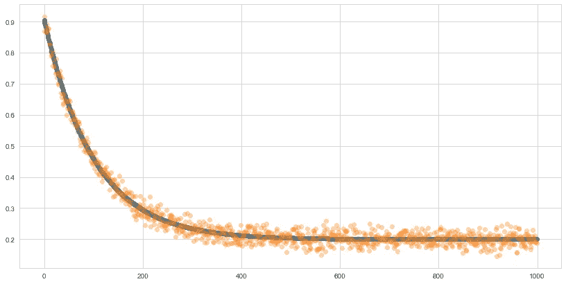
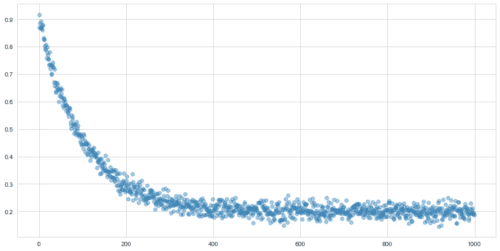
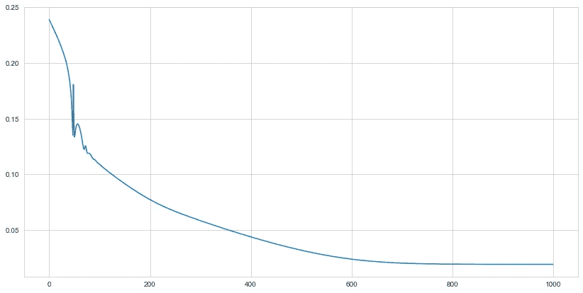

# 如何使用 Pytorch 作为通用优化器

> 原文：<https://towardsdatascience.com/how-to-use-pytorch-as-a-general-optimizer-a91cbf72a7fb?source=collection_archive---------4----------------------->



图片作者。

Pytorch 真的很有趣，如果你正在寻找一个框架来开始学习神经网络，我强烈推荐它——在 Pytorch [这里](/up-and-running-with-pytorch-minibatching-dataloading-and-model-building-7c3fdacaca40)可以看到我关于如何使用基本神经网络的简短教程。

然而，许多人没有意识到 Pytorch 可以用于一般的梯度优化。换句话说，**您可以使用 Pytorch 找到任意复杂优化目标的最小值或最大值。但是，你为什么要这样做呢？我能想到的理由至少有三个(还有很多)。**

1.  您已经熟悉 Pytorch，不想再学习另一个优化框架
2.  您希望对 Pytorch 模型的结果进行优化，即，您希望对 Pytorch 神经网络的预测进行优化(例如，第一阶段神经网络可能会预测客户参与特定高价值活动的倾向，优化器用于确定在给定一些约束条件(如营销预算)的情况下哪个活动是最佳的)。
3.  您希望使用 Pytorch 中定义的高级优化器，比如 Adam。

## 实现通用优化器

嗯……你实际上不需要实现任何东西，如果你已经熟悉 Pytorch，你只需要简单地写一个 Pytorch 自定义模块，就像你写神经网络一样，Pytorch 会处理好所有其他的事情。让我们看一个成功的例子。

为了演示，我们将定义一个简单的函数——指数衰减函数。让我们定义数据——标量浮点值`a, k, b`是函数的未知参数，优化的目标是估计这些参数。

```
import numpy as np
import torch
import matplotlib.pyplot as plt
from torch import nn
from torch.functional import F
from copy import copyimport seaborn as snssns.set_style("whitegrid")n = 1000
noise = torch.Tensor(np.random.normal(0, 0.02, size=n))
x = torch.arange(n)
a, k, b = 0.7, .01, 0.2
y = a * np.exp(-k * x) + b + noiseplt.figure(figsize=(14, 7))
plt.scatter(x, y, alpha=0.4)
```



指数衰减函数——作者图片。

接下来，让我们定义模型和训练循环:

```
class Model(nn.Module):
    """Custom Pytorch model for gradient optimization.
    """
    def __init__(self):

        super().__init__()
        # initialize weights with random numbers
        weights = torch.distributions.Uniform(0, 0.1).sample((3,))
        # make weights torch parameters
        self.weights = nn.Parameter(weights)        

    def forward(self, X):
        """Implement function to be optimised. In this case, an exponential decay
        function (a + exp(-k * X) + b),
        """
        a, k, b = self.weights
        return a * torch.exp(-k * X) + b

def training_loop(model, optimizer, n=1000):
    "Training loop for torch model."
    losses = []
    for i in range(n):
        preds = model(x)
        loss = F.mse_loss(preds, y).sqrt()
        loss.backward()
        optimizer.step()
        optimizer.zero_grad()
        losses.append(loss)  
    return losses
```

如果你熟悉 Pytorch，这里没有什么特别的东西。我们在这里要做的关键事情是定义我们自己的权重，并手动将它们注册为 Pytorch 参数，这就是这些行要做的事情:

```
weights = torch.distributions.Uniform(0, 0.1).sample((3,))
# make weights torch parameters
self.weights = nn.Parameter(weights)
```

下面几行确定了要优化的功能。你可以用你想要最小化的函数的定义来代替它们。

```
a, k, b = self.weights
return a * torch.exp(-k * X) + b
```

通过调用`nn.Parameter`,我们定义的权重将以与标准 Pytorch 参数相同的方式运行——即，它们可以计算梯度并根据损失函数进行更新。训练循环简单地在`n`历元上迭代，每次估计均方误差并更新梯度。

运行模型的时间到了，我们将使用 Adam 进行优化。

```
# instantiate model
m = Model()
# Instantiate optimizer
opt = torch.optim.Adam(m.parameters(), lr=0.001)losses = training_loop(m, opt)
plt.figure(figsize=(14, 7))
plt.plot(losses)
print(m.weights)
```



超过 1000 个时代的损失—作者图片..

上面的图显示了超过 1000 个时期的损失函数——你可以看到，在大约 600 年后，它没有显示出进一步改善的迹象。a、k、b 的估计权重为 0.697、0.0099、0.1996，非常接近定义函数的参数，我们可以使用训练好的模型来估计函数:

```
preds = m(x)
plt.figure(figsize=(14, 7))
plt.scatter(x, preds.detach().numpy())
plt.scatter(x, y, alpha=.3)
```


蓝线是估计的指数衰减曲线——图片由作者提供。

您可以看到，通过优化参数，我们现在可以拟合数据的指数衰减。虽然你可以用来自`scipy`的`curve_fit`做同样的事情，但是我认为 Pytorch 更大的灵活性来适应更复杂的功能是值得花时间去学习的。

**总结**

虽然大多数人会使用 Pytorch 来构建神经网络，但该框架的灵活性使它非常通用。在这篇文章中，我们拟合了一条由指数衰减函数定义的简单曲线，但是没有理由为什么相同的构建块不能扩展到任意复杂的优化函数。

希望这是有帮助的，如果你有任何想法，评论或问题，请告诉我。

感谢阅读！