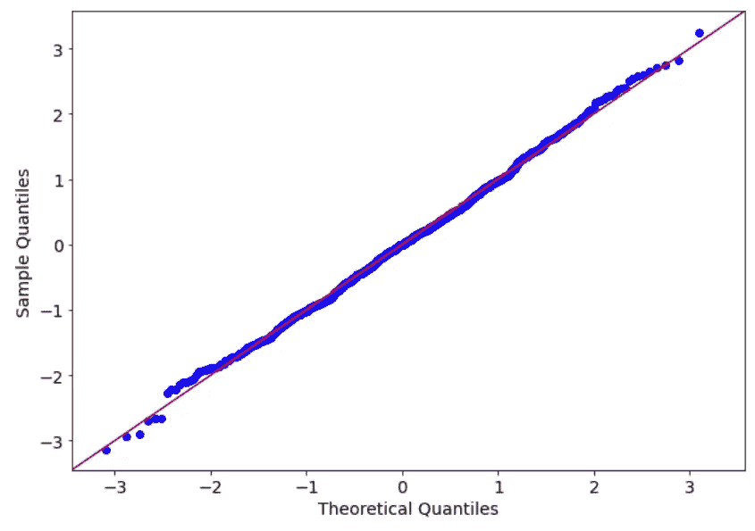
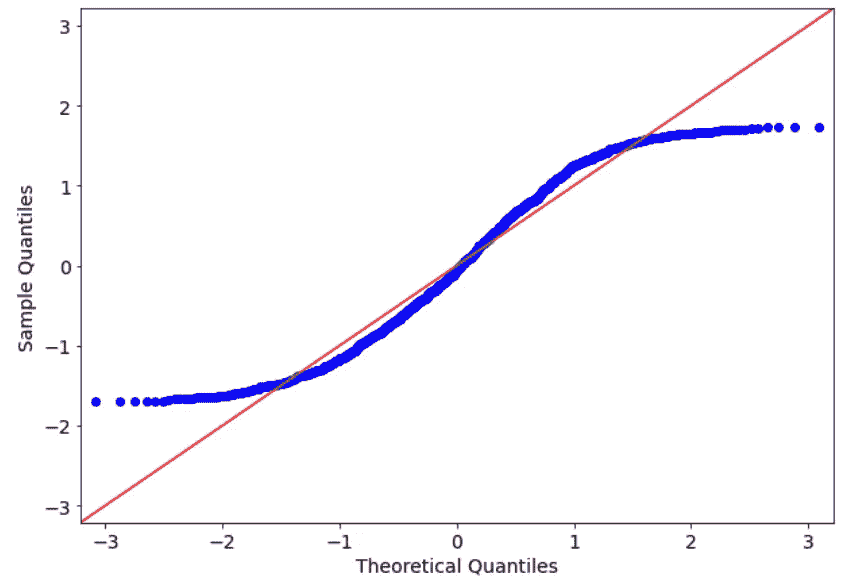
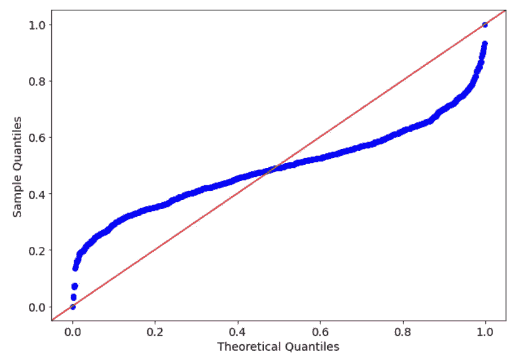
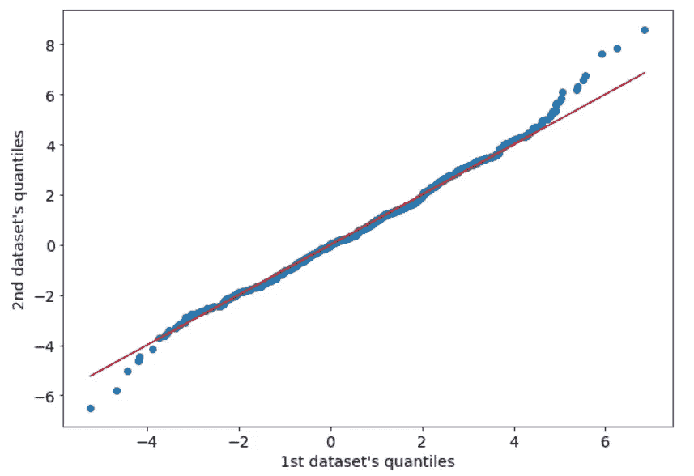

# 如何使用 Q-Q 图检查数据的分布

> 原文：<https://towardsdatascience.com/how-to-use-q-q-plot-for-checking-the-distribution-of-our-data-c798d0577369?source=collection_archive---------28----------------------->



作者图片

数据科学家通常需要检查他们的数据集的统计数据，特别是针对已知的分布或与其他数据集进行比较。我们可以为此目标运行几个假设测试，但我通常更喜欢使用简单的图形表示。我说的是 Q-Q 情节。

# 什么是 Q-Q 情节？

Q-Q 图通常被称为分位数图。这是一个 2D 图，我们在其中将分布的理论分位数与数据集的样本分位数进行比较。如果数据集是根据该分布生成的，我们预计该图表将接近 45 度线，因为样本分位数将与理论分位数相似。如果样本是从不同的分布中生成的，我们就不会得到 45 线。

通过这种方式，我们可以很容易地想象数据集是否类似于理论分布。我们甚至可以使用 Q-Q 图来比较两个数据集，只要它们具有相同的点数。

# Python 中的一个例子

现在让我们看看 Python 中的 Q-Q plot 是如何工作的。你可以在我的 [GitHub repo](https://github.com/gianlucamalato/machinelearning/blob/master/QQ_plot.ipynb) 上找到完整的代码。

首先，让我们导入一些库，并设置随机数种子，以使我们的模拟可重复。

```
from statsmodels.graphics.gofplots import qqplot 
from matplotlib import pyplot as plt plt.rcParams['figure.figsize'] = [10, 7] 
plt.rc('font', size=14) 
from scipy.stats import norm, uniform 
import numpy as np 
np.random.seed(0)
```

现在，让我们模拟 0 和 1 之间的 1000 个均匀分布的点，并将该数据集与具有相同均值和方差的正态分布进行比较。我们期望得到一个与 45 度线非常不同的 Q-Q 图，因为这两个分布非常不同。

```
x = np.random.uniform(1,2,1000)
```

为了根据最佳拟合正态分布绘制该数据集的 Q-Q 图，我们可以编写以下代码:

```
qqplot(x,norm,fit=True,line="45") 
plt.show()
```



作者图片

*fit=True* 参数试图根据最大似然来拟合数据集的正态分布。正如我们所见，样本分位数与理论分位数有很大不同，因为蓝点离红线非常远，红线是 45 度线。

现在让我们尝试使用正态分布的数据集。

```
x = np.random.normal(1,2,1000) 
qqplot(x,norm,fit=True,line="45") 
plt.show()
```


作者图片

现在结果大不一样了。样本分位数与理论分位数非常相似(即蓝色点靠近红线)。有一些异常值会在此图表的下限和上限产生一些噪音，但这不是一个大问题，因为样本分布的最大部分与理论值非常吻合。

当然，改变 *qqplot* 函数的第二个参数，我们可以将我们的样本数据集与另一个分布进行比较。例如，我们可以将正态分布的数据集与均匀分布的数据集进行比较。

```
qqplot(x,uniform,fit=True,line="45") 
plt.show()
```



作者图片

正如预期的那样，结果不太好，因为生成数据集的分布与最佳拟合的均匀分布非常不同。

# 两个数据集的 Q-Q 图

Q-Q 图甚至可以用于 2 个数据集，只要它们具有相同的点数。为了获得两个数据集的样本分位数，我们只需对它们进行升序排序并绘制它们。

让我们从两个正态分布生成两个正态分布数据集，具有相同的均值和相同的方差。

```
x1 = np.random.normal(1,2,1000) 
x2 = np.random.normal(1,2,1000)
```

现在我们可以对数据进行排序:

```
x1.sort() 
x2.sort()
```

然后我们可以画出来:

```
plt.scatter(x1,x2) 
plt.plot([min(x1),max(x1)],[min(x1),max(x1)],color="red") 
plt.xlabel("1st dataset's quantiles") 
plt.ylabel("2nd dataset's quantiles") 
plt.show()
```



作者图片

如我们所见，尾部仍有一些噪声，但分布的中心部分匹配得相当好。

# 结论

在本文中，我展示了如何使用 Q-Q 图来检查样本分布和理论分布之间或两个样本之间的相似性。尽管可以执行一些假设检验来实现这一目标(例如 Kolmogorov-Smirnov 检验)，但我更喜欢使用数据可视化，以便对我们的数据集中的现象进行可视化表示。这样，我们的解释不会受到任何假设检验的影响，甚至对非技术人员来说也更加清晰。

*原载于 2021 年 6 月 21 日*[*【https://www.yourdatateacher.com】*](https://www.yourdatateacher.com/2021/06/21/how-to-use-q-q-plot-for-checking-the-distribution-of-our-data/)*。*