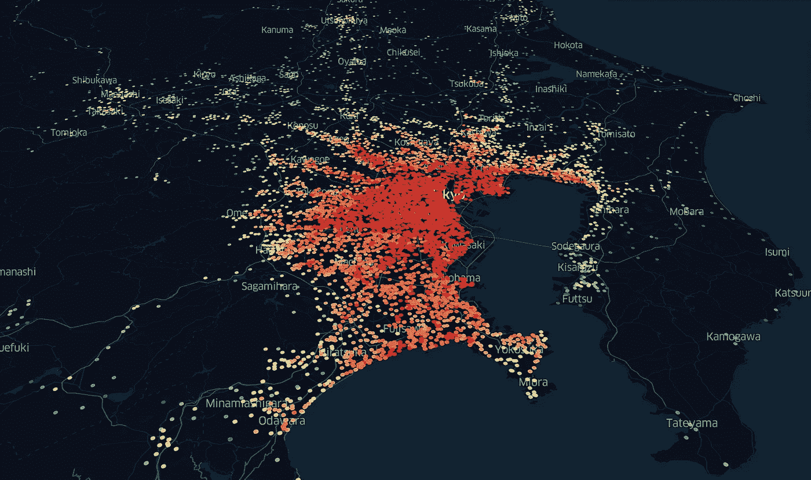
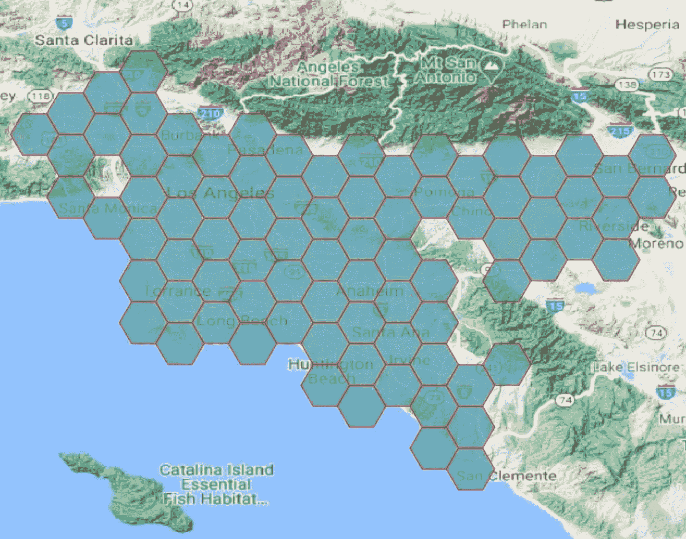
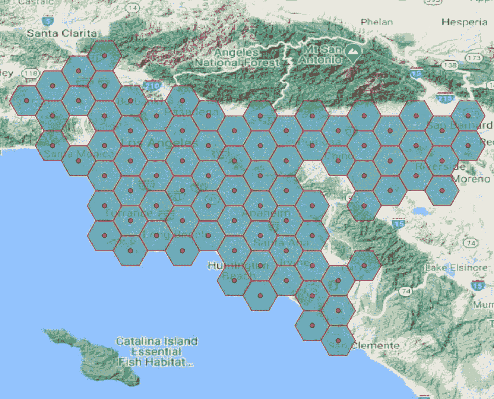

# 如何通过 python 脚本使用 QGIS 空间算法

> 原文：<https://towardsdatascience.com/how-to-use-qgis-spatial-algorithms-with-python-scripts-4bf980e39898?source=collection_archive---------7----------------------->



显示土地价格的日本东京地图。作者照片

QGIS 是您学习 GIS 和空间分析时最先接触到的工具之一。使用这个开源软件包，您可以处理空间数据及其处理的几乎所有方面。尽管它有大量的 GUI 特性可以使用，但有时有一种处理脚本的方法是很重要的。尤其是对于构建工作流的数据科学家和数据工程师来说，他们非常需要可扩展的自动化脚本。QGIS 为此提供了一个名为 [PyQGIS](https://docs.qgis.org/3.10/en/docs/pyqgis_developer_cookbook/) 的 Python API。您可以通过 python 脚本自动执行大多数与 QGIS 相关的操作和空间算法。让我们深入了解这个 Python API，并了解如何在 Python 上使用 QGIS 空间算法。

如果你想了解更多关于位置(地理空间)数据如何变得越来越重要，以及它是数据分析的前进方向，请查看我关于这个主题的文章。

[](https://www.samashti.space/articles/why-geospatial-data-is-the-way-forward-in-data-analytics) [## 为什么地理空间数据是数据分析的发展方向？- Samashti |博客

### 在过去的 10 年里，数据科学和分析已经成为各地的热门话题。数据分析帮助了…

www.samashti.space](https://www.samashti.space/articles/why-geospatial-data-is-the-way-forward-in-data-analytics) [](https://www.samashti.space/articles/why-you-need-to-use-geopackage-files-instead-of-shapefile-or-geojson) [## 为什么需要使用 Geopackage 文件而不是 shapefile 或 GeoJSON？- Samashti |博客

### 如果您一直在使用矢量数据并进行空间分析，您应该知道 shapefile 和 geojson。这是其中的两个…

www.samashti.space](https://www.samashti.space/articles/why-you-need-to-use-geopackage-files-instead-of-shapefile-or-geojson) 

作为其 python API 的一部分，QGIS 在其软件上提供了一个 python 控制台。您可以使用它来访问几乎所有内容，从 QGIS 菜单和图层到在数据图层上运行一些算法。控制台很好地处理了一些小规模的功能执行。但是，如果目标是处理复杂的工作流和更大的数据集，这个控制台就失去了光泽。它具有基本的功能，但缺乏复杂工作流程所需的复杂性。

不能从默认 python 环境中导入 QGIS 库。QGIS 安装了 python 版本来处理运行软件所需的所有模块。因此，如果您需要从 python 控制台/jupyter 笔记本中使用 QGIS 库，您需要确保您的 python 可以找到 QGIS 库路径。或者，您可以在 python 环境中安装 QGIS 库。让我们更详细地看看这些选项。

# 使用 Conda 安装 QGIS 库

如果您使用 [Anaconda](https://www.anaconda.com/) 来管理 python 库，并从事数据科学项目，那么您将主要了解 [conda](https://docs.conda.io/en/latest/) 。类似于 [pip](https://pip.pypa.io/en/stable/) ，conda 是一个 Python 和其他一些语言的包管理系统。使用 conda，您可以像在 Python 上安装任何其他库一样安装 QGIS 包。你可以直接在你默认的 python 环境中安装这个包。但是由于 QGIS 通常对依赖模块有其特定的要求。因此它可能会升级或降级关键包，这可能会为您的其他项目创建依赖模块版本冲突。

理想情况下，如果您将 Python 用于不同的项目，请为每个项目设置一个环境，或者至少为数据科学工作流设置一个环境。通过将这些从全局 python 环境中分离出来，您将使您的系统避免与包依赖相关的错误。因此，安装 QGIS 库的最佳选择是在虚拟环境中进行。它有助于将 QGIS 包与全球 Python 环境隔离开来。

要在活动 Python 虚拟环境中从 conda 安装 QGIS，请在活动 Python 虚拟环境中的终端上运行以下命令。该命令安装必要的 QGIS 库。

```
conda install -c conda-forge qgis
```

# 从虚拟 Python 环境映射 QGIS 桌面软件库。

上述方法可能会安装几个核心 QGIS 库，用于 python 脚本。但这仍无法让您访问桌面软件包中使用的所有 QGIS 空间算法。例如，如果您想要使用 QGIS 的处理工具箱中提供的 GRASS 或 SAGA 处理算法，仅安装 QGIS 核心库是不可能的。如果您经常使用桌面软件，您可能会发现安装工作量很大，而且占用大量存储空间。每次创建项目环境时，安装这么大的包会占用很多存储空间。

相反，您可以使用更简单的解决方案。通过从默认虚拟 Python 环境映射系统环境路径，可以使用 QGIS Desktop 及其库的现有安装(甚至是使用 QGIS 插件安装的 GRASS、SAGA 和其他算法)。您可以将一个现有的 QGIS 安装用于多个 Python 环境，而不存在依赖包的问题，同时不仅仅使用 QGIS 的核心库。

在这种情况下，我将在 Mac OS 上演示这个过程。但是对于 Linux 和 windows，您可以遵循类似的步骤，只需稍加修改。

# 步骤 1:从 QGIS Python 控制台获取和导出系统路径和操作系统环境变量

打开 **QGIS 桌面 app** ，打开 **Python 控制台**。然后首先运行下面几行，将系统路径导出到 CSV 文件。

```
import sys
import pandas as pd
paths = sys.path
df = pd.DataFrame({'paths':paths})
df.to_csv('./qgis_sys_paths.csv', index=False)
```

一旦导出了系统路径，就需要导出 QGIS 中的环境变量。

```
import os
import json
env = dict(os.environ)
rem = ['SECURITYSESSIONID', 'LaunchInstanceID', 'TMPDIR']
_ = [env.pop(r, None) for r in rem]with open('./qgis_env.json', 'w') as f:
    json.dump(env, f, ensure_ascii=False, indent=4)
```

理想情况下，您使用的 python 版本应该与 QGIS 安装中使用的版本相同或更早。要查找随 QGIS 一起安装的 python 版本及其路径，请运行以下代码，并在 Mac OS 的路径`/Applications/Qgis.app/Contents/MacOS/bin/`中查找相应的 Python 可执行文件。

```
from platform import python_version
print(python_version())
```

# 步骤 2:在使用算法之前，用 Python 脚本初始化 QGIS 库

在 python 脚本中使用 QGIS 库及其空间算法之前，我们需要设置刚刚导出的环境变量和路径。此外，我们需要初始化 QGIS 的处理模块。

首先，我们导入一些必要的 python 库来处理环境的设置。

```
# necessary imports
import os
import sys
import json
import pandas as pd
```

导入这些库后，我们需要设置环境变量和系统路径。

```
# set up system paths
qspath = './qgis_sys_paths.csv' 
# provide the path where you saved this file.
paths = pd.read_csv(qspath).paths.tolist()
sys.path += paths# set up environment variables
qepath = './qgis_env.json'
js = json.loads(open(qepath, 'r').read())
for k, v in js.items():
    os.environ[k] = v# In special cases, we might also need to map the PROJ_LIB to handle the projections
# for mac OS
os.environ['PROJ_LIB'] = '/Applications/Qgis.app/Contents/Resources/proj'
```

然后，我们实际上可以从 python 导入 QGIS 库。

```
# qgis library imports
import PyQt5.QtCore
import gdal
import qgis.PyQt.QtCore
from qgis.core import (QgsApplication,
                       QgsProcessingFeedback,
                       QgsProcessingRegistry)
from qgis.analysis import QgsNativeAlgorithms
```

在下一步中，我们通过将 QGIS 的本地算法添加到处理注册表来初始化处理模块及其算法。

```
feedback = QgsProcessingFeedback()# initializing processing module
QgsApplication.setPrefixPath(js['HOME'], True)
qgs = QgsApplication([], False)
qgs.initQgis() # use qgs.exitQgis() to exit the processing module at the end of the script.# initialize processing algorithms
from processing.core.Processing import Processing
Processing.initialize()
import processingQgsApplication.processingRegistry().addProvider(QgsNativeAlgorithms())
```

通过这一步，您可以从 python 访问所有 QGIS 库及其空间算法。您可以通过运行以下代码来检查您有权访问的所有算法。

```
algs = dict()
for alg in QgsApplication.processingRegistry().algorithms():
    algs[alg.displayName()] = alg.id()
print(algs)
```

> 目前，这些步骤解决了从 QGIS native algorithms & GRASS 等提供商处导入算法的问题。我仍在致力于启用佐贺和其他插件，如 Orfeo 工具箱等。，用于 Python。继续查看这个博客的更新，或者如果你知道如何更新，请告诉我。

# 运行算法

你可以从图书馆找到很多算法。您可以运行算法来帮助查看每个算法的描述。提供给算法的参数也显示在帮助输出中。要查看帮助，只需通过提供算法 id 来运行以下代码:

```
processing.algorithmHelp("native:centroids")# which would print this on the console.
"""
Centroids (native:centroids)This algorithm creates a new point layer, with points representing the centroid of the geometries in an input layer.The attributes associated to each point in the output layer are the same ones associated to the original features.----------------
Input parameters
----------------INPUT: Input layer Parameter type:	QgsProcessingParameterFeatureSource Accepted data types:
		- str: layer ID
		- str: layer name
		- str: layer source
		- QgsProcessingFeatureSourceDefinition
		- QgsProperty
		- QgsVectorLayerALL_PARTS: Create centroid for each part Parameter type:	QgsProcessingParameterBoolean Accepted data types:
		- bool
		- int
		- str
		- QgsPropertyOUTPUT: Centroids Parameter type:	QgsProcessingParameterFeatureSink Accepted data types:
		- str: destination vector file, e.g. 'd:/test.shp'
		- str: 'memory:' to store result in temporary memory layer
		- str: using vector provider ID prefix and destination URI, e.g. 'postgres:…' to store result in PostGIS table
		- QgsProcessingOutputLayerDefinition
		- QgsProperty----------------
Outputs
----------------OUTPUT:  <QgsProcessingOutputVectorLayer>
	Centroids
"""
```

因此，我们知道，对于在任何矢量层上运行质心算法的情况，我们知道我们必须提供 3 个参数及其可接受的数据类型。让我们对包含几个多边形的矢量文件运行一个简单的质心算法。



包含洛杉矶市网格多边形的矢量文件示例。作者照片。

对于算法，我们需要创建一个参数字典，一旦完成，我们运行质心算法。

```
parameters = {
    'ALL_PARTS': 1,
    'INPUT': './grid-polygons.geojson',
    'OUTPUT': './grid-centroids.geojson'
}
processing.run("native:centroids", parameters)# this would print out the output, once the algorithm is run.
"""
{'OUTPUT': './grid-centroids.geojson'}
"""
```

我们可以在 QGIS 桌面应用程序上看到网格质心的最终输出。



为洛杉矶市上空的每个网格多边形创建一个质心。作者照片。

# 需要注意的事项

*   理想的做法是让虚拟环境的 Python 版本与 QGIS 安装的版本或更早版本保持一致。否则，这可能会给为早期版本的 Python 构建的一些模块带来问题。
*   不要忘记通过运行`qgs.exitQgis()`退出您初始化的 QGIS 模块，其中 qgs 是您用来初始化模块的变量。
*   对于 windows 用户，由于有一个 OSgeo4W shell，整个过程的处理方式略有不同，这里不做介绍。
*   对于使用 M1 macbook 的用户，QGIS 使用 Rosetta 安装在英特尔架构中。而全球安装的 python 是建立在 arm64 架构上的。即使你使用 Anaconda Python 和 intel 架构，仍然有库(esp。数据科学&空间数据科学)。匹配模块安装的架构非常重要，这样您就可以在 python 中使用 QGIS 和其他库。
*   如果您发现您的全局 python 安装与 QGIS 上的不匹配，esp。在 M1 macbook 中，您可以将 QGIS python 本身用于数据科学工作流。因为它是为空间数据科学需求而构建的，所以没有太多东西可以添加到项目中。您可以按照上面的步骤 1 获得这个 python 路径。
    macOS: `/Applications/Qgis.app/Contents/MacOS/bin/python[version]` Linux: `/usr/share/qgis/python`
*   如上所述，您可以使用 QGIS Python 安装 spyder & jupyter 笔记本，使用 pip 在日常工作流程中使用。

我希望这有助于在日常 python 工作流中设置和使用 QGIS 库。当我找到更多的信息时，我会继续更新这部分，我很高兴收到任何进一步改进的建议。

如果你喜欢这篇文章，请订阅我的[博客](https://samashti.space)，并获得关于未来博客文章的通知。如有任何疑问或讨论，您可以在 [LinkedIn](https://www.linkedin.com/in/nikhilhubballi/) 和 [Twitter](https://twitter.com/samashti_) 上找到我。看看我以前的博客，关于如何免费对地址进行地理编码。

[](https://www.samashti.space/articles/how-to-geocode-addresses-for-free) [## 如何免费对地址进行地理编码？- Samashti |博客

### 近年来，位置数据的使用一直在增加。我们做的每件事都有地理标签。可能是……

www.samashti.space](https://www.samashti.space/articles/how-to-geocode-addresses-for-free) [](https://www.samashti.space/articles/how-alternative-data-helping-companies-invest-big) [## 替代数据如何帮助公司进行大规模投资？- Samashti |博客

### 就在十年前，如果一家公司想将一种新产品或服务推向市场，识别潜在的…

www.samashti.space](https://www.samashti.space/articles/how-alternative-data-helping-companies-invest-big)