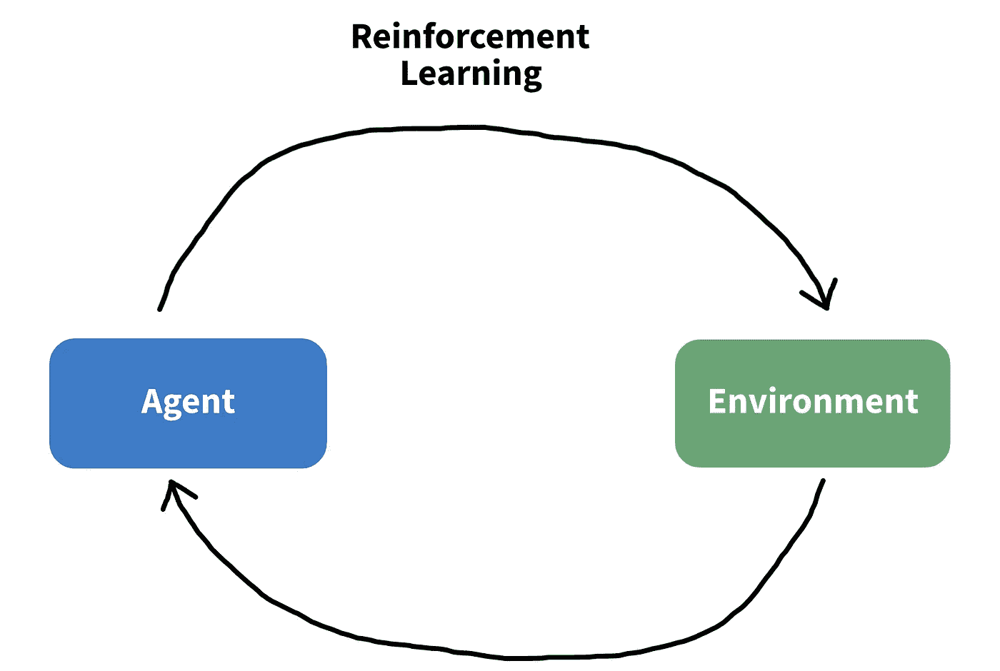
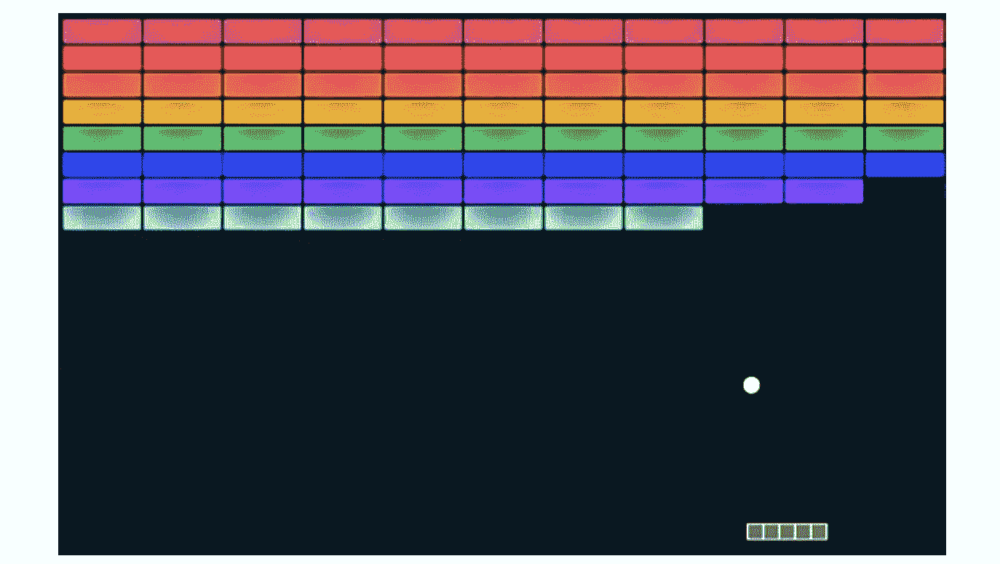
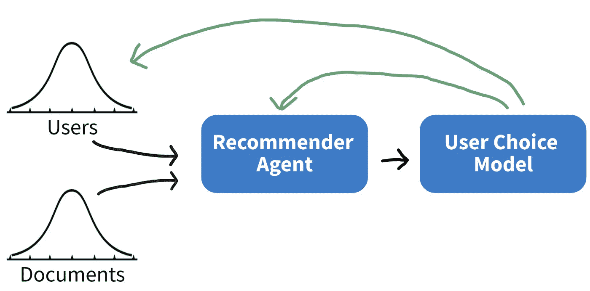
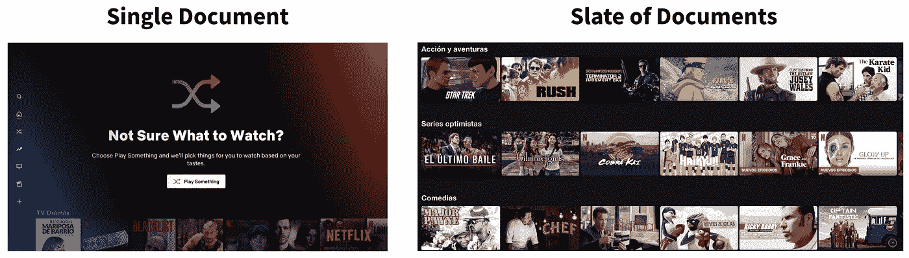

# 如何利用强化学习推荐内容

> 原文：<https://towardsdatascience.com/how-to-use-reinforcement-learning-to-recommend-content-6d7f9171b956?source=collection_archive---------9----------------------->

## 谷歌的研究人员开发了一个新的 RL 框架。

强化学习理论上是最有效的深度学习方法之一。然而，实际上它并不处理复杂的问题。谷歌开发的 RL 框架 RecSim ，允许优化复杂的推荐系统。

图 1:强化学习框架。图片作者。

谷歌和 UT 奥斯汀的研究人员创建了一个更强大的 RL 框架，允许动态用户功能，并处理一些 RL 的技术问题。虽然这种方法计算量很大，但它提供了一个允许优化或推荐引擎的离线开发环境。

让我们深入了解一下这种方法是如何工作的…

# 技术 TLDR

RecSim 是一个利用强化学习(RL)的模拟环境构建器。该方法由“模拟器”模块控制，该模块负责对用户/文档进行采样，并迭代地训练推荐代理。该方法支持与用户的顺序交互，并允许工程师对环境进行大量定制。

这篇论文和其他一些有用的资源在评论中有链接。

# 好的，很多了。它实际上是如何工作的？

让我们慢一点，真正理解这个方法是如何工作的。

## 强化学习的背景

强化学习(RL)是一个框架，它涉及通过重复模拟来训练代理人做出决策。简而言之，代理做出决定，从模拟器获得反馈，调整其决定，然后再次尝试。重复这个过程，直到损失函数被优化。

图 2:雅达利突围:2013 年第一款 RL 游戏。图片作者——[src](https://en.m.wikipedia.org/wiki/File:Atari_breakout.jpg)。

现代 RL 算法首次应用于雅达利游戏《突围》(图 2)。代理人控制底部的桨，并通过用球打破障碍来最大化得分。仅仅通过大量的尝试，RL 就可以成为一个近乎完美的玩家。从那以后，由于 RL 能够掌握定义良好的任务，如游戏和 NLP，因此受到了很多关注。

但是，与任何机器学习算法一样，它也有其局限性:

*   **RL 不好概括。**如果引入了新的功能或决策，it 部门通常很难适应。
*   RL 在组合决策空间上不能很好地扩展。因此，如果我们有很多可能的决定，比如在网飞的主屏幕上推荐很多电影，RL 会努力处理大量可能的配置。
*   **RL 不处理低信噪比数据。** RL 是一个非常强大的模型，可以从数据中学习错综复杂的规则和关系——如果有噪声特征，RL 将拟合噪声。
*   **RL 不处理长时间范围。**与上面的要点类似，如果我们想要优化一个长期决策，有很多机会去适应噪声，所以如果给 RL 一个复杂的优化任务，它可能会过度适应。

所以，RL 在明确定义的问题空间中确实很强大，但是我们如何让它推广到更复杂的问题呢？

## RecSim 框架

由谷歌和 UT 奥斯汀的研究人员开发的 RecSim 可能会解决我们在推荐引擎方面的问题。在这里，推荐包括向用户提供内容——想想 Spotify、网飞、YouTube 等。

图 3:简化的 RecSim 框架。图片作者——[src](https://arxiv.org/pdf/1909.04847.pdf)。

如图 3 所示，RecSim 中有两种类型的组件:模型(蓝色)和数据(黑色)。从第一个代理-环境周期开始，我们…

1.  **创建用户和文档样本(内容)。这些样本来自工程师指定的分布。**
2.  **获得代理的推荐。***推荐代理*从前面的步骤中获取用户和文档，并且**产生一个** **策略** —一个例子是向给定用户显示一组电影。
3.  **模拟用户的决策。***用户选择模型*接受来自代理的推荐，并基于先前的例子，将估计用户的行为——假设 45%的用户开始看电影。
4.  **向代理和用户传递反馈。**在确定了用户的行为之后，我们将这些信息传递给代理，这样它就可以改进它的预测。我们还将信息传递给用户数据，这样我们就可以更新长期的用户偏好，比如最喜欢的流派。
5.  **重复步骤 1-4，直到停止标准**。常见的停止标准是固定的迭代次数或最低精度。

注意，*推荐代理*和*用户选择模型*都可以是复杂的神经网络。对于文中的例子，推荐代理是一个深度神经网络，用户选择模型是一个多项式逻辑。

## 个案研究

RecSim 在各种使用案例中都取得了成功，但本文中引用了三个核心示例。

第一个是使用 RecSim 为用户发现潜在的(隐藏的)状态，并优化长期点击率(CTR)。潜在状态的一个例子是电影类型偏好。

这是一个典型的探索与利用的权衡。我们需要获得一些关于用户的数据来提供建议，但我们也希望尽快做出明智的决定来帮助我们的用户。对于有强烈内容偏好的用户，RecSim 能够显示出比贪婪算法提高 51%的点击率。

图 4:单一文档与候选文档推荐。图片作者。

研究人员解决的第二个问题是处理候选推荐，即组合决策空间(图 4)。

虽然没有给出准确性分数，但通过使用一些基本假设，作者能够证明 RecSim 框架的有效性。他们还注意到,“最优”算法的计算量非常大，并且大部分增益可以通过使用时间差异学习来获得，而不是完全成熟的 RL 算法。

**因此，虽然我们没有解决组合决策空间的问题，但 RecSim 提供了一些比普通 RL 计算效率更高的解决方案。**

最后，在第三个案例研究中，研究人员试图解决长时间跨度的问题。为了解决这个问题，作者反复向一组用户给出相同的建议，并观察他们偏好的变化。**通过隔离单个建议的影响，该模型甚至能够在低信噪比的环境中估计功能的真实影响。**

# 摘要

现在你知道了！

总之，RecSim 创建了一个模拟框架来优化推荐代理。它允许组合决策空间和长时间的视野。

如果您从事为用户生成推荐的业务，并且有足够的数据和计算资源，RecSim 可能是 RL 最健壮的推荐框架。

# 实施说明

*   RecSim 框架被封装在 OpenAI gym 中，以利用当前的 RL 库。
*   该方法是有效的，但仍可从未来的开发中受益。
*   RecSim 附带了几个默认的学习环境，但是因为这些环境可能是特定于领域的，所以鼓励开发人员构建自己的环境。
*   RecSim 允许可配置的用户状态，比如主题关联性。
*   虽然这不是 RecSim 的直接贡献，但该库支持动态用户特性，这是 RL 的一个相对较新的特性

*感谢阅读！我会再写 38 篇文章，把学术研究带到 DS 行业。查看我的评论，链接到这篇文章的主要来源以及一些有用的资源。*