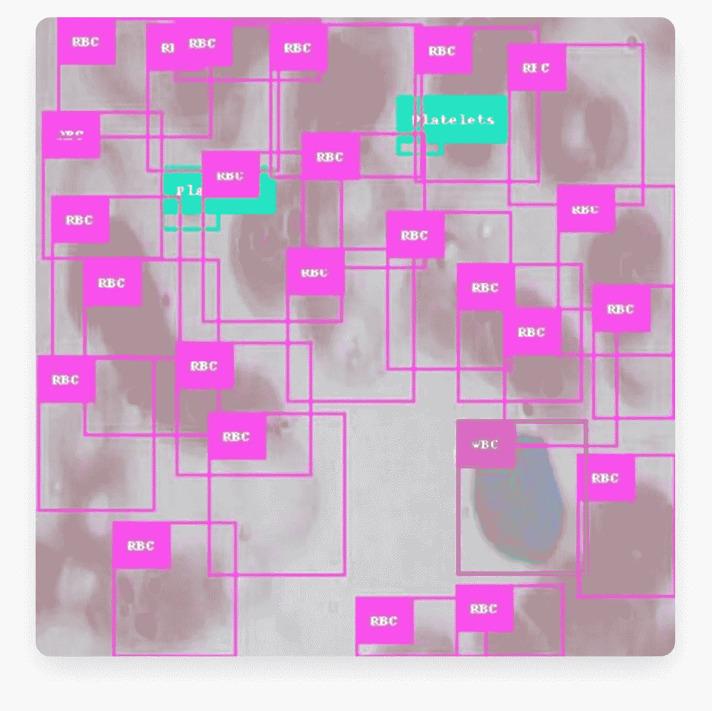
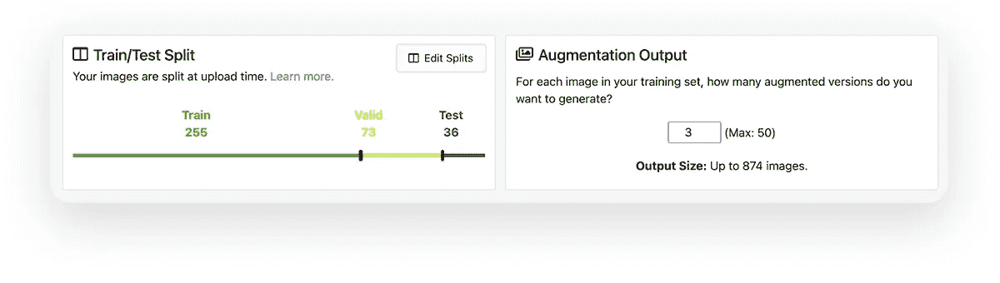

# 如何使用 Roboflow 和 Streamlit 可视化对象检测输出

> 原文：<https://towardsdatascience.com/how-to-use-roboflow-and-streamlit-to-visualize-object-detection-output-672ba11b2f7c?source=collection_archive---------24----------------------->

## 构建用于血细胞计数检测的应用程序

正在运行的应用程序。(图片由 [Roboflow](https://roboflow.com/) 和 [Streamlit](https://www.streamlit.io/) 提供；授权使用。)

大多数技术都是为了让你的生活或工作更轻松。如果您的工作涉及将计算机视觉构建到您的应用中，使用 [Roboflow](https://roboflow.com/) 平台可以满足您的一切需求。

Streamlit 是一个开源平台，使您能够将 Python 脚本转换为应用程序，并立即部署它们。Streamlit 和 Roboflow 可以携手合作，让您处理计算机视觉问题并可视化您的输出，以便您可以更快地做出更好的决定。

在本帖中，我们将带您了解如何使用 Roboflow 并简化它，向您展示如何:

1.  在 Roboflow 中拟合对象检测模型
2.  使用 API 访问模型及其预测
3.  创建和部署 Streamlit 应用程序

具体来说，我们将使用一个通用的[血细胞计数和检测数据集](https://public.roboflow.com/object-detection/bccd)。如果你想直接玩它，[这里有一个互动应用](https://roboflow.com/streamlit-bccd)和[这是代码](https://github.com/matthewbrems/streamlit-bccd)。

红细胞、白细胞和血小板。(图片由 [Roboflow](https://roboflow.com/) 和 [Streamlit](https://www.streamlit.io/) 拍摄；授权使用。)

我们将构建一个检测血小板、白细胞和红细胞的对象检测模型。然后，我们共同开发的应用程序将允许您使用您的对象检测模型进行预测，以给定的置信度可视化这些预测，并根据您首选的置信度编辑这些预测，并提供即时视觉反馈。

# 如何在 Roboflow 中拟合对象检测模型

您以前是否拟合过对象检测模型？

即使你没有，Roboflow 也可以帮助你完成计算机视觉的所有方面，从上传、注释和组织你的图像到训练和部署计算机视觉模型。

我们认为，你不需要成为一名数据科学家，或者需要丰富的编码背景才能使用计算机视觉。你现在已经拥有了你需要的一切。

计算机视觉工作流程。(图片由 [Roboflow](https://roboflow.com/) 和 [Streamlit](https://www.streamlit.io/) 提供；授权使用。)

如果你还没有一个 Roboflow 账户，你需要[前往 Roboflow 并创建一个](https://app.roboflow.com)。如果你想从公共数据集开始训练你的模型，Roboflow 有一个[很棒的教程，描述了](https://blog.roboflow.com/using-public-datasets/)如何更快地改进你的模型。(或者，可以[上传自己的数据集](https://docs.roboflow.com/adding-data/upload-api)！)

一旦你有了一个账户，就去我们的[计算机视觉数据集](https://public.roboflow.com)页面。我们已经公开了 30 多个不同类型的数据集，并且还在继续增加。

我们今天要介绍的是血细胞计数和检测数据集。

在您决定使用哪个数据集之后，就可以开始使用它了。这将创建您现在可以使用的数据集的副本。

派生公共数据集。(图片由 [Roboflow](https://roboflow.com/) 和 [Streamlit](https://www.streamlit.io/) 拍摄；授权使用。)

此时，可以直接拟合一个模型。但是，我们建议您预处理和增强您的图像。

*   **图像预处理。**在将图像输入模型之前，对所有图像执行确定性步骤。例如，你可以[调整你的图像](https://blog.roboflow.com/you-might-be-resizing-your-images-incorrectly/)的大小，使它们都一样大，或者[将你的图像转换成灰度](https://blog.roboflow.com/when-to-use-grayscale-as-a-preprocessing-step/)。
*   **图像增强。**通过扭曲您的输入图像来创建更多的训练示例，以便您的模型不会过度适应特定的训练示例。例如，您可以[翻转](https://blog.roboflow.com/how-flip-augmentation-improves-model-performance/)、[旋转](https://blog.roboflow.com/why-and-how-to-implement-random-rotate-data-augmentation/)、[模糊](https://blog.roboflow.com/using-blur-in-computer-vision-preprocessing/)，或者[为您的图像添加噪声](https://blog.roboflow.com/why-to-add-noise-to-images-for-machine-learning/)。目标是在您部署模型时，让您的模型更好地概括“真实世界”。

对于我正在使用的血细胞计数数据集，我选择了以下预处理和增强选项:

[图像预处理](https://docs.roboflow.com/image-transformations/image-preprocessing)和[图像增强](https://docs.roboflow.com/image-transformations/image-augmentation)技术。(图片由 [Roboflow](https://roboflow.com/) 和 [Streamlit](https://www.streamlit.io/) 拍摄；授权使用。)

当决定是否使用特定的增强选项时，我问自己一个问题“对于我的模型来说，增强图像是一个合理的图像吗？”在这种情况下，我给我的图像添加了 90 度、180 度和 270 度的旋转，因为细胞幻灯片可以合理地旋转 90 度，并且仍然有意义。

它对所有应用程序都没有意义。例如，我可能不包括自动驾驶汽车的那种旋转，因为停车标志应该用伸入地面的杆子来看。将图像旋转 180 度会使停车标志颠倒，而地面应该是天空——这对我的模型来说可能不是一件非常有用的事情。

[*培训、验证、测试拆分*](https://blog.roboflow.com/train-test-split/) *。*(图片由 [Roboflow](https://roboflow.com/) 和 [Streamlit](https://www.streamlit.io/) 拍摄；授权使用。)

我对数据进行了拆分，70%的数据在训练集中，20%在验证集中，10%在测试集中。正如你可能知道的，将你的数据分成[个训练、验证和测试集](https://blog.roboflow.com/train-test-split/)真的可以帮助避免过度拟合。

我决定创建三个增强版。这意味着，对于每个*训练*图像，我们将创建该图像的三个副本，每个副本都应用了随机增强技术。这将为我提供总共 874 张生成的图像:

*   765 个增强的训练图像(765 = 255 * 3)
*   加上 73 张验证图像
*   加上 36 张测试图片。

一旦你完成了你的预处理和增强，点击右上角的“生成”。*有用的提示:*确保给你的数据集起一个令人难忘的名字！

# 现在您已经准备好构建一个模型了

要建立一个模型，就像点击“使用 Roboflow Train”一样简单

两次点击来训练一个计算机视觉模型。(图片由 [Roboflow](https://roboflow.com/) 和 [Streamlit](https://www.streamlit.io/) 提供；授权使用。)

一般来说，你需要一个 Roboflow Train 信用来做到这一点。[联系我们，我们会帮您设置好](https://roboflow.com/contact?utm_source=streamlit&utm_medium=blog&utm_campaign=train)！

你可以选择从头开始训练或者从一个关卡开始。

*从零开始建立模型或者使用* [*迁移学习*](https://www.youtube.com/watch?v=aQM7M985X48&t=0s) *。*(图片由 [Roboflow](https://roboflow.com/) 和 [Streamlit](https://www.streamlit.io/) 拍摄；授权使用。)

*   **从零开始培养。这是更容易的选择。只需点击并运行！您的模型将从零开始构建，仅使用您提供给它的数据。**
*   **从一个关卡开始。**这个选项稍微复杂一点，需要一个相关的现有模型。如果您已经构建了一个适合相关数据的模型(或者有一个公共模型)，那么从一个检查点开始允许您使用现有的模型作为起点。模型还会根据您的图像进行额外训练。这样做的两个好处是你的模型将会训练得更快，而且你会经常看到性能的提高！这就是所谓的[迁移学习](https://blog.roboflow.com/a-primer-on-transfer-learning/)。然而，这确实需要一个相关的现有模型，而我们并不总是有这样的模型。

在我的例子中，我从零开始构建我的模型，因为我还没有一个相关的模型。

这就是在 Roboflow 中适合一个模型所需要的一切。说到底，如果你的数据已经被注释，并且你没有对增强做很多改变，那么只需要点击几下鼠标，就可以从你的图像转到一个训练有素的计算机视觉模型。我们还将[注释图像变成了一个非常快速的过程](https://docs.roboflow.com/annotate)——特别是有了[模型辅助标签](https://blog.roboflow.com/announcing-label-assist/)。

# 如何使用 API 访问模型和预测

*我们模型性能的总体结果，包括* [*平均精度*](https://blog.roboflow.com/mean-average-precision/) *。*(图片由 [Roboflow](https://roboflow.com/) 和 [Streamlit](https://www.streamlit.io/) 拍摄；授权使用。)

在深入研究这个问题之前，您需要确保您的模型运行良好。

我们的模型似乎表现得很好。通常，我们使用平均精度 (mAP)来评估目标检测模型。你的地图越接近 100%越好！按类别查看您的[模型的性能也是有帮助的，以确保您的对象检测模型对于一个对象子集的性能不会明显更差。](https://blog.roboflow.com/mean-average-precision-per-class/)

*看着* [*模特逐班表演*](https://blog.roboflow.com/mean-average-precision-per-class/) *。*(图片由 [Roboflow](https://roboflow.com/) 和 [Streamlit](https://www.streamlit.io/) 拍摄；授权使用。)

如果您的模型没有按照您想要的方式执行，您可能希望在继续之前对其进行改进。当人们采取以下两种行动中的一种(或两种)时，我们通常会看到模型的显著改进:

1.  [**完善自己的标注**](https://blog.roboflow.com/tips-for-how-to-label-images/) **。**围绕整个对象放置边界框，但尽可能靠近对象的边缘，可以提高模型的性能。
2.  <https://blog.roboflow.com/handling-unbalanced-classes/>****为不平衡的阶级进行矫正。有一个或多个严重代表不足的类会使您的模型更难正确识别那些代表不足的类。一个基本的例子是，如果你给一个孩子看 5 张狗的图片和 100 张猫的图片，这个孩子可能不能很好地识别狗。****

**现在我们已经拟合了一个模型，我们可以使用该模型对新图像进行预测。Roboflow 推断 API 是进行推断的几种方法之一，这就是我们将要使用的。**

*   **型号名称:这个要以`rf`开头。**
*   **访问令牌/API 密钥:这应该是一个 12+字母的代码。**

**为了使用这个 API，我们需要来自 Roboflow 的一些信息。确保这些都是私人的。这些都是针对你的！**

**这些信息可以在很多地方找到。我喜欢从示例 Web 应用程序中检索这些，因为我还可以轻松地上传一张图片，并从那里测试我的模型。一旦你有了这些信息，你会想要储存它们——你会随时需要它们。**

# **如何创建和部署 Streamlit 应用程序**

**部署 Streamlit 应用程序非常简单。即使你以前没有花很多时间专注于部署应用程序。(这里是我写的构建 app 的[代码。)](https://github.com/matthewbrems/streamlit-bccd/blob/master/streamlit_app.py)**

**紧紧跟随 [Streamlit 的 API 文档](https://docs.streamlit.io/en/stable/api.html)，我能够构建一个应用程序:**

*   **从我的电脑导入了一个图像文件**
*   **允许用户调整我们的计算机视觉模型的参数**
*   **显示了用模型的预测注释覆盖的导入图像**
*   **计算并显示有关图像和预测的汇总统计数据**
*   **为边界框生成了一个置信度直方图**

**我选择将它分为两个物理组件:侧边栏和主区域。**

*   ****边栏。**在侧边栏中，用户可以选择从本地计算机导入文件。在这里，用户可以选择一幅图像放入应用程序，并编辑为图像生成预测边界框时使用的置信度和重叠阈值。**

****

***应用侧边栏，让你能够快速改变你的预测参数。*(图片由 [Roboflow](https://roboflow.com/) 和 [Streamlit](https://www.streamlit.io/) 拍摄；授权使用。)**

*   ****主要区域。**在主区域，我们有我提到的所有其他东西。包含预测的图像、关于图像和预测本身的一些统计数据、显示所有边界框置信度的直方图，以及存储边界框注释的 JSON 的打印输出。**

****

***主应用区域，可视化预测输出、汇总统计和边界框置信度。*(图片由 [Roboflow](https://roboflow.com/) 和 [Streamlit](https://www.streamlit.io/) 拍摄；授权使用。)**

**如果你想看完整的代码，[你可以在这里找到](https://github.com/matthewbrems/bccd_streamlit_app/blob/main/streamlit_app.py)。最有帮助的三个工具是:**

*   **如果我想在我的屏幕上打印任何东西，`st.write()`让我可以轻松做到。它支持 [Markdown](https://daringfireball.net/projects/markdown/) ，所以我可以用##来控制标题的大小。在显示汇总统计数据时，我还使用了 [f 字符串](https://realpython.com/python-f-strings/)，以便更好地控制这些数据的呈现方式。例如，在小数点后四位四舍五入平均置信水平，而不是一长串尾随小数。**
*   **我绝对不是一个网络开发人员。定义侧边栏就像`st.sidebar()`一样简单，而不是花费我的时间去计算如何为用户留出屏幕的左侧和争论尺寸。想在侧边栏上添加一些东西，比如滑块或者上传文件的方式？试试`st.sidebar.slider()`或者`st.sidebar.file_uploader()`。Streamlit API 的设置使您的组件停留在您想要的位置。**
*   **`st.image()`和`st.pyplot()` : Streamlit 的 API 很直观。如果你想在你的应用程序中插入图像，你可以使用`st.image()`功能。来自 pyplot 的剧情？`st.pyplot()`。如果你想把一张图片放到侧边栏，你可以把它从`st.image()`改成`st.sidebar.image()`。**

**你明白了。如果你想做某件事，你可能只需要输入`st.that_thing_you_want_to_do()`！如果你想让那个东西出现在你的侧边栏里，把它改成`st.sidebar.that_thing_you_want_to_do()`！**

**在编写完我的 Python 脚本并推送到 Github 之后，我按照 [Streamlit 的指示部署了我的应用](https://docs.streamlit.io/en/stable/deploy_streamlit_app.html)——[点击这里查看应用](https://roboflow.com/streamlit-bccd)！**

**想了解更多关于开发人员使用 Streamlit 开发的令人惊叹的应用程序吗？[查看他们的应用程序库](https://www.streamlit.io/gallery)和[社区论坛](https://discuss.streamlit.io/)，为你的下一个项目寻找一些灵感。**

***原载于 2021 年 2 月 23 日*[*https://blog . streamlit . io*](https://blog.streamlit.io/how-to-use-roboflow-and-streamlit-to-visualize-object-detection-output/)*。***