# 如何使用 Seaborn 进行数据可视化

> 原文：<https://towardsdatascience.com/how-to-use-seaborn-for-data-visualization-4c61fc488ec1?source=collection_archive---------34----------------------->

## 数据可视化是以图形的形式表示数据的艺术。对于处理数据的专业人员，例如金融分析师、业务分析师、数据分析师、数据科学家等，这是一个非常有用的工具。在本教程中，我们将使用 Python 库 Seaborn。


卢克·切瑟在 [Unsplash](https://unsplash.com/s/photos/graphs?utm_source=unsplash&utm_medium=referral&utm_content=creditCopyText) 上的照片

# 目录

1.  介绍
2.  先决条件
3.  安装 Seaborn
4.  导入 Seaborn 并加载数据集
5.  不同类型的图表
6.  可视化口袋妖怪数据集
7.  结论

# 介绍

Seaborn 是一个基于 matplotlib 构建的开源 Python 库。它用于数据可视化和探索性数据分析。Seaborn 很容易使用 dataframes 和 Pandas 库。创建的图表也可以轻松定制。下面是数据可视化的一些好处。

图表可以帮助我们找到在任何机器学习或预测项目中有用的数据趋势。

*   图表使得向非技术人员解释数据变得更加容易。
*   视觉上吸引人的图表可以使演示和报告更吸引读者。

本教程可以分为三个主要部分。第一部分将讨论安装 seaborn 和加载我们的数据集。在第二部分中，我们将讨论 Seaborn 中的一些常见图形。最后，我们将使用 seaborn 和[口袋妖怪数据](https://www.kaggle.com/rounakbanik/pokemon)来创建一些很酷的图表。

我将把我所有的代码写在一个 Google colab 文件中。你可以在[这里](https://colab.research.google.com/drive/1Kv8B74wBfNhCD232DTnwdOCOJdXn_IxB?usp=sharing)找到。

# 先决条件

*   很好的理解 Python。
*   在熊猫图书馆工作的一些经验。
*   使用 Matplotlib 库的一些经验。
*   对数据分析的基本理解

# 安装 Seaborn

如果您正在使用 Google Colab，您可以跳过安装步骤。但是，如果您在本地机器上工作，您将需要安装 Seaborn。我强烈建议创建一个虚拟环境来更好地管理您的包。

```
python -m venv venv
venv/Scripts/activate
pip install pandas, matplotlib, seaborn
```

# 导入 Seaborn 并加载数据集

```
import seaborn as sns
import pandas
import matplotlib.pyplot as plt
```

Seaborn 有 18 个内置数据集，可以使用以下命令找到它们。

```
sns.get_dataset_names()
```

我们将在本教程中使用泰坦尼克号数据集。

```
df = sns.load_dataset('titanic')
df.head()
```

# 不同类型的图表

## 计数图

在处理分类值时，计数图很有帮助。它用于绘制不同类别的频率。性别列包含泰坦尼克号数据中的分类数据，即男性和女性。

```
sns.countplot(x='sex',data=df)
```

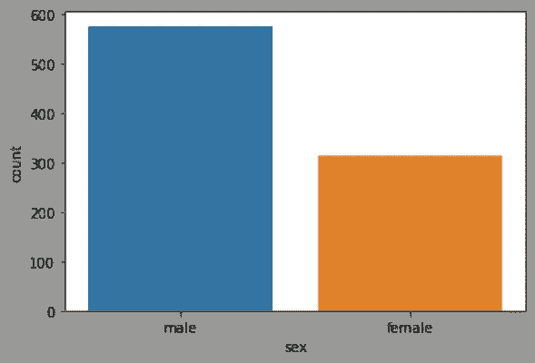

计数图 1

*   **数据** —数据帧。
*   **x** —列的名称。

我们可以从图表中观察到，男性乘客的数量明显高于女性乘客的数量。

我们可以根据另一个分类变量进一步分解计数图中的条形。也可以自定义绘图的调色板。

```
sns.countplot(x='sex', hue = 'survived', data = df,
palette = 'Set1')
```

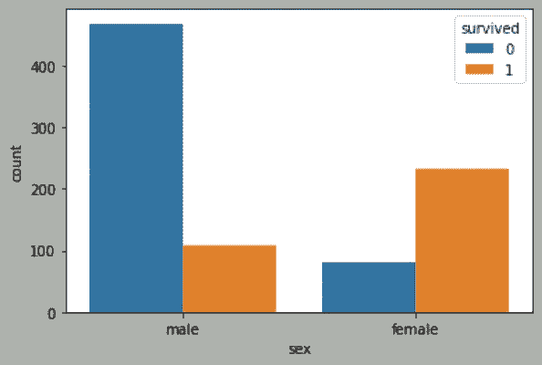

计数图 2

*   **色调** —拆分条形的分类列的名称。
*   **调色板** —要使用的调色板。要获得调色板列表，请点击查看 matplotlib 的文档[。](https://matplotlib.org/3.3.3/tutorials/colors/colormaps.html)

## KDE 图

核密度估计(KDE)图用于绘制连续数据的分布。

```
sns.kdeplot(x = 'age' , data = df , color = 'black')
```

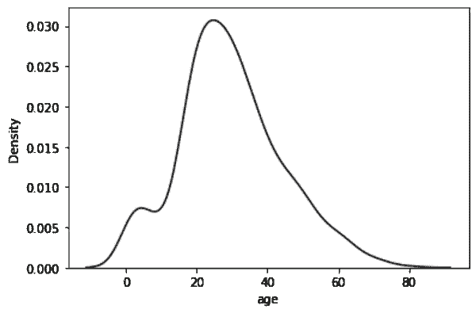

KDE 图

*   **数据** —数据帧。
*   **x** —列的名称。
*   **颜色** —图形的颜色。你可以在这里找到颜色列表[。](https://matplotlib.org/3.1.0/gallery/color/named_colors.html)

上图的峰值在 20 到 40 岁之间，因此我们可以得出结论，大多数乘客的年龄在 20 到 40 岁之间。

## 分布图

分布图类似于 KDE 图。它用于绘制连续数据的分布。

```
sns.displot(x = 'age',kde=True,bins = 5 , data =df)
```

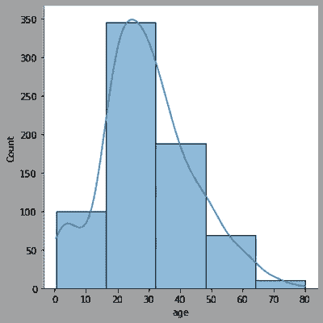

分布图 1

*   **kde** —默认设置为假。但是，如果您希望在条形图顶部绘制 KDE 图，可以将其设置为 True。
*   **箱** —箱/条的数量。数字越小，条形越宽，间隔越宽。

上面的情节告诉我们，泰坦尼克号上的大多数人都是 25 岁左右。

```
sns.displot(x ='age',kde=True,bins = 5 ,
hue = df['survived'] , palette = 'Set3', data=df)
```

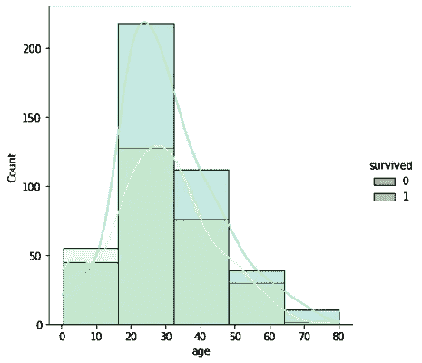

分布图 2

您还可以将色调和调色板作为参数传递来定制图形。

大多数幸存的乘客都是二十多岁。

## 散点图

对于这个图和下面的图，我们将使用 iris 数据集。虹膜数据集包含与花的花瓣大小(花瓣长度和花瓣宽度)和萼片大小(萼片长度和萼片宽度)相关的数据。

这些特征用于分类鸢尾的类型(刚毛鸢尾、杂色鸢尾和海滨鸢尾)。下面我们将尝试研究这些特征之间的关系。

首先，我们需要加载虹膜数据集。

```
df = sns.load_dataset('iris')
df.head()
```

散点图有助于理解数据之间的相互关系，

```
sns.scatterplot(x='sepal_length', y ='petal_length' ,
data = df , hue = 'species')
```

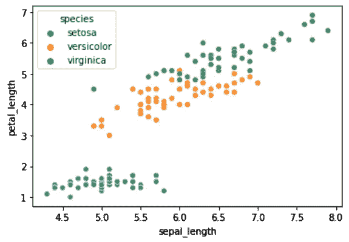

散点图

散点图需要 x 轴和 y 轴的数据。我们还可以为 hue 参数传递一个值，根据分类列给点着色。

在上图中，我们可以观察到萼片长度< 6cm and petal length >2 厘米的鸢尾花最有可能是刚毛鸢尾。虽然在杂色点和海滨点之间没有明显的界限，花瓣长度在 2 厘米和 5 厘米之间的鸢尾花最有可能是杂色类型，而花瓣长度大于 5 厘米的鸢尾花最有可能是海滨类型。

## 联合地块

联合图也用于绘制数据之间的相关性。

```
sns.jointplot(x='sepal_length' , y ='petal_length',
data = df , kind = 'reg')
```

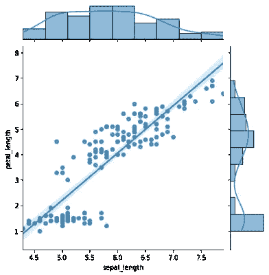

联合地块

*   **种类** —要绘制的地块的种类。它可以是下列之一。

`'scatter', 'hist', 'hex', 'kde', 'reg', 'resid'`

## 配对图

Seaborn 让我们绘制多个散点图。当您想快速浏览数据时，这是一个不错的选择。

```
sns.pairplot(df)
```

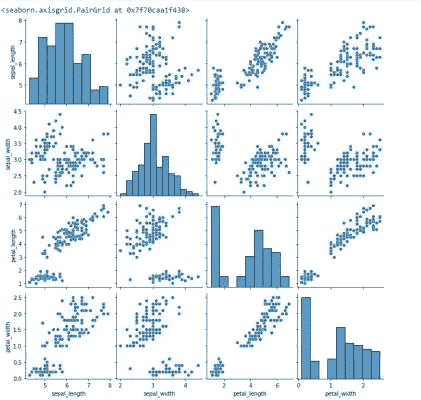

配对图

它将所有连续数据配对，并绘制它们的相关性。它还绘制了数据的分布。

如果不希望将所有列配对，可以再传入两个参数 x_vars 和 y_vars。

## 热图

热图可用于可视化混乱、矩阵和关联。

```
corr = df.corr()
sns.heatmap(corr)
```

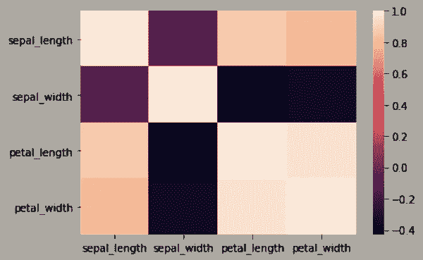

热图 1

我们可以自定义配色方案、最小/最大值和注释。

根据热图，我们可以得出结论，萼片长度与花瓣长度和花瓣宽度高度正相关，而萼片宽度与花瓣长度和花瓣宽度负相关。

```
sns.heatmap(corr, cmap=['red','green','blue'],
vmin = -.5 , vmax = 0.6,annot = True)
```

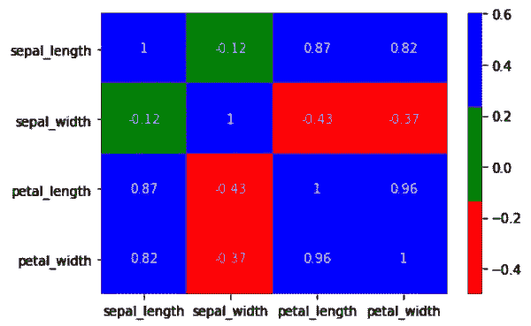

热图 2

# 可视化口袋妖怪数据集

你可以从[这里](https://www.kaggle.com/rounakbanik/pokemon)下载口袋妖怪数据集。

将文件上传到 google drive。

```
from google.colab import files
files.upload()
```

如果您在本地机器上工作，可以跳过上述步骤。确保下载的文件与 Python 文件位于同一个文件夹中。

```
pokemon_df = pd.read_csv('pokemon.csv')
pokemon_df.head()
```

## 口袋妖怪类型分布

```
plt.figure(figsize=(15,8))
sns.countplot(x = 'type1' , data = pokemon_df,
hue = 'is_legendary')
```

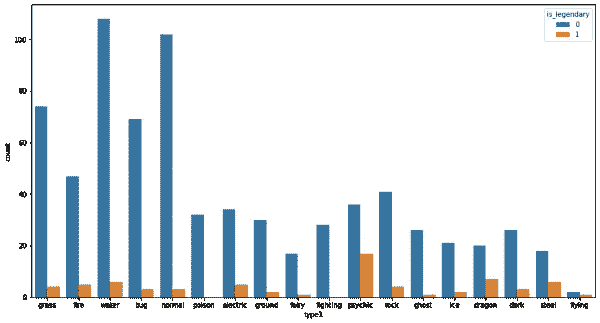

口袋妖怪剧情 1

因为 Seaborn 是建立在 matplotlib 之上的，所以我们可以使用 matplotlib 的函数来增加图形的大小。查看图表，我们可以得出结论，水和正常是主要的口袋妖怪类型。我们还可以得出结论，传奇口袋妖怪的主导类型是精神。

## 进攻和防守的关系

```
sns.pairplot(x_vars=['attack' , 'defense','sp_attack','sp_defense'] ,
y_vars=['attack' , 'defense','sp_attack','sp_defense'] ,
data = pokemon_df)
```

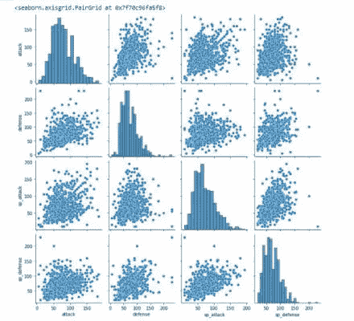

口袋妖怪剧情 2

你也可以选择传递色调参数来获得更多的洞察力。

## 身高和体重的关系

```
sns.jointplot(x = 'weight_kg', y = 'height_m',
data = pokemon_df,hue = 'is_legendary')
```

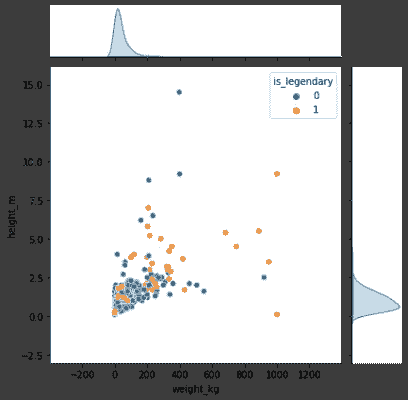

口袋妖怪剧情 3

根据上面的图表，我们可以得出结论，口袋妖怪的身高和体重没有任何相关性。

你可以尝试一些其他的情节。

*   身高/体重分布。
*   传奇口袋妖怪 vs 非传奇口袋妖怪的数量。
*   特攻特防回归图。
*   显示功能之间相关性的热图。

# 结论

数据可视化是呈现数据的好方法，Seaborn 是您工具箱中的有用工具。因为它是建立在 matplotlib 之上的，所以您可以像使用 matplotlib 自定义绘图一样自定义您的绘图。

编码快乐！

我最近用 WordPress 创建了一个博客，如果你能看看的话，我会很高兴的😃

  

在 LinkedIn 上与我联系

<https://www.linkedin.com/in/rahulbanerjee2699/>  

*原载于* [*节*](https://www.section.io/engineering-education/seaborn-tutorial/) *。2021 年 1 月 29 日木卫一*