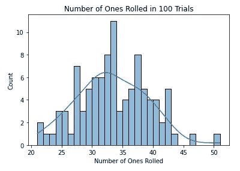
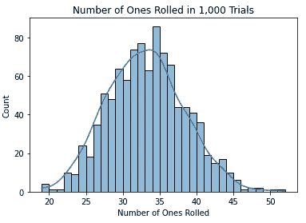
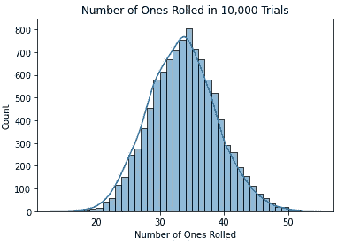
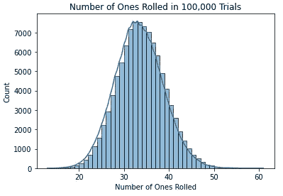
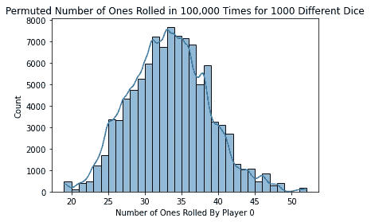

# 如何使用模拟进行假设检验

> 原文：<https://towardsdatascience.com/how-to-use-simulations-for-hypothesis-tests-6f0ac53a9c8f?source=collection_archive---------17----------------------->

## [实践教程](https://towardsdatascience.com/tagged/hands-on-tutorials)

## 如何用 Python 中的例子使用两种不同的模拟技术进行假设检验


照片由 [Chuttersnap](https://unsplash.com/@chuttersnap) 在 [Unsplash](https://unsplash.com/photos/5MUui5cvcDU) 上拍摄

假设检验是统计学的重要组成部分。它们帮助我们在医疗保健、商业、伦理和许多其他领域做出重要决策。有许多很棒的资源解释了如何进行这些测试，以及如何使用像正态分布和 t 分布这样的分布来获得这些测试的结果。

本文将关注如何使用模拟为假设检验生成我们自己的分布。模拟允许我们用很少的假设来进行假设检验，并且有一个直观的结果，可以很容易地解释。

我们要看的第一个模拟技术是使用一个已知概率分布的随机变量随机生成数据。当您知道您有兴趣进行统计分析的事件结果的潜在概率分布时，这是一个非常有用的概念。

我们将使用的第二种模拟技术被称为置换假设检验。当您试图测试变量之间的相关性时，这是一个特别有用的工具。

对于这两种技术，我们将使用一个示例来计算在六面骰子上滚动的 1 的数量。我们以此为基础来描述这些模拟是如何工作的。到本文结束时，您应该了解如何将模拟应用到您感兴趣的更高级的假设测试中。

# 假设检验简介

在我们开始模拟之前，让我们快速回顾一下假设检验。如果您已经对此感到满意，请随意跳到下一部分。

假设检验的基本目标是了解某种治疗对结果变量的影响。例如，如果一家制药公司在一项研究中给一些参与者一种他们正在测试的新药，而另一些人收到一种安慰剂，该公司将有兴趣了解实际药物的表现是否比安慰剂更好。举个例子，这是一种减肥药，服用这种药的人比服用安慰剂的人平均多减了 10 磅。

你首先假设一个无效假设，即你在研究中观察到的结果是由于偶然。这相当于假设整个人群(除了参与研究的样本之外)的真实体重减轻了 0 磅。然后，我们需要收集足够的证据来否定这个假说，支持另一个药物有效的假说。

然后，我们将观察到的结果与 t 分布(如果我们不知道标准偏差，并且人口较少)或正态分布进行比较。我们会考虑在假设的分布下，我们多久会观察到一个和我们在实验中观察到的一样大的结果；观察到极值或比观察值更极值的概率称为 p 值。如果该概率足够低(通常为 5%)，我们可以拒绝我们的零假设，即我们观察到的结果仅仅是由于机会(因为零分布不太可能代表基于我们实验的真实总体反应)。

# 方法 1:已知概率分布的模拟

我们将使用 Python 编写所有的代码，但是这些概念在没有 Python 知识的情况下应该很容易理解。让我们从导入一些库开始。

```
import numpy as np
import pandas as pd
import random
import seaborn as sns
```

对于第一个例子，我们想进行一个假设检验，看看一个六面骰子的权重是否相等(如果所有 6 个数字的概率相等)。我们对这个测试的零假设是所有的数字被掷出的可能性是相等的。

我们假设一个骰子有 20%的未知概率掷出 1，有 16%的概率掷出其他 5 个数字。

```
random.seed(100)
pop = [1, 2, 3, 4, 5, 6]
weights = [.2, .16, .16, .16, .16, .16]
skewed = random.choices(pop, weights=weights, k=200)
```

在观察了 200 次掷骰子(由上面的代码生成)之后，我们使用下面的函数来计算每个被掷出的数字的个数:

```
def count_occurences(data, minimum=1, maximum=6):
    counter = {num: 0 for num in range(minimum, maximum + 1)}
    for roll in data:
        counter[roll] += 1
    return counter
```

我们观察每个数字出现的次数如下:

```
skewed_dist = count_occurences(skewed)Out: {1: 46, 2: 29, 3: 27, 4: 39, 5: 29, 6: 30}
```

如果骰子的重量相等，那么当我们掷骰子 200 次时，我们预计每次掷骰子的数字约为 32，每个数字出现的概率为 16.67% (1/6)。我们注意到 1 的数量特别大，想测试一下这是否是偶然的。

由于我们已经知道每个数字在公平骰子中出现的潜在概率，我们可以模拟成千上万次掷骰子，看看在一组 200 次掷骰子中观察到 46 个 1 的可能性有多大。

我们可以使用下面的代码生成 100 次 200 个公平骰子滚动的试验:

```
rolls_dist_100 = [[random.randint(1, 6) for rolls in range(200)] for num_trials in range(100)]
```

我们应该模拟多少次试验？100 次试验够吗？这是一件需要考虑的重要事情。让我们看看在不同次数的试验中，我们看到的 1 的数量分布。



正如我们所看到的，更多的试验似乎能更好地去除我们结果中的随机噪声。运行更多试验的时间成本很小。因此，你应该进行的试验次数取决于你试图探索的问题。一般来说，试验越多越好。

我们将使用 100，000 次试验来获得我们的统计结果。这是我们在零假设下观察到的一的数量分布，假设每个数字的概率相等。

现在，让我们将实际观察到的 46 个结果与 100，000 组 200 个骰子滚动的结果进行比较。

```
# Create a list of dictionaries for the counts
roll_counts_100000 = list(map(count_occurences, rolls_dist_100000))# Store results in dataframe
counts_df_100000 = pd.DataFrame(roll_counts_100000)# Find the times where we observe a larger value
counts_df_100000['bigger'] = counts_df_100000[1] > skewed_dist[1]# Get the probability
sum(counts_df_100000['bigger']) / 100000Out: 0.0082
```

我们看到观察到我们所做的结果的概率大约是 0.0082(我们的 p 值)。这是非常低的，所以我们将拒绝我们的零假设，即骰子在所有 6 个面上着陆的可能性相等。我们已经知道这是预期的结果，因为我们知道倾斜骰子的真实概率分布。

# 方法 2:排列假设检验

现在我们将讨论排列测试。这里有一个很棒的可视化，如果你想了解更多关于这个过程的信息，你应该去看看。排列测试背后的想法是，我们给变量赋值，我们想看看这些赋值是否有意义。为了测试这一点，我们多次随机打乱赋值的顺序，看看旧的赋值与新的赋值分布相比如何。

让我们假设一个有 1000 名参与者的锦标赛正在进行，每个参与者互相掷骰子 200 次，最低的数字获胜。玩家 0 赢得锦标赛，与其他玩家相比，他有大量的零。我们想知道他是否作弊了。

我们使用以下代码生成数据:

```
pop = [1, 2, 3, 4, 5, 6]
weights_skewed = [.2, .16, .16, .16, .16, .16]
random.seed(100)
rolls_vs = [random.choices(pop, k=200) if person != 0 else random.choices(pop, weights=weights_skewed, k=200) for person in range(1000)]
```

我们使用下面的代码为每个玩家的所有掷骰子创建一个数据框。

```
df_vs = pd.DataFrame(list(map(count_occurences, rolls_vs)))
```

我们注意到参与人 0 掷出了 46 个 1，远远超过了预期的 200 个 1 的数量。我们在 200 掷的锦标赛中生成 100，000 个千位玩家的 1 的排列分布，并查看该玩家的 1 是否明显多于排列分布。

```
perms = [np.random.permutation(df_vs[1])[0] for i in range(100000)]
```



每个排列中玩家 0 的 1 的数量(来源:作者)

在给定分布的情况下，我们发现观察值的 p 值为 46 或更高。

```
sum([1 if 46 <= x else 0 for x in perms]) / 100000Out: 0.01746
```

我们得到 p 值为 0.017。这是一个相当低的概率，但并非完全不可信。我们期望看到这种类型的表演大约是 100 次中的 1 次。我们应该对这种表现持怀疑态度，并可能认为该球员可能在这场比赛中作弊。如果这是研究环境中的另一个测试，我们将有足够的证据来拒绝零假设，即我们观察到的结果是由于机会而支持我们的替代假设，即玩家使用倾斜的骰子。

# 结论

作为数据科学家，我们现在又多了两个工具来进行假设检验。只需几行代码，我们就可以用很少的假设来测试这些假设。我们不需要假设检验中经常需要的关于数据正态性的典型假设。

除了分析掷骰子之外，这些工具还有一些有趣的应用。我们现在有了分析这些问题的基本构件。这些类型的测试已经被应用到一些有趣的问题中，比如评估奥运会跳水比赛中的裁判偏差，以及评估篮球比赛中的“T2”是否存在。

感谢您阅读本文，祝您下次假设检验顺利。