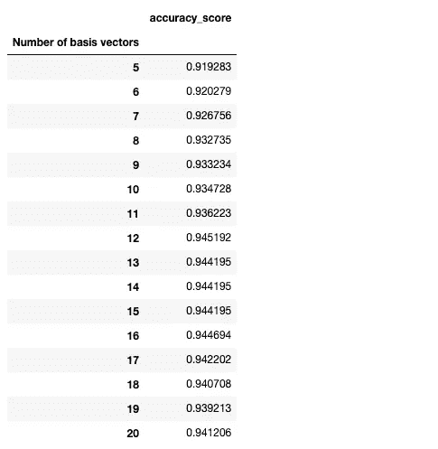

# Python 中如何使用奇异值分解进行图像分类

> 原文：<https://towardsdatascience.com/how-to-use-singular-value-decomposition-svd-for-image-classification-in-python-20b1b2ac4990?source=collection_archive---------3----------------------->

## 用一个简单的例子揭开 SVD 背后的线性代数概念


Marcel strau 在 [Unsplash](https://unsplash.com?utm_source=medium&utm_medium=referral) 上拍摄的照片

线性代数中最难理解的主题之一是**奇异值分解** (SVD)方法。它也是最基本的技术之一，因为它为理解主成分分析(PCA)、潜在狄利克雷分配(LDA)和一般矩阵分解的概念铺平了道路。

奇异值分解之所以难以捉摸，是因为虽然这种方法需要大量的数学和线性代数知识才能掌握，但实际应用却常常被忽视。有很多人以为自己掌握了 SVD 的概念，其实不然。这不仅仅是一种降维技术:本质上，SVD 的神奇之处在于*任何矩阵 A 都可以写成秩 1 矩阵的和*！这一点以后会变得明显。

本文的目的是通过将 SVD 应用于一个众所周知的例子:手写数字分类，展示 SVD 的用途和基本机制。

# 快速提醒(高级可选)

奇异值分解的基本关系是


其中:
U 和 V 是正交矩阵，
S 是对角矩阵

更具体地说:


其中显示了前述的权利要求，**任何矩阵 A 都可以写成秩 1 矩阵的和**。

**奇异值分解的一些有用特性:**

1.  u 矩阵和 v 矩阵分别由**和****aᵀa****的特征向量构成。**
2.  *任何矩阵都有 SVD 分解。这是因为 ***AAᵀ*** 和 ***AᵀA*** 矩阵有一个特殊的性质(以及其他性质):它们至少是半正定的(这意味着它们的特征值要么是正的，要么是零)。*
3.  *S 矩阵包含正特征值的平方根。这些也被称为**奇异值。***
4.  *在包括 Python 在内的大多数编程语言中，U 和 V 的列的排列方式是特征值较高的列在特征值较小的列之前。*
5.  **u，u* …向量也被称为左奇异向量，它们形成了一个**正交基**。相应的， *v，v* …向量称为右奇异向量。*
6.  *矩阵 A 的秩是 S 矩阵的非零奇异值的个数。*
7.  *[**埃克哈特-杨-米尔斯基定理**](https://en.wikipedia.org/wiki/Low-rank_approximation) **:** 一个秩的最佳 *k* 秩逼近 *k < r* 一个矩阵在 2-范数和 F-范数下是:*

**

*换句话说:*

> *如果你想用一个较低秩的 k 来逼近任何矩阵 A，最佳的方法是对 A 应用 SVD，只取前 k 个具有最高 k 个奇异值的基向量。*

# *Python 中的 SVD*

*对于这个例子，我们将使用[手写数字 USPS(美国邮政服务)数据集](https://www.kaggle.com/bistaumanga/usps-dataset?select=usps.h5)。该数据集包含 7291 个训练和 2007 个[0–9]之间的手写数字测试图像。图像是 16*16 灰度像素。首先，我们加载数据:*

```
*import numpy as np
import pandas as pd
import matplotlib.pyplot as plt
from scipy.linalg import svd, norm
from sklearn.metrics import accuracy_score, confusion_matrix, classification_report
import h5py
import os# define class labels
labels = {
    0: "0", 
    1: "1", 
    2: "2", 
    3: "3", 
    4: "4", 
    5: "5", 
    6: "6", 
    7: "7", 
    8: "8",
    9: "9"
}# load the dataset
with h5py.File(os.path.join(os.getcwd(), 'usps.h5'), 'r') as hf:
        train = hf.get('train')
        test = hf.get('test') x_train = pd.DataFrame(train.get('data')[:]).T
        y_train = pd.DataFrame(train.get('target')[:]).T
        x_test = pd.DataFrame(test.get('data')[:]).T
        y_test = pd.DataFrame(test.get('target')[:]).Tprint(x_train.shape)
print(y_train.shape)
print(x_test.shape)
print(y_test.shape)#Output:
#(256, 7291)
#(1, 7291)
#(256, 2007)
#(1, 2007)*
```

*数据的加载方式与上面快速提醒部分的尺寸相匹配。 *x_train* 和 *x_test* 的列包含作为向量的数字，这些数字被展平成大小等于 256 的数组(因为每个数字的大小都是 16x16)。另一方面， *y_train* 和 *y_test* 是行向量，分别包含训练和测试数据集的每个数字(0 到 9 之间的值)的实际类。*

***图 1** 显示了训练数据集中的第一幅图像:*

```
*digit_image=x_train[0]
plt.imshow(digit_image.to_numpy().reshape(16,16),cmap='binary')*
```

**

*图 1:来自训练数据集的图像*

*数字分类的方法由以下步骤组成:*

1.  *我们将 *x_train* 数据帧分成 10 个矩阵(按列)，每个矩阵对应一个数字[0–9]。这些是之前提到的 *A 的*矩阵。目标是将 SVD 分别应用于它们中的每一个。例如，A0 矩阵仅包含数字 0 的图像，其形状为(256，1194)，因为数据集中有 1194 个 0。*
2.  *接下来，我们将 SVD 应用于[A0，A1..A9]矩阵。对于每个 A 矩阵，我们存储相应的 U、S 和 V 矩阵。我们将主要使用 U 矩阵。*
3.  *用一个数字表示的每个数据矩阵 A 都有一个“独特的特征”。这种区别反映在前几个左奇异向量 *(u，u …)*。由于这些特征向量本质上是基向量，如果一个未知数字可以用另一个数字(例如数字 3)的基更好地近似，那么我们可以假设该未知数字被分类为那个数字(如 3)。这将在后面的编程示例中变得更加明显。*

***第一步***

*这相当容易。我们只是创建了[A0，A1..A9]矩阵，并将它们存储在名为 alpha _ matrices 的字典中:*

```
*alpha_matrices={}for i in range(10):
    alpha_matrices.update({"A"+str(i):x_train.loc[:,list(y_train.loc[0,:]==i)]})print(alpha_matrices['A0'].shape)
#(256, 1194)*
```

***第二步***

*这一步也很简单。我们将 U、S 和 V 矩阵分别存储在*左奇异*、*奇异 _ 矩阵*和*右奇异*字典中:*

```
*left_singular={}
singular_matix={}
right_singular={}for i in range(10):
    u, s, v_t = svd(alpha_matrices['A'+str(i)], full_matrices=False)
    left_singular.update({"u"+str(i):u})
    singular_matix.update({"s"+str(i):s})
    right_singular.update({"v_t"+str(i):v_t})print(left_singular['u0'].shape)
#(256, 256)*
```

*让我们展示一下这些矩阵中包含了哪些信息。我们将使用数字 3 的 U、S 和 V 矩阵作为示例，在我们的示例中，它们对应于以下变量:*

```
*#left_singular[‘u3’]
#right_singular[‘s3]
#singular_matix[‘v_t3]plt.figure(figsize=(20,10))
columns = 5
for i in range(10):
   plt.subplot(10/ columns + 1, columns, i + 1)
   plt.imshow(left_singular["u3"][:,i].reshape(16,16),cmap='binary')*
```

**

*图 2:U3 矩阵的前 10 个奇异向量*

***图 2** 显示了前 10 个左奇异向量[u，u … u ⁰](共 256 个)。它们都描绘了数字 3，其中第一个(u1 向量)最为清晰。*

***图 3** 以对数标度显示了 S 矩阵中数字 3 的奇异值:*

```
*plt.figure(figsize = (9, 6))
plt.plot(singular_matix[‘s3’], color=’coral’, marker=’o’)
plt.title(‘Singular values for digit $3$’,fontsize=15,weight=”bold”,pad=20)
plt.ylabel(‘Singular values’ ,fontsize=15)
plt.yscale(“log”)
plt.show()*
```

**

*图 3:数字 3 的所有奇异值*

*给定奇异值排序，前几个是最高的(就值而言)，并遵循“陡峭的曲线模式”。*

*通过考虑**图 2** 和**图 3** ，我们可以图形化地确认 3 位 SVD 的矩阵逼近性质(记住 **Eckart-Young-Mirsky 定理**):第一个左边的奇异向量代表矩阵 A3 的固有属性值。事实上，在图 2 的**中，第一个奇异向量 *u1* 看起来像数字 3，随后的左奇异向量代表 u1 周围的训练集的最重要的变化。***

*问题是我们是否可以只使用第一个 *k 个*奇异向量，并且仍然有一个很好的近似基。我们可以通过实验来验证。*

***第三步***

*给定一个由(1256)个向量表示的未知数字称为 *z* ，给定左奇异向量的集合 *u1，u2… uk* ，其中每个集合表示对应的数字矩阵/A 矩阵，那么 *z* 的目标值是多少？注意我们的索引是 *k* (第一主奇异特征向量)而不是 *n* (全部)。要解决这个问题，我们要做的就是以下几点:*

> *目标是计算测试集中的一个数字在 10 个不同的标准正交基中的表现程度。*

*这可以通过计算以下类型的最小二乘问题中的剩余向量来实现:*

**

*最小二乘问题的解是*

**

*记住 U 矩阵是正交的。剩余范数向量变成:*

**

*就是这样！现在我们需要的东西都有了。使用最后一个公式，我们继续计算不同 *k* 值的测试精度:*

```
*I = np.eye(x_test.shape[0])
kappas=np.arange(5,21)
len_test=x_test.shape[1]predictions=np.empty((y_test.shape[1],0), dtype = int)for t in list(kappas):
    prediction = []
    for i in range(len_test):
        residuals = []
        for j in range(10):
            u=left_singular["u"+str(j)][:,0:t]
            res=norm( np.dot(I-np.dot(u,u.T), x_test[i]  ))
            residuals.append(res)
        index_min = np.argmin(residuals)
        prediction.append(index_min)

    prediction=np.array(prediction)
    predictions=np.hstack((predictions,prediction.reshape(-1,1)))scores=[]for i in range(len(kappas)):
    score=accuracy_score(y_test.loc[0,:],predictions[:,i])
    scores.append(score)data={"Number of basis vectors":list(thresholds), "accuracy_score":scores}
df=pd.DataFrame(data).set_index("Number of basis vectors")*
```

**

*表 1:不同 k 值的测试准确度得分*

*我们也可以用图形显示这个结果:*

**

*图 4:不同 k 值的测试准确度分数*

***表 1** 和**图 4** 都显示了不同数量的基向量的准确度分数。使用 k=12 可以获得最好的分数。*

*接下来，显示混淆矩阵:*

```
*pd.set_option(‘display.max_colwidth’,12)
confusion_matrix_df = pd.DataFrame( confusion_matrix(y_test.loc[0,:],predictions[:,7]) )confusion_matrix_df = confusion_matrix_df.rename(columns = labels, index = labels)
confusion_matrix_df*
```

**

*f1 分数(宏观平均值和每节课的分数) :*

```
*print(classification_report(y_test.loc[0,:],predictions[:,7]))*
```

**

***点评:** *数字 0、1、6、7 在 f1-score 方面表现最好。
*数字 5 和 3 在 f1 得分方面表现最差。*

*让我们来看一些分类错误的图片的例子:*

```
*misclassified = np.where(y_test.loc[0,:] != predictions[:,7])plt.figure(figsize=(20,10))
columns = 5
for i in range(2,12):
    misclassified_id=misclassified[0][i]
    image=x_test[misclassified_id]

    plt.subplot(10/ columns + 1, columns, i-1)
    plt.imshow(image.to_numpy().reshape(16,16),cmap='binary')
    plt.title("True label:"+str(y_test.loc[0,misclassified_id]) + '\n'+ "Predicted label:"+str(predictions[misclassified_id,12]))*
```

**

*显然，其中一些数字写得非常糟糕。*

***结论***

*实际上，A 数据矩阵本质上是一个低秩矩阵加噪声:A = A' + N。通过应用 **Eckart-Young-Mirsk** 定理，我们用一个正确秩为 k 的矩阵来逼近数据矩阵 A。这具有保持矩阵固有属性完整的效果，同时去除了额外的噪声。但是我们如何找到正确的秩 k 呢？*

*在我们的案例中，我们通过对第一个主要奇异值进行实验，根据测试精度经验地找到了 k。然而，应该注意的是，当然还有其他算法优于这种技术。然而，本案例研究的重点是通过调整一种众所周知的矩阵分解技术来展示手写数字分类的另一种方法。有关这个例子的理论技术和原理的更多信息，请查阅本[书](https://epdf.pub/matrix-methods-in-data-mining-and-pattern-recognition32204.html)。*